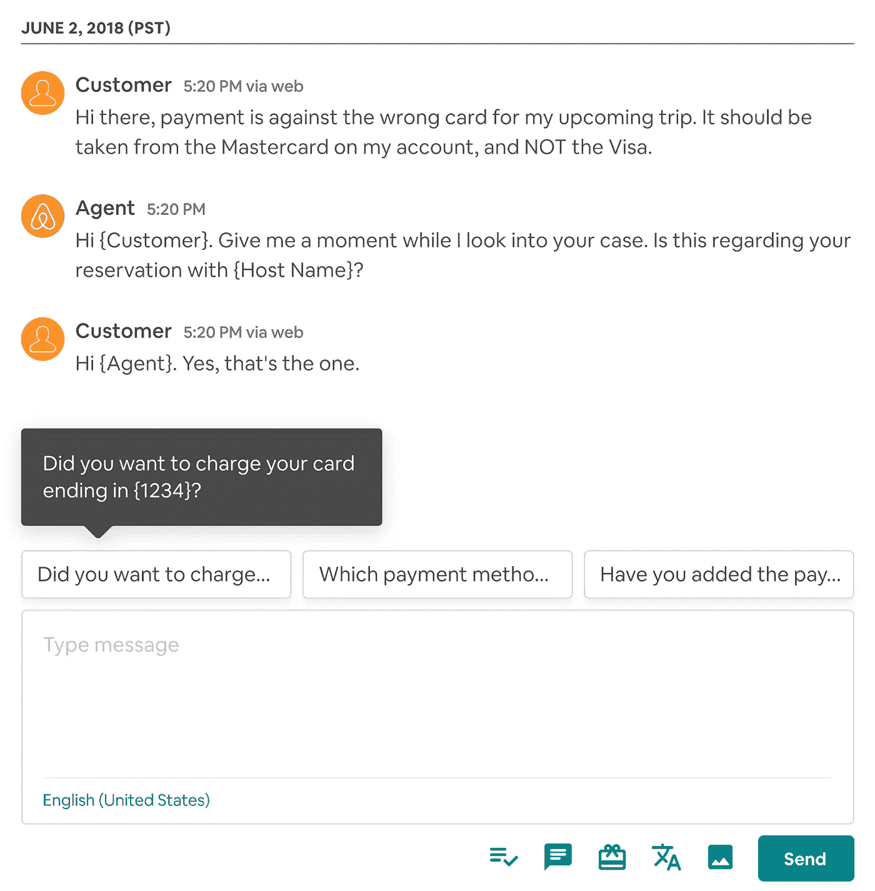
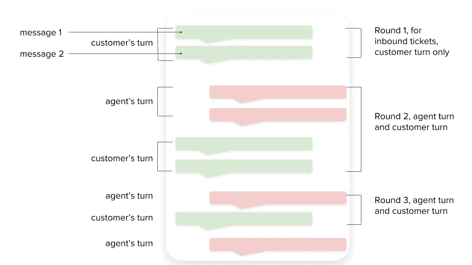
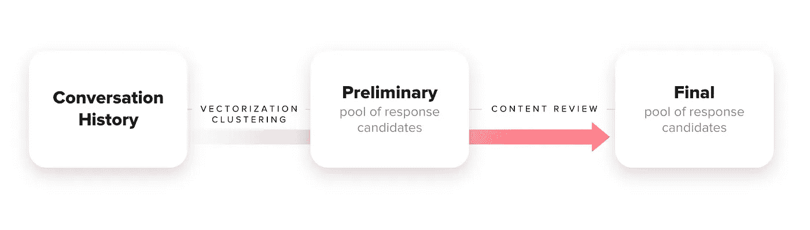
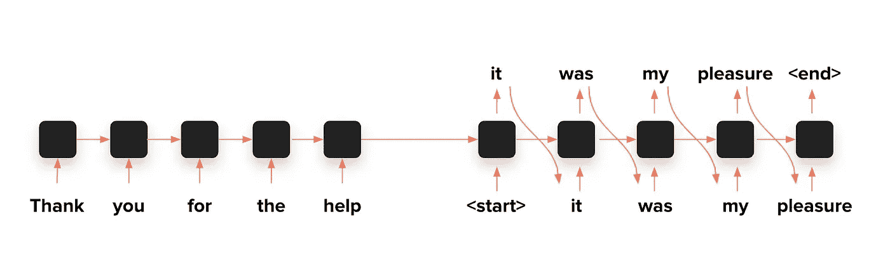
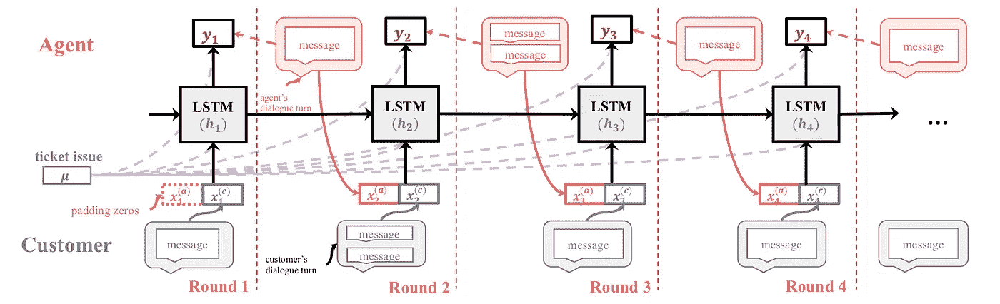

# 除了“我能帮你什么吗？”

> 原文：<https://medium.com/airbnb-engineering/beyond-how-may-i-help-you-fd6a0d385d02?source=collection_archive---------4----------------------->

## 我们如何使用序列模型和 LSTM 网络来为我们的客户服务代理提供响应建议

**由**欣(Cindy)陈、万

The Airbnb office in Dublin offers plenty of workspace beyond your desk.

在 Airbnb，我们为全球的主人和客人提供服务。Airbnb 业务的一个重要部分是大规模提供高质量的客户服务。实时聊天是我们的客户支持渠道之一，客户可以通过它与我们的客户服务代理聊天来解决他们的问题。

代理在他们的对话中重复键入或复制和粘贴经常使用的消息是非常耗时的。这对我们的客户和代理来说不仅是浪费时间，还会妨碍他们在解决问题时与客户的深入交流。为了解决这些问题，我们在我们的客户支持聊天系统中引入了*智能回复*，在这里我们建议代理只需点击一下就可以使用简短回复。

Figure 1\. Proactive response suggestions for Airbnb’s Live Chat customer service agents. The recommendations carry the context from previous messages: customer’s intent to change payment method. (Placeholders such as customer, agent, host name, and 1234 are auto-filled in real applications.)

# 一次谈话的由来

如果你对对话式人工智能相对陌生，那么在关于对话对话建模的文献中使用的各种术语可能会令人困惑。在深入我们算法的细节之前，澄清几个术语可能是有帮助的:*话语、消息、话轮、*和*回合。*

***消息/话语:*** 如图 2 所示，一条消息就是一个文本 blurb。一条消息可以包含多个句子。在这里，我们互换地对待*消息*和*话语*。

在这种情况下，客户通过在消息中描述他们的问题来发起聊天对话，这创建了一个*入站票据*。我们使用的所有示例都以客户信息开始。

***话轮:*** 一个*话轮*由一个对话者连续发送的所有消息组成。

Figure 2\. The Anatomy of a Conversation: message, turn, and round

***回合:*** 一回合是每个对话者一个回合。因为我们的目标是建议代理下一轮的回答，在我们的上下文中，一轮总是从轮到代理开始，到轮到顾客结束。第一轮(*用于呼入票，仅轮到客户*)和最后一轮(*用于大多数客户支持聊天对话，仅轮到代理*)是此规则的例外。

# 响应候选生成

Figure 3\. Response candidates are generated by clustering similar sentences in conversation history using NLP and finalized by content expert review

智能回复系统的第一步是建立一个候选回复池。我们从聊天记录中提取所有代理消息，匿名化消息中的个人信息，并将其标记为句子。我们使用 TF-IDF 加权 **word2vec** 模型对这些句子进行了矢量化(Mikolov 等人，2013)。然后，我们对句子向量应用可扩展的小批量 K-means 聚类算法以及随后的层次聚类算法，以获得具有相似语义的句子聚类。例如，*“给我一点时间，让我调查一下你的情况。”*和*“让我来调查一下。”*聚集在一起。同样的，*“你还需要什么帮助吗？”*和*“还有什么需要我帮忙的吗？”*都在同一个语义簇里。

通过将具有相似语义的句子聚集在一起，我们从代理消息中识别出重复的模式。这些聚类还可以帮助我们避免冗余并增加推荐的多样性——同时只推荐来自不同语义聚类的响应。

生成的候选答案由内容专家最终确定，以确保正确的语气和风格。

# 长与短是相对的:带 LSTMs 的序列模型

有了候选回答池后，下一个任务是根据对话上下文推荐前 N 个回答。在本帖中，我们将介绍两个版本的推荐算法。两者都是序列模型(RNN，递归神经网络)，利用 LSTM 单位。

## LSTM 的多头和空头

对于第一个算法，我们采用了图 4 中的序列对序列模型架构。这种序列对序列模型结构或其变体在多个智能回复系统中使用(Kannan 等人，2016)。序列的单位是一个字，整个序列是一个消息。该模型采用最近的在前消息，并输出一个或多个潜在响应。

在这种体系结构中，信息从一个单元传递到下一个单元。这在所有基于 RNN 的序列模型中都是必不可少的。有不同类型的 RNN 细胞结构来控制信息如何在链中流动。在一个普通的 RNN 单元中，只有一个状态向量从前一个单元传递到下一个单元。如果输入序列很长，例如“*谢谢您的帮助，我们这边的一切都解决了*”，而不是只有*“谢谢您的帮助”，*关于序列早期部分的记忆(长期记忆)可能会丢失。如果一个好的预测依赖于这样的长期信息，那么预测的输出将是不理想的。

Figure 4\. Sequence to sequence model, taking most recent preceding message and output one or more potential responses

LSTM(长短期记忆)网络是一种特殊的 RNN，能够记忆来自输入序列的长期和短期信息。[这篇博文](http://colah.github.io/posts/2015-08-Understanding-LSTMs/) (Olah，2015)很好地解释了为什么 LSTMs 能够做到这一点。简单地说，LSTMs 具有更复杂的结构，它允许两个状态向量从前一个单元传递到下一个单元，一个用于短期记忆，另一个用于长期记忆。

值得指出的是，从序列到序列模型直接生成的回答可能包含不完整的句子，并且具有不令人满意的风格。我们使用 K-最近邻方法从上述候选池中找到最接近的响应，并确保推荐的响应来自不同的语义聚类。

使用该算法部署的系统产生了积极的影响，并从我们的代理那里收到了积极的反馈。然而，我们也发现它对我们的用例有很大的限制:

*   虽然这种方法使用 LSTM 网络，但输入序列只是最近的在前消息。长期记忆只能和输入序列一样长。然而，一个聊天对话有许多回合，并且先前的消息包含相关信息，这是该方法不能捕捉的。
*   这种方法特别适合建议*反应式*回应和回答客户问题。然而，在建议*主动*回应方面存在困难，例如调查性问题(例如*“您是否在我们这里有其他账户？”，“您想使用哪种付款方式？”*)。这也可能是由于对话的早期部分缺乏长期背景。调查是客户服务代理收集必要信息以解决客户问题的关键步骤，因此我们设计了第二种算法架构来解决这一问题。

## 谈话中的长与短

长与短是相对的。虽然上面的模型使用 LSTMs，但是它只具有最近的在前消息的上下文。这被认为是会话中的短期上下文，因此我们设计了一种新的算法架构来承载来自所有先前消息的长期上下文。

Figure 5\. Model architecture with long term memory of all preceding messages from both interlocutors

如图 5 所示，这种新的模型架构将一轮中的所有消息视为 LSTM 单元的输入，因此会话中所有前面的轮都形成了序列。在一轮中，代理人 *x(a)* 和客户 *x(c)* 的对话轮嵌入被连接在一起，以形成对 LSTM 单元的输入。 *y* 是代表下一轮代理响应的输出。

我们还考虑将出票作为一项附加功能。票据问题可以由客户或代理在创建票据时分配，或者由单独的问题预测模型预测。我们尝试在输入层将票证问题与话轮嵌入连接起来，在输出层将其与隐藏状态连接起来，或者两者都连接起来。

从图 1 中的例子可以看出，这种新的模型架构使我们能够为引导对话流程的代理建议积极的响应，尤其是调查性的问题。它也有能力从对话的早期部分进行长期的上下文。

# 挑战和后续步骤

第二种型号的生产面临几个挑战。对于上述第一种模型，在在线服务时，整个序列被用作输入，因此不需要缓存 LSTM 单元之间的隐藏状态。然而，在第二个模型中，只有前一轮作为输入，我们需要缓存从之前的单元生成的隐藏状态。

注意，在我们的第二个模型架构中，在离线训练期间，同一个对话回合中的多个消息被连接起来。然而，话轮结束信号并不总是可以实时获得的，我们不知道一个对话者是否会在同一个话轮中发送另一个消息。我们正在研究在线服务期间处理和解决此问题的方法。

平均而言，我们的代理回复每条消息包含 2 到 3 句话。如果我们的代理不需要手动将多个句子组合在一条消息中，这将增加建议的采纳率并帮助他们。目前，我们有静态规则来组合多个句子作为对话的介绍和结束。如何根据上下文在整个对话中巧妙组合句子，是值得解决的问题。

最后，虽然当前的推荐用户界面使用三个悬停气泡，但它会变得很麻烦，尤其是当我们在一个推荐中组合多个句子时。我们计划建立一套智能排版和快速访问功能，以帮助我们的代理减轻处理文本内容的负担，减少重复打字的不便，以便他们可以专注于参与和帮助我们的客人和主人。

# AAAI 深度拨号车间纸

你可以在我们的论文(arXiv:[https://arxiv.org/abs/1811.10686](https://arxiv.org/abs/1811.10686))中找到模型架构、训练过程和评估方法的更多细节。本文已被接受在 [AAAI 人机对话推理与学习研讨会(DEEP-DIAL 2019)](https://www.zensar.com/deep-dial19) 上做完整口头报告。请参加我们的会议，了解更多信息。2019 年 1 月 27 日—2 月 1 日，夏威夷檀香山见！

有兴趣加入我们来解决具有挑战性的自然语言处理和人工智能对话问题吗？我们一直在寻找 [*有才华的人加入我们的数据科学和分析团队！*](https://www.airbnb.com/careers/departments/data-science-analytics)

作者要感谢亚沙尔·迈赫达德和内金·内贾蒂的有益讨论和见解，以及丽莎·钱的指导和支持。

*作者还要感谢 Airbnb 代理平台产品、设计、工程和内容团队的成员，他们使这项工作成为可能:泰德·哈吉萨瓦、泰勒·汤利、科琳·波弟、珍·沃德威尔、阿德里安·卡亨、弗吉尼亚·维克里和许多其他人。*