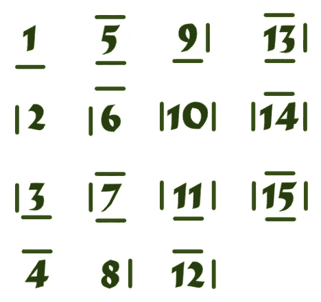

# BFS:从爱丽丝到门迪克斯

> 原文：<https://medium.com/mendix/bfs-from-alice-to-mendix-e4d7376e0901?source=collection_archive---------7----------------------->

Figure 0 Run, Alice! Before you lose the white rabbit out of your sight!

[https://alicelabyrinth-sandbox.mxapps.io/](https://alicelabyrinth-sandbox.mxapps.io/)

让我来指导你我的旅程，我是如何从解决一个 CodinGame 的难题，到在 Mendix 中制作一个小应用程序，同时我来说明广度优先搜索。首先，我们去爱丽丝梦游仙境。

爱丽丝跟着兔子下了洞，进入了神秘的科丁加姆仙境。这个领域的传言说，它充满了奇怪的程序员解决琐碎的编程挑战，尝试各种算法，如广度优先搜索(BFS)，见图 1。

Figure 1 How breadth first search works. Source: [https://www.codingame.com/learn/BFS](https://www.codingame.com/learn/BFS)

爱丽丝决心不让白兔离开她的视线。她追着白兔跑进了迷宫。事实证明，白兔的速度太快了。她一进来，就失去了白兔。她停了一会儿，因为她意识到仅仅追赶那只白兔会给她带来更大的麻烦。她决定从结构上解决这个问题。爱丽丝从背包里拿出笔和纸，开始写下各种笔记。她遵循以下四个解决问题的步骤(见 https://youtu.be/vEq6vmKIJwo[):](https://youtu.be/vEq6vmKIJwo)

1.  问题陈述
2.  对象表示
3.  解决方案策略
4.  实验

在地面上，她发现了从 1 到 16 的奇怪数字，见图 2。

Figure 2 The labyrinth from the top view with x and y-axis. On each cell you see a number, what does it say?

爱丽丝是一个非常聪明的女孩，她发现了牢房墙壁的数量和地面价值之间的联系。对于一个小女孩来说，她是一个非凡的病人，首先在她的笔记本上解决这个问题，然后冲进去将各种逻辑拖放到建模器中。

1 问题陈述。

她用“给定*输入*，我想到达*输出*”的公式来思考她的问题陈述:给定这个迷宫，其中的单元格包含墙壁的值，我想找到我和兔子之间的最短路径。

2 对象表示

Alice 环顾四周并确定对象表示，这就像在 Mendix 中弄清楚域模型一样。有一个迷宫，它是一个单元的集合，我们称之为节点，包含从 1 到 15 的值。根据该值，Alice 能够推断出它连接到了哪些节点。迷宫是一张图表。x 0 和 y 0 上的节点连接到 x 0 和 y 1 上。这意味着节点 0，0 是节点 0，1 的父节点。因为该图是无向的，这意味着您可以从节点 0，0 转到节点 0，1，但也可以从节点 0，1 回到节点 0，0。

Alice 对实体图和节点很满意。

3 解决方案策略

她想出了一个接近这个迷宫的策略。为了找到最短路径，她决定使用广度优先搜索。

第一步:她首先需要连接迷宫的所有节点。有了这个值，她就可以计算出父节点连接到哪个子节点。1 个用于下壁，2 个用于左壁，4 个用于顶壁，8 个用于右壁。因此，值为 5 的节点 1，2 有一个顶壁 5–4 = 1 和一个底壁 1–1 = 0。

第二步:启动 BFS。她所站的节点就是根，见图 3。该节点首先被添加到队列中，队列是一个列表，所有节点都在其中等待 BFS 处理。想象一下，你在排队等候进入你最喜欢的主题公园景点。第一个进入队列的是第一个离开队列(进入景点)的(先进先出 FIFO)。

Figure 3 The node with Alice is the root. Can you already find the shortest path from Alice to Rabbit?

步骤 3:当队列包含节点时，这些节点急切地等待轮到 BFS

步骤 4:将节点放在队列的前面，并获取其子节点

步骤 5:对于每个孩子，设置到 Alice 的距离，并将其添加到队列中，参见图 4。

Figure 4 For each cell, the distance is calculated to the root

第 6 步:当 BFS 找到所有节点后，从兔子开始，向后数距离，直到找到爱丽丝，见图 5。

Figure 5 The shortest path from Rabbit to Alice highlighted in green. You probably already figured out the shortest path, didn’t you?

现在爱丽丝想出了她的策略，所以她拿出了她的最好的朋友，她永远的朋友，不要和 BFS 混淆。这些孩子被小玩意宠坏了，因为她拿出了一架她甚至可以自己编程的无人机！她用自己的解决方案给自己的闺蜜编程。无人机飞出去。计算从爱丽丝到兔子的最短路径。然后回来引导爱丽丝去找白兔。

爱丽丝和兔子结合了。谁知道这种情况会持续多久，直到白兔看了一眼他的时钟，发现他总是迟到。

爱丽丝和白兔联合了。得分 100%！我写出了我的 JavaScript 代码，通过测试用例，看到我获得了 100%的分数，我感到很自豪。当我想象这个挑战中的一个 Mendix 应用程序时，我兴奋起来，这样我就可以炫耀我了解 BFS。

在 Mendix 中连接输入和输出并不是我最大的挑战，因为我已经找出了我的伪代码。我最大的挑战是如何向用户呈现输入和输出。我如何让用户配置迷宫？我必须击败的贾巴沃克正在获得前端动力。她在模板网格的洞穴里休息。

我画了一些草图，看起来类似于图 6。

Figure 6 How it now looks like in the Mendix application, where you can find this Labyrinth preconfigured. Click on one of the buttons in the top, Alice or Rabbit, and place them somewhere in the Labyrinth.

模板网格非常适合二维数组。在 JavaScript 中，我使用一个 2D 数组作为 4 个其他列表的列表，包含 4 个单元格。在 Mendix 中，我不能在列表中保存列表。然而，通过向节点实体添加 x-y 坐标，我实现了类似的东西。当您在应用程序中选择一个单元格时，您会看到它的坐标为白色。

使模板网格动态化，不同的单元格有不同的边界，是最困难的部分。您可以单击任意单元格，然后单击附近的单元格。这导致这两个单元连接，并且它们之间的壁被移除。用 CSS 我可以给单元格添加边框。然而，我不想让所有的单元格都有相同的边框，如图 7 所示。用户必须有拆除墙壁的可能性。

Figure 7 Every cell is bordered

当您删除应用程序中的墙时，单元格会立即在后端连接起来，并且值(范围从 1 到 15)会更新。覆盖这部分，连接网格的细胞，是我伪代码中最难的一步。

此外，边界必须是动态的，取决于从 1 到 15 的值，见图 8。

Figure 8 Depending on the value, the position of the borders (walls) are calculated. Can you figure out which values are the basic values the other values are based on?

为了打败这个贾巴沃克，我进入了应用商店，找到了我的沃帕尔之剑:动态类。对于您在图 8 中看到的每个数字，我必须有一个不同的类。例如，我有 border10 类，有左边框和右边框。我成功地使边境充满活力，但是贾巴沃克还没有被打败。只有细胞的内容得到了边界，但不是整个细胞。

我把自己藏在一个叫做谷歌的城堡里，在那里我找到了我的下一个武器:内嵌块。我把它添加到动态类的容器中，于是贾巴沃克号咽下了最后一口气。

然而，贾巴沃克确实让我受伤了，因为我没能让整个前端充满活力。你会看到一个 4 乘 4 的格子，高 4，宽 4。可以输入高度。但是，您不能输入宽度，因为它在模板网格中是固定的。

随着我的贾巴沃克被击败，迷宫被正确地显示出来，以及它所有的动态边界，实现第 2 步到第 6 步不再那么困难了。所有的节点也已经彼此正确关联，这使得检索它们并逐个浏览它们变得很容易。

你自己试试吧。你可以选择预配置的迷宫，在这篇博客中使用过。然后点击爱丽丝按钮，把爱丽丝放在迷宫的某个地方。单击兔子按钮将兔子放在某个地方。首先用 BFS 计算距离。然后就可以找到去兔子的最短路径，见我的伪代码第 6 步。您也可以选择配置自己的迷宫，并尝试在我实现的 BFS 上设置难度。

你也可以尝试自己解决共同游戏挑战或 Mendix 中的其他共同游戏挑战。用 JavaScript 解决 CodinGame 的难题帮助我提高了解决问题的技巧。它给我带来了耐心，因为几天后我还在和一些人斗争。自己在纸上解谜，有助于我理解问题。

在 Mendix 中用它制作一个应用程序是一个完全不同的挑战。我已经理解了这个问题，但是我真的理解到足以把它变成一个用户可以输入和读取输出的应用程序吗？在 Mendix 中制作它迫使我考虑如何将输入和输出呈现给用户。在 Mendix 中制作应用程序很容易，这打开了一个新的视角来看待和处理这个难题。