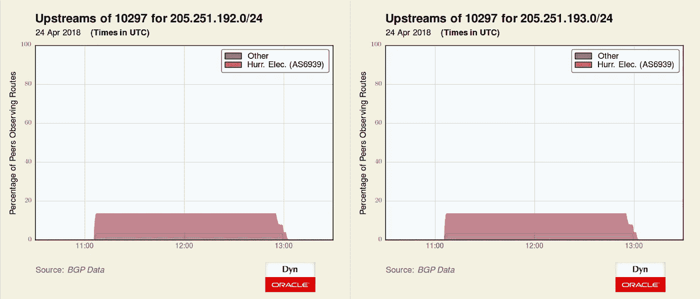
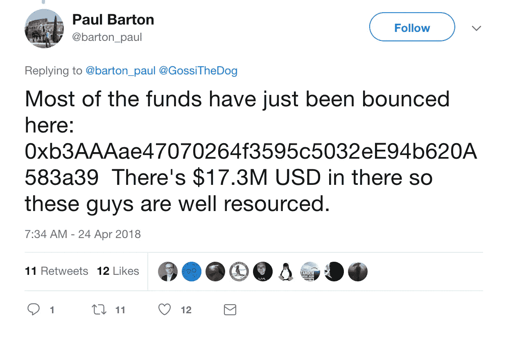

# BGP 劫持亚马逊 DNS 窃取加密货币

> 原文：<https://medium.com/oracledevs/bgp-hijack-of-amazon-dns-to-steal-crypto-currency-a90dd29cb3ab?source=collection_archive---------0----------------------->

昨天早上，我们发布了一条推文(如下),称亚马逊的权威 DNS 服务受到了路由(BGP)劫持的影响。我们不知道这是一个精心策划的计划的一部分，利用 DNS 和 BGP 固有的安全弱点来窃取加密货币，但这一引人注目的场景似乎已经发生了。

> 今早 BGP 劫持影响了亚马逊 DNS。俄亥俄州哥伦布市的 eNet (AS10297)宣布了以下亚马逊路线从世界协调时今天 11:05 到 13:03 的更多细节:205 . 251 . 192 . 0/24 205 . 251 . 193 . 0/24 205 . 251 . 195 . 0/24 205 . 251 . 197 . 0/24 205 . 251 . 197 . 0/24
> 
> *205.251.199.0/24*
> 
> *—互联网智能(@互联网英特尔)*[*2018 年 4 月 24 日*](https://twitter.com/InternetIntel/status/988792927068610561?ref_src=twsrc%5Etfw)

在发布劫持推文后，我观察到与加密货币网站 myetherwallet.com 有关的 DNS 劫持报告，并认为这两件事可能有关联:

> *也许和这个有关:*[*https://t.co/6dOrmEuRAz*](https://t.co/6dOrmEuRAz)
> 
> *—道格·马多利(@ DougMadory)*[*2018 年 4 月 24 日*](https://twitter.com/DougMadory/status/988793161014267909?ref_src=twsrc%5Etfw)

果然，eNet/ [XLHost](http://www.xlhost.com/) (AS10297)似乎遭遇了一个漏洞，使得攻击者能够冒充亚马逊的权威 DNS 服务。这些攻击者利用 AS10297 公布了亚马逊 DNS 使用的五条路由:

Amazon.com 股份有限公司 Amazon.com 股份有限公司 Amazon.com 股份有限公司

Amazon.com 公司。

如上所述，这些 BGP 路由不是全局路由。事实上，只有 15%多一点的 BGP 来源在他们的表格中有它们。然而，接受被劫持路由的网络用户(显然包括谷歌的[递归 DNS 服务](https://twitter.com/mdhardeman/status/988805808501788678))将他们的 DNS 查询发送到嵌入在 AS10297 中的冒名顶替的 DNS 服务。根据 CloudFlare 的说法，如果这些用户试图访问 myetherwallet.com，冒名顶替的 DNS 服务不会将他们导向亚马逊网络服务(通常托管该网站)，而是导向一组俄罗斯 IP 地址。请注意，用户确实需要在浏览器中点击通过证书失败警报，但这并没有阻止许多用户。

几个小时后，MyEtherWallet 发布了一份声明，承认他们的加密货币服务的许多用户被重定向到一个欺诈网站(尽管错误地将劫持归咎于谷歌 DNS，而不是亚马逊 DNS):

> 更正:今天早上的 BGP 劫持针对的是 AWS DNS，而不是 Google DNS。
> 
> **—互联网智能(@互联网英特尔)*[*2018 年 4 月 24 日*](https://twitter.com/InternetIntel/status/988841601400270848?ref_src=twsrc%5Etfw)*

***结论***

*这种攻击滥用了 BGP 基于信任的特性来颠覆亚马逊的 DNS。然后，它滥用 DNS 基于信任的性质，将用户导向俄罗斯的一个恶意网站，并准备好取走他们的加密货币。*

*尽管提出了保护 BGP 和 DNS 的技术措施，但我们目前似乎没有办法完全防止这种情况再次发生。然而，一个值得考虑的想法[来自 NTT 的 Job Snijders](https://twitter.com/JobSnijders/status/988948198436851712)，他提议主要的 DNS 权威服务提供 RPKI 作为其路由的来源验证。这将使 ASes 和 IXP 路由服务器能够丢弃无效的路由，就像昨天用来冒充亚马逊 DNS 的那些路由一样。*

*如果像这样的袭击可以不受惩罚地进行并从中获利，我们可以期待更多的袭击。*

**

**原载于 2018 年 4 月 25 日*[*blogs.oracle.com*](https://blogs.oracle.com/internetintelligence/bgp-hijack-of-amazon-dns-to-steal-crypto-currency)*。**