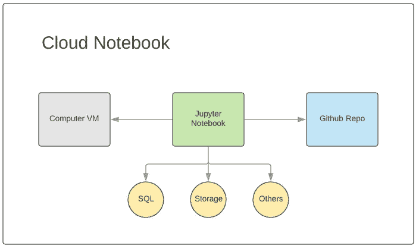
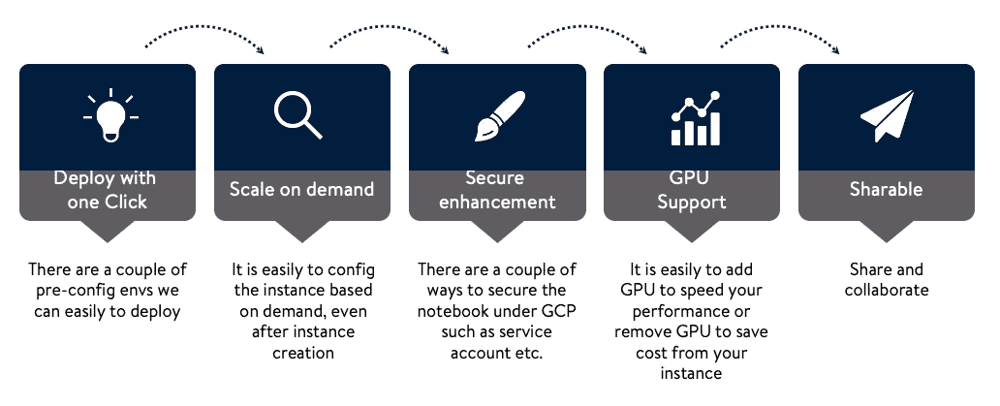
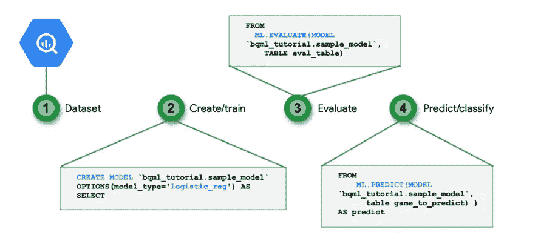
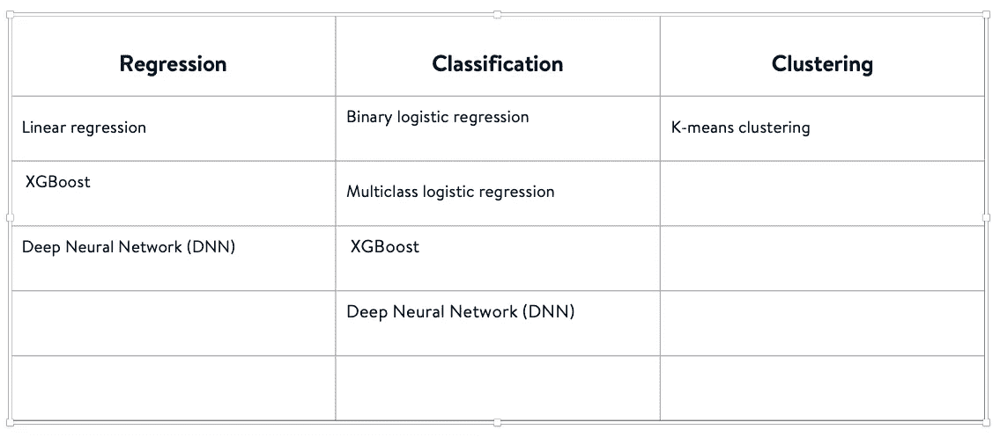
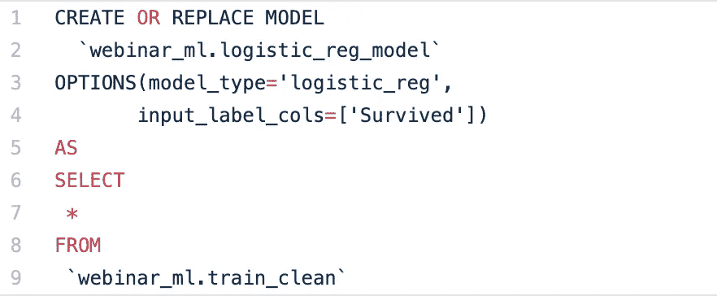
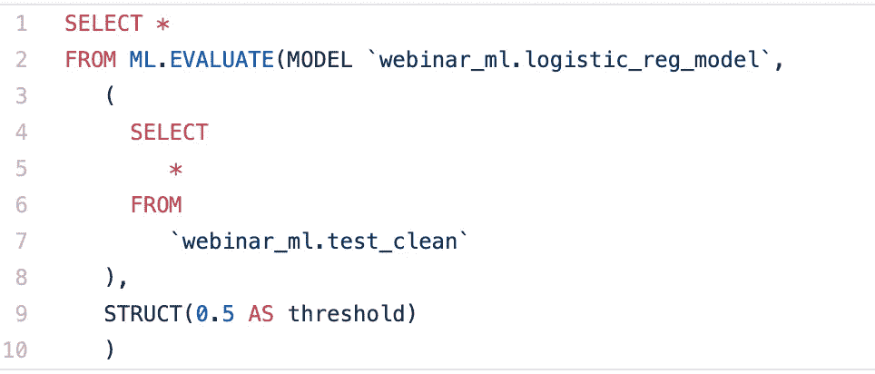
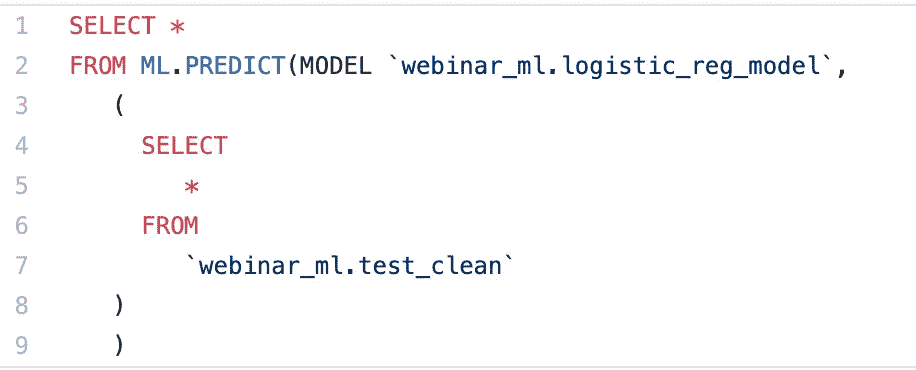

# 使用云笔记本和查询风格 ML 的大数据分析

> 原文：<https://medium.com/walmartglobaltech/big-data-analytics-with-cloud-notebooks-and-query-style-ml-4a5c71ac2960?source=collection_archive---------7----------------------->

## 关于将机器学习与云服务相结合的迷你指南


Photo credit: Pixabay

云服务由于其灵活性、可持续性、成本节约、安全性等，扮演着比以前重要得多的角色。那么如何将机器学习与云服务相结合成为云未来的另一个方面。目前，云服务供应商有多种选择。对于他们中的每一个人，他们在云服务下都有一些类似的与机器学习相关的组件。比如有微软 Azure 笔记本，GCP 云 AI 平台笔记本，AWS EMR 笔记本，Azure SQL 中的机器学习服务等。在我们的特例中，我们以 GCP 为例。当我看着他们比如 AI 平台笔记本，BigQuery ML，AutoML 等。，我心中有一个很大的问号——我们如何选择正确的方法来达到我们的目标？在这篇博客中，我们将使用两种不同的方法来创建基于“泰坦尼克号——灾难中的机器学习”(参考文献 1)的数据的逻辑回归。我们试着根据结果比较云笔记本和查询风格 ML 的优缺点。

我们使用的数据来自 Kaggle，主要目标是预测哪些乘客在泰坦尼克号沉船事故中幸存。

# 议程

*   通用云笔记本的架构
*   基于笔记本预测数据
*   查询样式 ML
*   基于查询样式 ML 预测数据
*   云笔记本与查询风格 ML 的比较
*   推荐

# 通用云笔记本的架构



Cloud Notebook — Architecture

根据上面的图表，我们可以发现 Jupyter 笔记本位于带有预配置实例的 Compute VM 下。它可以接触到不同的服务，如 SQL、存储等。这是一款高级 Jupyter 笔记本电脑，具有以下优势。



Benefits for Notebook

# 基于笔记本预测数据

我们按照以下步骤构建笔记本，您可以在参考 2 笔记本下找到所有详细代码:

*   业务理解(目标和描述)
*   数据理解:统计摘要、可视化和数据质量检查
*   数据准备:缺失值插补、特征工程和整合数据
*   建模:建立一个模型。符合模型。验证模型
*   估价

# 查询样式 ML？

查询风格 ML 是机器学习的一个新领域。查询风格 ML 最关键的一点是创建一个基于 SQL 的 ML 模型。即使我们不知道像 python 或其他 ML 库这样的编程语言，我们仍然可以使用 SQL 构建 ML 建模。

在这个特殊的例子中，我们使用 BigQuery ML，它包括四个步骤:获取数据集、创建和训练模型、评估模型和预测结果。



Photo credit: Google Cloud Platform

但是 BigQuery ML 到目前为止只支持以下回归、分类、聚类的模型。我们可以在下面的桌子下面找到它们。



BigQueryML: Support Models

# 基于查询样式 ML 预测数据

因为做统计汇总、可视化、数据质量检查和特征工程不是那么容易，所以我们使用来自笔记本部分的特征工程的结果数据，并将数据输入到 BigQuery 表中(我们使用 BigQuery 作为例子)。

输入数据后，我们在下面的四个步骤中处理 BigQuery ML 流程:

## 步骤 1:基于训练数据创建模型

与创建表一样，我们可以基于训练集创建逻辑回归模型。我们可以设置很多参数，但是现在，我们只使用所有的默认值。



BigQueryML — Create Model

## 步骤 2:获取模型信息

创建模型后，我们可以使用 SQL 获得许多不同的模型信息。以下查询将返回所有要素的权重。同样，我们可以得到很多模型元数据，我们可以参考参考文献 3 中的页面。


BigQuery — Get Model Info

## 步骤 3:评估模型

使用下面的查询和测试数据集，我们可以获得分类问题的 6 个性能指标，如精度、召回率、准确度、f1_score、log_loss 和 roc_auc。



BigQuery — Evaluate Model

## 第四步:预测

最后一步是根据模型预测数据。我们可以使用下面的查询来预测数据。



BigQuery — Predict

# 云笔记本与查询风格 ML 的比较

我们使用两种不同的方法来创建基于相同数据的逻辑回归。让我们来看看这两种型号的性能结果。根据下表，我们可以发现这两个模型有非常相似的结果。

```
| Metric    | Notebook    | BigQuery ML |
|-----------|-------------|-------------|
| precision | 0.798407557 | 0.790697674 |
| recall    | 0.746405229 | 0.790697674 |
| accuracy  | 0.842602041 | 0.850622407 |
| roc_auc   | 0.901349357 | 0.902874126 |
```

除了模型性能，让我们深入下面的 7 个类别，以获得云笔记本和查询风格 ML 之间更详细的方面。得分范围从低到高。我们也可以在下面找到最终的比较表。

## 数据清理灵活/特征工程:

编程语言可以更灵活地处理数据，甚至 SQL 也可以做一些基本的方法。

## 模型多样性:

BigQuery ML 对模型选择有限制。

## 模型创建和保存:

BigQuery ML 在这里表现很好，因为它可以像创建表一样创建模型。

## 基本模型性能:

对于基本模型，这两种方法具有相同的性能结果。

## 自动性能调节:

BigQuery ML 需要在 SQL 语句下手动设置一些参数，但是对于编程语言，我们有一些像 GridSearchCV 这样的库来自动调整模型。

## 可视化:

BigQuery ML 不支持数据可视化，它需要 looker 或其他工具的支持。然而，在笔记本电脑下执行可视化要灵活得多。

## 技能多样性:

学习 SQL 可能比学习编程语言简单一点。

```
| Aspects                   | AI Platform Notebooks | BigQuery ML |
|---------------------------|-----------------------|-------------|
| Data Cleaning Flexible    | high                  | low         |
| Feature Engineering       | high                  | low         |
| Model Diversity           | high                  | low         |
| Model Creation and Saving | medium                | high        |
| Basic Model Performance   | high                  | high        |
| Auto Performance Tuning   | high                  | low         |
| Visualizing               | high                  | low         |
| Skill Diversity           | high                  | medium      |
```

# 推荐

基于上一节，我们可以发现查询风格 ML 在模型创建和保存、基本模型性能和技能多样性方面具有良好的性能。我们来讨论一下什么时候用查询风格 ML，什么时候用云笔记本。

## 查询样式 ML:

在处理基于干净数据集的简单回归、分类和聚类时，我们可以使用查询样式 ML 进行初始分析。

## 云笔记本:

我们可以在任何时候用它来处理任何情况，比如图像分类，自然语言处理等等。

就我的理解，当我需要创建一些简单的模型时，我会同时使用笔记本和查询样式 ML。使用笔记本对数据和特征工程进行预处理，使用查询样式 ML 创建和存储模型。

# 参考

1.  [https://www.kaggle.com/c/titanic](https://www.kaggle.com/c/titanic)
2.  [https://github . com/Jason-JZ-Zhu/Webinar _ BigQueryML/blob/main/basic-notebook-for-titanic-demo . ipynb](https://github.com/jason-jz-zhu/Webinar_BigQueryML/blob/main/basic-notebook-for-titanic-demo.ipynb)
3.  [https://cloud . Google . com/big query-ml/docs/getting-model-metadata](https://cloud.google.com/bigquery-ml/docs/getting-model-metadata)