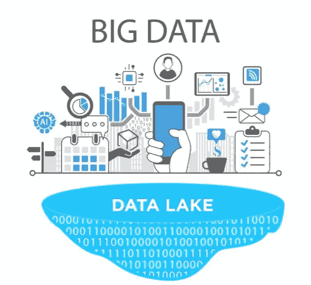

# 大数据和数据湖完整概述

> 原文：<https://medium.com/oracledevs/big-data-data-lake-a-complete-overview-475b16eb736?source=collection_archive---------9----------------------->

www.igfasouza.com

什么是破解杰克？

如果你想知道什么是大数据，而不是你认为的大数据，或者如果你想知道什么是数据湖，而不是你认为的数据湖，你应该看看这个。

我刚刚完成了一系列博客文章，其中我概述了大数据、数据湖、Hadoop、Apache Spark 和 Apache Kafka。

这里的想法是一个完整的帖子，有一个很好的概述和一个发现这些领域和技术的好起点。

[什么是大数据？](http://www.igfasouza.com/blog/what-is-big-data/)

[什么是数据湖？](http://www.igfasouza.com/blog/what-is-data-lake/)

[什么是 Hadoop？](http://www.igfasouza.com/blog/what-is-hadoop/)

[什么是阿帕奇 Spark？](http://www.igfasouza.com/blog/what-is-apache-spark/)

[什么是阿帕奇卡夫卡？](http://www.igfasouza.com/blog/what-is-kafka/)

[Hadoop 生态系统& Hadoop 发行版](http://www.igfasouza.com/blog/hadoop-ecosystem-hadoop-distributions/)

所有的帖子都是基于一系列的链接、视频、教程、博客和书籍，我发现其中夹杂着我的观点。

整个内容需要大约两个小时来阅读，所以很好的研究！

感谢你花时间阅读这篇文章。