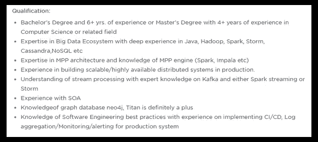

# 大数据工程师简历—打造令人印象深刻的数据工程师简历

> 原文：<https://medium.com/edureka/big-data-engineer-resume-7bc165fc8d9d?source=collection_archive---------0----------------------->

Big Data Engineer Resume — Edureka

简历是一张电子羊皮纸，它会在面试官面前树立你的第一印象，为你扫清第一轮筛选的障碍。当谈到大数据工程师等责任和期望都很高的精英职位时，简历必须是自我描述的，令人印象深刻的。这个关于大数据工程师简历的博客将帮助你建立一个。

经验和技能是你简历中最重要的部分。确保它符合工作要求。开始创建数据工程师简历的最恰当的方式是查看一些真实的工作职责。

# 大数据工程师职位描述

## 大数据工程师的职责

不浪费任何时间，让我们快速浏览一些职位描述，这将有助于您了解行业对大数据工程师的期望。你可以做好相应的准备。

*   **戴尔****—大数据工程 **

*   **爱立信** — ***大数据工程师***

*   **沃尔玛实验室** — ***数据工程师***

让我们总结一下大数据工程师/数据工程师的职责。

# ***大数据工程师职责:***

*   设计、创建、测试和维护完整的数据管理和处理系统。
*   与利益相关者和解决方案架构师紧密合作。
*   确保架构满足业务需求。
*   构建高度可扩展、健壮且容错的系统。
*   负责整个 ETL 过程。
*   发现数据获取机会
*   寻找从现有数据中发现价值的方式和方法。
*   提高单个组件和整个系统的数据质量、可靠性和效率。
*   通过将各种编程语言和工具集成在一起，创建完整的解决方案。
*   创建数据模型以降低系统复杂性，从而提高效率并降低成本。
*   在现有系统中引入新的数据管理工具和技术，以提高效率。
*   设定和实现个人和团队的目标。

向前推进，现在我们需要看看组织履行这些工作职责所需的技能。

# 所需的大数据工程师技能

理解所需技能的最明智的方法是查看相同的职位描述。

*   **戴尔** — ***大数据工程***

*   **爱立信** — ***大数据工程师***

*   **沃尔玛实验室** — ***数据工程师***

完全正确！现在，我们将找出有助于我们建立简历和准备面试的重要技能。

*   了解 Hadoop 生态系统及其内部的不同框架——HDFS、YARN、MapReduce、Apache Pig、Hive、Flume、Sqoop、ZooKeeper、Oozie、Impala 和 Kafka
*   实时处理框架(Apache Spark)
*   数据库架构
*   基于 SQL 的技术(例如 MySQL/ Oracle DB)
*   NoSQL 技术公司(如 Cassandra 和 MongoDB)
*   编程语言:Python/R/Java
*   ETL/数据仓库解决方案(Talend，Informatica)
*   了解不同的操作系统— UNIX、Linux、Solaris 或 MS Windows
*   具有 SOA、图形数据库、CI/CD 管道、监控和警报知识者优先。

除了这些技术技能之外，你还需要提到你的人际交往技能，如强大的沟通技能、领导技能、管理技能、解决问题的技能等。这将证明你的能力。

现在让我们把注意力集中在制作简历时应该牢记的要点上。

# 恢复建筑

简历是你在面试官面前的第一印象。这是实现目标的第一步，也是最关键的一步。有两种方法可以制作你的简历:

*   这是制作简历的传统方式，你可以用经历发生的方式提及你的经历。保守领域首选这类简历。
*   **功能性:**这是一种全新的方式，你可以根据所需的技能来提及你最相关的经验。在这种情况下，你的招聘人员不必浏览整个简历来找出所需的技能。这是一种在面试官面前更专注、更简洁地展示自己的方式。

在制作简历时，有几个关键点需要记住。

*   你需要记住的第一件事是，你的简历应该在格式和你试图传达的信息方面保持一致、简洁和清晰。
*   保持你的简历更新。建立或更新你的简历真的很累，但是你投入的时间越多，你被选中的几率就越高。招聘人员会收到数百份求职简历，而你的简历将为你扫清第一轮的障碍。
*   对于某人来说，少于 8 年的工作经验应该有一份单页简历。你最多应该带一份两页的简历。两页之后，简历变得冗长，面试官对阅读它失去了兴趣。
*   如果你有 2 年以上的工作经验，试着做一份功能性简历，只写相关的工作经历，而不是充斥所有的内容。优先考虑特定工作所需的技能。为每一份工作制作一份定制的简历总是更好。
*   列出活动，并提及你在活动中的角色。这是你展示你的人际交往能力的地方，比如领导力、团队精神等。此外，列出你所获得的奖项，以证明你在不同领域的潜力。
*   你的爱好在打破与面试官的僵局方面起着重要的作用。这一部分也表明你是一个拥有各种技能和爱好的多面手。

现在，让我们进入大数据工程师简历博客中最令人期待的部分。

# 大数据工程师简历

现在具体说大数据工程师简历，除了你的姓名&个人详细信息，第一节应该是你的工作经历。

## 工作经历

你应该总是从相关的工作经历开始，这将很快引起招聘人员的注意。它应该以一种非常简洁、明快和清晰的方式陈述你所承担的责任以及你从中学到的东西。

你可以把你的经历分成以下几部分:

*   指定
*   组织名称
*   雇佣期限
*   工作职责简述
*   你从那份工作中学到的知识或经验

# ***示例:***

**经历:美国银行数据工程师**

2015 年 7 月至今

在风险管理团队中担任大数据工程师，该银行希望在日常运营中存储、处理和管理从各种来源收集的大量数据。该系统主要检查客户的信誉，寻找信用风险。

>与各个团队和管理层合作，了解需求并设计完整的系统

>实施了具有实时处理功能的完整大数据管道

>使用 Cloudera 5.11.x 及其不同组件

>使用 Spark 2.1.x API 实时传输来自各种来源的数据

>使用 Spark SQL 和数据帧在 Scala 中开发 Spark 代码进行聚合

>使用 Sqoop 从各种 RDBMS(如 Oracle DB 和 MySQL)获取和检索数据

>在配置单元中创建了模式，并使用分桶和分区进行了性能优化

>严格使用 Impala 2.8.x 来执行特别查询

>编写 Hive 查询来转换数据，以便进一步进行下游处理

>为调度查询和操作创建 Oozie 工作流作业

>参与端到端部署流程

**塔塔咨询服务公司高级软件工程师**

2013 年 6 月至 2015 年 7 月

— — — — — — — — — — — — — — — — — — — — — — — — — — — — — — — — — — — — — — — — — — — — — — — — — — — — — — — — — — — — — —

> — — — — — — — — — — — — — — — — — — — — — — — — — — — — — —

> — — — — — — — — — — — — — — — — — — — — — — — — — — — — — —

**Java 开发者—德勤**

2010 年 11 月至 2013 年 7 月

— — — — — — — — — — — — — — — — — — — — — — — — — — — — — — — — — — — — — — — — — — — — — — — — — — — — — — — — — — — — — —

> — — — — — — — — — — — — — — — — — — — — — — — — — — — — — —

> — — — — — — — — — — — — — — — — — — — — — — — — — — — — — —

上面的简历中有一些关键因素，它们不仅会让你更有优势，还会给你的雇主留下深刻印象。

*   看着工作描述，你可以同样调整你的经历&提及那些组织需要的工具和技能。
*   大数据工程师工作经验更相关，所以我阐述了第一部分。在写我的 Java 开发人员和高级软件工程师工作时，我将只包括大数据工程师角色所必需的那些技能。
*   你需要明白，有太多的工具用于一个单一的目的，你不可能掌握所有的工具。因此，我的建议是，不要仅仅提及工具或框架的名称，而是添加一个关于你的知识和参与工具的小描述。这也有助于面试官了解，如果你没有使用相同工具的经验，你有使用另一种工具的经验。

# 技术

在工作经历之后，我会建议你创建一个技术技能部分，在那里你可以列出你的技术技能。您可以将您认为大数据工程师工作角色所需的所有技能，或者您有信心掌握的技能放入其中。

## 样品

**技术技能:**

CDH、HDFS、SPARK、Hive、Impala、Sqoop、Map Reduce、Oozie、Putty、Netezza、YARN、Python、R、Talend、Informatica、Power BI、Hibernate、RHEL、UNIX、Windows、敏捷方法论、MongoDB、Cassandra、HBase、MySQL、Oracle DB、SOA、CI/CD。

**成就&爱好**

在这之后，下一个部分应该是成就和爱好。尽量不要提及太多的成就或爱好，因为这会分散面试官的注意力&他/她可能会错过重要的。提几个相关的&你有信心的。

您可以点击 从 [***下载大数据工程师简历样本。***](https://goo.gl/ths1Rf)

我希望这个大数据工程师简历博客已经帮助你弄清楚如何建立一个有吸引力和有效的简历。在我们即将发布的关于大数据工程师薪酬的博客中，我们将讨论影响大数据工程师薪酬的不同因素。

如果你想查看更多关于人工智能、Python、道德黑客等市场最热门技术的文章，你可以参考 Edureka 的官方网站。

请留意本系列中解释大数据其他各方面的其他文章。

> 1. [Hadoop 教程](/edureka/hadoop-tutorial-24c48fbf62f6)
> 
> 2.[蜂巢教程](/edureka/hive-tutorial-b980dfaae765)
> 
> 3.[养猪教程](/edureka/pig-tutorial-2baab2f0a5b0)
> 
> 4.[地图缩小教程](/edureka/mapreduce-tutorial-3d9535ddbe7c)
> 
> 5.[h 基础教程](/edureka/hbase-tutorial-bdc36ab32dc0)
> 
> 6. [HDFS 教程](/edureka/hdfs-tutorial-f8c4af1c8fde)
> 
> 7. [Hadoop 3](/edureka/hadoop-3-35e7fec607a)
> 
> 8. [Sqoop 教程](/edureka/apache-sqoop-tutorial-431ed0af69ee)
> 
> 9.[水槽教程](/edureka/apache-flume-tutorial-6f7150210c76)
> 
> 10. [Oozie 教程](/edureka/apache-oozie-tutorial-d8f7bbbe1591)
> 
> 11. [Hadoop 生态系统](/edureka/hadoop-ecosystem-2a5fb6740177)
> 
> 12.[HQL 顶级蜂巢命令示例](/edureka/hive-commands-b70045a5693a)
> 
> 13. [Hadoop 集群搭配亚马逊 EMR？](/edureka/create-hadoop-cluster-with-amazon-emr-f4ce8de30fd)
> 
> 14.[大数据教程](/edureka/big-data-tutorial-b664da0bb0c8)
> 
> 15. [Hadoop 开发人员-工作趋势和工资](/edureka/hadoop-developer-cc3afc54962c)
> 
> 16. [Hadoop 面试问题](/edureka/hadoop-interview-questions-55b8e547dd5c)

*原载于 2018 年 11 月 22 日*[*https://www.edureka.co*](https://www.edureka.co/blog/big-data-engineer-resume/)*。*