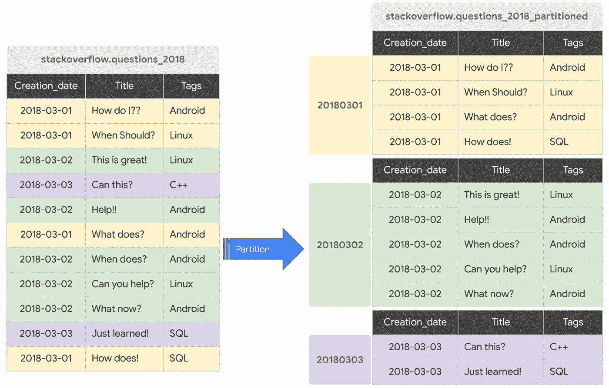
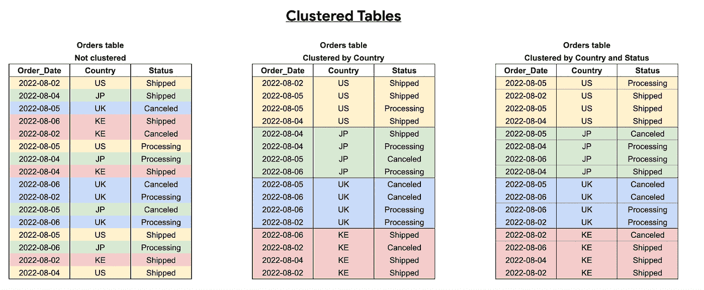
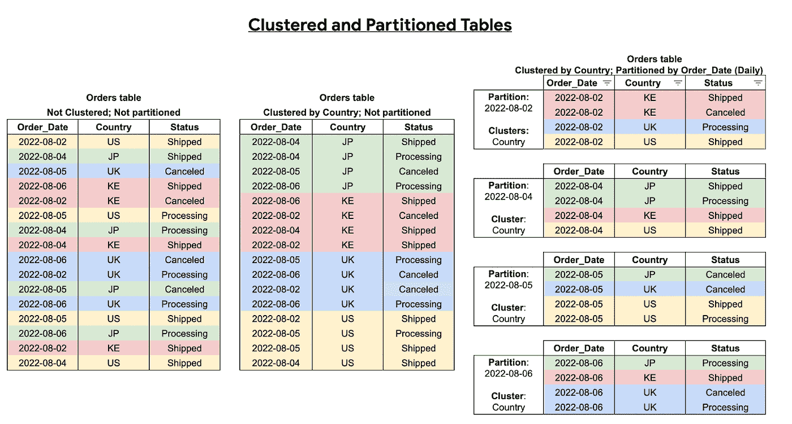

# BigQuery:传统 SQL 与标准 SQL 的难题

> 原文：<https://medium.com/globant/bigquery-legacy-sql-vs-standard-sql-conundrum-f8628abd1e82?source=collection_archive---------0----------------------->

## **案例研究**

Photo by [benjamin lehman](https://unsplash.com/@benjaminlehman?utm_source=medium&utm_medium=referral) on [Unsplash](https://unsplash.com?utm_source=medium&utm_medium=referral)

在这篇博客中，我们将了解[遗留 SQL](https://cloud.google.com/bigquery/docs/reference/legacy-sql) 中的一些限制，这些限制阻止了用户利用[标准 SQL](https://cloud.google.com/bigquery/docs/reference/standard-sql/introduction) 的优化优势。借助案例研究的概述，展示了如何在 BigQuery 中使用分区和集群来帮助您使用标准 SQL 方言优化成本和性能。

# 简短的大查询

[BigQuery](https://cloud.google.com/bigquery/docs/introduction) 作为一种全面管理的企业数据仓库解决方案，在大数据世界中被广泛应用于各种用例，并且每天都有越来越多的人采用它。BigQuery 提供机器学习、地理空间分析和商业智能功能，帮助您管理和分析数据。其无服务器架构允许您使用 SQL 查询来回答您组织的最大问题，而无需管理任何基础架构。使用 BigQuery 可扩展的分布式分析引擎，您可以在几秒钟内查询数万亿字节的数据。BigQuery ML(机器学习)文档有助于数据分析师、数据工程师、仓库管理员或数据科学家做出重要的业务决策。

# **传统 SQL 和标准 SQL**

Bigquery 表可以用两种方言查询:遗留 SQL 和标准 SQL。遗留 SQL 是 BigQuery 2.0 发布之前的一种较老的 SQL 方言，标准 SQL 是当前的首选 SQL 方言。成本和性能优化优势(如集群和分区)在传统 SQL 方言中不可用，只能在标准 SQL 方言中使用。尽管标准 SQL 方言是 Google 建议在 BigQuery 中使用的方言，并且所有未来的改进都承诺只使用这种方言，但在一些情况下，用户仍然在使用遗留的 SQL，因为他们对更改 SQL 方言有所保留。如果我们让用户用两种方言查询同一个 BigQuery 表，并且我们希望为用标准 SQL 方言查询的用户优化性能和成本，该怎么办？这就是我们要解决的问题。

# **分区表**

分区表是被分成称为分区的段的表。这提高了查询性能并降低了查询成本，因为查询扫描的数据量减少了。目前，只能在一列上进行分区。要对 BigQuery 表进行分区，可以使用时间戳、日期或日期时间列、BigQuery 接收数据时的时间戳或整数列。这允许 BigQuery 删除与查询中的合格过滤器不匹配的分区，从而提高查询性能。当查询的 where 子句中添加的列与我们对表进行分区的列相同时，分区会限制扫描的数据量。这是一种广泛使用的查询性能和成本优化策略。

Image referred from [here](https://cloud.google.com/blog/topics/developers-practitioners/bigquery-explained-storage-overview)

# **聚集表**

聚集表可以提高查询性能并降低查询成本。BigQuery 中的聚簇表使用*聚簇列*具有用户定义的列排序顺序。聚集表对存储块中指定列的列值进行排序。当对这样的表执行查询时，它只根据查询中提到的键列值扫描相关的块。目前，一个表中最多只能对四列进行聚类。可以结合集群和分区来进一步优化它。应该有策略地选择用于聚集和分区的列，考虑对相应表执行的查询类型，以充分利用这一可用特性。

Image referred from [here](https://cloud.google.com/bigquery/docs/clustered-tables)

Image referred from [here](https://cloud.google.com/bigquery/docs/clustered-tables)

# **案例研究问题陈述**

每天增长 500 -700 GB 的 TB 级数据仓库表。此表是分析团队、数据科学团队和平台团队的事实来源。由于分析团队正在使用遗留的 SQL 方言来查询表，并且不会继续对其进行更改，因此不可能应用表优化策略，如表分区和聚类等。这意味着运行几个查询来扫描整个万亿字节的 BigQuery 表，这导致了指数级的高成本。

Image: Created by the Author

## **一种变通方法**

Hadoop 分布式文件系统( [HDFS](https://data-flair.training/blogs/hadoop-hdfs-architecture/) )是 Hadoop 集群的底层文件系统。它提供可扩展、容错、机架感知的数据存储，旨在部署在商用硬件上。该团队实施的一个节省成本的解决方案是，每天将整个表数据移动到本地集群上的 HDFS，所有其他作业在 Spark SQL 中执行。这节省了由于扫描大量数据而查询 BigQuery 所产生的高成本。这仍然是一个大问题；即使节省了成本，仅仅为了运行查询而从云中转移数据也是乏味且容易失败的。

Image: Created by the Author

# **解决方案**

当问题可以在大查询本身中解决时，每天将 TB 级的数据移出大查询。应用以下步骤在成本、性能和整个问题的复杂性方面产生了巨大的差异。

*   使用*CTAS*'*Create Table AS '*，在同一个数据集中创建一个临时 BigQuery 表。这将在执行所有日常作业之前创建一个表。
*   在*‘create _ date’*列上对临时表进行分区，并基于*‘id’*列向临时表添加聚类。
*   执行该表上的所有查询和作业。

Image: Created by the Author

*   在所有作业完成后删除该表。

# **改进对比**

这是将查询移动到 HDFS 执行或在 BigQuery 中执行查询而不进行优化与在 BigQuery 中通过应用分区和集群等优化策略执行查询之间的快速比较。

# **总结**

在由于产品的局限性和充分利用我们拥有的其他功能而受到束缚的情况下，提出一个优化的解决方案将会节省您大量的时间、复杂性和金钱。在上面的场景中，BigQuery 是问题，BigQuery 是解决方案。新用户大多使用标准 SQL 方言在 BigQuery 中进行查询，但也有少数老用户仍然使用遗留 SQL。即使在这种情况下，我们仍然可以使用变通方法为标准 SQL 用户优化同一个表。

这就结束了对分区和集群如何在 BigQuery 中拯救成本和提高性能的演示，即使由于遗留 SQL 方言的限制而不可能做到这一点。

# **参考文献**

*   [大查询](https://cloud.google.com/bigquery/docs/introduction)
*   [遗留 SQL](https://cloud.google.com/bigquery/docs/reference/legacy-sql)
*   [标准 SQL](https://cloud.google.com/bigquery/docs/reference/standard-sql/introduction)
*   [big query 中的分区](https://cloud.google.com/bigquery/docs/partitioned-tables)
*   [big query 中的聚类](https://cloud.google.com/bigquery/docs/clustered-tables)