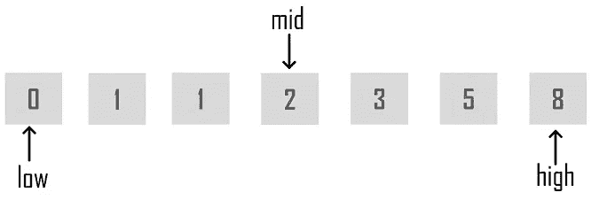

# Java 中的二分搜索法——实现递归二分搜索法算法

> 原文：<https://medium.com/edureka/binary-search-in-java-cf40e927a8d3?source=collection_archive---------6----------------------->


搜索和排序算法在任何编程语言中都是流行的算法。它们是理解编程基础的基础。Java 中的二分搜索法就是这样一种流行的搜索算法。在这篇文章中，我将告诉你所有关于它的实现。

本文涵盖了以下主题:

*   什么是二分搜索法？
*   实现二分搜索法算法
*   递归二分搜索法

我们开始吧！

# 什么是二分搜索法？

Java 中的二分搜索法是一种查找目标值在排序数组中的位置的搜索算法。**二分搜索法**将目标值与数组的中间元素进行比较。它只对一组有序的元素起作用。要对集合使用二分搜索法，必须首先对集合进行排序。



当二分搜索法用于在有序集合上执行操作时，迭代次数总是可以根据正在搜索的值而减少。你可以在上面找到 *mid 元素*的快照中看到。二分搜索法的类比是利用数组排序的信息，将时间复杂度降低到 *O(log n)* 。

# 实现二分搜索法算法

让我们来看看下面的伪代码，以便更好地理解它。

```
Procedure binary_search
A ← sorted array
n ← size of array
x ← value to be searchedSet low = 1
Set high = n**while** x not found
**if** high < low
EXIT: x does not exist.set mid = low + ( high - low ) / 2**if** A[mid] < x set low = mid + 1 **if** A[mid]> x
set high = mid - 1**if** A[mid] = x
EXIT: x found at location mid
end **while**end procedure
```

**解释:**

**第一步:**首先比较 x 和中间元素。

**第二步:**如果 x 与 mid 元素匹配，那么你要返回 mid 索引。

**第三步:**否则，如果 x 大于 mid 元素，那么 x 只能位于 mid 元素之后的右侧半数组。因此你重现了右半边。

**第四步:**否则，if (x 较小)然后对左半部分循环。

这就是在给定数组中搜索元素的方法。

现在让我们看看如何递归实现二分搜索法算法。该程序演示了相同的内容。

# 递归二分搜索法

```
**public** **class** BinarySearch {
// Java implementation of recursive Binary Search
// Returns index of x if it is present in arr[l..h], else return -1
**int** binarySearch(**int** a[], **int** l, **int** h, **int** x)
{
**if** (h >= l) {
**int** mid = l + (h - l) / 2;
// If the element is present at the middle itself
**if** (a[mid] == x)
**return** mid;
// If element is smaller than mid, then it can only be present in left subarray
**if** (a[mid] >x)
**return** binarySearch(arr, l, mid - 1, x);
// Else the element can only be present in right subarray
**return** binarySearch(arr, mid + 1, h, x);
}
// We reach here when element is not present in array
**return** -1;
}
**public** **static** **void** main(String args[])
{
BinarySearch ob = **new** BinarySearch();
**int** a[] = { 20, 30, 40, 10, 50 };
**int** n = a.length;
**int** x = 40;
**int** res = ob.binarySearch(a, 0, n - 1, x);
**if** (res == -1)
System.out.println("Element not present");
**else** System.out.println("Element found at index " + res);
}
}
```

在执行上述程序时，它将定位出现在特定索引处的元素

```
Element found at index 2
```

这就把我们带到了 Java 中的二分搜索法这篇文章的结尾。我希望您发现它提供了很多信息，并帮助您理解了 Java 基础知识。

这就把我们带到了高级 Java 教程博客的结尾。我希望你发现这个博客信息丰富，增加了你的知识价值。
如果你想查看更多关于人工智能、DevOps、道德黑客等市场最热门技术的文章，你可以参考 [Edureka 的官方网站。](https://www.edureka.co/blog/?utm_source=medium&utm_medium=content-link&utm_campaign=binary-search-in-java)

请留意本系列中的其他文章，它们将解释 Java 的各个方面。

> *1。* [*面向对象编程*](/edureka/object-oriented-programming-b29cfd50eca0)
> 
> *2。*[*Java 中的继承*](/edureka/inheritance-in-java-f638d3ed559e)
> 
> *3。*[*Java 中的多态性*](/edureka/polymorphism-in-java-9559e3641b9b)
> 
> *4。*[*Java 中的抽象*](/edureka/java-abstraction-d2d790c09037)
> 
> *5。* [*Java 字符串*](/edureka/java-string-68e5d0ca331f)
> 
> *6。* [*Java 数组*](/edureka/java-array-tutorial-50299ef85e5)
> 
> *7。* [*Java 集合*](/edureka/java-collections-6d50b013aef8)
> 
> *8。* [*Java 线程*](/edureka/java-thread-bfb08e4eb691)
> 
> *9。*[*Java servlet 简介*](/edureka/java-servlets-62f583d69c7e)
> 
> *10。* [*Servlet 和 JSP 教程*](/edureka/servlet-and-jsp-tutorial-ef2e2ab9ee2a)
> 
> *11。*[*Java 中的异常处理*](/edureka/java-exception-handling-7bd07435508c)
> 
> *12。* [*Java 教程*](/edureka/java-tutorial-bbdd28a2acd7)
> 
> *13。* [*Java 面试题*](/edureka/java-interview-questions-1d59b9c53973)
> 
> *14。* [*Java 程序*](/edureka/java-programs-1e3220df2e76)
> 
> *15。*[*kot Lin vs Java*](/edureka/kotlin-vs-java-4f8653f38c04)
> 
> *16。* [*依赖注入使用 Spring Boot*](/edureka/what-is-dependency-injection-5006b53af782)
> 
> *17。* [*堪比 Java 中的*](/edureka/comparable-in-java-e9cfa7be7ff7)
> 
> *18。* [*十大 Java 框架*](/edureka/java-frameworks-5d52f3211f39)
> 
> *19。*T110*Java 反射 API*
> 
> *20。*[*Java 中的前 30 个模式*](/edureka/pattern-programs-in-java-f33186c711c8)
> 
> *21。* [*核心 Java 秘籍*](/edureka/java-cheat-sheet-3ad4d174012c)
> 
> 22。[*Java 中的套接字编程*](/edureka/socket-programming-in-java-f09b82facd0)
> 
> *23。* [*Java OOP 备忘单*](/edureka/java-oop-cheat-sheet-9c6ebb5e1175)
> 
> *24。*[*Java 中的注释*](/edureka/annotations-in-java-9847d531d2bb)
> 
> 25。[*Java 中的库管理系统项目*](/edureka/library-management-system-project-in-java-b003acba7f17)
> 
> *二十六。*[*Java 中的树*](/edureka/java-binary-tree-caede8dfada5)
> 
> 27。[*Java 中的机器学习*](/edureka/machine-learning-in-java-db872998f368)
> 
> *28。* [*顶级数据结构&Java 中的算法*](/edureka/data-structures-algorithms-in-java-d27e915db1c5)
> 
> *29。* [*Java 开发者技能*](/edureka/java-developer-skills-83983e3d3b92)
> 
> 30。 [*前 55 名 Servlet 面试问题*](/edureka/servlet-interview-questions-266b8fbb4b2d)
> 
> *31。*[](/edureka/java-exception-handling-7bd07435508c)*[*顶级 Java 项目*](/edureka/java-projects-db51097281e3)*
> 
> **32。* [*Java 字符串备忘单*](/edureka/java-string-cheat-sheet-9a91a6b46540)*
> 
> **33。*[*Java 中的嵌套类*](/edureka/nested-classes-java-f1987805e7e3)*
> 
> **34。* [*Java 集合面试问答*](/edureka/java-collections-interview-questions-162c5d7ef078)*
> 
> **35。*[*Java 中如何处理死锁？*](/edureka/deadlock-in-java-5d1e4f0338d5)*
> 
> **36。* [*你需要知道的 50 个 Java 合集面试问题*](/edureka/java-collections-interview-questions-6d20f552773e)*
> 
> **37。*[*Java 中的字符串池是什么概念？*](/edureka/java-string-pool-5b5b3b327bdf)*
> 
> *38。[*C、C++和 Java 有什么区别？*](/edureka/difference-between-c-cpp-and-java-625c4e91fb95)*
> 
> *39。[*Java 中的回文——如何检查一个数字或字符串？*](/edureka/palindrome-in-java-5d116eb8755a)*
> 
> **四十。* [*你需要知道的顶级 MVC 面试问答*](/edureka/mvc-interview-questions-cd568f6d7c2e)*
> 
> **41。*[*Java 编程语言十大应用*](/edureka/applications-of-java-11e64f9588b0)*
> 
> *42。[*Java 中的死锁*](/edureka/deadlock-in-java-5d1e4f0338d5)*
> 
> *43。[*Java 中的平方和平方根*](/edureka/java-sqrt-method-59354a700571)*
> 
> *44。[*Java 中的类型转换*](/edureka/type-casting-in-java-ac4cd7e0bbe1)*
> 
> **45。*[*Java 中的运算符及其类型*](/edureka/operators-in-java-fd05a7445c0a)*
> 
> **46。*[*Java 中的析构函数*](/edureka/destructor-in-java-21cc46ed48fc)*
> 
> **47。*[*Java 中的二分搜索法*](/edureka/binary-search-in-java-cf40e927a8d3)*
> 
> **48。*[*Java 中的 MVC 架构*](/edureka/mvc-architecture-in-java-a85952ae2684)*
> 
> **49。* [*冬眠面试问答*](/edureka/hibernate-interview-questions-78b45ec5cce8)*

**原载于 2019 年 8 月 14 日*[*https://www.edureka.co*](https://www.edureka.co/blog/binary-search-in-java/)*。**