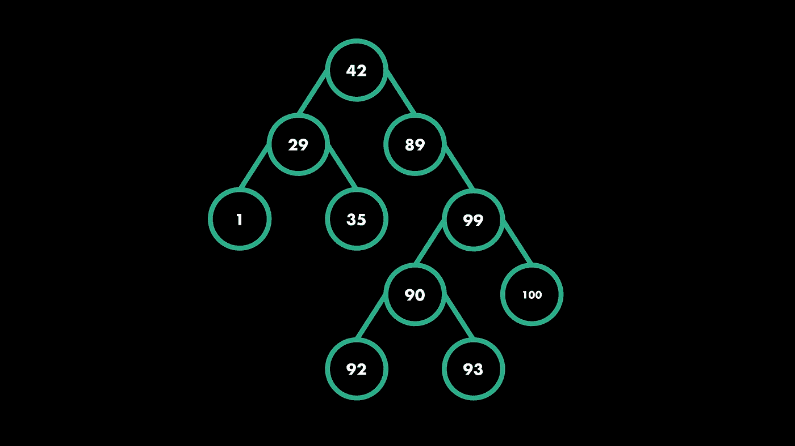
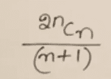

# 二叉树

> 原文：<https://medium.com/quick-code/binary-tree-traversal-python-implementation-f69c405bb286?source=collection_archive---------5----------------------->



Fig. A sample binary tree.

树是具有层次顺序的数据结构，每个节点称为父节点，可以有零到多个子节点。二叉树是这样一种树，其中每个父节点最多有两个子节点。

# 二叉树的遍历:

有三种方法可以遍历二叉树。我们也可以使用它们，稍加修改，遍历其他类型树。它们即与父子配置一起:

1)有序遍历— —左孩子/父母/右孩子

实施-

```
*class Node:* *def __init__(self, value):* *self.left =None* *self.val = value* *self.right = None**def inorder(root):* *if root:* *inorder(root.left)* *print(root.val)* *inorder(root.right)*
```

2)前序遍历— —父/左子/右子

实施-

```
*class Node:* *def __init__(self, value):* *self.left =None* *self.val = value* *self.right = None**def preorder(root):* *if root:* *print(root.val)* *preorder(root.left)* *preorder(root.right)*
```

3)后序遍历— —左孩子/右孩子/父母

实施-

```
*class Node:* *def __init__(self, value):* *self.left =None* *self.val = value* *self.right = None**def postorder(root):* *if root:* *postorder(root.left)* *postorder(root.right)* *print(root.val)*
```

遍历的时间复杂度为 O(n)。

# 树中的节点总数:

下面是查找二叉树中节点总数的给定脚本:

```
*class Node:* *def __init__(self, value):* *self.left = None* *self.value = value* *self.right = None**def total_nodes(root):* *if(!root) :* *return 0* *else :* *return 1+total_nodes(root.left)+total_nodes(root.right)*
```

# 可能的树的总数:

给定“n”个节点时，计算无标签二叉树总数的公式:



Fig. Formula for unlabelled

给定“n”个节点时，计算带标签二叉树总数的公式:


Fig. Formula for labelled.