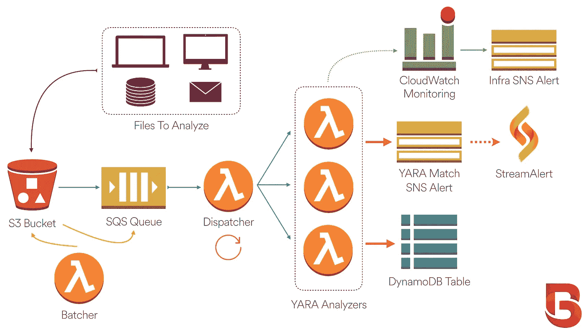

# BinaryAlert:实时无服务器恶意软件检测

> 原文：<https://medium.com/airbnb-engineering/binaryalert-real-time-serverless-malware-detection-ca44370c1b90?source=collection_archive---------1----------------------->

今天，Airbnb 自豪地宣布 BinaryAlert 的开源版本:一个用于检测恶意文件的无服务器实时框架。BinaryAlert 可以利用一组可配置的 YARA 规则，每天高效地分析数百万个文件，一旦发现任何恶意行为，就会触发警报！组织可以在几分钟内将 BinaryAlert 部署到他们的私有 AWS 帐户，允许他们在自己的环境范围内分析内部文件和文档。

# 示例使用案例

*   **企业警报:**通过分析可执行二进制文件发现笔记本电脑和服务器上的恶意软件感染。
*   **电子邮件附件:**识别发送到您组织的恶意文档。
*   **用户上传:**检测用户何时上传恶意文件到你的应用程序。
*   **安全研究:**使用内置的追溯分析，针对您自己的私人文件集合快速测试 YARA 规则的新迭代。

# 利用 YARA 规则

YARA 是一个强大的二元分析模式匹配工具。与简单的基于哈希的签名不同，YARA 规则可以根据常见模式对整个恶意软件家族进行分类。随着 YARA 在安全社区中看到更广泛的使用，我们希望找到一种方法来利用 YARA 规则扫描整个组织中的恶意文件。

其他安全工具支持 YARA 规则集成，但是我们找不到一个私有的、低成本、可扩展的、包含电池的、易于部署和维护的解决方案。例如， [VirusTotal](https://www.virustotal.com/) 支持针对文件提交的 YARA 规则匹配，但它是一项公共服务，并不是为分析具有不同保密级别和敏感度的内部文件和文档而设计的。

BinaryAlert 是我们的解决方案:一个用于可伸缩 YARA 分析的无服务器框架，您可以在自己的 AWS 帐户中便宜而轻松地部署它！

# 二元报警特征

## 实时

在应对威胁时，时间至关重要，因此 BinaryAlert 几乎会在文件上传后立即进行分析。在我们的部署中，分析通常在文件发现后的 1–2 分钟内完成。

## 追溯分析

当 YARA 规则集更新后，BinaryAlert 将自动重新分析您的整个文件语料库，以找到任何新的匹配。这允许您使用将来收到的信息来识别过去的威胁，并且它提供了一种测试新规则有效性的简单机制。

## YARA 规则包括

BinaryAlert 包含了几个我们自己的 YARA 规则，也使得从其他开源项目如 [YaraRules](http://yararules.com/) 中克隆规则变得容易。每个包含的规则都经过了 Airbnb 环境中超过 200 万个可执行二进制文件的测试，以验证其有效性。

## 无服务器设计

像 [StreamAlert](https://streamalert.io) 一样，BinaryAlert 利用 AWS Lambda 函数进行分析，而不是传统的服务器。这提供了许多好处，包括更强的安全性(无需修补或维护服务器)和更低的成本(只需为您使用的内容付费)。

## 基础设施即代码

同样以 StreamAlert 为例，BinaryAlert 使用 [Terraform](https://www.terraform.io/) 来管理其底层基础设施。这大大简化了部署过程:一个命令就可以创建和配置所有必需的 AWS 组件。部署简单、安全且可重复。

## 度量和监控

BinaryAlert 上传关于其处理吞吐量的自定义指标，并自动创建 CloudWatch 警报来监控您的部署的健康状况。警报阈值可轻松配置，以适应不同的工作负载。

# 体系结构

## AWS 服务

BinaryAlert 利用几种不同的 AWS 服务:

*   **AWS CloudWatch:** 存储日志和指标，并监控服务健康状况。
*   **AWS DynamoDB:** 存储 YARA 比赛信息。
*   **AWS IAM:** 通过基于角色的访问控制来管理权限。
*   **AWS Lambda:** 执行无服务器计算(如 YARA 分析)。
*   **AWS S3:** 存储上传到 BinaryAlert 用于分析的文件。
*   **AWS SNS:** 发送 YARA 比赛和 CloudWatch 警报的通知。
*   **AWS SQS:** 提供一个队列来跟踪等待分析的文件。

幸运的是，Terraform 会自动配置所有这些服务，所以您不必这样做！

## 分析流程

1.  该组织收集文件，并将其发送到他们的 BinaryAlert S3 桶。感兴趣的文件可能包括可执行二进制文件、电子邮件附件、文档等。
2.  上传到 S3 存储桶的每个文件都会立即排队等待分析。
3.  一个调度 Lambda 函数每分钟运行一次，将文件分组为批处理，并并行调用多达几十个分析器。
4.  每个分析器使用预编译的 YARA 规则列表扫描其文件。
5.  YARA 匹配被保存到 DynamoDB，一个警报被发送到一个 SNS 主题。我们使用 [StreamAlert](https://streamalert.io) 来发送这些警报，但其他组织可以通过电子邮件或任何其他受支持的 SNS 订阅来消费这些警报。
6.  对于追溯分析，批处理 Lambda 函数将整个 S3 存储桶排队以进行重新分析。
7.  如果任何 BinaryAlert 组件表现异常，将触发可配置的 CloudWatch 警报。这将通知一个不同于 YARA 比赛提醒的 SNS 主题。

# 未来的工作

BinaryAlert 的未来版本将在 YARA 分析之前添加对文件预处理的支持，包括解压缩和解包。我们可以利用 AWS 步骤功能来更好地协调管道的不同阶段。

Airbnb 还致力于支持 YARA 社区。我们将继续贡献我们自己的 YARA 规则，并从其他开源项目中获取、测试和提供规则反馈。

# 总结想法

由于与无服务器设计相关联的较低成本、较简单的管理和可扩展性，无服务器架构已被证明对于安全工具是有效的。BinaryAlert 代表了我们在开源无服务器安全领域的下一个贡献，允许其他人更快更容易地检测他们自己组织内的恶意文件。

参观[github.com/airbnb/binaryalert](https://github.com/airbnb/binaryalert)开始吧！

安全团队@ Airbnb

# 贡献者

BinaryAlert 由以下人员为您带来:

*   [austinbyers](https://github.com/austinbyers) (建筑师和开发商)
*   [哑剧框架](https://github.com/mime-frame)(概念、设计和代码审查，YARA 规则)
*   [融合轨迹](https://github.com/fusionrace) (YARA 规则)
*   [ryandivert](https://github.com/ryandeivert)， [jacknagz](https://github.com/jacknagz) ，和 [chunyong-lin](https://github.com/chunyong-lin) (代码审查)