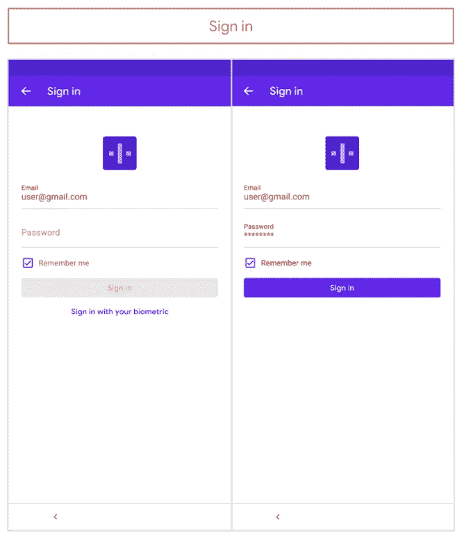
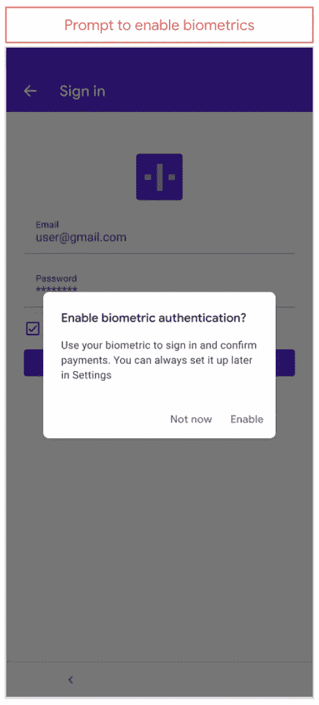
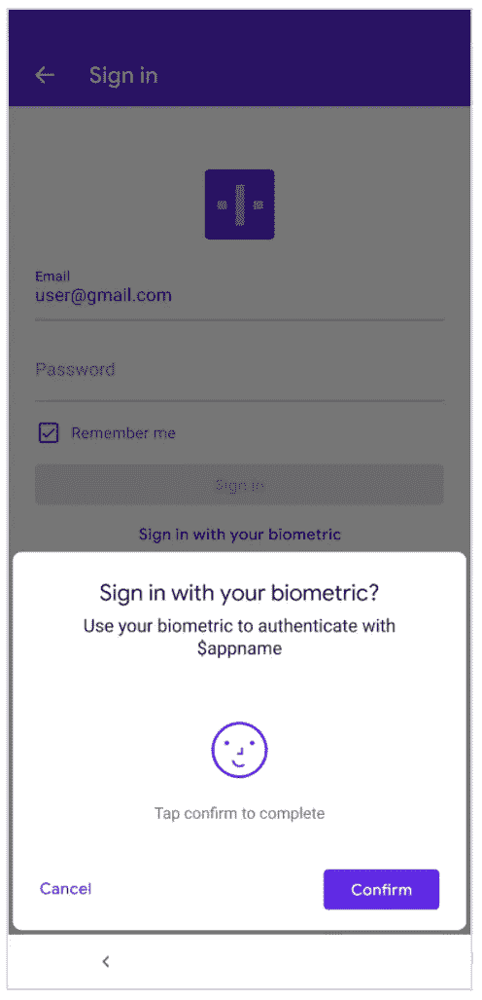
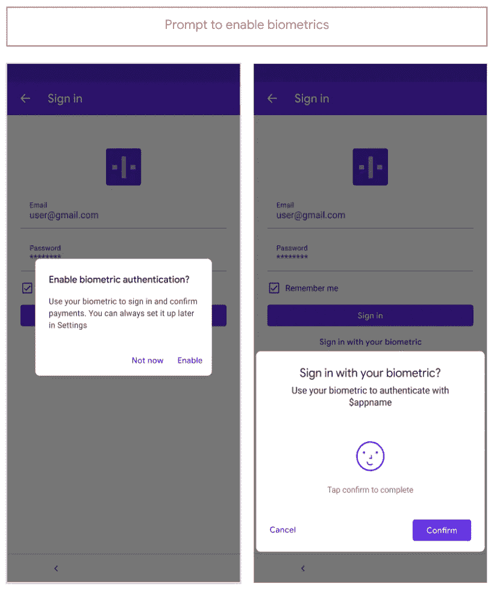
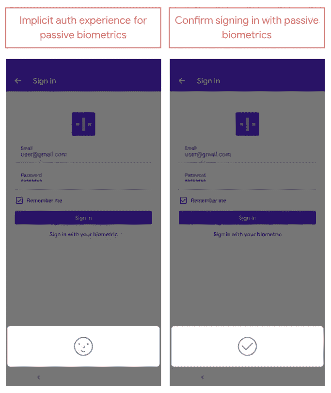
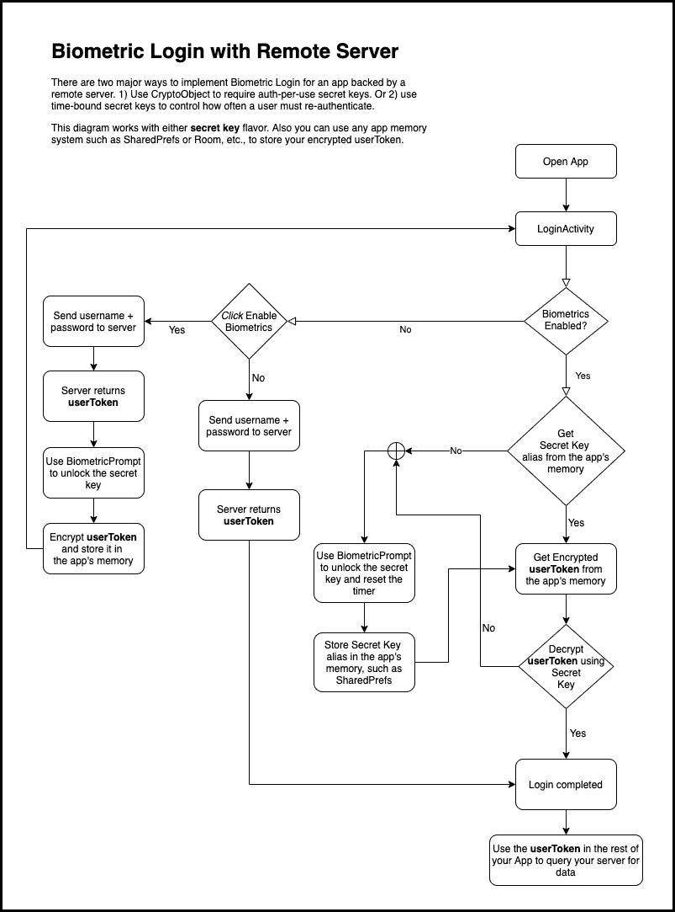

# Android 上的生物认证—第 2 部分

> 原文：<https://medium.com/androiddevelopers/biometric-authentication-on-android-part-2-bc4d0dae9863?source=collection_archive---------0----------------------->

## 关键用户旅程和用户界面

这是 Android 系列上*生物认证的第 2 部分。更多信息，参见[第 1 部分](/androiddevelopers/biometric-authentication-on-android-part-1-264523bce85d)。*

要增强您的登录过程以包括生物识别身份验证，请在用户成功登录后立即提示他们启用生物识别身份验证。图 1A 显示了一个典型的登录流程，您可能已经很熟悉了。用户按下登录按钮后，服务器返回一个`userToken`，然后提示他们启用生物识别，如图 1B 所示。一旦用户启用了生物特征认证，从那时起，每次用户需要登录时，应用程序都会自动显示生物特征提示，如图 2 所示。

**Figure 1A: Typical sign-in UI**

**Figure 1B: Enable biometric authentication**

**Figure 2: Confirm biometric authentication**

**图 2:确认生物认证**

虽然图 2 显示了 UI 中的确认按钮，但该按钮实际上是可选的。例如，如果您正在构建一个餐馆应用程序，建议您显示这个确认按钮，因为生物认证允许顾客支付他们的餐费。对于敏感交易和支付，我们建议您要求确认。要在你的应用程序 UI 中包含一个确认按钮，在构建你的`[BiometricPrompt.PromptInfo](https://developer.android.com/reference/androidx/biometric/BiometricPrompt.PromptInfo)`时调用`[setConfirmationRequired(true)](https://developer.android.com/reference/androidx/biometric/BiometricPrompt.PromptInfo.Builder#setConfirmationRequired(boolean))`。请注意，如果您不调用`setConfirmationRequired()`，系统将默认将其设置为 true。

# 生物识别设计流程

举例来说，代码片段使用加密版本的`BiometricPrompt`，带有`CryptoObject`。

如果你的应用需要认证，你应该创建一个专用的`LoginActivity`组件作为你的应用的登陆页面。只要需要身份验证，无论您要求用户进行身份验证的频率有多高，这一点都很重要。如果用户已经被认证，那么`LoginActivity`将调用`finish()`，用户可以继续前进。如果用户尚未通过身份验证，那么您应该检查生物识别功能是否已启用。

有几种方法可以检查生物识别功能是否已启用。然而，与其在各种备选方案中费力地寻找，不如让我们特别深入一个:对定制属性`ciphertextWrapper`的空检查。`CiphertextWrapper`是您创建的一个数据类，以便当用户成功地为您的应用启用生物认证时，您可以方便地将加密的`userToken`，也称为`ciphertext`，存储在永久存储中，如`SharedPreferences`或`Room`。因此，如果`ciphertextWrapper`不为空，那么就有了访问远程服务器所需的`userToken`的加密版本——也就是说启用了生物识别。

如果没有启用生物识别，那么用户可以点击启用它(图 1B)，这时您将向用户显示实际的生物识别提示，如图 3 所示。

在下面的代码片段中，`showBiometricPromptForEncryption()`展示了如何设置与生物识别提示相关联的密钥。本质上，您从一个`String`初始化一个`Cipher`，然后将`Cipher`传递给`CryptoObject`。最后你把`CryptoObject`传给`biometricPrompt.authenticate(promptInfo, cryptoObject)`。

**Figure 3: Prompt to enable biometrics**

此时，即图 2 和图 3，app 只有`userToken`。但是，除非用户每次打开应用程序时都使用他们的密码，否则这个`userToken`需要存储在应用程序的文件系统中，以供以后的会话使用。然而，如果您存储`userToken`而没有首先对其进行加密，那么未经授权访问设备的攻击者可能会读取`userToken`，并使用它从远程服务器获取数据。因此，最好在本地保存之前加密`userToken`。这就是图 3 中的生物特征提示发挥作用的地方。当用户使用他们的生物特征进行身份验证时，你的目标是使用`BiometricPrompt`解锁一个密钥(或者是*每次使用授权*或者是*有时间限制*)，然后使用该密钥加密服务器生成的`userToken`，然后将其存储在本地。从现在开始，当用户需要登录时，可以使用自己的生物特征进行认证(即生物特征认证- >解锁密钥- >解密`userToken`进行服务器访问)。

请注意用户第一次启用生物特征识别和用户随后使用生物特征识别登录之间的区别。为了启用生物认证，应用程序调用`showBiometricPromptForEncryption()`，它初始化一个用于加密`userToken`的`Cipher`。另一方面，为了使用生物特征进行实际登录，应用程序调用`showBiometricPromptForDecryption()`，它初始化一个`Cipher`进行解密，然后使用`Cipher`对`userToken`进行解密。

启用生物认证后，用户下次返回应用程序时应该会看到生物认证提示，如图 4 所示。请注意，因为图 4 用于登录应用程序，而图 2 用于交易确认，所以不需要确认，因为应用程序登录是一个被动的、容易撤销的操作。

**Figure 4**

为了为您的用户实现这个流程，当您的`LoginActivity`验证用户已经通过身份验证时，您将使用通过成功的`BiometricPrompt`身份验证解锁的加密对象来解密`userToken`，然后在`LoginActivity`组件上调用`finish()`。

# 完整的图片

图 5 显示了推荐工程设计的完整流程图。我们充分意识到，您的代码在许多地方可能会偏离这一建议。例如，您自己的加密解决方案可能只要求为加密而不是为解密解锁密钥。我们仍然为那些可能需要的人提供完整的示例解决方案。

图中提到*密钥*的地方，你可以自由使用*每次使用授权*密钥或*限时*密钥。此外，只要图中提到“应用程序的内存”，您就可以自由地使用您最喜欢的结构化数据存储解决方案:`[SharedPreferences](https://developer.android.com/reference/android/content/SharedPreferences)`、`[Room](https://developer.android.com/jetpack/androidx/releases/room)`或其他任何东西。最后，通常所说的`userToken`是任何类型的服务器负载，可以让用户访问受限数据或服务。服务器通常会检查这种有效载荷的存在，作为调用者被授权的证据。

在图中，从“ *encrypt userToken* ”指向的箭头很可能指向“ *login completed* ”而不是回到“`LoginActivity`”。尽管如此，我们还是选择了“`LoginActivity`”来提醒大家注意，在用户点击“启用生物识别”之后，可以使用额外的`Activity`，例如`EnableBiometricAuthActivity`。使用单独的活动可能会使您的代码更加模块化，因此可读性更好。或者，您可以创建一个带有两个`Fragment`的`LoginActivity`(由一个[导航组件](https://developer.android.com/guide/navigation)支持):一个`Fragment`用于实际的认证流程，另一个`Fragment`用于响应用户点击“启用生物识别”。

除了这个工程流程图，我们还发布了一个设计指南，您可以在实施您的应用时遵循。此外，我们在 Github 上的[示例应该会为您提供进一步的见解。](https://github.com/android/security-samples/tree/master/BiometricLoginKotlin)

**Figure 5: Complete diagram of biometric login with remote server**

# 第二部分总结

在这篇文章中，你学到了以下内容:

*   使用哪些 UI 资产来增强生物识别的登录过程。
*   你的应用应该为生物认证解决的关键用户旅程。
*   如何设计您的代码来处理生物认证的不同方面。
*   您的登录系统应该如何流动的完整工程图。

编码快乐！