# 比特币、区块链和积木

> 原文：<https://medium.com/capital-one-tech/bitcoin-blockchain-and-building-blocks-9f304380c77d?source=collection_archive---------1----------------------->


我们都听说过很多关于比特币的炒作——现在是区块链——以及它们将如何彻底改变金融和商业。我想更深入地了解它们实际上是如何工作的；打开引擎盖四处看看。有点剧透:它们并不神奇、完美、无瑕。他们有问题——一些是技术性的，另一些是人和技术的微妙和不可避免的交集。

首先，我们有自己的术语:“比特币”是用来指数字货币(价值单位)和允许你兑换这种货币的软件。当提到货币时，我将使用“BTC”。大多数情况下，我们将讨论软件。

区块链是比特币的一部分，或者说它就是这样开始的。这是一个专门为存储交易而设计的分布式数据库，就像一本账簿一样。比特币通过软件来控制交易的增加。比特币被设计成开放和匿名的，面向那些互不了解或互不信任的人。对于受信任的组织(如组织或银行联合体)内部的交易，您仍然可以使用区块链，但是您可能希望对其进行不同的控制。

比特币建立在几种广为人知的加密技术之上。虽然它以新的方式组合和使用它们，但这是你每次访问安全网站时都会用到的技术。

在这一堆技术的底部是两个基本工具:公钥加密和散列函数。其他一切都建立在它们之上。它们背后的数学真的很复杂，超出了我的理解范围，但你不必理解数学就能理解它是如何工作的——特别是，它的局限性，它如何失败，以及当它失败时会发生什么。

在讨论公钥密码学之前，我们需要一些背景知识。

# 对称密码术

在最古老、最简单的加密形式中，你接受一条信息，根据某种公式用不同的字母替换其中的每个字母。简而言之:


在这里，数学是秘密的部分。如果你懂数学，你就能解密这条信息。Rot-13 加密就是一个例子，你将字母表中的每个字母“旋转”13 位，于是“a”变成了“n”，“b”变成了“o”，依此类推。要解密信息，你只需将每个字母旋转回来。这是一个非常愚蠢的密码。现代加密技术更加复杂，但从根本上来说，它仍然是:


一个重要的创新是“钥匙”的概念。这是加密算法使用的一小段信息，有点像密码。用不同的密钥加密相同的数据会产生不同的加密输出。


这里数学部分不是秘密。事实上，它受到的公众监督越多，就越值得信赖。秘密是关键。

您使用相同的密钥进行加密和解密，就像使用真实的密钥一样。锁门的钥匙可以开锁。这被称为“对称密钥加密”，以区别于我们马上要看到的。

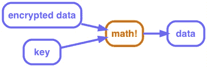

但是，有一个问题:你加密信息的原因是你认为有人可能会拦截它。那么，如何以一种不会被截获的方式将密钥发送给某人呢？也许我们需要一种不同的加密方式…

# 公钥加密

在公钥加密中，有两个密钥。其中一个是私有的，一个是公有的。私钥，你必须保持安全和秘密。非常非常安全。公钥，你给任何人。出版它。在公共登记处用你的电子邮件地址注册。

您可以使用任何一个密钥进行加密，但是用一个密钥加密的任何内容只能用另一个密钥解密:

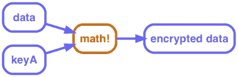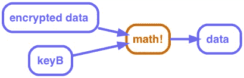

你可以给某人发送一条秘密消息，用他们的公钥加密。只要只有他们有自己的私钥，只有他们才能解密。如果他们丢失了自己的私钥，他们就无法解密；任何窃取他们私钥的人都可以。

你可以做的另一件事是用你的私钥加密信息。任何人都可以用你的公钥解密，所以它不是秘密，但他们知道你加密了它。

我们可以将这两者结合起来。如果我用我的私钥和你的公钥加密某个东西，只有你能看懂，你知道它来自我。

好了，这是我们的第一个大积木。到第二个…

# 加密哈希函数

哈希函数是一种数学运算，它接收数据并输出一个数字。数据可以是任何东西，从单个字节到高清电影文件。


哈希函数有几个重要的方面:

*   相同的数据总是生成相同的数字
*   这是不可逆的-您无法从输出数字中重建输入数据
*   不同的数据可以生成相同的数字；这被称为“碰撞”

**加密**哈希函数使用复杂的数学来保证更多的事情:

*   碰撞的可能性极小(1/N，其中 N 是宇宙中的原子数)
*   稍微修改数据会生成完全不同的输出
*   没有办法可预测地修改数据以生成特定的输出(导致冲突)

哈希在处理两种数据时特别有用:秘密数据和大数据。

例如，认证系统可以存储密码的散列而不是密码本身。当有人输入密码时，会计算其散列值并与存储值进行比较。如果有人窃取了存储的值，它只让他们猜测密码，并知道他们是否猜对了。(他们可以很快地尝试很多猜测，这就是为什么你需要长密码。)

散列法还为您提供了比较数据文件的快捷方式:您可以计算每个文件的散列值，然后比较这些散列值，而不是逐个字节地检查这两个文件。这也意味着，如果你想跟踪你以前是否见过一个特定的文档，你只需要存储它的散列。

对于开发人员来说，散列的一个常见用法是在 Git 中。它保存文件的散列，所以它知道它们是否已经改变，并且每次提交都由其中所有内容的散列来标识。

作为另一个例子，我写了一个很小的 Ruby 脚本来检查我所有的 MP3 文件，寻找重复的文件。它读取每个文件，为它计算一个散列，并保存一个文件路径的散列查找表。如果散列已经在字典中，它将打印出一条消息，其中包含新旧文件路径。

```
digests = {}
Find.find( dir ) do |f|
    if File.file?( f ) and File.size?( f ) then
        d = MD5.file( f ).hexdigest  # hash of file
        if digests[d] then
            puts "Duplicates: #{digests[d]} and #{f}"
        else
            digests[d] = f
        end
    end
end
```

# 数字签名

如前所述，我可以用我的私钥加密一个文档，任何人用我的公钥都可以解密它并验证它来自我。但是一旦解密，就很难重新验证了。你必须保留加密的拷贝，重新解密，并比较解密的版本。

一个更好的选择是通过散列函数运行未加密的文档，然后用您的私钥只加密散列值。那是数字签名。要验证签名，用公钥解密它，重新计算文档的散列，并比较两者。

**签约**

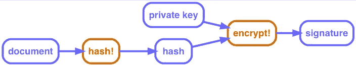

**验证**

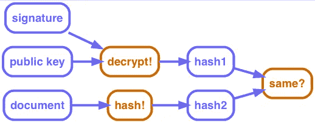

# 处理

好了，现在我们已经组装好了我们的积木，我们可以进入实际的比特币和区块链部分了。

正如我所说，区块链就像一本大账本。这是现存的所有 BTC 的记录，以及它们的所有者。它实际记录的是 BTC 的*转账*，而不是余额。它没有记录“爱丽丝有 5 个 BTC”；它记录了“鲍勃给了爱丽丝 2 BTC”和“克里斯给了爱丽丝 3 BTC”。爱丽丝必须把所有的转账加起来，才能算出她有多少钱。

其实爱丽丝不是爱丽丝，她是`43b46ef2e61a3d6a725fe70fe2b3adaadbca7348`什么的。这就是区块链匿名的原因:每个人只能通过他们的公钥来识别。这是一个共享数据库；任何使用它的人都可以看到每笔交易的全部历史。Alice 还可以使用多把钥匙，这样就很难发现她的交易是属于同一个人的。

正如区块链记录的那样，一项交易定义了一组输入和输出。它的投入是以前的交易，它从 BTC。它的输出包含被传输的金额和它们要传输的公钥的散列值。每个输入都是前一个事务的输出。

所以当你付款时，你没有足够的钱来支付；你有一堆单独的交易。你必须说类似“从交易 13a16 中取出 5 BTC…并将其交给 key 72fc3…”(我在这里缩写了 id。)

一项交易产出要么被花掉，要么没被花掉:当你花掉一项产出时，其中的价值都必须流向某个地方。如果你收到的所有交易都比你想支付的要多，你能做的就是把其中一笔分开，把一部分还给你自己。

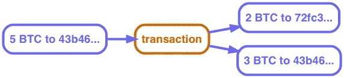

您还可以进行多对一或多对多交易。你可以把你收到的一堆小额付款合并成一笔更大的付款给别人，然后把差额还给你自己。

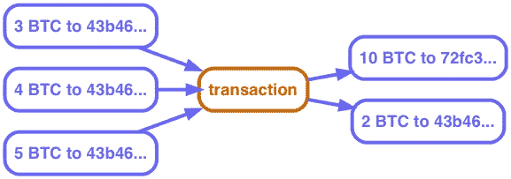

或者只是将它们全部收集到单个交易中。

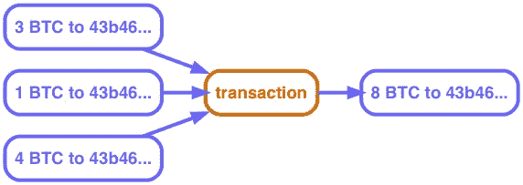

# 确认

那么，事务的所有权是如何实现的呢？是什么阻止你伪装成另一个人？这就是区块链的症结所在。任何数据库都可以存储事务。我们如何从数学上证明交易是经过授权的，并且记录没有被篡改？

每个事务输出还包括一个小的可执行脚本，用于验证对它的任何声明。要将输出声明为新事务的输入，您必须提供凭证:输入事务的公钥和签名。该脚本将这些作为参数。它检查公钥是否是预期的公钥，使用该公钥解密所提供的签名，并将结果与其自己的事务的哈希进行比较。如果匹配，则证明声明者拥有与所需公钥匹配的私钥。

整个验证过程如下所示:

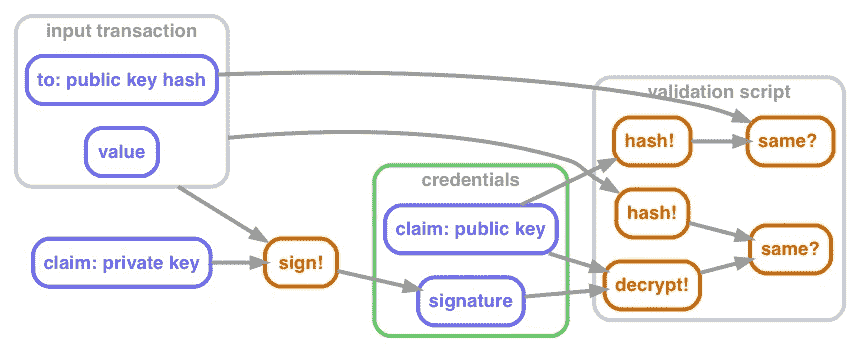

在伪代码中，那是:

```
function validate(signature, publicKey) {
  return
    hash(publicKey) == “43b46ef2e61a3d6a725fe70fe2b3adaadbca7348”
    &&
    decrypt(signature, publicKey) == hash(inputTransactionBytes())
}
```

这里有一个来自[比特币维基](https://en.bitcoin.it/wiki/Transaction#Principle_example_of_a_Bitcoin_transaction_with_1_input_and_1_output_only)的完整交易示例。

```
Input:
Previous tx:
f5d8ee39a430901c91a5917b9f2dc19d6d1a0e9cea205b009ca73dd04470b9a6
Index: 0
scriptSig:
304502206e21798a42fae0e854281abd38bacd1aeed3ee3738d9e1446618c4571d10
90db022100e2ac980643b0b82c0e88ffdfec6b64e3e6ba35e7ba5fdd7d5d6cc8d25c6b241501Output:
Value: 5000000000
scriptPubKey: OP_DUP OP_HASH160 404371705fa9bd789a2fcd52d2c580b65d35549d OP_EQUALVERIFY OP_CHECKSIG
```

您会看到它有输入事务的 id(`Previous tx`)。`Index`表示我们要求哪个输出(因为可能有多个)。`scriptSig`是签名和公钥——凭证——它将从那个输入馈送到脚本中。请注意，输入部分没有来自上一笔交易的金额。最下面，`scriptPubKey`是剧本。它使用自己古怪的小程序语言:`OP_DUP`和诸如此类的命令。

由于每个事务都与以前的事务相关联，并且每个事务都与其他事务相关联，因此事务序列可能类似于:

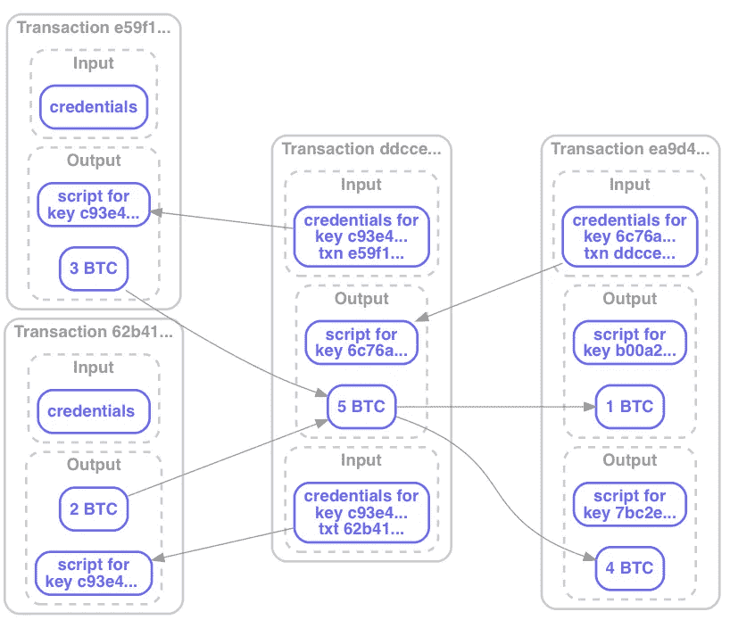

好的，我可以创建一个新的事务，它从以前的事务中取出 BTC，并将其转移给其他人。我们有一个机制，让某人验证我是否被允许这样做。但是验证的一部分要求他们查找输入交易并检查它们是否有效。这意味着所有*的*输入必须已经过验证。诸如此类。

有没有什么方法可以简化这个过程，这样我们就不必每次都重新验证以前的整个交易链？

# 区块链

这就把我们带到了真实的区块链。它们被分组到块中，而不是单独验证和存储每个事务。每个块还有一些头数据，包括这个块的事务和前一个块的头的散列。修改一个较早的块会改变它的散列，使任何篡改变得明显。然而，这只是告诉你发生了变化，而不是它是什么。

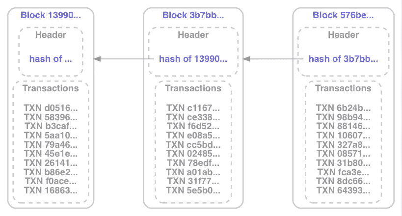

随着新的事务被添加到链中，它还会更新事务输出的索引(类似于数据库索引),添加新的事务并删除失效的事务。去除用过的是很重要的。如果我有一个交易输出，给我 2 BTC，我可以创建两个新的交易，将它转移给不同的人。每一个看起来都是合理的，但是我们不能两个都允许——那是重复支出。

# 工作证明

到目前为止，区块链没有理由不是一个集中式数据库。所有事务都发送给它，它验证它们并将其添加到链中。简单。对于人们谈论的一些用途，他们完全可以这样做。

但比特币的全部意义在于避免任何中央权威。所有比特币用户都可以创建交易，将交易添加到区块，验证交易，并向区块链添加新区块。但是这个链需要保持一致:每个人都需要就发生了什么事务以及以什么顺序发生达成一致。随着成千上万的人不断尝试向链中添加新的块，你如何决定下一个是哪个？你可以随机选择一个，但是如果没有人负责选择，你怎么做呢？

这个问题的解决方案是什么让比特币，比特币。

如果您为一个事务块计算散列，您将得到一个实际上是随机的数字。当你把它看作一个二进制数时，有 50%的可能性第一位是零，有 25%的可能性前两位是零，以此类推。当你达到 40 位时，你说的是万亿分之一。

因此，比特币所做的是在交易块中添加一种叫做随机数字段的填充物。除了更改块的哈希值之外，它没有任何作用。为了使块本身有效，它的散列必须至少有一定数量的前导零。

要找到一个能使块有效的填充值是一件靠蛮力猜测的事情:设置一个新的随机数，计算散列，看它是否匹配，再试一次。

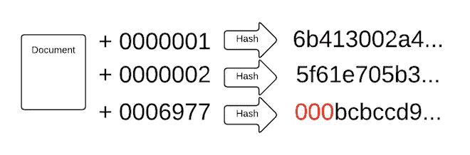

这是采矿。事实就是这样:世界各地的许多人都在消耗巨大的计算能力，以成为第一个找到有效数字的人。

比特币矿工为所有这些辛勤工作获得报酬的方式是所谓的[代](https://en.bitcoin.it/wiki/Transaction#Generation)交易或比特币基地。当他们组装一个事务块时，他们添加一个自身有输出但没有输入的事务块。交易的价值——他们的回报——是由比特币软件设定的。如果他们试图要求更多，其他所有人都会以无效为由拒绝该封锁。奖励是[目前](http://www.bitcoinblockhalf.com/) 12 辆 BTC，大约 53000 美元。它每 4 年减半，最终将归零。届时，世界上将有 2100 万 BTC。

一个重要的特征是，没有人必须事先就下一个块中的事务达成一致。(由于这是一个分布式网络，每个人接收交易的顺序都会略有不同。)每个人都可以验证自己的块，第一个生成有效块的人会广播它。其他人检查它是否有效，并将其添加到他们的链中。它们停止在它们的块上的工作，丢弃任何添加到新块中的事务，收集更多的事务，并开始验证新块。

如果出现平局——在网络上的大多数人收到新块之前，其他人同时找到了答案，该怎么办？这可能会导致一个暂时的分裂，其中有两个链的竞争版本。第一个添加另一个新块的链获胜。理论上，一行中可能有多个结，但这种情况不太可能发生，因此不是一个严重的问题。

为了最大限度地减少平局的可能性，比特币故意通过让解决方案难以找到来引入延迟。鉴于比特币网络的总计算能力，你可以估计找到一个有一定数量前导零的哈希需要多长时间。比特币软件会调整所需的前导零的数量，以便找到一个有效块所需的时间保持相当稳定，约为 10 分钟。

# 二等兵区块链

现在让我们远离比特币，因为商业世界的很多兴趣在于分离出区块链，并定义不同的规则来管理它。同样，比特币的重点是匿名性和不可信参与者。

工作验证引入的延迟有两个目的:随机化下一个块的选择，以及减少同时发送一个以上有效块的机会。在一个更小的可信参与者网络(几百家银行)中，您可以使用一个更轻量级的共识协议，减少延迟并增加交易量。如果你想达到“主要信用卡规模”，这很重要。比特币的工作证明将其限制在每秒约 7 笔交易，而大型支付处理器为 115 笔，大型信用卡为 2000-4000 笔。

扩大区块链的交易量可能会降低它的民主程度。请记住，它是一个不断增长的数据库，包含所有交易。在撰写本文时，比特币的区块链占用了 [107 GB](https://blockchain.info/charts/blocks-size) ，包含[2.07 亿笔交易](https://blockchain.info/charts/n-transactions-total)，比 [VISA 每天处理的交易](https://usa.visa.com/run-your-business/small-business-tools/retail.html)多一点。如果信用卡规模很大，它将每年增长 25 TB。仅仅是传输这些数据就要消耗掉平均 6.5 Mbps 的速度。它不需要一个大企业来支持，但它的成本将超过普通用户或甚至严重的爱好者所能承受的。

你也可以用区块链来记录 BTC 以外的东西的转移。虽然我们可能认为它是一个支付系统，但它实际上是财产所有权和交换的记录。在比特币区块链中，这是 BTC，但也可能是汽车、钻石、艺术品或土地的所有权。这开启了许多可能性。

# 智能合同

当我们看比特币交易的例子时，你可能想知道为什么交易输出包括这个复杂的验证脚本，而不仅仅是一个公钥。答案是，使用脚本允许定义验证事务的其他条件。

在一个简单的例子中，脚本可能需要三个签名中的两个:买方、卖方和仲裁员。卖方不能自行要求付款。如果买家满意，他们就会签字。如果没有，仲裁人可以签字或不签字，这取决于他们的判断。买方和卖方仍然需要一个真实世界的信任，仲裁人是诚实的。

相反，如果是对体育比赛结果或股票价格的打赌，仲裁人可以是一个程序，它使用 web 服务来检测是否满足正确的条件。这更有效率，但是，参与者信任这个项目。

另一个例子是 Kickstarter 式的筹资活动。创建一个支付你 100 BTC 的交易，并允许任何人添加输入。直到它们加起来达到 100 BTC，交易才会生效，只有通过验证后你才能消费。

理论上，你也可以有未来支付:交易立即有效，但其输出只能在某个特定日期后要求。这在比特币中似乎是可能的，但是[这是实验性的，缺乏好的工具](/@thomasmccabe/hodling-bitcoins-with-op-checklocktimeverify-a-step-by-step-guide-to-manually-building-a-bitcoin-ce9476725de8)。这将允许托管交易和可退还的存款。

尽管有这些很酷的功能，但智能合约有一个固有的限制:从数学上保证钱在未来可以支付的唯一方法是现在锁定它。一笔在未来支付给某人的交易，今天就把钱从你这里拿走了。一旦它被添加到区块链，你就花掉了这些投入，你不能重复花费它们。验证合同只是防止接收者在时间限制到期之前花费输出。如果你想通过智能合同每月自动支付下一年的租金，你实际上已经提前支付了一整年的租金。

# 人类

这里有很大的潜力，但也有一些问题。区块链的数学可能是完美而优雅的，但人不是。

一个严峻的挑战是密钥管理，尤其是面向消费者的应用程序。在比特币里，你*是*你的私人钥匙:有人[偷了](https://www.forbes.com/sites/laurashin/2016/12/20/hackers-have-stolen-millions-of-dollars-in-bitcoin-using-only-phone-numbers/)你的钥匙就成了你；如果你丢了钥匙，你就不存在了，你所拥有的一切也就失去了。即使在大多相当精通技术的比特币社区，也有许多关于[私人密钥在废弃硬盘](https://www.theguardian.com/technology/2013/nov/27/hard-drive-bitcoin-landfill-site)中丢失的恐怖故事，导致价值数千或数百万美元的 BTC 无法使用。

人们提出了一些降低风险的方法。您可以设置您的交易，以便所有支付都需要两个或更多公钥中的一个，其他的作为备份离线存储或由某个可信的第三方存储。您可以完全依靠第三方来管理您的密钥，并使用一些传统的方案与他们进行身份验证。这些东西可以防止丢失，但也有可能被盗。

非比特币区块链的另一个选择是使用不同的验证机制。在一个更传统的金融环境中，你会有一个账户注册。交易将由一个账号而不是一个公钥所拥有。交易可以由与该账户相关联的任何密钥来签名。

我猜想，要完全解决这个问题，将需要创建多层认证系统，就像我们用于遗忘密码一样:母亲的娘家姓、童年宠物等等，最终由政府颁发的带照片的身份证来支持。

第二个大问题是，区块链交易只是交易的一个方面:商品和/或服务也在现实世界中交换。如果出现任何问题，比特币没有正式的方式对指控进行抗辩。使用智能合约，区块链交易可以有一个仲裁人，如上所述，但是你有一个需要建立和信任的外部人工系统。

除了盗窃、故意破坏和欺诈，还有一些明显的错误:打错了金额，或者寄到了错误的地址。一旦没了，就没了，没有办法撤销交易。你可以委婉地要求收款人把钱转回来，但前提是你知道他们是谁。没有可追踪的身份和管理机构，就没有办法强迫他们。

在我们解决了所有事情*应该如何*工作之后，我们仍然需要考虑到实现中的缺陷。比特币有过此类错误导致重大损失的[历史](https://nakedsecurity.sophos.com/2014/03/06/where-have-all-the-bitcoins-gone/)。 [Etherium DAO hack](http://www.coindesk.com/understanding-dao-hack-journalists/) 展示了需要外部的、人为的过程来处理软件故障。

公平地说，比特币的“效率”有多少来自于去除传统金融服务提供的所有消费者保护和弹性机制。换句话说，要制作适合典型消费者的区块链，需要多少基础设施—客户支持、欺诈调查等。—你必须重新发明吗？

# 结论

归根结底，区块链不是某种独特的技术奇迹。这是一个分布式数据库，具有一些不寻常的特征。如果您正在考虑使用它，您应该能够解释为什么它比 Kafka 或普通的关系数据库更适合您的业务需求。

对于自动化(软件和机械的)有一个普遍的警告:把人从循环中解放出来可能会使系统更有效率，更不容易出错，更不容易受到攻击；但这也往往会使失误和成功的攻击更具破坏性，更难恢复。我们需要为这类“黑天鹅”事件做好计划，并找出减轻它们的方法。

会计不用橡皮，但他们会把东西划掉。区块链交易不能被编辑是好事，但如果它们不能被取消或撤销，那就糟了。任何真正的商业系统——几乎任何真正的信息系统——都需要某种方式来处理这种情况。更广泛地说，它需要让人们犯错并从中恢复。

值得称赞的是，区块链是对其原始问题的出色解决方案:由不可信的分布式全球网络维护的可信记录系统，具有不可靠的连接和延迟。许多被大多数数据库视为罕见故障模式的事情，被视为正常行为。虽然它有一些限制，可能会阻止它在其他环境中按原样使用，但从中可以学到很多东西，并且它的某些版本很可能成为具有广泛应用范围的基础技术。

*免责声明:Capital One 与这篇博文中提到的公司无关。所有使用的商标都是其各自所有者的财产。*