# 黑色 Kotlin 周:有效的 Kotlin 文章& Coroutines 电影和移动应用程序文章&用例文章&开放研讨会和书籍折扣✂️

> 原文：<https://blog.kotlin-academy.com/black-kotlin-week-effective-kotlin-articles-coroutines-movie-mobile-app-articles-use-cases-b2c2eac9e29e?source=collection_archive---------1----------------------->

亲爱的程序员们！🙂

这次我们为您带来:
**📝**编程篇**、
📹**科特林开发日会议的一部电影**，
✂️特别黑色周折扣。**

**✂️黑科特林周特辑✂️**

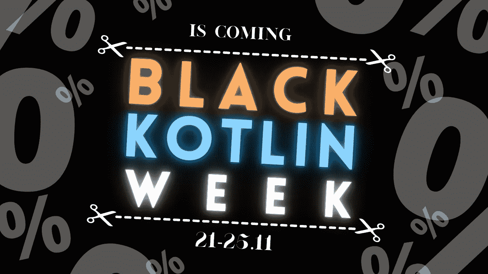

功能性 Kotlin 书**终于有了平装本！**
你可以阅读一下写作过程，在这里遇见所有精彩的投稿人[。](https://kt.academy/article/functional-kotlin-release)

[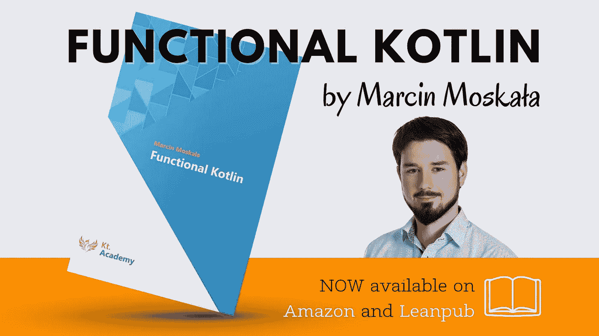](https://kt.academy/book/functional_kotlin)

这本书的平装本在亚马逊和 T21 都有售。

下面是今天特别新闻简报内容的简要列表:

**Kotlin Coroutines** 来自**阿姆斯特丹 2022 年 kot Lin Dev Day**的演讲由**Marcin moska a**:
🎬[实践中的科特林协程](https://www.youtube.com/watch?v=6zLyFzHc6xs)

**更新有效 Kotlin** 文章撰稿**Marcin moska a:**
👉[第 7 项:当可能缺少结果时，首选可空或结果结果类型](https://kt.academy/article/ek-nullable-result)
👉[第 11 项:可读性设计](https://kt.academy/article/ek-readability)
👉[第 12 项:操作符的含义应与其函数名](https://kt.academy/article/ek-operator-name)
一致👉[第 16 项:属性应该代表状态，而不是行为](https://kt.academy/article/ek-property)

文章是来自**有效科特林**书的部分。这里可以找到[。📖](https://leanpub.com/effectivekotlin)

**手机 app**n 根哥学长写的文章**:
👉[使用调色板 API Android 从图像中提取颜色](/extracting-colors-from-an-image-using-the-palette-api-android-ac319aaadac6)**

**科特林·科罗特斯**文章作者**马尔钦·莫斯卡兹** :
👉[数据/适配器层的 Kotlin 协程用例](https://kt.academy/article/cc-use-cases-data-layer)

这是《科特林协同程序》一书中的一章。你可以在 [LeanPub](https://leanpub.com/coroutines) 上找到。

**移动数据分析**由**丽贝卡·利**撰写的文章:
👉[您可以更好地利用移动数据分析的 5 种方式](/5-ways-you-can-better-utilize-mobile-data-analytics-54ac202b9e54)

黑色科特林周

📚**科特林图书**📚

❗ **开放工作坊** ❗
👉[高级科特林开放式车间](https://kt.academy/workshop/kotlinAdvanced/form/public/advancedKotlinOct2022/register)
👉 [Kotlin Coroutines 开放工作坊 12 月版](https://kt.academy/workshop/coroutines#register)

更多详情和折扣在新闻简报的最后

开始吧！🙃

Kotlin 协同程序库被设计成非常适合常见的用例，并对测试有强大的支持。本演示将展示 **Kotlin 协同程序在现实生活中的 Android 和后端项目**中的典型用法，并分析如何正确测试这些用例。Xebia 于 2022 年 5 月 19 日组织了 2022 年 Kotlin Dev Day】。这一事件发生在阿姆斯特丹的约翰克鲁伊夫竞技场。
👇

[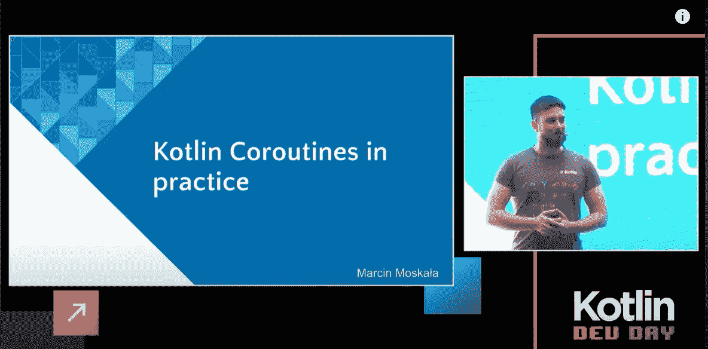](https://www.youtube.com/watch?v=6zLyFzHc6xs)

[科特林实用程序](https://www.youtube.com/watch?v=6zLyFzHc6xs)
🎥🎥🎥🎥🎥🎥🎥🎥🎥🎥🎥🎥🎥🎥🎥🎥🎥🎥🎥🎥🎥🎥🎥🎥

为什么我们更喜欢避免抛出异常并使用对我们有利的类型呢？
**第 7 项:当可能缺少结果时，优先选择可空或结果结果类型**👇

[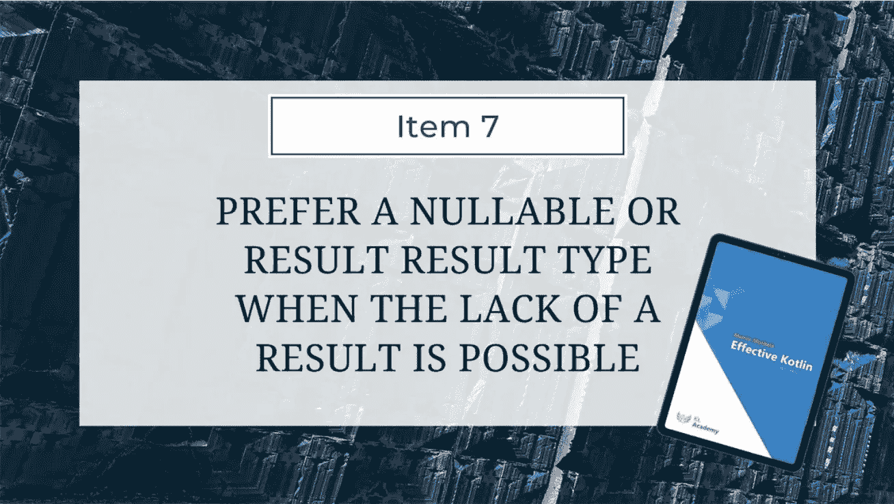](https://kt.academy/article/ek-nullable-result)

[Item 7: Prefer a nullable or Result result type when the lack of a result is possible](https://kt.academy/article/ek-nullable-result)
🔻 You can find the whole book below
[https://leanpub.com/effectivekotlin](https://leanpub.com/effectivekotlin)

我们真的希望应用程序简洁吗，或者我们更希望它们可读吗？
**第 11 项:可读性设计**👇

[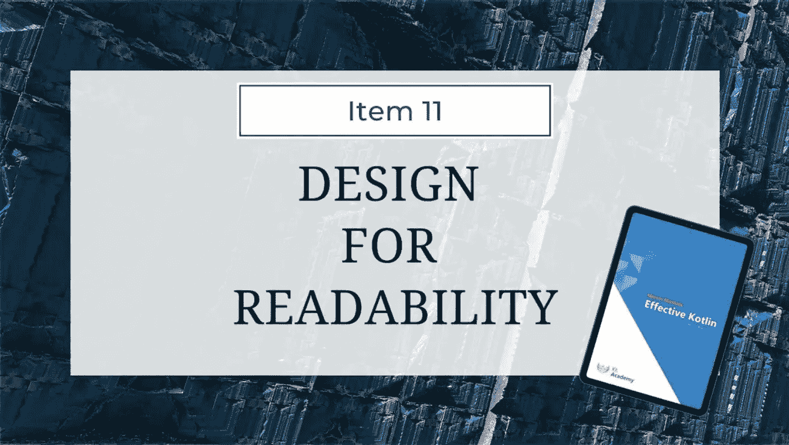](https://kt.academy/article/ek-readability)

[Item 11: Design for readability](https://kt.academy/article/ek-readability)
🔻 You can find the whole book below
[https://leanpub.com/effectivekotlin](https://leanpub.com/effectivekotlin)

什么时候可以重写操作符，什么时候不行。
**第 12 项:运算符的含义应该与其函数名**一致👇

[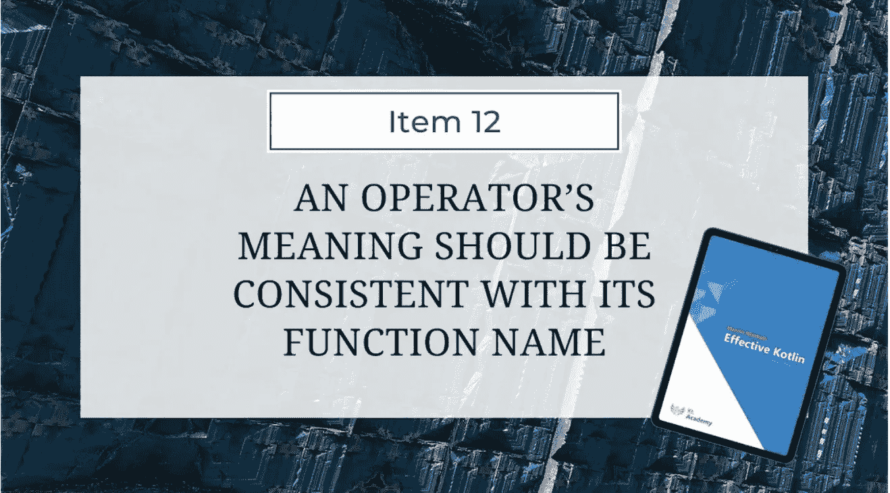](https://kt.academy/article/ek-operator-name)

[Item 12: An operator’s meaning should be consistent with its function name](https://kt.academy/article/ek-operator-name)
🔻 You can find the whole book below
[https://leanpub.com/effectivekotlin](https://leanpub.com/effectivekotlin)

什么应该被定义为行为，什么应该被定义为功能？
**第 16 项:属性应该代表状态，而不是行为**👇

[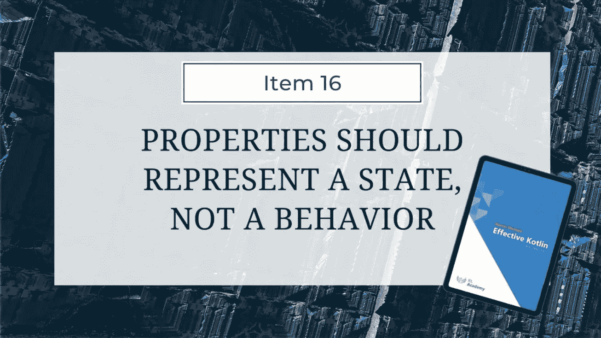](https://kt.academy/article/ek-property)

[Item 16: Properties should represent state, not behavior](https://kt.academy/article/ek-property)
🔻 You can find the whole book below
[https://leanpub.com/effectivekotlin](https://leanpub.com/effectivekotlin)

从图像中提取颜色并不新鲜，但在主题化应用中被广泛使用。这是怎么做到的，或者怎么才能做到？
阅读[的另一篇文章 **Ngenge 学长**寻找答案。
**使用调色板 API Android 从图像中提取颜色**👇](https://ngengesenior.medium.com/)

[Extracting Colors from an Image Using the Palette API Android](/extracting-colors-from-an-image-using-the-palette-api-android-ac319aaadac6)

我们如何在**数据/适配器层使用 Kotlin 协同程序，**我们如何使用回调或阻塞函数？
**数据/适配器层的 Kotlin 协程用例**👇

[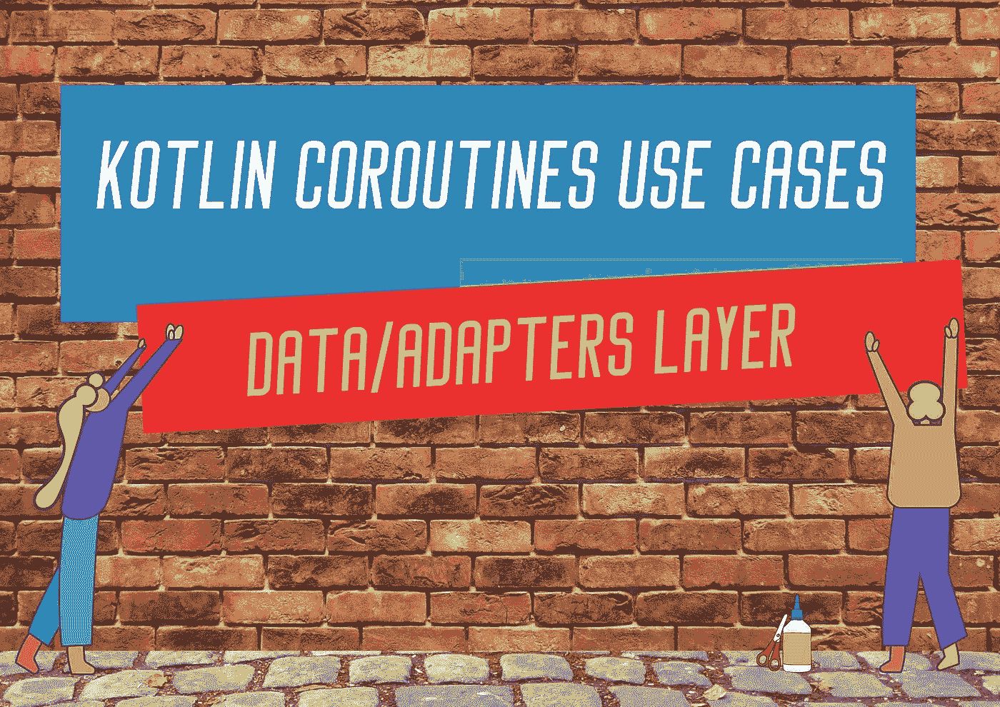](https://kt.academy/article/cc-use-cases-data-layer)

[Kotlin Coroutines use cases for Data/Adapters Layer](https://kt.academy/article/cc-use-cases-data-layer)
🔻 You can find the whole book below
[Kotlin Coroutines by Marcin Moskała [Leanpub PDF/iPad/Kindle]](https://leanpub.com/coroutines)

这 5 种更好地利用移动数据分析的方法将帮助所有苦苦挣扎的企业纠正他们的错误。从丽贝卡·利写的文章中了解更多信息。
**更好地利用移动数据分析的 5 种方法👇**

[5 Ways You Can Better Utilize Mobile Data Analytics](/5-ways-you-can-better-utilize-mobile-data-analytics-54ac202b9e54)

**布莱克·科特林周特辑
书籍**

[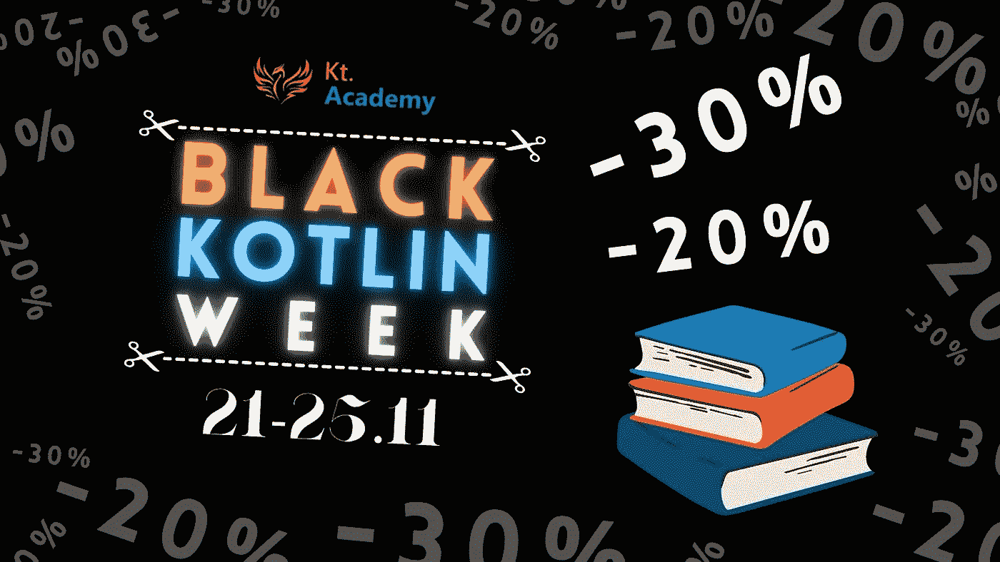](https://kt.academy/book)

📘最新的**功能性科特林**书作者**马辛·莫斯卡兹**
点击此链接，获得 20%的⬇️
[功能性科特林作者【lean pub pdf/ipad/kindle】](https://leanpub.com/kotlin_functional/c/BlackWeek2022)

📚众所周知的**科特林协同程序**和**有效科特林**书籍也由**马尔钦·莫斯卡兹**所著。
点击这些链接，获得 30%的⬇️
[马丁·莫斯卡兹的科特林协同程序【莱安出版社 pdf/ipad/kindle】](https://leanpub.com/coroutines/c/BlackWeek2022)
[马丁·莫斯卡兹的有效科特林【莱安出版社 pdf/ipad/kindle】](https://leanpub.com/effectivekotlin/c/BlackWeek2022)

❕The 代码仅在❕时间 11 月 21 日至 25 日有效

**开放式车间**

[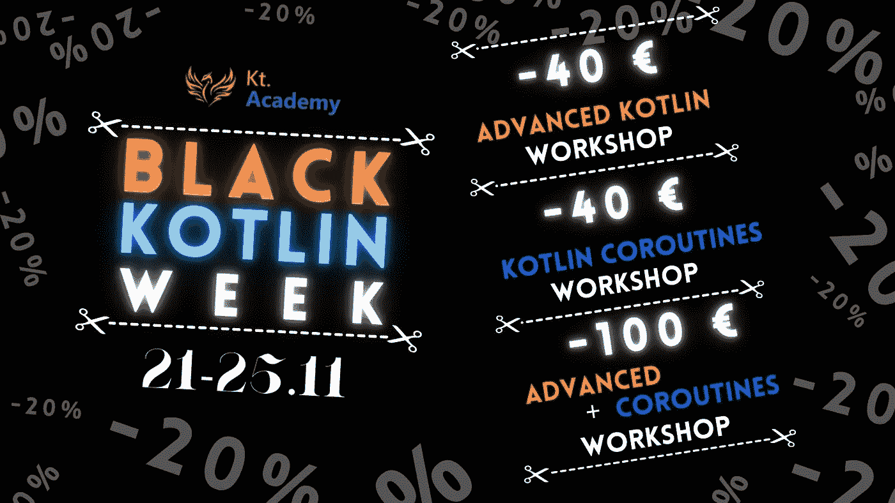](https://kt.academy/workshop)

👉[高级科特林开放式工作坊](https://kt.academy/workshop/kotlinAdvanced/form/public/advancedKotlinOct2022/register)由 [**亚历山大**](https://kt.academy/workshop/kotlinAdvanced#trainer) 主持。

[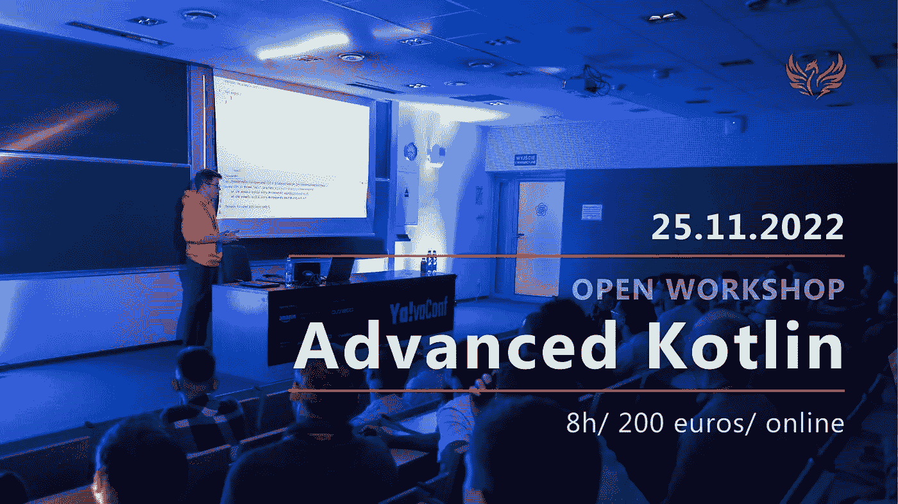](https://kt.academy/workshop/kotlinAdvanced#register)

参加本次培训并获得—40⬇️€
只需在注册表中键入特殊代码 **BlackKotlinWeek** :

[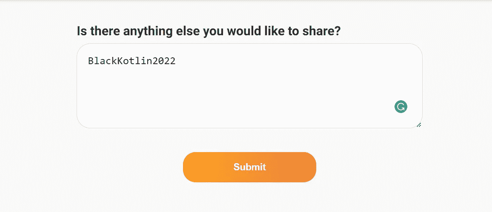](https://kt.academy/workshop/kotlinAdvanced#register)

👉[由](https://kt.academy/workshop/coroutines)[Marcin moska a](https://kt.academy/workshop/coroutines#trainer)主持的 Kotlin Coroutines 公开研讨会。

[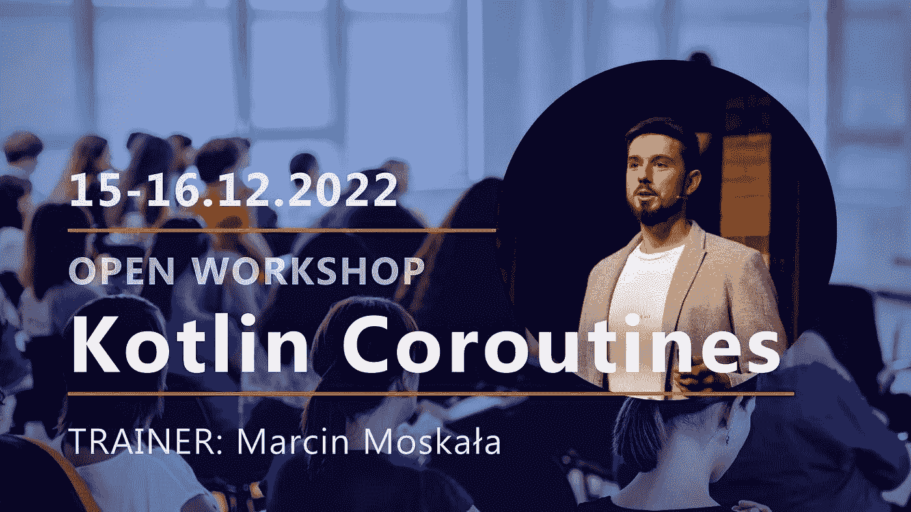](https://kt.academy/workshop/coroutines#register)

参加本次培训，获得**—40⬇️**€
只需在报名表中输入特殊代码 **BlackKotlinWeek** :

**成为黑色科特林主人并加入两个工作坊**
‼️ [高级科特林开放工作坊](https://kt.academy/workshop/kotlinAdvanced/form/public/advancedKotlinOct2022/register)和[科特林协同开放工作坊](https://kt.academy/workshop/coroutines) ‼️

在注册表中输入特殊代码 **BlackKotlinSpecial2022** :

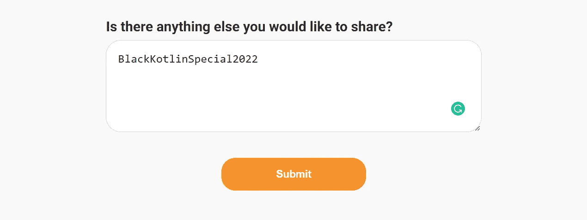

❕All 代码仅在❕时间 11 月 21 日至 25 日有效

✂️✂️✂️✂️✂️✂️✂️✂️✂️✂️✂️✂️✂️✂️✂️✂️✂️✂️✂️✂️✂️✂️✂️✂️

这就是我们今天的全部内容🙂

如果你有什么想告诉我们的，请回复这封邮件让我们知道！💌

敬请期待！👌
Kt。学院团队

www: [kt.academy](https://kt.academy/)
博客:【blog.kotlin-academy.com】
Twitter EN:[@ ktdotsacademy](https://twitter.com/ktdotacademy)
Twitter PL:[@ ktdotsacademypl](https://twitter.com/ktdotacademyPL)
FB:[@ ktdotsacademy](https://www.facebook.com/KtDotAcademy)
LinkedIn:[@ Kt。学院](https://www.linkedin.com/company/kt-academy/)

