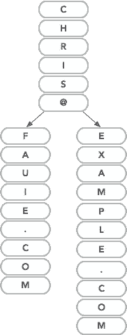
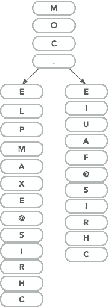
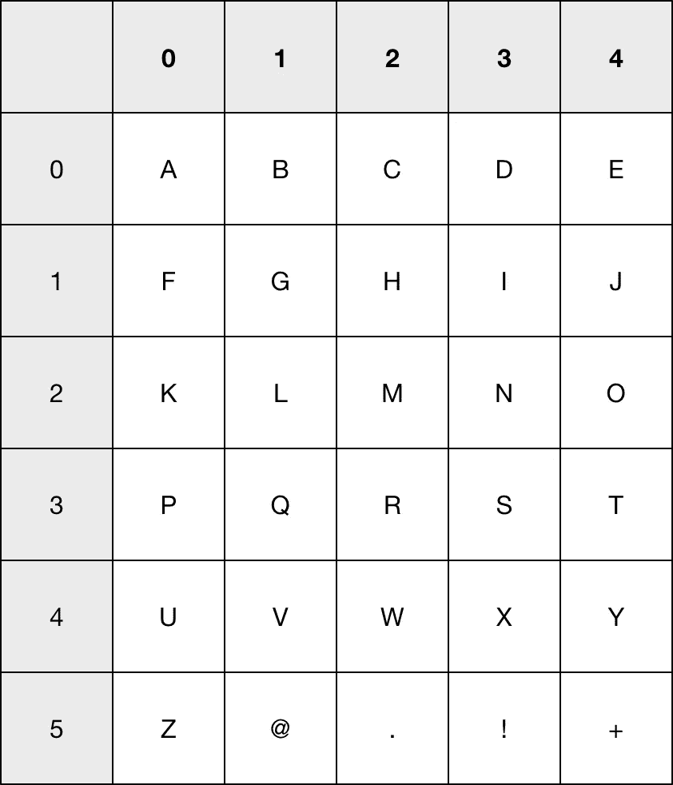
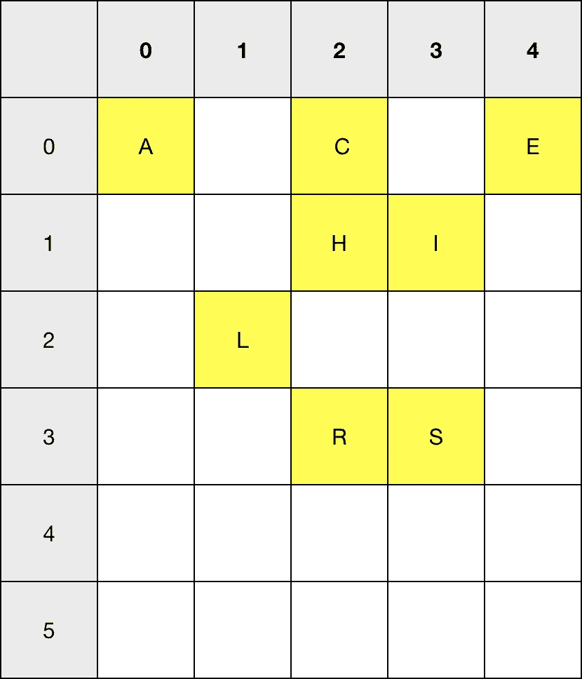
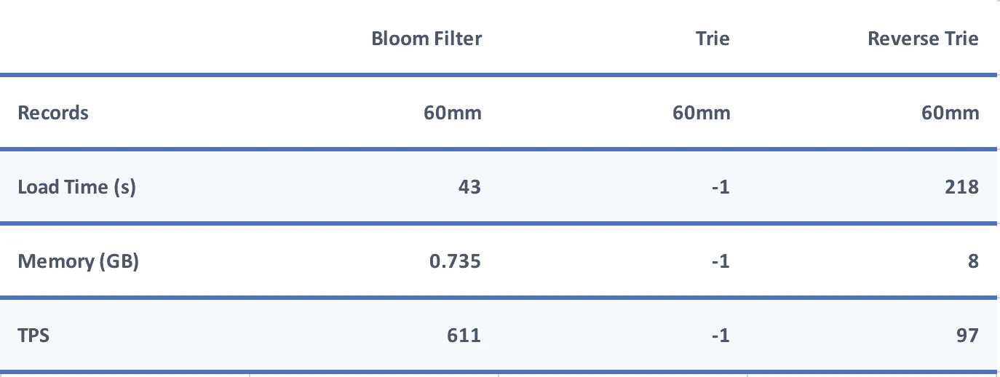

# 微服务世界中极快的数据查找

> 原文：<https://medium.com/capital-one-tech/blazing-fast-data-lookup-in-a-microservices-world-dd3ae548ca45?source=collection_archive---------0----------------------->

那是 1998 年，我们的 VB 4.0 应用程序连接到数据库，使用 JDBC 处理少量数据。自 2003 年以来，我们的 web 应用程序和今天基于 API 的应用层继续遵循相当简单的模式来处理少量数据。2018 年，我们将构建微服务，以 20 年前无法想象的速度和容量处理流数据。这是通过极快的消息总线实现的，这种总线实现了以前只能通过批处理/ETL 工具实现的吞吐量。但是所有这些数据都会给我们的数据库带来问题。首先，让我们看看在流环境中获取数据的错误方式，然后我们将展示如何使它变得更好。

## **原始快速数据**

我们有一系列微服务，可以过滤和增强电子邮件。我们的输入将是一个永无止境的、极其庞大的原始消息管道。我们正在添加的组件之一将是一个已知垃圾邮件陷阱或退回电子邮件地址的黑名单。出于多种原因，我们需要保证我们的系统不会发送这些电子邮件。

我们的黑名单很简单，它是一个 6000 万已知不良地址的列表*(请原谅，这不是一个真实的例子，一个 6000 万条不良邮件的列表在现实世界中很可能不是正确的方法)*。“黑名单”验证微服务的最初实现是天真地构建的——对于要检查的每条消息，该服务将建立一个数据库连接*(让我们开始)*，查询黑名单表(黑名单)，并检查是否存在现有的项目。如果有一个项目，那么我们的黑名单实现将把入站消息丢弃在地板上，并忘记它曾经发生过。

我甚至不打算运行这个测试，因为我们知道这是我们黑名单中最幼稚的实现。每条消息都将连接到数据库，查询并关闭连接。即使有一个相当大的数据库服务器，我想我们能得到的最好结果也是 10-15 TPS(每秒事务数)。为了满足 500 TPS，数据库必须有多大，我们的应用程序必须扩展到多宽？500 TPS 变成每分钟 18 万条记录。这将是一个合理的吞吐量！

## **快速数据存取**

让我们想想怎么做才对。为了让这个足够快，我们想要实现一个缓存层。缓存可能不是正确的词…传统上，程序员会在缓存中查找特定的数据，如果不存在，代码将检查数据库作为记录的真正来源。一旦数据从数据库中取出，它就被插入到缓存中。这种方式构建缓存的速度很慢，而且只有在第一次访问数据时才会出现。我们将在一个操作中提前填充缓存，而不是在一段时间内填充，这个操作是“*select email from black _ list*”，将黑名单中的每个名字插入到我们的查找结构中(这里称为缓存)。

很快，我们知道缓存意味着我们不再是“真正的”实时管道，这没关系。在一个真实的应用程序中，我们会想出如何更新我们的缓存，但我们不会在这篇文章中讨论它。

缓存将作为我们微服务的数据存储。因为我们关心极快的数据查找，所以我们需要一个只读缓存。我们 6000 万条记录的整个数据集需要放在这个缓存中。6000 万条记录听起来可能是很多数据，但我们会让它发挥作用。

## **可能的方法**

我想到了几种不同的实现方式:

1.  查询数据库中的每条记录。
2.  使用中间缓存工具。
3.  选择内存中的本地数据结构。

您可以将每种方法视为保存数据的一个步骤。我们通常会处理数百万条记录，而不是数百条。为了高效地存储和处理所有这些数据，我们需要将其压缩到一个可消耗的内存块中。

**选项 1** 就是我们上面提到的。每个事务都需要一个新的数据库连接、一个查询和结果处理。这将导致大量的网络和数据库开销。如果不故意编写一个更慢的过程，这是构建我们的查找最慢的方式，所以我们不要谈论它。

**选项#2** 是个不错的选项。事实上，有很多理由表明这可能是正确的选择。如果我们看看像 [Memcached](https://memcached.org/) 、 [Redis](https://redis.io/) 或 [Hazelcast](https://hazelcast.com/) 这样的系统，我们会得到多个客户端/微服务可以同时连接的好处。这些技术都具有商业支持的第三方应用程序或拥有大量从业者的流行开源系统的优势。例如，如果我们使用[AWS elastic cache](https://aws.amazon.com/elasticache/)建立一个 Redis 系统，那么我们很可能很快就会开始比赛。Redis 的性能令人惊叹，可以轻松应对我们所说的负载。

但是我们也要跳过这个选项。没想到我会这么说，是吗？当然不是！Redis 等人会工作得很好！但不如选项 3 好。

# **自定义内存查找**

在我们探索定制内存查找时，我想在这里研究两种数据结构。第一个是 [Trie](https://en.wikipedia.org/wiki/Trie) ，第二个是[布隆过滤器](https://en.wikipedia.org/wiki/Bloom_filter)。

# 特里

trie 是一种树状结构。它试图通过在内存中构建路径来删除重复数据。例如，电子邮件地址:[chris@fauie.com](mailto:chris@fauie.com)和 chris@example.com(不是我的真实地址)将如下所示:

Trie Visualization — containing two email addresses

为了保存电子邮件列表，我们知道 TLD(顶级域名:例如。com，。edu。info 等)是一个非常有限的列表。“反向 trie”的指标与上述相反。在顶部是 TLD，它们的最后一个节点是“c”。当处理两个电子邮件地址时，它不会改善任何事情，但是，当处理 6000 万个电子邮件地址时，差异就变得显而易见了。

Reverse Trie Visualization — containing same two email addresses

想象一下，有多少电子邮件地址会有相同的 TLD 和域名？@gmail.com、@yahoo.com、@aol.com、@outlook.com .现在我们开始节省数据。

在我最初实现 Trie 查找时，我无法在不交换的情况下将 6000 万封假邮件加载到内存中。这让我很惊讶，但事实就是如此。一个简单的电子邮件字符串的“反转”,我就可以非常快速有效地加载数据了。至少我是这样认为的(稍后会有更多的介绍)。

# 布隆过滤器

我使用的另一个数据结构是 Bloom Filter。布隆过滤器是一种**概率**数据结构。当我们谈到假阳性时，我将在下面详细讨论。布隆过滤器允许紧凑形式的查找数据来表示集合中的项目。我在脑海中想象布鲁姆滤镜的方式是想象一个巨大的坐标平面(还记得几何学吗？).这是一个矩阵，或者二维数组。让我们创建一个示例哈希表示:

Hashing Algorithm for our Bloom Filter

取一个像 chris 这样的单词，散列它，你可以想象你最终得到的表示是:

c == (2，0)

h == (2，1)

r == (2，3)

i == (3，1)

s == (3，3)

在这个例子中，c 将总是散列到(2，0)，h 散列到(2，1)，等等。

构建散列算法是第一步。在这个例子中，我们可以将存储数据的矩阵想象成具有相同的结构。然而，每个盒子都是空的。每个盒子代表一个“位”，或一个布尔值(0，1 或真/假)持有者。当我们添加单词 chris 时，我们的代码会将相应的位翻转为 1。添加值后，我们可以通过重新散列和检查所有方块来“检查”单词 chris 是否存在。厉害！我们还没有保存任何数据…但是，让我们加上查理这个词。然后我们翻转相应的位，c、h 和 I 仍然开启。我们已经节省了 3 位！继续添加单词和翻转比特，直到你的整个数据集被表示出来。

Bloom Filter with Chris and Charlie flipped “on”

**奖励:***超级航母会是什么样子？*

希望你能很快意识到这么小的数组是无法工作的-‘dog’和*‘god’会翻转相同的位，‘master’和‘tamers’会散列并翻转相同的位。没有办法知道哪个单词被用来翻转比特。幸运的是，提出这种方法的智能数据科学家有一个解决方案。我们估计我们将有多少项目*(回到我们的 6000 万封电子邮件列表)*，我们的库或代码可以构建一个更大的网格，使用非常不同的哈希算法。只要值散列一致，我们就可以对我们的数据有信心。*

****警告*** *:网格越小，我们越容易出现重复，也就是所谓的误报。虽然布隆过滤器可能有假阳性，但它绝不会有假阴性。查看布隆过滤器的 Go 库，它解释了如何调整大小**

*此外，忽略布隆过滤器的另一个重要方面将是疏忽的。上面，我们可视化了一个坐标平面，原始数据被映射到其中。*

*狗== '上帝'*

*在现实世界中，通过电子邮件，我们也会遇到很多误报。*

*[chrisfauerbach@example.com](mailto:chrisfauerbach@gmail.com)' = = '[fauerbachchris@examaple.com](mailto:fauerbachchris@gmail.com)'。*

*因此，彻底的布隆过滤器实现将具有两个附加特征。布隆过滤器将首先“散列”入站/原始数据，而不是原始数据的单一平面。让我们来看一个 sha1 哈希。Bloom Filters 通常不会像 SHA 系列那样使用加密哈希，而是使用一系列快速哈希，这些哈希会产生相同长度的不同结果。这是一个例子。*

****注意:* *echo -n 抑制一个新的行字符。shasum -a 1 使用 sha1 算法。****

*我们有一个更长的字符串(*b6b 0756 bb8a 354 ddcecc1 f 89d 88 CB 69646 B0 C18 e*)要添加到我们的 Bloom Filter 中。SHA1 不是最好的算法，因为有已知的重复，但是如果我们多次散列我们的数据，然后我们保持一个坐标平面的“列表”,会怎么样呢？我们的数据结构可以运行快速 sha1 并检查第一个坐标平面。如果有“命中”，意味着值在坐标平面内，我们可以进入下一个算法。让我们运行一个 sha224:*

**4d 3 AC 82 b 69 f 380 C2 BD feb 58 a 0 be 019d 4 ea ee 9 b 8 F2 c 68 CDE 30 f 845 EBA**

*如果有“命中”，那么我们可以运行 sha256:*

**21761536 edfba 84 bfeef 4d 054 b 50 f 279 e 20 da 8 AE 70874 e 0691 DC 6 AE 171 DD 8145**

*如果在所有的过滤器(sha1，sha224，sha256)上都有一个“命中”，我们可以声称在我们的布隆过滤器中有那个值([chris@fauie.com](mailto:chris@fauie.com))。如果**任何**坐标平面没有命中，我们可以确信我们的数据不在结构中。我的同事 Jon Bodner 建议把它想象成一个筛子或者坐标平面的链表。从一个走到下一个，寻找一个“错过”。*

*正如我前面提到的，在 Bloom Filter 中，完全有可能出现误报。然而，我们可以**而不是**得到一个假阴性。这是 Bloom Filter 的一个方面，在确定它是否是您的应用程序的正确数据结构时，需要了解并有目的地决定它。我们可以通过使用更大规模的“更多”算法来降低这种风险。*

# ***结果***

*对于这个数据缓存系统，我测量了三段数据:*

1.  *加载时间(秒)*
2.  *使用的内存(千兆字节)*
3.  *TPS(通过 API 每秒查找一次)*

## *装入时间*

*加载时间很重要。最坏的情况是，如果应用程序崩溃，我们可以通过从数据库重新加载数据并继续运行来快速恢复。在下面的图表中，您会注意到 Trie 的值为-1。这是因为最初的 trie 实现失败了，无法将所有数据加载到内存中。这很糟糕，我的第一个想法是我做错了什么。我决定翻转数据(反转字符串)并加载它。那创造了奇迹！这告诉我，我的优化理论奏效了。所以一开始失败了也不要放弃！这里数字越小越好。*

## *使用的内存*

*当我们考虑应用程序部署时，使用的内存也很重要。如果我们能够在 [AWS EC2](https://aws.amazon.com/ec2/) ，或者 [AWS ECS](https://aws.amazon.com/ecs/) ，或者 [Fargate](https://aws.amazon.com/fargate/) 中利用大量的小实例，那么我们就可以节省资金。如果一种方法占用 30GB 内存，那就不好了。这里的数字越小越好。*

## *查找速度*

*最后，我想测量查找速度。我的方法是构建数据结构(Trie、Bloom Filter ),并在其上添加一个快速 HTTP GET API。我编写了一个测试负载运行应用程序，使用与我创建 60 毫米测试电子邮件相同的算法产生了一个随机字符串，并开始用它们敲打 API。下面显示的数字是 TPS，即每秒事务数。请记住，我们的目标是大约 500TPS 或更高。*

**

*Results Chart*

# ***实际结果！***

*这些结果并没有让我太惊讶。我以为 Bloom Filter 会赢，没想到所有指标差距巨大。坦率地说，不应该有那么大的差距。原始数据文件的长度不到 8GB，所以我知道有些地方不太对劲。我对布鲁姆过滤器印象深刻。这提供了紧凑的结构，短的装载时间，以及我想要的吞吐量。*

*还记得我之前说过 Trie 可以高效地加载数据吗？我错了。这是我所能想象的最没有效率的事情。以一个 1.5GB 的文件为例，它会爆炸式地占用 8GB 以上的内存，这与高效正好相反。回头看看树形结构，每次你添加一个新的字母，你就创建了一个节点。该节点为“下一个”字母建立指向 40 个其他节点的空指针。每向下一层增加一层字母，这一层中的每个节点有 40 个指针。在 Go 中，指针是 64 位机器上的 8 字节数据结构。我们拥有的单词越长，我们的数据使用范围就越广。*

**

*Visualization of a tiny Trie*

*看到那些盒子了吗？想知道在这个数据结构中你能容纳多少个单词吗？两个。那是因为你可以有两个以同一个字母开头的单词。假设我们的单词是 a 和 an。两个字母需要三个是三个层次。我只在每一层的一个字母下面添加了 40 个节点。两个字母的单词需要 120 个盒子(空指针)。您能看出为什么这可能是一个臃肿的数据结构吗？单词越长，就越臃肿。*

*尝试是很好的，但是要仔细检查你的用例。*

# ***结论***

*这是一个展示为什么我们有不同的数据结构和算法来解决挑战性问题的练习。如果你像我一样，你一定听过这句谚语，“如果你有一把锤子，所有东西看起来都像钉子。”或者，如果你去找外科医生诊断和治疗某个问题，你很可能会以手术告终。*

*作为计算机科学家和数据科学家，我们需要不止一个工具来解决我们的问题。所以，尝试不同的语言，尝试不同的数据结构；对学习新事物保持开放的态度，回想你早期的教育和经历。你曾经学过链表、映射、数组等等是有原因的。*

****很想听到一些思想上的反馈！推特我***[***@ chrisfauerbach***](https://twitter.com/chrisfauerbach)***。****

**

**披露声明:这些观点仅代表作者个人观点。除非本帖中另有说明，否则 Capital One 不属于所提及的任何公司，也不被其认可。使用或展示的所有商标和其他知识产权都是其各自所有者的所有权。本文为 2018 首都一。**