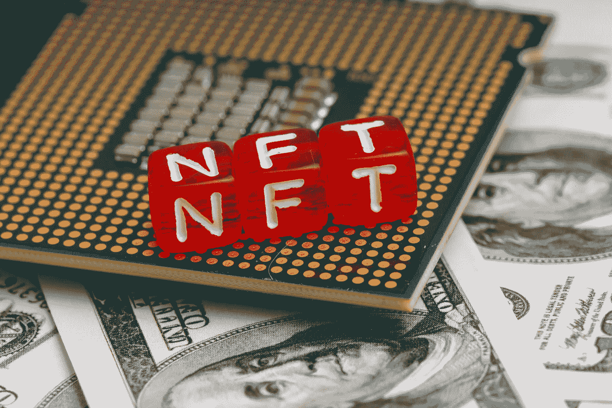

# 游戏中的区块链——NFTs 和 Play to Earn Farming

> 原文：<https://medium.com/version-1/blockchain-in-gaming-nfts-and-play-to-earn-farming-b4993455df24?source=collection_archive---------4----------------------->

**区块链是什么？**

区块链最简单的定义就是，它是一个分布式数据库。区块链是分布式账本技术(DLT)家族的一员，它允许多个分布式节点(或组织)使用一致的算法来协调和记录数据，以确保所有节点都得到正确和同步的维护和更新。区块链是不可变的，这意味着一旦写入，区块就不能更新或删除。这些数据块中的每一个都是安全的，并使用加密原理相互绑定。

了解更多区块链信息；我强烈推荐我们的白皮书，它对此进行了深入的解释。你可以在这里找到。

既然我们已经介绍了这项技术，那么让我们进入这篇文章的细节:NFT 支持区块链。

NFT 代表不可替换令牌，这意味着它们是“唯一的”。我的意思是，没有两件东西有相同的代码，就像交易卡一样。即使 50 个人有一张皮卡丘神奇宝贝交易卡，每一张都是独一无二的。

图像、gif 甚至视频正在成为非功能性文件，艺术家们肯定乐此不疲。然而，它们通常以有限的方式被创造出来，以引入稀缺性和价值。这就是投资者和收藏家、社区和有影响力的人，以及像游戏这样的娱乐业进来的地方。

**游戏中的 NFTs**

即使我们同意拥有魔兽世界的灰烬使者、命运之王 2 或雷神之锤 mjlnir 会很棒，但我相信这将削弱一个人在玩包含这些标志性物品的视频游戏时的体验和沉浸感。然而，我不会反对新的、精选的、不与虚拟世界中的任何角色相关联的物品被现实生活中的某个人拥有，就像金恩资产的情况一样。

金恩是一家专注于区块链的公司，拥有一枚同名硬币。他们也是一个加密数字资产的开发者，一个名为 Oindrasdain 的 NFT 的创造者。这是一件描绘斧头的艺术品，游戏《失落的遗物》(之前名为《被遗忘的神器》)将其添加到了文件中。因此，当你登录到游戏中，它会通过检查与你的帐户关联的钱包来检测你对 NFT 的所有权，并向你提供该物品。在这种情况下，物品是买来的，而不是得到的。然而，我们可以看到付费游戏的吸引力，特别是如果收藏品的价值可以转移到其他游戏。因此，扩大该项目的范围会增加其内在价值。

我很高兴我不会是负责在每个游戏中平衡这些项目的人，这听起来像一场噩梦！

Oindrasdain — Owned by [Mary_Jane_Whatson](https://opensea.io/Mary_Jane_Whatson), created by Enjin

**在游戏中滥用 NFT 的可能性**

我不想这么说，但是当有人可以操纵一个系统来赚钱时，人性中最坏的一面就会浮出水面。我们可以以[魔兽世界的瓶颈问题](https://www.wired.com/story/world-of-warcraft-classic-russian-bots/)为例。魔兽世界里有成千上万的机器人在掘金，在膨胀虚拟经济。

[一枚金币的价值几乎是委内瑞拉玻利瓦尔的 7 倍。](https://edition.cnn.com/2018/05/08/world/world-of-warcraft-token-worth-more-than-venezuelas-currency-trnd/index.html)你可能会问这个黄金是用来做什么的，答案又是一个争议。

通过《魔兽世界》中的内容来刺激其他玩家是一项价值数百万美元的业务，公会和社区出售他们的服务来换取游戏内的金牌。因此，它正在创造虚假的成就，向游戏中的人发送垃圾信息，并向潜在的买家开放骗局。

暴雪确实禁止了 boosting 社区来解决这些问题。然而，这是一个很好的例子。一旦你在 NFT 奖励游戏中加入这种行为，你就会发现，如果实施不当，它会很快变成一场灾难。我们不要忘记，除了游戏开发问题，还有可能的区块链编码漏洞。

每当有人被发现滥用游戏的服务条款，他们通常会受到惩罚，他们的帐户被禁止，如果未来的漏洞来自他们的第二个帐户，下一个行动是知识产权禁令。在今天的技术中，VPN 可以用来解决这个问题，但是，这也违反了服务条款，接下来就是硬件 ID 禁令。

既然我们正在谈论从 NFT 农场中获得实际的金钱，而不仅仅是欺骗或滥用游戏中的错误，我可以很容易地看到未来“玩家”开放一个虚拟机的公共云环境来运行他们的机器人并农场这些 NFT。如果帐户，IP 或硬件 ID 被禁止，他们可以改变它们，然后再去，自动化它，很有可能赚得比你花的多。我的看法和未来计划我真的很喜欢玩电子游戏，我已经玩了 20 多年了。最近，我甚至努力组织了一次虚拟网吧活动，让我的同事们体验玩电子游戏的乐趣。这是为了欢迎新的爱好者，同时将他们跨部门联系起来，无论他们的级别或年龄。然而，我也热爱技术，以及它在公共云和游戏开发中发展的极快速度。如果你做好准备，研究它，并始终保持谨慎，每一个好主意都值得探索。

**关于作者:**
Samuel Stan 是第 1 版合作伙伴团队的项目经理。