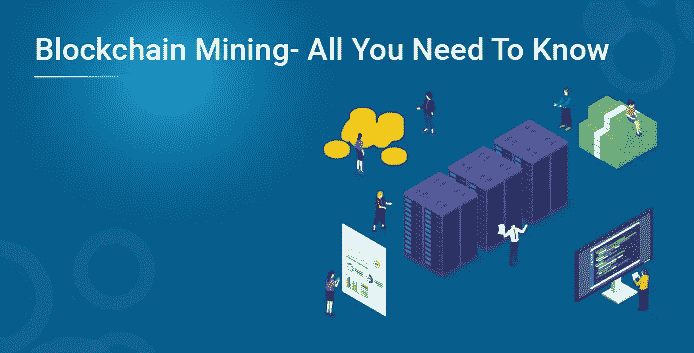
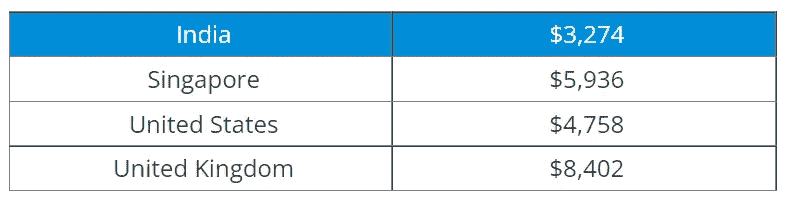
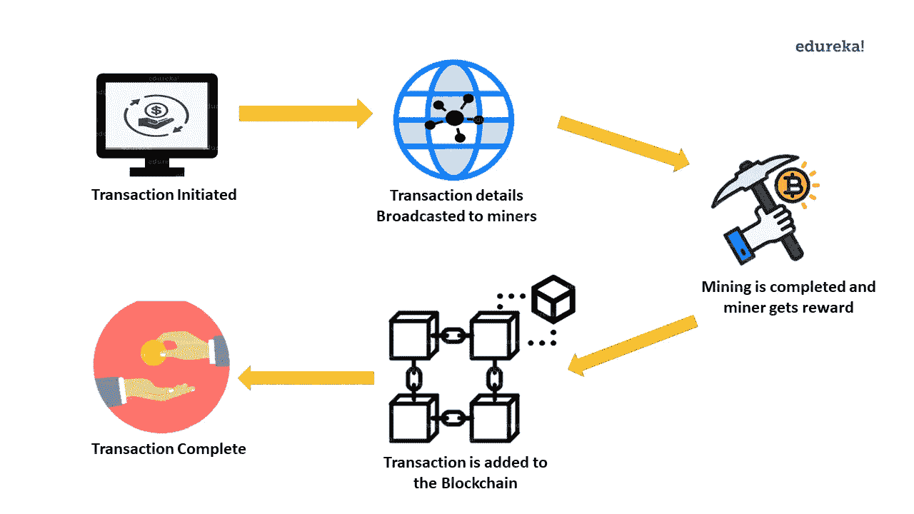
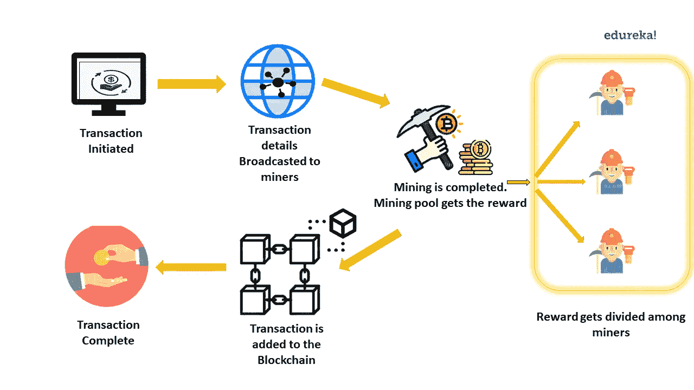

# 区块链挖掘——你需要知道的一切

> 原文：<https://medium.com/edureka/blockchain-mining-you-need-to-know-ad2b2255c36b?source=collection_archive---------0----------------------->

想知道区块链挖掘是怎么回事，它是如何盈利的？如果是，那么请阅读这篇关于区块链挖掘的文章，通过这篇文章，您可以了解什么是区块链挖掘以及它是如何工作的。

以下是我将在本文中涉及的主题:

*   为什么要采矿？
*   什么是区块链挖掘？
*   区块链挖掘是如何工作的？

# 为什么要采矿？

没有人会无缘无故地做任何事情，当涉及到技术时，你会做一些事情，要么是因为它有趣，要么是因为你从中获得了一些利润。**为什么要采矿？**“可以分为 2 个问题:

1.  为什么有人会挖掘区块链？
2.  为什么区块链挖掘是必要的？

## 为什么有人会挖掘区块链？

钱！是的，你可以通过挖掘区块链赚钱。但是有多少呢？那要看你的开采能力了。采矿需要一些资源，如计算硬件、冷却系统、电力和维护。你的采矿设备越强大，你的采矿能力就越强，你就能赚更多的钱。

为了让你有个概念，我列出了在不同国家开采一枚比特币的成本

要了解更多不同国家的采矿成本，请访问此链接。

你知道你挖矿区块链是有报酬的。但是为什么你会因为采矿而得到报酬呢？这是因为挖掘对于区块链保持完整性非常重要，挖掘有助于保持完整性。想知道怎么做？这就引出了下一个问题。

## 为什么区块链挖掘是必要的？

区块链技术优先考虑欺诈预防。任何交易只有在经过验证后才会被添加到区块链中。这是为了防止虚假/欺诈交易。验证是通过挖掘来进行的。所以当我说你因挖掘区块链而获得报酬时，实际上是指你因确认交易而获得报酬。

既然你已经明白了为什么要进行区块链挖掘，那我们就来了解一下什么是区块链挖掘。

# 什么是区块链挖掘？

区块链挖掘是一个用于验证新交易的过程。不同的区块链实现使用不同的方法进行验证。在这篇博客中，我将解释一个比特币挖矿的例子。当新的区块链交易发生时，在将这些交易添加到区块之前，给所有参与挖掘的矿工一个数学问题。这个数学问题是一个基于哈希算法的难题，只能通过暴力破解。

解决这个问题的唯一方法是检查每个可能的解决方案，看看它是否正确，没有捷径可走。寻找解决方案不需要智能，只需要更快的计算速度。数学问题的解决方案被称为**工作证明。****工作证明，顾名思义**是矿工花费时间和资源寻找解决方案的证明。如前所述，区块链挖掘需要大量资源。为此花费时间和资源，矿工会得到一种叫做**采矿奖励的奖励。**

既然你已经理解了什么是区块链挖掘，那我们就来看看它在现实世界中是如何工作的。

# 区块链挖掘是如何工作的？

区块链挖掘在普通桌面上几乎是不可能的，它需要具有更快计算速度的特殊硬件。采矿有两种方式:个体采矿和联营采矿。

## 个体采矿

在这里，每个矿工将设置硬件，并注册自己采矿。当新的交易发生时，区块链网络中的所有矿工都会收到一个数学问题。矿工的硬件开始寻找解决方案。第一个找到解决方案的矿工通知所有其他矿工他已经找到了解决方案。然后，其他矿工验证它，以避免块的错误验证。一旦矿工的解决方案得到验证，矿工就会获得奖励，交易也会被添加到区块链中。

## 采矿池

有些时候，单个矿工没有足够的资源来开采区块链。在这种情况下，一群矿工聚集在一起形成一个采矿池。这些矿工结合他们的资源，更快的挖掘区块链。类似于个体采矿，矿池得到问题，成功解决后，他们得到奖励。这一奖励根据矿工贡献的资源多少在他们之间分配。

区块链挖矿就是这样发生的，矿工获得奖励。我希望这个博客增加了你的知识。现在，去探索用于区块链挖掘的不同机制。

如果您希望学习区块链并在区块链技术方面建立职业生涯，请查看我们的 ***区块链认证培训*** ，该培训带有讲师指导的现场培训和真实项目经验。本培训将帮助您全面了解什么是区块链，并帮助您掌握该主题。

如果你想查看更多关于人工智能、DevOps、道德黑客等市场最热门技术的文章，那么你可以参考 [Edureka 的官方网站。](https://www.edureka.co/blog/?utm_source=medium&utm_medium=content-link&utm_campaign=blockchain-mining)

请留意本系列中解释区块链其他各方面的其他文章。

> *1。* [*以太坊教程*](/edureka/ethereum-tutorial-with-smart-contracts-db7f80175646)
> 
> *2。* [*以太坊专网*](/edureka/ethereum-private-network-tutorial-22ef4119e4c3)
> 
> *3。* [*什么是智能合约？*](/edureka/smart-contracts-301d39565b76)
> 
> *4。* [*坚实度教程*](/edureka/solidity-tutorial-ca49906bdd47)
> 
> *5。* [*松露以太坊教程*](/edureka/developing-ethereum-dapps-with-truffle-7533289c8b2)
> 
> *6。* [*最好的以太坊开发工具*](/edureka/ethereum-development-tools-7175503a1ac7)
> 
> *7。* [*超帐面料*](/edureka/hyperledger-fabric-184667460-edc184667460)
> 
> *8。* [*Hyperledge vs 以太坊*](/edureka/hyperledger-vs-ethereum-bdc868e10817)

*原载于 2019 年 5 月 22 日*[*https://www.edureka.co*](https://www.edureka.co/blog/blockchain-mining/)*。*