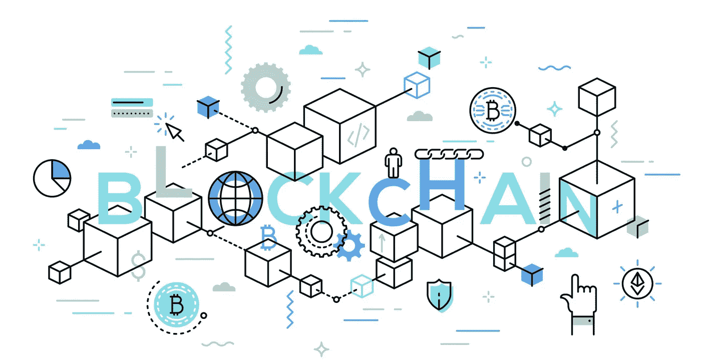
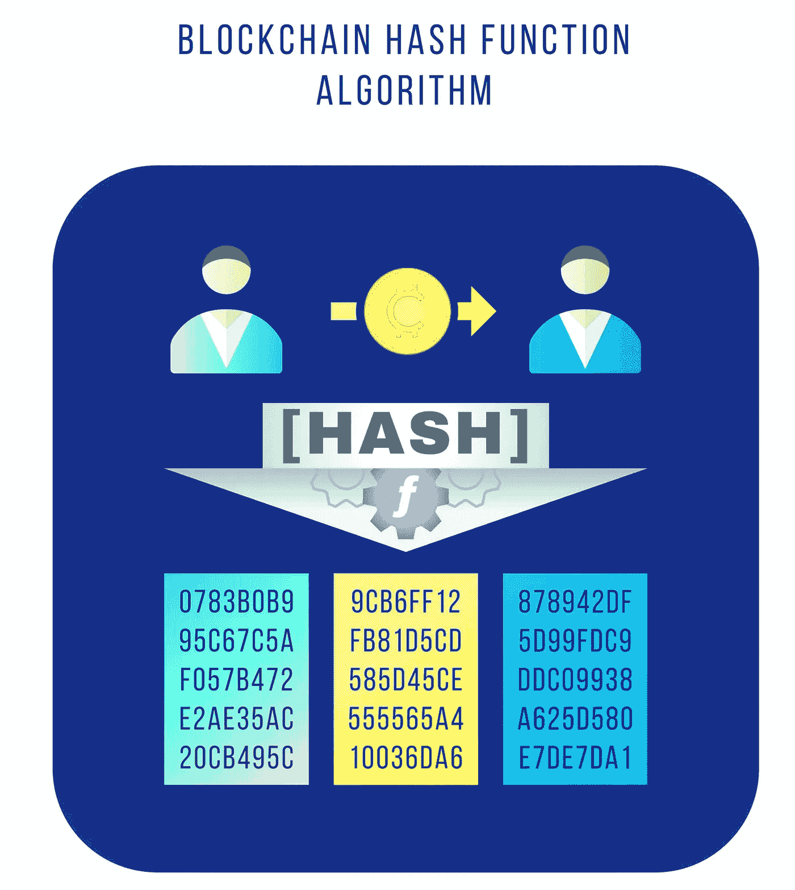

# 区块链安全:区块链真的安全吗？

> 原文：<https://medium.com/edureka/blockchain-security-is-blockchain-f7be8d4d54c3?source=collection_archive---------1----------------------->

个人数据的安全，尤其是存储在网上的个人数据的安全，非常重要，也是一项人权。几十年来，它一直处于危险之中，并不断恶化。区块链技术为这个问题提供了一个优雅的解决方案。**区块链**顾名思义，是包含一组交易的数字区块链。块中的所有事务形成一个默克尔根，并使用它生成一个散列，该散列包含在块头中。区块链中的每个块都通过块哈希值连接到前一个块。这反过来使区块链能够抵抗任何类型的篡改，因为黑客需要改变包含该交易的块以及与之相关的块，以避免暴露。

区块链被设计成不可变、防篡改和安全的。有助于实现这一目标的功能包括:

*   分散
*   密码学和散列法
*   共识协议

我们来讨论一下这些性质。

# 分散

区块链在一个分散的网络上工作，信息以一致的方式传递和更新给所有参与者。因此，每个人都有最新的更新信息。进行任何更改时，所有参与者都会对其进行验证，一旦验证通过，该更改才会追加到区块链中。所以我们可以说，去中心化允许真相的单一版本，但没有单点失败。

# 密码学和散列法

这是一种复杂的数学算法，可以防止攻击。所有事务都经过加密哈希处理并包含在块中。哈希算法接受一个输入值，并应用哈希算法(比特币的 SHA-256 算法)生成一个新值，我们称之为哈希摘要。根据所使用的算法，摘要的长度是固定的。查看摘要时，无法猜测其值，而且，即使是值的微小变化也会以不可预测的方式完全改变摘要。现在，事务的这个散列连同前一个块的块散列一起被包括在块头中，并且一起生成新的块散列。现在，该块哈希将包含在下一个块头中。这就是如何使用加密的安全散列函数来形成块链。

除此之外，每笔交易都经过数字签名。为了解释这一点，我举一个例子。假设你要送几个比特币到 ***ABC*** 。因此，您将使用我的私钥对我的消息进行加密散列，并将散列与 ***ABC*** 的地址一起发送。现在，网络中的每个人都可以查看交易，并可以使用我的公钥进行验证，但只有 ***ABC*** 能够将这些比特币添加到他的钱包中。因此，每个人都可以看到交易，但没有人可以窃取它。

# 共识协议

共识协议是网络的大多数参与者关于交易有效性的协议。单个矿工验证交易，而整个网络可以通过检查***‘工作证明*** 来确认验证者的可信度。因此，即使网络中只有很少的恶意参与者，他们也很容易被清除，他们的意见从来都不重要。

这些基本属性形成了融入区块链的安全三要素，并阻止任何形式的不正当行为

# 这很好，但并不完美

阅读这一切可能会让你觉得区块链是安全的，这是一个绝对的事实。事实并非如此，因为正面有裂缝。最有说服力的区块链漏洞是区块链与其他实体互动的方式。智能合约可以自动化许多区块链任务，但它们只有在编码后才能发挥作用。虽然他们不是区块链的一部分，但他们确实与它交互，因此如果代码编写得不好，黑客就可以渗透到智能合同中并窃取财富。

类似地，与区块链互动的中央机构可能会将区块链网络置于风险之中。黑客通常将目标锁定在存在单点故障的集中式存储库，这是他们可以利用的漏洞。因此，区块链技术的安全性不应与加密货币交易所遭到黑客攻击的新闻混为一谈。

以下是一些可以实现的事情——

*   防止任何人访问敏感信息，除了有权访问的人。会员服务提供商(MSP)在这方面提供帮助。他们负责注册参与者，并根据其角色提供对其 ID 的访问。
*   使用最高级别的安全标准保护私钥，这样它们就永远不会被滥用。

区块链网络中的所有这些功能将增加它防止攻击所需的保护。

# 结论

在这篇关于“区块链安全”的文章的结尾，我想说，区块链网络的安全性取决于它的基础设施。建立区块链网络时，您必须寻找最佳的部署平台。尽管区块链具有提供安全性的固有特性，但基础架构中的已知漏洞可能会被恶意参与者利用。最好的方法是拥有集成安全性的基础设施。

区块链还是一个新兴的技术，每天都在变好。区块链研究人员正在努力修补安全漏洞。我们还目睹了极端情况下的艰难抉择，这可能导致新一轮的区块链。综合考虑，区块链对许多企业来说是一个更好的解决方案。但是，重要的是继续发展和改善区块链生态系统，使其尽可能安全。如果你想查看更多关于人工智能、DevOps、道德黑客等市场最热门技术的文章，你可以参考 Edureka 的官方网站。

请留意本系列中解释区块链其他各方面的其他文章。

> *1。* [*以太坊教程*](/edureka/ethereum-tutorial-with-smart-contracts-db7f80175646)
> 
> *2。* [*以太坊专用网络*](/edureka/ethereum-private-network-tutorial-22ef4119e4c3)
> 
> *3。* [*什么是智能合约？*](/edureka/smart-contracts-301d39565b76)
> 
> *4。* [*坚实度教程*](/edureka/solidity-tutorial-ca49906bdd47)
> 
> *5。* [*松露以太坊教程*](/edureka/developing-ethereum-dapps-with-truffle-7533289c8b2)
> 
> *6。* [*最好的以太坊开发工具*](/edureka/ethereum-development-tools-7175503a1ac7)
> 
> *7。* [*超帐面料*](/edureka/hyperledger-fabric-184667460-edc184667460)
> 
> *8。* [*Hyperledge vs 以太坊*](/edureka/hyperledger-vs-ethereum-bdc868e10817)

*原载于 2019 年 2 月 26 日*[*https://www.edureka.co*](https://www.edureka.co/blog/blockchain-security/)*。*