# 区块链 101 -区块链技术初学者指南

> 原文：<https://medium.com/edureka/blockchain-tutorial-d05f9c36b62b?source=collection_archive---------5----------------------->

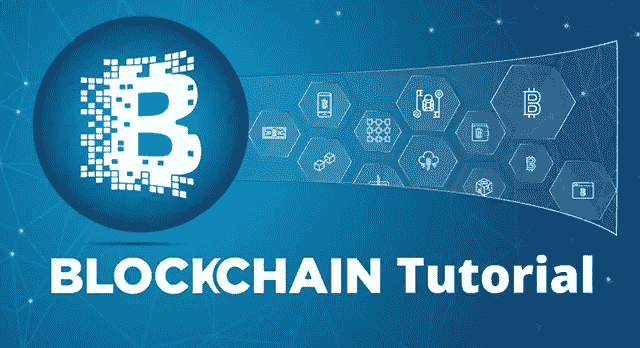

Blockchain Tutorial — Edureka

比特币和区块链技术的发展如此迅速，以至于即使那些没有听说过加密货币或不知道其工作原理的人也在寻求投资和探索这一领域。本区块链教程将按以下顺序为您提供关于比特币和区块链的所有基本知识:

1.  当前银行系统的问题
2.  区块链如何解决这些问题
3.  区块链和比特币是什么？
4.  区块链的特点
5.  用例
6.  演示:使用区块链实施数字银行

区块链技术和加密货币今天已经成为一个并行平台，人们已经开始执行他们的标准交易。现在，如果一个新系统正在慢慢取代一个现有的系统，那么当前的系统一定有一些问题。我们将通过了解当前银行系统的问题来开始这篇区块链教程博客。

# 当前银行系统的问题:

任何现有的系统都会有一些问题。让我们看看银行系统最常面临的一些问题:

## 高昂的交易费用

让我们看一个例子来更好地理解这个问题:


在这里，Chandler 向 Joe 发送 100 美元，但是在 Joe 可以接收之前，它必须通过可信任的第三方，如银行或金融服务公司。从该金额中扣除 2%的交易费，乔在交易结束时仅收到 98 美元。现在，这可能看起来不是一个大数目，但想象一下，如果您发送 100，000 美元而不是 100 美元，那么交易费用也会增加到 2，000 美元，这是一个大数目。根据 SNL Financial 和 CNNMoney 的一份报告，[摩根大通、美国银行和富国银行在 2015 年从 ATM 和透支费用中获利超过 60 亿美元](http://money.cnn.com/2016/01/14/investing/atm-overdraft-fees/index.html)。

## 双重支出

重复消费是数字现金方案中的一个错误，其中同一个数字代币被消费两次或更多次。为了帮助你更好地理解这个问题，我举个例子:

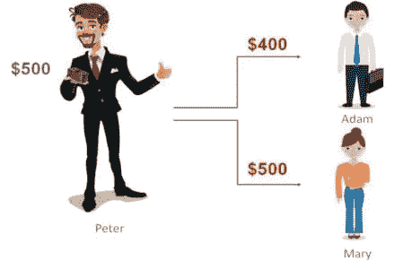

这里彼得的账户上只有 500 美元。他同时向 Adam 和 Mary 发起了两笔交易，金额分别为 400 美元和 500 美元。通常情况下，该交易不会成功，因为他的账户中没有足够的余额 900 美元。然而，通过复制或伪造与每个数字交易相关联的数字令牌，他可以在没有所需余额的情况下完成这些交易。这种操作被称为双重支出。

## 网络欺诈和账户黑客

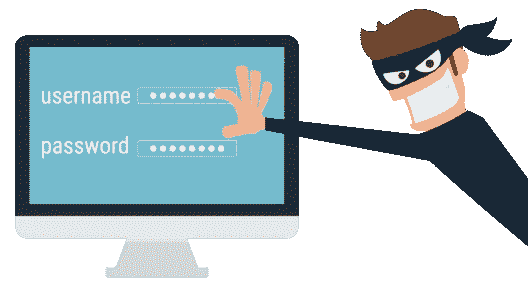

在印度，2016 年与信用卡/借记卡和互联网银行相关的欺诈案件数量为 14，824 起。这些诈骗涉及的净金额为 77.79 亿卢比，其中 21 亿卢比来自互联网诈骗，41.64 亿卢比来自 ATM/借记卡相关诈骗。

## 金融危机和崩溃


想象一下，把你所有的积蓄都给了你信任的人，却发现他们已经走了，并在别的地方丢失了。这就是 2007 年至 2008 年发生的事情，当时银行和投资机构大举借债，并将其作为次级抵押贷款借给那些甚至无力偿还这些贷款的人。这进而导致了有史以来最大的金融危机之一，据估计在全球范围内造成了近 11 万亿美元的损失。这只是最常见的例子之一，我们有多经常听说银行和金融服务公司因内部欺诈而倒闭？整个第三方系统是建立在对中间人盲目信任的基础上的。

我们已经看到了每个人都面临的一些最常见的问题。如果有一个系统能够克服这些问题，并为我们提供一个区块链技术所做的事情，那该多好啊。

现在让我们试着理解区块链和比特币如何解决这些问题，作为这个区块链教程博客的下一部分。

# 区块链是如何解决这些问题的？

以下是区块链技术解决上述问题的一些方法:

## 分散制

与由中央或联邦当局控制和管理的银行和金融组织相比，区块链系统遵循去中心化的方法。在这里，每个人都是系统的一部分，对系统的发展和衰落负有同等的责任。不是一个单独的实体掌握着权力，而是与这个系统相关的每个人都掌握着一些权力。

## 公共分类账

保存区块链上发生的所有交易细节的账本是开放的，与系统相关的每个人都可以完全访问。一旦你加入区块链网络，你就可以下载自交易开始以来的完整交易清单。尽管完整的分类账是公开的，但参与交易的人的详细信息仍然完全匿名。

## 核实每一笔交易

每一笔交易都通过交叉核对分类账进行核实，交易的确认信号会在几分钟后发出。通过使用几种复杂的加密和散列算法，消除了重复花费的问题。

## 低交易费或无交易费

交易费通常不适用，但区块链的某些变体确实实施了某些最低交易费。然而，与银行和其他金融机构收取的费用相比，这些交易费用相对较少。如果交易需要优先完成，则用户可以增加额外的交易费用，以便优先验证交易。

既然我们已经谈论了当前现有系统的问题，并了解了区块链技术如何克服这些挑战，我很确定您一定对区块链系统有所了解。

在这一点上，你可能仍然想知道区块链和比特币到底是什么。所以在本区块链教程的下一部分，让我们试着去理解这些重要的概念。

# 区块链和比特币是什么？

在我们继续了解什么是区块链之前，你必须了解什么是比特币:

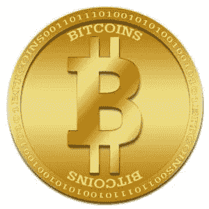

比特币是一种加密货币和数字支付系统，由一个不知名的程序员或一群程序员以中本聪的名字发明。这意味着它们可以作为普通货币使用，但不像美钞那样实际存在。它们是一种在线货币，可以用来买东西。这些类似于以比特形式存在于人们电脑中的“数字现金”。比特币只存在于云端，像 Paypal，Citrus 或者 Paytm。尽管它们是虚拟的，而不是实体的，但当人们通过网络转移时，它们就像现金一样被使用。

比特币系统基于点对点网络，交易直接在用户之间进行，无需中介。这些交易由网络节点验证，并记录在一个名为区块链的公共分布式账本中。由于该系统在没有中央存储库或单一管理员的情况下工作，比特币被称为第一种去中心化的数字货币。

比特币的生产使其成为一种独特的货币。与普通货币不同，比特币不能按需创造。只能创造 2100 万个比特币，其中 1700 万个已经被创造出来。每当包含有效交易的区块被添加到区块链时，比特币就会被创建。这是创造比特币的唯一方法，通过各种数学和加密算法，我们确保没有假比特币被创造或流通。现在让我们了解更多的区块链。

# 什么是区块链？

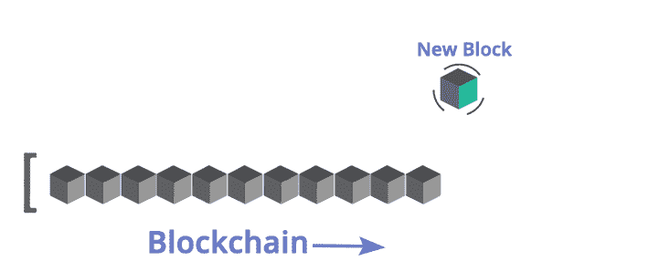

区块链可以称得上是整个加密货币体系的脊梁。区块链技术不仅有助于用户使用加密货币进行交易，还能确保相关用户的安全性和匿名性。这是一个不断增长的记录列表，称为块，使用加密技术进行链接和保护。区块链可以作为“一个开放和分布式的账本，可以以可验证和永久的方式记录双方之间的交易。”这个在网络中的每个人之间共享的分类帐是公开的，所有人都可以查看。这给系统带来了透明度和信任。

区块是区块链的“当前”部分，记录最近的一些或所有交易，一旦完成，将作为永久数据库进入区块链。每完成一个块，就会生成一个新的块。

区块链通常由对等网络管理，共同遵守验证新区块的协议。一旦被记录，任何给定块中的数据在没有所有后续块的改变和网络多数的共谋的情况下不能被追溯性地改变。交易一旦存储在区块链中就是永久的。它们不能被破解或操纵。一旦我们了解区块链的概念，我们将会了解更多。

在我们的区块链教程博客中，让我们看看区块链技术的特征，以帮助我们理解它为什么变得如此流行。

# 区块链的特点

以下是区块链技术的最重要特征，这些特征使其成为一项革命性的技术:

*   SHA256 哈希函数
*   公钥加密
*   分布式分类帐和对等网络
*   工作证明
*   验证激励

让我们试着一个一个地了解它们。

# SHA256 哈希函数

区块链技术中使用的核心哈希算法是 SHA256。使用散列的目的是因为输出不是“加密”的，即它不能被解密回原始文本。它是一个“单向”加密函数，对于任何大小的源文本都是固定大小的。为了更好地理解，让我们看下面的例子:


如果您查看第一个示例，我们将输入作为“Hello World”，并获得一个输出作为“a 591 a6 d 40 BF 420404 a 011733 CFB 7 b 190d 62 c 65 BF 0 bcda 32 b 57 b 277d 9 ad 9 f 146 e”。然而，只要加上一个“！”最后，输出完全变为“7 f 83 b 1657 ff 1 fc 53 b 92 DC 18148 a 1d 65 DFC 2d 4 B1 fa 3d 677284 addd 200126d 9069”。如果我们将“H”改为“H”，将“W”改为“W”，那么输出值变为“7509 e 5 BDA 0 c 762 D2 BAC 7 f 90d 758 b5 b 2263 fa 01 ccbc 542 ab 5 E3 df 163 be 08 E6 ca 9”。

我希望通过这个例子，你已经理解了算法的复杂性，因为即使输入中最微小的变化也会导致输出的巨大变化。

# 公钥加密

这种加密技术通过创建一组称为公钥和私钥的密钥来帮助用户。这里，公钥与其他人共享，而私钥由用户保密。为了理解这些键的作用，让我们看下面的例子来更好地理解:

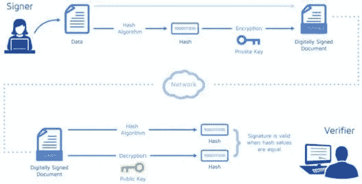

如果钱德勒向乔伊发送一些比特币，该交易将包含三条信息:

*   乔伊的比特币地址。(乔伊的公钥)
*   钱德寄给乔伊的比特币数量。
*   钱德的比特币地址。(钱德勒的公钥)

现在，所有这些数据连同加密的数字签名一起通过网络发送，以进行验证。数字签名也是一个哈希值，由 Chandler 的比特币地址和他发送给 joey 的金额组合而成。这个数字签名由私钥加密。一旦必须验证该交易的矿工收到该数据，他将同时进行两个过程:

1.  他获取所有未加密的数据，如交易金额和 Joey 和 Chandler 的公钥，并将其提供给哈希算法以获得哈希值，我们称之为 Hash1
2.  他获取数字签名，并用 chandler 的公钥解密，得到一个散列值，我们称之为 Hash2

如果 Hash1 和 Hash2 相同，那么这意味着这是一个有效的交易。

# 分布式账本和 P2P 网络

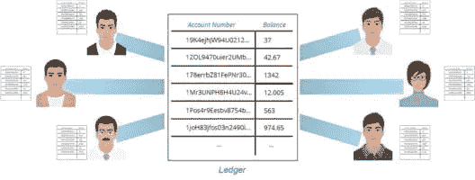

网络上的每个人都有一本账本。没有单一的集中拷贝。让我用下面的例子来帮助你理解什么是分类账:假设你需要向你的朋友约翰发送 10 个比特币，其中你的比特币余额为 974.65，约翰的余额为 37。你的余额将被扣除 10 BTC 并记入约翰的账户。

区块链有一种独特的方式来实现这一点。比特币区块链账本里没有账户和余额。从第一笔开始的每一笔交易都存储在一个不断增长的数据库中，这个数据库叫做区块链。平均约有 2050 个交易的区块，截至今天，区块链中有 484，000 个区块，约有 2.5 亿次交易。

这个账本分布在比特币区块链的所有用户中，即账本没有存储的中心位置。网络上的每个人都拥有分类帐的副本，而真正的副本是所有分布式分类帐的集合。

# 工作证明

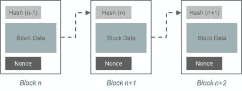

你可能想知道，如果每个人都平等地拥有账本，谁会给区块链添加区块？人们如何信任这个人？

为此，我们有了工作证明的概念。这基本上就像解决一个非常大的难题。这需要大量的计算工作。这项工作是由我们称为矿工的比特币网络中的人完成的。这些矿工的工作是验证交易，并解决与正在创建的区块相关的复杂数学难题。问题的难度经过调整，平均 10 分钟解决一块。挖掘器搜索特定的随机数(数学值),该随机数给出预定的期望散列。目前的难度是这样的，你需要尝试大约 20.6 万亿次随机数才能得到正确的散列。

每个块都有一个哈希值，该哈希值是前一个块的最终哈希值、事务数据的哈希值和 nonce 的组合。块的最终结果哈希必须以指定数量的尾随零开始。正是这种计算来找到满足使得挖掘计算如此昂贵的条件的随机数。

因此，找到这个随机数的人就是成功的矿工，他/她可以将他们的区块添加到区块链中。通过我们的 P2P 分布式网络，他/她广播他们的块，每个人验证散列是否匹配，更新他们的区块链，并立即继续解决下一个块。

# 验证激励

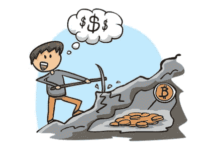

比特币交易的最后一步是奖励创造了最新区块的矿工。该奖励由区块链系统提供，用于验证交易和维护区块链。目前每块的奖励是 12.5 BTC(卢比**3427850**/-或**53390**)。这是比特币挖矿最有趣的部分。

比特币激励是产生新货币进入系统的唯一方式，据信到 2140 年，所有 2100 万比特币将被开采。

至此，我希望你现在对区块链技术有更多的了解和欣赏。区块链远不止比特币。金融只是区块链旨在颠覆的众多行业之一。继续我们的区块链教程，现在让我们看一个 IBM 和 Maersk 的例子，以了解供应链行业是如何被区块链打乱的。

# 区块链教程:用例

马士基是一家丹麦企业集团，业务涉及运输、物流和能源领域。自 1996 年以来，马士基一直是全球最大的集装箱船和供应船运营商。该公司总部位于丹麦哥本哈根，在 130 个国家设有子公司和办事处，约有 88，000 名员工。

IBM 是一家美国跨国技术公司，自 1921 年以来主要致力于业务解决方案、安全解决方案和存储解决方案

## **业务需求:**

作为极其动态的供应链行业的一部分，跟踪最微小的变化是客户的头等大事。他们需要一个解决方案，使他们能够完成运输过程，而不会在文书工作上出现延误。一个能够将系统的所有利益相关者聚集在一起并提供装运的实时状态的解决方案。

## **挑战:**

今天，全球贸易中 90%的货物都是由航运业运输的。这一供应链是由点对点通信的复杂性和绝对数量所决定的。这些通信是通过一个松散耦合的陆地运输提供商网络进行的。货运代理，海关，经纪人，政府的港口和海运承运人处理。集装箱运输的文件和信息费用估计是实际运输费用的两倍以上。

## **解决方案:**

IBM 和 Maersk 正在通过一个分布式许可平台解决这个问题，该平台可由供应链生态系统访问，旨在交换事件数据和处理文档工作流。

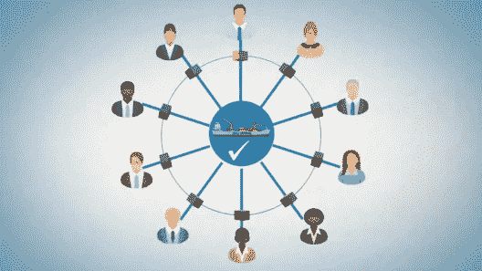

默克和 IBM 正在采用区块链技术，通过数字化贸易工作流程和端到端跟踪货运来创建一个全球防篡改系统。这消除了摩擦，包括昂贵的点对点通信。这一合作将具备跟踪每年数百万次集装箱运输的潜在能力，并在选定的贸易航线上与海关当局进行整合。

## **结果:**

*   为供应链系统中的所有利益相关者提供一个安全的**数据交换**平台。
*   建立了一个**防篡改存储库**来存储流程中涉及的所有文档。
*   定期的运输活动有助于减少重大的**延误和欺诈**，每年节省数十亿美元。
*   减少了贸易组织之间的壁垒，从而使全球 GDP 增长了 3%。
*   帮助**将整体贸易额**提高了 12%。

这就是区块链技术如何帮助马士基，并一直在帮助全球其他许多公司。最后，作为本文的一部分，我们将看看如何在您的系统上建立私有自治区块链的演示。

# 演示

我们将使用以太坊区块链实现一个数字银行。以太坊是一个开源的、公共的、基于区块链的分布式计算平台。这些系统将允许我们:

1.  制造一种具有固定市场供应和代币的加密货币，以代表现实世界的资产价值。
2.  创建一个自主的私有区块链，有花钱的规则。
3.  通过验证事务来挖掘新以太。

演示可分为 4 个步骤:

1.  克隆 Geth 代码
2.  创造一个创世块
3.  为我们的区块链制定规则
4.  验证和挖掘以太

## 步骤 1:克隆 Geth 代码:

geth 是运行在 Go 中实现的完整以太坊节点的命令行接口。通过安装并运行`geth`，你可以加入以太坊前沿直播网络

*   我的真实以太
*   在地址间转移资金
*   创建合同并发送交易记录
*   浏览块历史

从 GitHub 克隆 geth 存储库。为此，打开一个新的终端并执行以下命令:

```
$ git clone [https://github.com/ethereum/go-ethereum](https://github.com/ethereum/go-ethereum)
```


在您成功地从 github 克隆了文件之后，我们需要分支 geth 的最新版本。

```
$ cd go-ethereum 
$ git tag
```

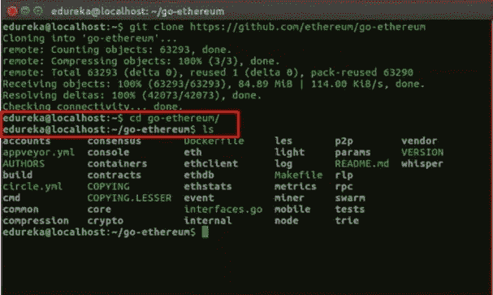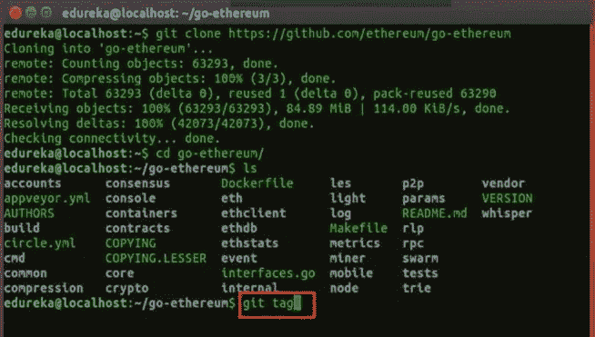

```
$ git checkout tags/v1.6.7 -b EdurekaEthereumV1.6.7
$ git branch
```


```
$ make all
```

## 第 2 步:创建创世纪块

创世纪区块是区块链的第一个区块。改变创世区块是一种彻底远离比特币区块链的方式，也就是说，建立一个有自己独立历史的新网络。要创建 genesis 文件，请执行以下命令:

```
$ cd go-ethereum 
$ mkdir genesis 
$ cd genesis 
$ gedit genesis.json
```


## 第三步:为我们的区块链制定规则

我们区块链的规则将包含在我们创建的 genesis.json 文件中。在 genesis.json 文件中添加以下代码:

```
{
    { "config":{ 
        "chainId": 123, 
        "homesteadBlock": 0, 
        "eip155Block": 0, 
        "eip158Block": 0, 
        }, 
    "nonce": "0x3", 
    "timestamp": "0x0", 
    "parentHash": "0x0000000000000000000000000000000000000000000000000000", 
    "extraData": "0x0", 
    "gasLimit": "0x4c4b40", 
    "difficulty": :0x400", 
    "mixhash": "0x0000000000000000000000000000000000000000000000000000", 
    "coinbase": "0x000000000000000000000000000000000", 
    "alloc":{ 
        }
}
```

> **nonce:** 一个 64 位的 hash，与 mix-hash 结合，证明在这个块上已经执行了足够的计算量。
> 
> **时间戳:**一个标量值，等于 Unix time()函数在这个块开始时的合理输出。
> 
> **mixhash:** 一个 256 位的 hash，它与 nonce 一起证明在这个块上已经执行了足够的计算量。
> 
> **难度:**一个标量值，对应于在块的随机数发现期间应用的难度级别。
> 
> **alloc:** 允许定义预充钱包列表。这是以太坊特有的处理“以太预售”期的功能。
> 
> **括号:**整个父块头的 Keccak 256 位哈希(包括它的 nonce 和 mixhash)。
> 
> **extraData:** 可选自由，但最大。32 字节长的空间保存智能的东西。
> 
> **gasLimit:** 一个标量值，等于当前每一区块天然气消耗的全链限制。
> 
> **coinbase:** 矿工在区块中包含的第一笔交易。

现在我们需要初始化区块链。您可以使用以下命令来实现这一点:

```
$ /home/edureka/go-ethereum/build/bin/geth --datadir ~/ethereum/net3 init genesis/genesis3.json
```


现在我们已经初始化了区块链，是时候让 geth 控制对它的访问了。执行以下命令启动 geth 控制台:

```
$ /home/edureka/go-ethereum/build/bin/geth --datadir ~/ethereum/net3/ --networkid 3 console
```


## 步骤 4:验证和挖掘以太

在 Geth 控制台中，执行以下命令:

**personal.newAccount():** 它会创建一个新帐户，作为您的区块链的一部分，并附带一个特定的钱包。


**eth.accounts:** 它帮助您检查属于您的区块链的各种账户。


**eth.blockNumber():** 这有助于确定区块链中的块数。

**miner.start():** 这个函数用来启动挖掘过程。


下面您可以看到采矿应用程序正在运行:

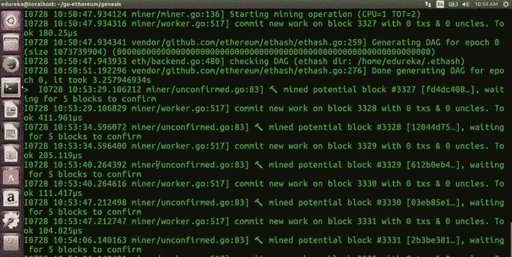

**miner.stop():** 停止挖掘过程。

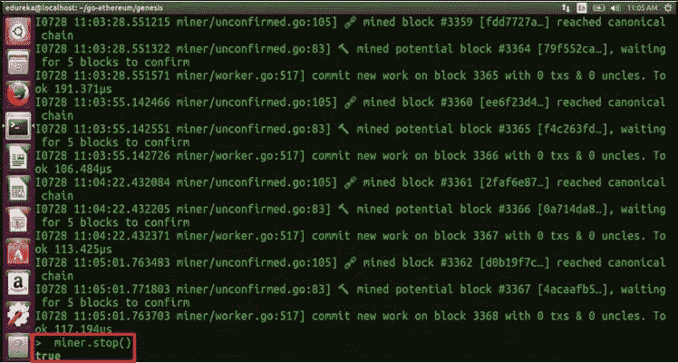

**eth.blockNumber():** 在挖掘过程之后执行这个命令，告诉你在执行挖掘操作之后，你在哪个块号。
**eth.getBalance:** (“账号”):该命令用于查看指定账户中的乙醚余额。

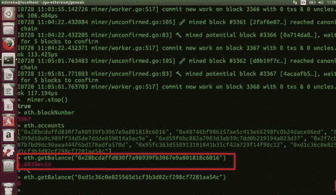

**退出:**退出 geth 控制台。

这样，我们成功地开采了乙醚，并完成了我们的银行演示。如果你想查看更多关于人工智能、DevOps、道德黑客等市场最热门技术的文章，那么你可以参考 [Edureka 的官方网站。](https://www.edureka.co/blog/?utm_source=medium&utm_medium=content-link&utm_campaign=blockchain-tutorial)

请留意本系列中的其他文章，它们将解释区块链的其他各个方面。

> 1.[以太坊教程](/edureka/ethereum-tutorial-with-smart-contracts-db7f80175646)
> 
> 2.[以太坊专用网络](/edureka/ethereum-private-network-tutorial-22ef4119e4c3)
> 
> 3.[什么是智能合约？](/edureka/smart-contracts-301d39565b76)
> 
> 4.[坚固性教程](/edureka/solidity-tutorial-ca49906bdd47)
> 
> 5.[松露以太坊教程](/edureka/developing-ethereum-dapps-with-truffle-7533289c8b2)
> 
> 6.[最佳以太坊开发工具](/edureka/ethereum-development-tools-7175503a1ac7)
> 
> 7.[总账结构](/edureka/hyperledger-fabric-184667460-edc184667460)
> 
> 8. [Hyperledge vs 以太坊](/edureka/hyperledger-vs-ethereum-bdc868e10817)

*原载于 2017 年 9 月 6 日*[*www.edureka.co*](https://www.edureka.co/blog/blockchain-tutorial/)*。*