# Blog Pribadi dengan Github Pages dan Hugo

> 原文：<https://medium.easyread.co/blog-pribadi-dengan-github-pages-dan-hugo-b4e2cc035ca6?source=collection_archive---------2----------------------->

## Bagaimana membuat blog pribadi dengan github pages dan hugo?

Memiliki sebuah *blog* pribadi merupakan salah satu langkah yang perlu dilakukan oleh seseorang untuk memperkenalkan dirinya kepada orang lain dengan cara yang menarik. Dengan adanya *blog* , kamu dapat “ *menjual* ” diri kamu secara mudah, cepat dan ideal. Tentu saja sebuah *blog* pribadi biasanya berisi mengenai pengenalan diri kamu, kontak kamu, dan beberapa tulisan, karya atau *portofolio* yang pernah kamu buat.

*Nah* , sebagai seorang *programmer* , membuat *blog* pribadi seharusnya menjadi hal yang mudah untuk dikerjakan. Apalagi jika kamu cukup menguasai bahasa pemograman yang biasa dipakai dan kamu mampu untuk merancang tampilan dari *blog* yang akan kamu buat, maka bukanlah sebuah hal yang mustahil bagi kamu untuk segera memilikinya. Lalu bagaimana jika kamu kurang mahir untuk membuatnya tetapi kamu ingin memilikinya? Atau jika kamu malas untuk merancang tampilan dari *blog* kamu dan kamu takut hasil yang kamu kerjakan tidak bagus. Mungkin tulisan ini dapat membantu kamu.

Untuk memiliki sebuah *blog* yang sederhana tetapi menarik dari segi tampilan dan sudah memiliki fungsi yang cukup maksimal, dapat kamu mulai dengan menggunakan *Github Pages* dan *Hugo* .

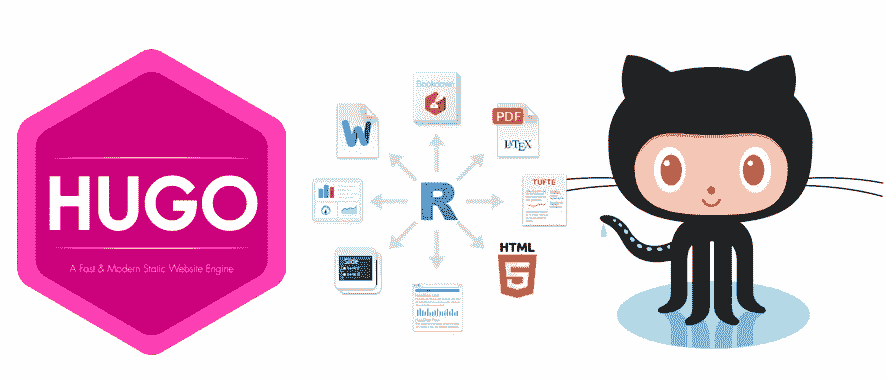

**Lalu sekarang apa itu *Github Pages* dan *Hugo* ?**

# Github Pages

> Github pages is websites for you and your projects. Hosted directly from your GitHub repository. Just edit, push, and your changes are live.

[*Github Pages*](https://pages.github.com) adalah sebuah *website* yang dapat dipakai oleh setiap pengguna *github* yang dihosting secara langsung dari repositori yang ada pada *github* . Repositori ini bisa dimiliki satu per akun, atau satu per organisasi atau bahkan untuk tidak terbatas untuk proyek. *Nah* , disini kita akan mencoba membuat sebuah *website* pribadi menggunakan akun *github* yang kita miliki. Jika kamu belum memiliki akun *github* , kamu perlu mendaftar terlebih dahulu untuk dapat menggunakannya. Selain daripada kamu dapat menggunakan *github pages* untuk *blog* pribadi kamu, memiliki akun *github* juga dapat membantu kamu *memanage* setiap proyek yang sedang kamu kerjakan. Jadi tidak ada ruginya jika kamu membuat akun di *github.*

Tahapan yang dilakukan untuk menggunakan *github pages* kamu sebagai *blog* pribadi cukup mudah. Kamu dapat mengikuti langkah-langkah berikut.

*   Buatlah sebuat repositori di *github* dan namai repositori tersebut dengan format: `**username.github.io**`
*   [*Clone*](https://help.github.com/articles/cloning-a-repository/) repositori kamu tersebut ke komputer atau laptop kamu menggunakan terminal. Tentukan di folder mana kamu akan meletakkan repositori kamu tersebut. Langkah-langkah *mengcloning* repositori, dapat kamu baca lebih lanjut [di sini](https://help.github.com/articles/cloning-a-repository/) .
*   Setelah repositori sudah ada di komputer atau laptop kamu, buatlah sebuah file dengan nama `**index.html**` , kamu boleh mengisinya dengan apa saja, misalnya *Hello world* . Simpan file tersebut.
*   Lakukan *commit changes* dan *push* perubahan tersebut ke repositori kamu yang ada di *github* . Langkah-langkah lebih lanjut mengenai *commit* dan *push* dapat kamu baca [di sini](https://help.github.com/articles/pushing-to-a-remote/) .
*   Setelah berhasil melakukan *commit* dan *push* , secara otomatis *github* *pages* kamu sudah terbentuk.
*   Jalankan di *browser* , masukkan *url* sesuai dengan nama repositori kamu tadi, maka akan menampilkan sesuai yang ada pada file index.html sebelumnya, misalnya *Hello world* .

Jika kamu masih kurang paham dengan langkah-langkah di atas, kamu juga dapat mengikuti langkah yang ada [disini](https://pages.github.com) atau mengikuti langkah yang ada pada video di bawah ini.

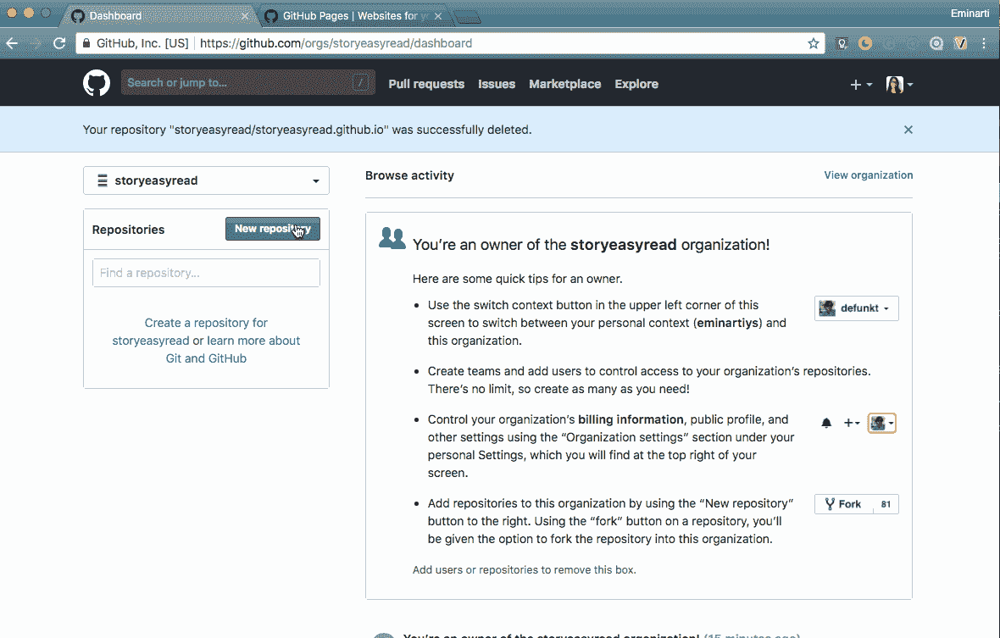

Cara membuat github pages

**Sekarang apa itu *Hugo* ?**

# Hugo

> Hugo is one of the most popular open-source static site generators. With its amazing speed and flexibility, Hugo makes building websites fun again.

[*Hugo*](https://gohugo.io) adalah sebuah *framework open-source* yang populer untuk membangun sebuah *website* . Dengan *Hugo* kamu dapat mengatur tampilan dari *blog* pribadi kamu dengan mudah. Mungkin bagi kamu yang sebelumnya sudah pernah menggunakan *Github Pages* dengan *Jekyll,* ini termasuk hal yang sama. Akan tetapi sekarang kita akan menggunakan *Hugo* sebagai *frameworknya* . *Hugo* sendiri memiliki banyak tema yang bisa kamu pilih untuk *blog* kamu. Jenis-jenis tema yang ada dapat kamu lihat pada [halaman ini](https://themes.gohugo.io) .

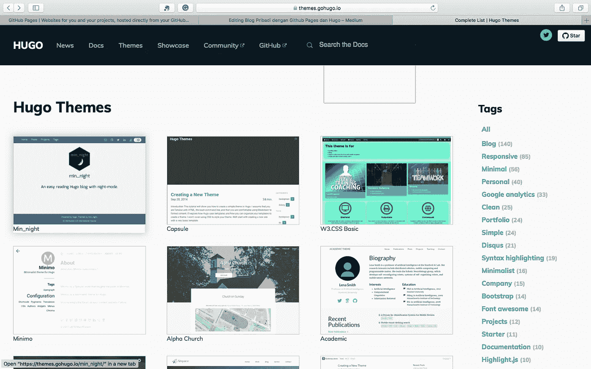

Hugo themes

Langkah pertama yang diperlukan untuk memakai *Hugo* sebagai *framework blog* kamu ialah kamu harus *menginstall* terlebih dahulu *hugo* di komputer atau laptop kamu. Kamu dapat mengikuti petunjuk yang ada pada [dokumentasi](https://gohugo.io/getting-started/installing) dan sesuaikan dengan OS yang komputer atau laptop kamu pakai.

Langkah-langkah berikut jika kamu *menginstallnya* pada [*macOS*](https://gohugo.io/getting-started/installing/#install-hugo-with-brew) .

*   Untuk proses yang lebih *instant* , kamu dapat menggunakan *brew* . Pada terminal kamu, jalankan *command* `**brew install hugo**` dan jika sudah selesai, untuk memastikan bahwa *hugo* sudah *terinstall* , jalankan kembali *command* `**hugo version**` di terminalmu.

Sedangkan langkah-langkah berikut jika kamu *menginstallnya* pada [*windows*](https://gohugo.io/getting-started/installing/#chocolatey-windows)

*   Pada *windows* kamu dapat menggunakan *chocolatey* . Jalankan *command* `**choco install hugo -confirm**` .
*   Selanjutnya untuk mulai membuat *blog* pribadi kamu dengan *framework hugo,* buatlah sebuah situs dengan menjalankan kembali *command* `**hugo new site <nama_project>**` **.** Maka secara otomatis proyek *hugo* kamu sudah terbentuk.

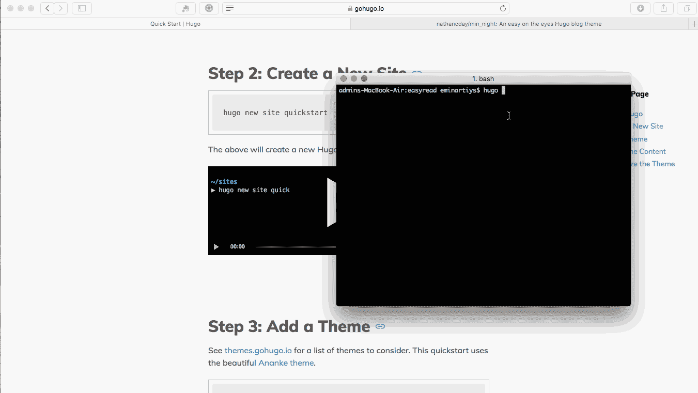

Creating a new site use hugo

Langkah setelah itu, kamu dapat mengikuti dokumentasi dari tema yang sudah kamu pilih sebelumnya. Biasanya sebuah tema memiliki contoh yang dapat kamu ikuti dengan mudah sebagai acuan mengerjakan *blog* kamu. Misalnya tema yang dipilih adalah *min_night.* Pada dokumentasi tema ini kamu dapat melihat contoh yang tersedia pada folder `**exampleSite**` . Kamu dapat mengikuti konfigurasi yang ada pada folder tersebut, karena tentu saja konfigurasi tersebut merupakan konfigurasi yang paling optimal untuk tema tersebut.

Sebagai informasi, untuk konfigurasi defaultnya sendiri, *hugo* menggunakan `**config.toml**` **,** `**config.yaml**` , **atau** `**config.json**` yang dapat ditemukan pada *root* folder. Seperti yang terdapat pada folder `exampleSite` , kamu menemukan sebuah file konfigurasi `config.toml` . Konfigurasi inilah yang dapat kamu pakai pada *website* yang sudah *tergenerate* sebelumnya. Kamu dapat memakainya dan mengubahnya sesuai dengan kebutuhan kamu.

Misalnya sementara ini kamu akan mengikuti keseluruhan konfigurasi file `config.toml` yang ada pada `exampleSite` . Langkah berikutnya untuk menjalankan *website* kamu adalah sebagai berikut.

*   Jalankan *command* `**hugo server -D**` pada terminal kamu.
*   Buka *browser* kamu, masukkan *url* yang disebutkan di terminal kamu tersebut.

*Command* ini akan menjalankan *blog* kamu di *local* . Jika tidak ada kegagalan, sekarang kamu sudah memiliki sebuah *website* yang sesuai dengan tema yang kamu pilih. Contohnya seperti gambar di bawah ini.

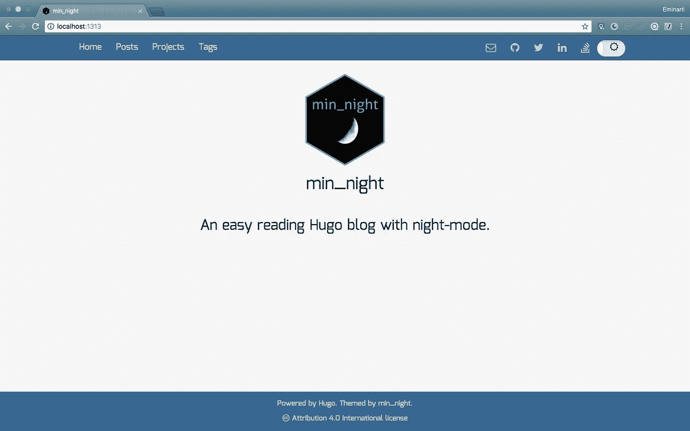

Our site using hugo.

***Sekarang bagaimana kamu mengedit dan mengubahnya agar sesuai dengan halaman yang kamu inginkan?***

# Konfigurasi Hugo dan Kostumisasi Tema

Pertama yang perlu kamu perhatikan ialah file `config.toml` , `config.yaml` , atau `config.json` yang ada pada proyek kamu, yang sebelumnya sudah kamu sesuaikan dengan konfigurasi yang sudah ada. File ini merupakan bagian yang berperan penting dalam proses pembuatan *website* kamu dengan *Hugo* . File ini berisi konfigurasi *website* kamu, oleh karena itu yang perlu kamu atur sesuai keinginan kamu pastinya adalah file ini terlebih dahulu.

Misalnya seperti yang terdapat pada file `[config.toml](https://github.com/nathancday/min_night/blob/master/exampleSite/config.toml)` yang ada pada tema yang di pilih, kamu ingin mengubah menu yang ditampilkan.

```
# adjust these as you see fit
[[menu.main]]
    url = "/"
    name = "Home"
    weight = 1[[menu.main]]
    url = "/post/"
    name = "Posts"
    weight = 2[[menu.main]]
    url = "/project/"
    name = "Projects"
    weight = 3

[[menu.main]]
    url = "/tags/"
    name = "Tags"
    weight = 4
```

Kamu dapat menghapus salah satu menu atau mengatur ulang susunannya. Misalnya menjadi.

```
# adjust these as you see fit
[[menu.main]]
    url = "/"
    name = "Home"
    weight = 1[[menu.main]]
    url = "/post/"
    name = "Posts"
    weight = 2

[[menu.main]]
    url = "/tags/"
    name = "Tags"
    weight = 3
```

Maka tampilan dari menu akan menjadi seperti ini dibawah ini.

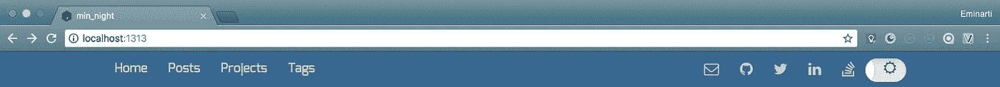

Before remove project menu

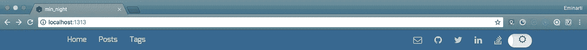

After remove project menu

Selanjutnya, misalnya kamu akan mengubah konfigurasi lain yang ada pada `config.toml` ini

```
[params]
    author = "Nate Day"
    description = "An easy reading Hugo blog with night-mode."
    logo = "favicon/android-chrome-192x192.png"
    twitterAuthor = "[@natedayta](http://twitter.com/natedayta)"
    githubUsername = "nathancday"
```

menjadi

```
[params]
    author = "Easyread"
    description = "Easy read, easy understanding. A good writing is a writing that can be understood in easy ways."
    logo = "favicon/android-chrome-192x192.png"
    twitterAuthor = "[@easyread_story](http://twitter.com/easyread_story)"
    githubUsername = "storyeasyread"
```

Maka *website* kamu akan berubah menjadi

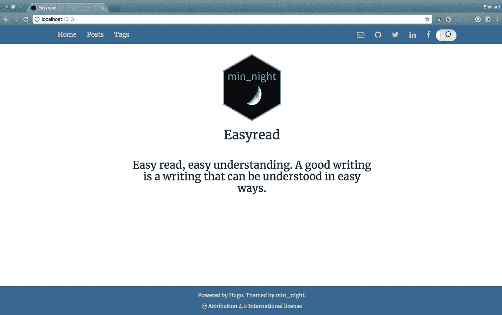

Oleh karena mengubah file `config.toml` sangat berpengaruh pada *website* kamu nantinya, makadari itu kamu perlu memperhatikan variabel apa saja yang dapat diganti untuk menyesuaikan dengan *website* yang kamu inginkan.

***Lalu bagaimana jika kamu ingin menambahkan page lain pada website kamu?***

## Kostumisasi Tema

Konsep yang diusung oleh *Hugo* untuk menggunakan tema sesuai dengan yang kamu inginkan ialah *mengoverride* *layout* dan aset-aset yang ada pada direktori level teratas proyek kamu. Kamu dapat *mengoverride* *template* , tema atau *static file* tersebut, lalu *Hugo* akan terlebih dahulu menggunakan *file* yang telah *dioverride* dibandingkan memakai *file* yang sudah ada pada tema.

Jika kamu *mengclone* tema yang akan kamu pakai melalui repositori di git, jangan mengubah tema secara langsung, melainkan lakukan perubahan pada tema dengan konsep *override* yang sudah dijelaskan diatas.

**Contoh.** Sebelumnya kamu sudah mengubah gambar yang akan dimunculkan pada `config.toml` sesuai dengan gambar yang akan kamu pakai, akan tetapi gambar tidak berubah dan malah menampilkan pesan *error* seperti gambar dibawah ini.

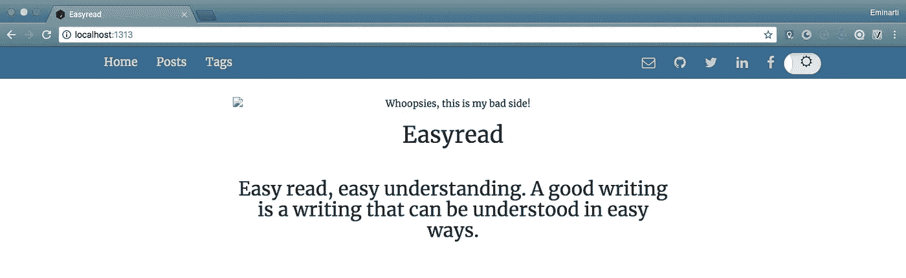

Langkah-langkah berikut dapat kamu coba misalnya kamu ingin *mengoverride* *template* *html* untuk keperluan gambar seperti di atas atau lain sebagainya.

*   Lakukan proses *override* pada file *html* yang ingin kamu ubah. Contohnya halaman `index.html` . Kamu perlu *mengoverride* file ini untuk memunculkan gambar sesuai dengan variabel yang kamu berikan.
*   Letakkan file sesuai dengan letak di mana dia berada. Jika dia terdapat dalam folder, maka terlebih dahulu buatlah foldernya untuk meletakkan file yang kita *override* tersebut.

Misalnya, jika kamu ingin *mengoverride* file `index.html` yang ada di folder `layouts` di direktori `themes` kamu, maka kamu harus terlebih dahulu membuat folder `layouts` pada direktori `root` kamu, lalu letakkan file `index.html` yang baru di folder tersebut.

Atau misalnya kamu ingin *mengoverride* file `footer.html` yang berada pada folder `partials` yang ada di folder `layouts` maka kamu juga harus membuat folder `partials` terlebih dahulu di folder `layouts` direktori `root` kamu. Dapat kamu lihat seperti gambar di bawah ini.

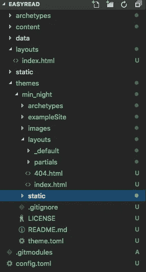

Jika sudah melakukan langkah-langkah di atas, kamu sudah dapat mengubah isi file sesuai dengan yang kamu inginkan. Seperti kasus diatas, kamu ingin mengubah gambar yang ditampilkan. Kamu dapat mengubahnya seperti ini.

Override index.html

Maka halaman yang tampil sekarang berubah menjadi seperti ini.

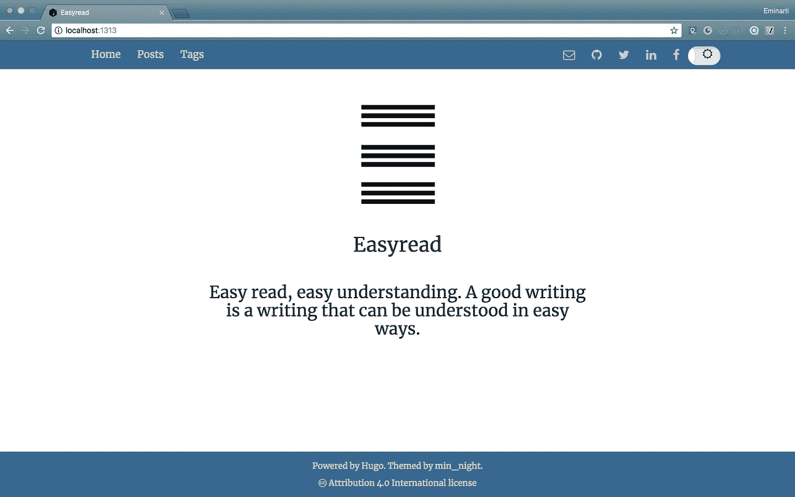

Cara serupa juga diterapkan jika kamu ingin *mengoverride* file lainnya. Buat file yang serupa letak dan namanya dan ubah sesuai dengan kebutuhan kamu kembali.

***Lalu sekarang bagaimana jika kamu ingin menambahkan konten pada website kamu.***

## Menambahkan Post

Untuk menambahkan konten pada *website* kamu, kamu dapat meniru `exampleSite` yang dimiliki oleh tema yang kamu pilih tadi. Disini, setiap postingan yang muncul akan diambil dari direktori `**content**` . Seperti pada contoh tema yang dipilih sebelumnya, yaitu *min_night* . Pada direktori `content` di tema ini, terdiri dari 2 folder, yaitu `post` dan `project` . Folder `post` untuk tulisan-tulisan kamu dan folder `project` untuk proyek-proyek atau portofolio yang kamu kerjakan.

Disini kamu ingin menampilkan tulisan-tulisan kamu. Maka kamu dapat mencoba untuk mengikuti folder `post` yang ada pada `exampleSite` .

*   Sama seperti konsep *override* sebelumnya, lakukan *override* pada folder `post` tersebut.
*   Buat file baru di direktori tersebut dengan menjalankan *command* `**hugo new post/<name>.md**` pada terminal, maka file secara otomatis akan tersedia pada folder `post` .

*Nah* , hal lain yang perlu kamu pahami disini ialah file-file yang akan kamu tampilkan pada *blog* kamu memakai format *markdown* . Makadari itu, file yang terbentuk di direktori `post` kamu juga memiliki format `.md` . Untuk mengisinya tentu saja kamu mengikuti format *markdown* , seperti penggunaan *heading, text format, numbering* , dan lain sebagainya.

Lagi-lagi kamu dapat mengikuti contoh dari file yang ada di `exampleSite.` Sekarang jika kamu sudah menambahkannya dengan mengikuti contoh, jalankan kembali *blog* kamu di *browser* , lalu periksa apakah *post* yang kamu buat sudah ada pada *blog* kamu.

Contohnya seperti di bawah ini.

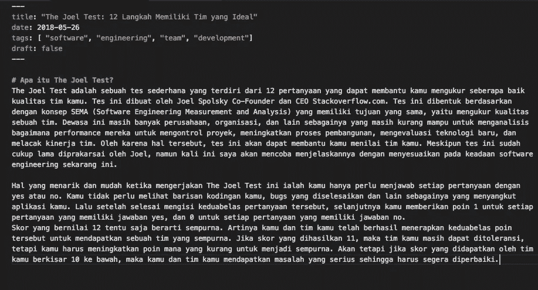

Contoh post.md

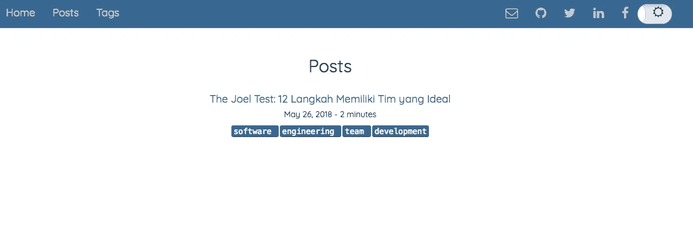

Tampilan dari daftar post

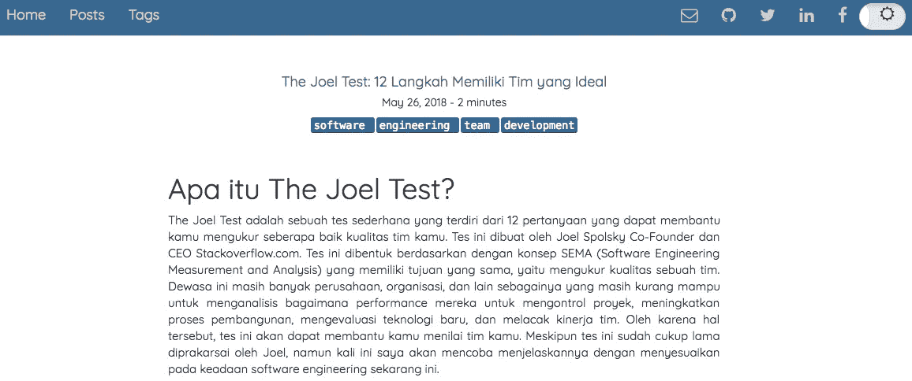

Contoh salah satu post

Jika kamu sudah berhasil membuatnya, kamu hanya perlu mengulangi langkah yang sama untuk setiap post yang akan kamu tambahkan. Begitu pula jika kamu ingin *mengoverride* file css dan lain sebagainya, pastikan kamu meletakkannya sesuai dengan folder yang ada di tema lalu ubah sesuai yang kamu butuhkan. *Tidak sulit bukan* ?

## **Deploy ke Github Page**

*Nah* , setelah kamu selesai membuat *blog* kamu dan kamu sudah yakin ingin *mempublishnya* , sekarang adalah saat bagi kamu untuk *mendeploy* *blog* kamu. Lalu bagaimana cara *mendeploy* *blog* yang kamu buat tadi?

Caranya sangat sederhana. Kamu dapat mengikuti langkah-langkah yang ada di bawah ini.

*   Pada terminal kamu, jalankan *command* `**hugo**` . *Command* ini secara otomatis akan menghasilkan sebuah folder *public* yang berisi file-file yang diperlukan oleh *website* kamu.
*   Selanjutnya kamu pindah direktori ke folder *public* tersebut dengan menjalankan *command* `**cd public**`
*   Setelah kamu berada di folder *public* , lakukan *commit* pada pekerjaan kamu dan *push* pekerjaan kamu ke repositori kamu yang ada di github.
*   Lalu coba jalankan di *browser* kamu sesuai dengan nama repositori kamu, misalnya `**storyeasyread.github.io**` . Maka secara langsung *blog* impian kamu sudah jadi dan tayang.

Jika nanti kamu ingin menambahkan *post* lain, ulangi dengan cara yang sama, dan jalankan kembali langkah-langkah *mendeploy* ini untuk memperbaharui *blog* kamu.

Bagaimana? Tidak sulit bukan? Kamu dapat memiliki *blog* impian kamu dengan mudah dan cepat. Untuk eksplorasi yang lebih lanjut, kamu dapat mengutak-atik tema yang kamu pilih. Tentu saja kamu tetap harus memperhatikan setiap file yang ingin kamu ubah.

*Nah* , sekarang apakah kamu tertarik membuat *blog* pribadi kamu? Ayo silahkan dicoba 💪