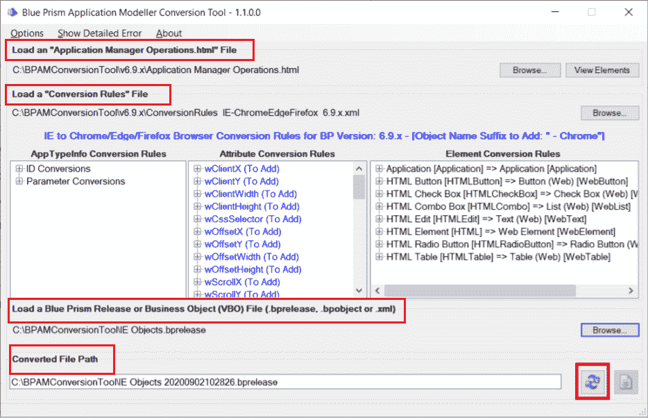
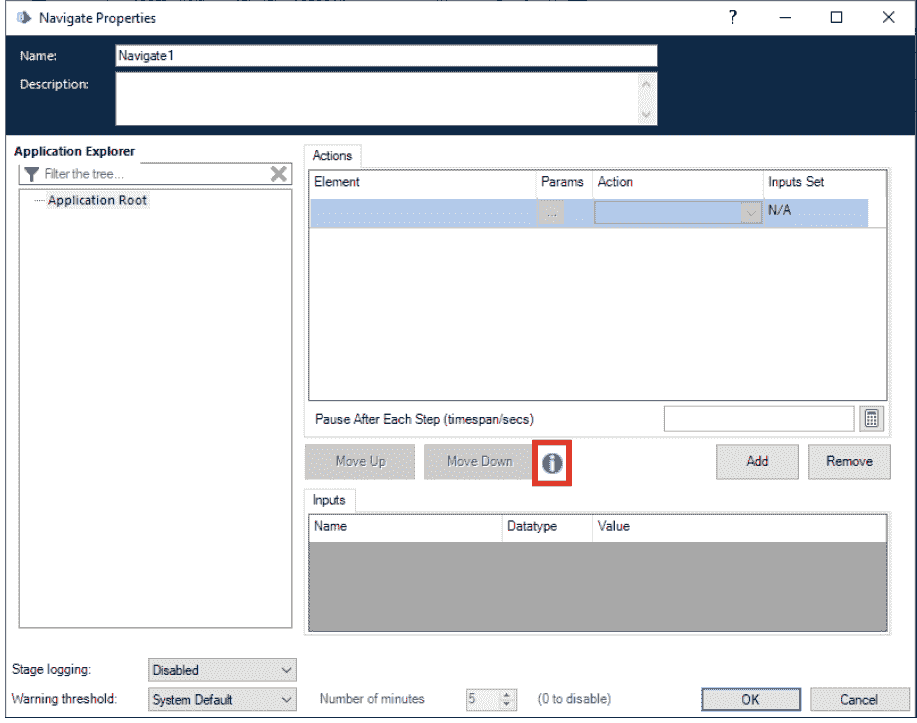

# 蓝棱镜:担心 MS Edge 迁移？看看这个。！！

> 原文：<https://medium.com/globant/blue-prism-worried-about-ms-edge-migration-check-this-out-d529a2dfaf1f?source=collection_archive---------1----------------------->

嘿 RPA 的人！！！

您一定听说过 Internet Explorer 11 的退役，它将在 2022 年 6 月左右停止支持。我们中的许多人都面临着将现有流程从 IE 迁移到 MS Edge 的新请求。因此，下面是它的快速解决方案，即**“蓝棱镜应用建模器转换工具”**

为了加快迁移速度，我们现在可以利用 Blue Prism 通过数字交换正式提供的“Blue Prism Application Modeller 转换工具”。

Blue Prism 应用程序建模器转换工具是一个应用程序建模器转换器，允许根据转换规则快速转换应用程序建模器元素和属性。只需点击几下鼠标，就可以快速生成转换后的 BP 版本，并查看变更。

**你需要上传的全部:**

*   应用程序管理器 Operations.html 文件
*   转换规则文件
*   蓝棱镜版本或目标文件。

在这里，你现在提供了一个转换的蓝色棱镜版本，您可以导入和审查转换。

现在，您一定想知道什么是“Application Manager operations . htm”文件以及如何创建它。这很简单，遵循以下步骤:

*   打开蓝棱镜互动客户端，导航至工作室。
*   打开现有对象或创建一个对象。
*   添加或打开现有的“导航”阶段。

*   点击高亮图标。这将打开默认浏览器。
*   如果默认浏览器不是 chrome，打开 Chrome，同时保持另一个浏览器打开。
*   将 URL 从默认浏览器复制到 chrome 浏览器。
*   关闭默认浏览器。
*   在 Chrome 上，现在按 Ctrl+S(另存为)并将文件保存在所需的位置。

**请注意:**保持名称不变，即应用经理 Operations.html，选择“网页，仅 HTML。html*htm)"选项。

正如您所注意到的，现在您不需要手动重新探测所有元素。蓝棱镜在这里帮助您节省时间和精力。

**好处:**

其中一个明显的好处是节省时间，并且在同一个规则文件下转换的所有对象保持一致。

**限制:**

请试着找出答案:-)

**参考:**

[https://digital exchange . blue prism . com/dx/entry/3439/solution/application-modeller-conversion-tool](https://digitalexchange.blueprism.com/dx/entry/3439/solution/application-modeller-conversion-tool)