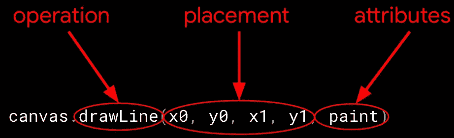
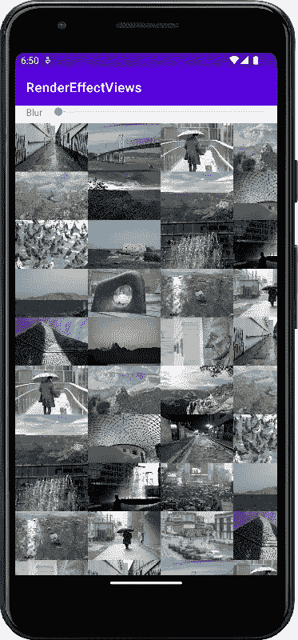

# 模糊界限

> 原文：<https://medium.com/androiddevelopers/blurring-the-lines-4fd33821b83c?source=collection_archive---------4----------------------->

## Android 渲染效果#1:模糊效果

这篇文章(以及下一篇文章)基本上是我和 [Sumir Kataria](https://twitter.com/SumirKodes) 为今年的 Android 开发者峰会录制的视频的书面版本:

Here’s the video version of this article (and more!)

当我开始学习如何使用模糊效果时，我并不清楚如何将它融入到整体应用程序中，所以我认为这可能有助于澄清它的用途，它在 Android 整体渲染工具箱中的位置，以及如何实际创建和使用模糊效果。

# 首先，关于在 Android 上绘图的一句话

在最基本的层面上，Android 上的视觉元素(如按钮、文本和其他 UI 或自定义元素)通常是通过调用`Canvas`API 来绘制的，如`drawLine()`、`drawText()`、`drawBitmap()`等等。除非您在自定义视图中绘制对象，否则您的代码可能不会直接调用这些方法，但是当绘制应用程序中的 UI 组件时，会以您的名义调用这些方法。

这些绘图命令中的大多数向渲染系统提供三条信息。你可以把这些想象成*什么*、*哪里*以及*如何*进行绘图的信息，其中*什么*是操作本身(要绘制的“图元”)、*哪里*是对象的放置(位置和大小)、以及*如何*是绘图属性的集合。我们今天关注的正是这些属性，因为这就是模糊的由来。



Each drawing primitive tells the render what, where, and how to draw the object

绘图属性是由一个`Paint`对象提供的，这个对象的默认属性可以被调用者(你的应用程序或者代表你的 UI 系统)修改。大多数的`Paint`API 都相对简单明了，比如`setColor()`表示图元应该被绘制的颜色，`setStyle()`表示对象应该被填充还是“描边”(表示对象的轮廓)，再加上大量的文本属性，我在这里就不赘述了。

还有更强大和复杂的属性可以分配给一个`Paint`对象。其中包括用于改变图元颜色的`[ColorFilter](https://developer.android.com/reference/android/graphics/ColorFilter)`子类(比如我个人最喜欢的`[ColorMatrixColorFilter](https://developer.android.com/reference/android/graphics/ColorMatrixColorFilter)`，它应该获得 longestandmostreativeclassrepetivenamever 奖)，以及*着色器*。着色器包括各种渐变对象和位图，并提供绘制操作从中采样的源颜色，以提供所绘制的几何图形的结果颜色。例如，使用着色器可以使用线性或圆形渐变来填充矩形，或者使用位图中的值来填充或描边该矩形。(预告:Android 13 中有一个新的“着色器”API，允许你超越这些效果；请继续关注本系列的下一篇文章。

# 然后是渲染效果

当您想要影响单独的绘图操作(比如在自定义视图中绘制一条线)时，上面所有的 API 都允许您为单独的`draw*()`调用设置属性。但是如果您想在一个`View`中使用所有绘图操作的属性呢？例如，如果您想要给一个按钮着色(它由几个独立的内部绘制操作组成)，或者在一个`View`上应用一个着色器，该怎么办？

这就是`[RenderEffect](https://developer.android.com/reference/android/graphics/RenderEffect)`的用武之地。`RenderEffect`将一个或多个着色器捆绑在一起，并将它们应用到一个整体`View`——或一个[render node](https://developer.android.com/reference/android/graphics/RenderNode)(`Views`的底层渲染机制)——通过让渲染器将那些效果应用到整个`View`来简化事情。你可以使用单个`RenderEffect`或者将几个链接在一起来应用多种效果。

当在 API level 31 中引入`RenderEffect`时，它提供了将现有的属性效果(如`ColorFilter`、`Bitmap`和`[Shader](https://developer.android.com/reference/android/graphics/Shader)`)收集到效果中，以及将它们链接起来的方法，工厂方法如下:

```
static RenderEffect createBitmapEffect(Bitmap bitmap)
static RenderEffect createColorFilterEffect(ColorFilter colorFilter)
static RenderEffect createShaderEffect(Shader shader)
static RenderEffect createChainEffect(RenderEffect outer,
                                      RenderEffect inner)
```

但是`RenderEffect`也引入了一种全新的绘制效果:*模糊*。

# 视力模糊

除了封装现有`Paint`属性的对象之外，`RenderEffect`还引入了一种新的效果，可以轻松模糊`View`或`RenderNode`内容:

```
static RenderEffect createBlurEffect(float radiusX, float radiusY,
                                     Shader.TileMode edgeTreatment)
static RenderEffect createBlurEffect(float radiusX, float radiusY,
                                     RenderEffect inputEffect,
                                     Shader.TileMode edgeTreatment)
```

使用这些方法，您现在可以轻松地在一个`View`(或者，使用上面的第二个重载，另一个`RenderEffect`)上创建一个模糊效果，以便在渲染时模糊整个内容。可以把它想象成通过一个过滤器发送视图的原始内容，这个过滤器在发送的过程中模糊了视图的内容。这就是正在发生的事情，尽管它实现这一点的实际方式是通过渲染屏幕外的内容，应用模糊，然后将模糊的结果复制到原始目标。

`radius`参数决定了模糊有多大(源输入中每个像素之外的像素在每个方向上有多少)，而`TileMode`决定了模糊边缘会发生什么。这最后一个参数是必需的，因为模糊在被计算的像素之外的像素上操作，所以它需要知道当那些其他像素位于输入内容之外时该做什么。

创建模糊后，您可以通过调用以下命令将其设置在`View`上:

```
View.setRenderEffect(renderEffect RenderEffect)
```

您可以类似地将其设置在`[RenderNode](https://developer.android.com/reference/android/graphics/RenderNode)`上:

```
RenderNode.setRenderEffect(renderEffect RenderEffect)
```

…就是这样！一旦您设置了`RenderEffect`，在该对象中发生的任何绘图都将使用您在其上设置的效果。如果你想改变效果的属性(如模糊半径)，你重新创建并再次设置它，如上所述。

# 例子

我写了一个简单的应用程序来看看如何在 UI 中使用模糊。具体来说，我想演示如何使用模糊来帮助从背景中“弹出”前景内容，就像相机对焦有助于将图片主体从背景中分离出来一样。

首先，我在背景上做了模糊处理。在这种情况下，背景是照片库；包含一组图片缩略图的布局。



A layout containing picture thumbnails. Clicking on a picture shows an enlarged view of it.

点击其中一张图片可以放大它，并显示该图片的标题。如果我们可以模糊背景，这样当我们试图专注于前景图片及其标题时，其余的图片就不会产生太多的视觉噪音，这不是很好吗？

我在应用程序中添加了一个`SeekBar`，允许动态改变模糊度。这不是我在一个完成的应用程序中需要的东西(只是选择一个模糊的工作，并坚持下去；用户不会想要修改这种东西，所以保持用户界面简单)。但我最初想用它来玩不同的模糊，并展示如何用不同的参数重新创建它们。`seekBar`传入一个从 0 到 50 的值(`SeekBar` UI 组件上的最小/最大值)。

```
**seekBar**.setOnSeekBarChangeListener(**object** : SeekBar.OnSeekBarChangeListener{
    **override fun** onProgressChanged(seekBar: SeekBar, progress: Int,
                                   fromUser: Boolean) {
        updateEffect(progress.toFloat())
    }
    // start/stop overrides stubbed out...
})
```

`updateEffect()`使用`progress`值作为模糊半径(我对 x 和 y 使用相同的值)。 ***重要提示*** :一个`0`的值用来表示应该去除模糊，这是通过设置`RenderEffect`到`null`来实现的。原来要求 0 半径模糊(数学上等同于不模糊)会，呃，崩溃。`0`显然不是系统要求模糊效果时期望的值。这是很少记录的(我们正在修复…)，所以我想你可能想知道，如果你在家里尝试这个的话。我知道我想知道当我的初始代码试图处理那个值时发生了什么。

```
**fun** updateEffect(progress: Float) {
    **if** (progress > 0) {
        **val** blur = RenderEffect.createBlurEffect(
            progress, progress, Shader.TileMode.*CLAMP*)
        **pictureGrid**.setRenderEffect(blur)
    } **else** {
        **pictureGrid**.setRenderEffect(**null**)
    }
}
```

`updateEffect()`创建 RenderEffect(或使其无效以移除它)，用`progress`的值作为半径，然后在图片布局上设置它，`voilà`，我们有模糊:


Picture gallery with blur RenderEffect applied to the container

现在我们有了模糊的工作，是时候在放大的图片上工作了。这种效果是通过 Android 13 中新的 AGSL `RuntimeShader`功能处理的，在本系列的第 2 部分中有所描述: [AGSL:在阴影中制造(r)](https://chethaase.medium.com/agsl-made-in-the-shade-r-7d06d14fe02a) 。