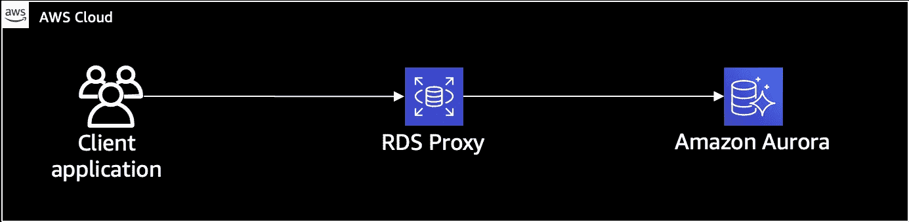
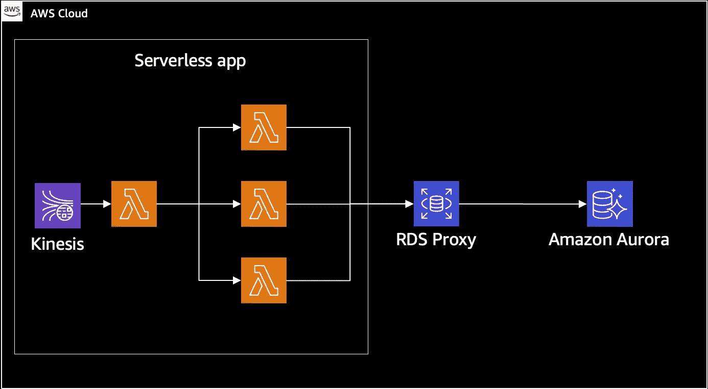
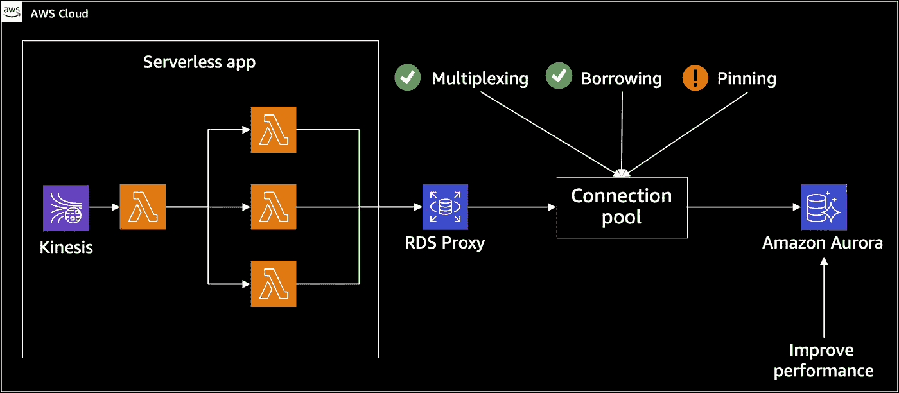
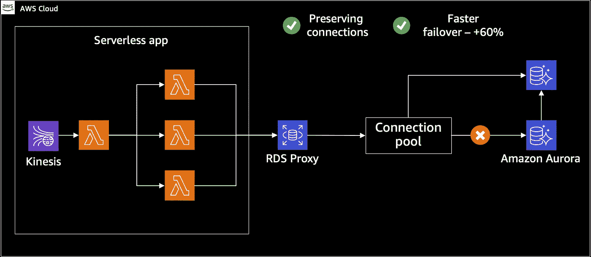
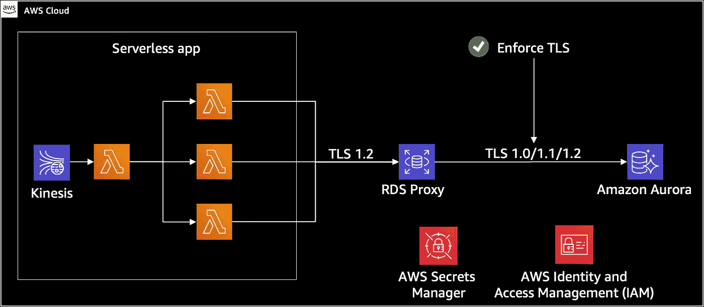

# 借助 Amazon RDS 代理和 Amazon Aurora 提升无服务器应用性能

> 原文：<https://medium.com/globant/boost-serverless-app-performance-with-amazon-rds-proxy-and-amazon-aurora-e466695884f1?source=collection_archive---------0----------------------->

RDS 代理服务推出后，我和费利佩·梅希亚一起开始测试这项服务，看看它如何应用在无服务器架构中。我们首先测试了几个在 Aurora MySQL 数据库上执行并发写任务的 lambdas 函数，以及 RDS 代理如何在这些类型的场景中帮助我们。经过几次测试和衡量，我想分享一下我所学到的东西。

RDS 代理是一种完全受管的 AWS 服务，充当应用层和数据库层之间的代理层，负责:

*   池和共享数据库连接
*   提高应用可用性。
*   提高数据安全性。

然而，当我们开始使用无服务器架构和关系数据库(Aurora MySQL)时，我们遇到了一些有趣的挑战:

*   **数据库性能和连接管理:**通过拥有同步连接，我们的数据库必须使用其计算资源来管理这些连接，并在出现流量高峰时支持它们的升级。
*   **故障转移时间:**当无服务器架构中有关键应用时，可用性将始终是优先考虑的问题，因此，我们必须在服务和可用性之间寻求有效的成本关系。
*   **安全性:**如何通过多个 lambda 函数处理数据库的连接字符串、用户名和密码？

## 带 RDS 代理的典型无服务器架构

# 连接管理

*   **多路复用:**在您的会话中完成一个事务后，代理可以重用每个连接。这种事务级重用被称为多路复用。
*   **借用:**当 RDS 代理从池中删除一个连接以重用它时，就会发生这种情况。一旦完成，他把它放回游泳池。
*   **固定:**在某些情况下，RDS 代理不确定是否可以在会话之外重用连接，在这些情况下，会话将保持在同一连接上，直到会话结束。

# 故障转移时间

当主实例出现更新问题或连接问题时，可能会发生故障转移。在故障转移期间，RDS 代理继续接受来自同一个源的连接，并自动将它们定向到将充当主实例的新实例。

在这些故障切换期间，客户端不会受到以下影响:

*   故障转移时域名系统(DNS)传播延迟。
*   本地 DNS 缓存。
*   连接超时。
*   不确定哪个数据库实例是当前的编写器。
*   在不关闭连接的情况下，等待来自变得不可用的前编写器的查询响应。

# 安全性

RDS 代理支持 TLS 协议版本 1.0、1.1 和 1.2。您可以使用比您在底层数据库中使用的 TLS 版本更高的 TLS 版本来连接到代理。

对于连接到数据库的 lambda 函数，一切都必须通过 Secrets Manager 服务来完成，其中有一个在代理中配置的秘密。在 lambda 级别，我们将其指向 RDS 代理。

# 执行的测试

**基础设施部署:**整个基础设施是用 CDK + TS 部署的，像这样部署整个基础设施是一个有趣的挑战，然而，与 CDK + Python 相比，TS 的文档并不完整。

**数据库配置**

**极光主数据库实例**

**Aurora 备用数据库实例**

## λ函数

它是在 Python 3.7 中开发的，它实际上是一个脚本，通过两个周期在数据库中执行循环写入任务，并依次显示它何时在数据库中写入每个记录:

现在，在所描述的场景中，所有 lambda 函数都在数据库上执行写任务，故障转移在两个场景中执行，在每个场景中总共运行了 15 个测试:

*   **没有 RDS 代理的故障转移:**在这个场景中，我们在故障转移时有 10-12 秒的数据库不可用。
*   **使用 RDS 代理的故障转移:**在这个场景中，只有 30%的测试不可用 1 秒，其余 70%没有不可用。

在我们的场景中进行测试后，我们证明随着时间的推移，故障转移性能提高了 ***90%。***

# 吸取的教训

*   每当 AWS 发布一个新的服务，我建议等待 3-6 个月在生产环境中使用它。由于文档通常不完整，AWS 支持人员不太了解服务，您可能很难尝试做复杂的事情。
*   如果您要实现 RDS 代理，请考虑成本以及它们对项目的影响。
*   对于生产环境，我明确建议使用代理来提高安全性、连接和故障转移。
*   在执行的测试中，故障转移时间减少了 90%,在某些情况下，没有出现不可用的情况。

— [卡洛斯·桑布拉诺](https://www.linkedin.com/in/carlos-zambrano-aws/)