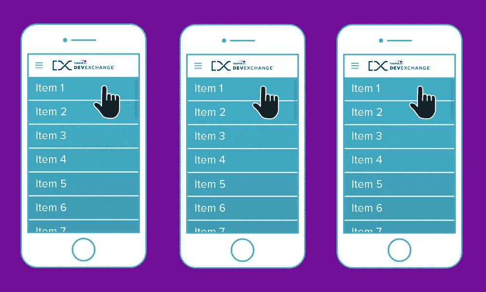
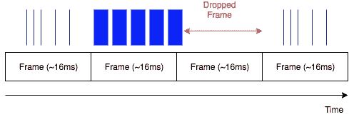
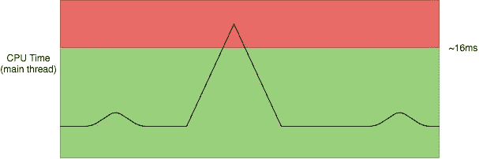
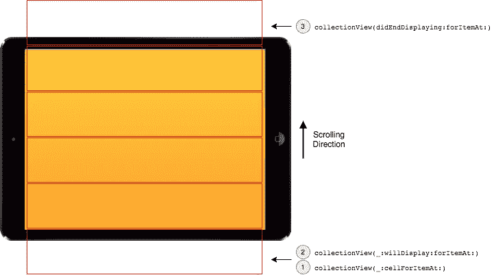
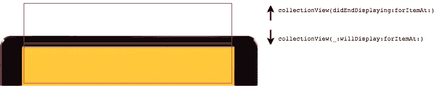
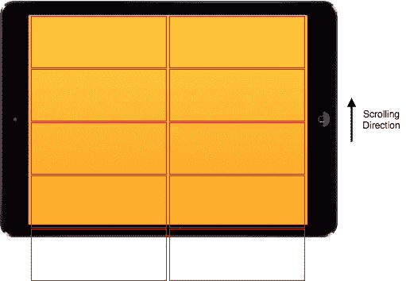
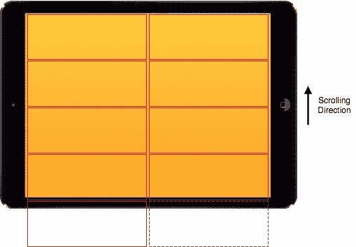

# 使用 iOS 10 预取 API 提升平滑滚动

> 原文：<https://medium.com/capital-one-tech/boost-smooth-scrolling-with-ios-10-pre-fetching-api-818c25cd9c5d?source=collection_archive---------0----------------------->

在[之前的帖子](/capital-one-developers/smooth-scrolling-in-uitableview-and-uicollectionview-a012045d77f)中，我们探索了一些常见的策略来实现我们的 iOS 移动应用程序的平滑滚动。应用这些策略的主要目的是避免*起伏的滚动*，这是一个对用户体验产生负面影响的常见问题。为了帮助开发者完成这样的任务，苹果在 iOS10 中对 **UICollectionView** 做了一些非常有用的改动。但是在回顾这个新引入的功能之前，让我们先来看看是什么促使了对它们的需求。

# 什么原因导致滚动不稳定？

你曾经使用过滚动不稳定的应用程序吗？如果答案是“是”，那么你就知道当你试图快速滚动时，应用程序内容出现口吃是多么令人失望。您可能会问自己，是什么触发了这种起伏不定的滚动行为以及随之而来的糟糕用户体验。

**简短的回答是:应用程序被*丢帧*。但是这到底是什么意思呢？**

为了确保一致的平滑滚动，应用程序需要能够稳定地显示 60 FPS(每秒帧数)。或者换句话说，应用程序需要每秒钟刷新 60 次内容。这意味着每帧大约有 16 毫秒(1000 毫秒/60 帧~ 16 毫秒/帧)要渲染。在不幸的情况下，显示一帧花费的时间比分配的时间长，没有显示下一帧的数据，据说应用程序“*丢弃了一帧“*”。下图显示了这种不幸的情况。蓝色标记表示绘制操作，其粗细表示完成渲染所需的时间。正如我们所看到的，在第二帧中，我们有一些渲染事件花费了超过分配的时间(大约 16 毫秒)，因此，第三帧被丢弃了。

Dropped Frame

我们可以从刷新操作花费的 CPU 时间的角度来看这个场景。在下图中，峰值对应于应用程序刷新当前内容的时间超过预期的 16 毫秒时出现的丢帧。

Display Refreshes

为了获得良好的用户体验，刷新时间必须始终低于允许的最大值约 16ms。理想情况下，由于我们想要创建一个*出色的*用户体验(而不仅仅是一个好的体验)，每次刷新时间应该是:

*   始终远低于允许的最长时间(约 16 毫秒)。
*   尽可能低，以节省可用于其他任务的 CPU 时间。

丢帧最常见的原因是从主线程为单元加载昂贵的数据模型。这种情况的典型例子有:

*   从 URL 加载图像。
*   从数据库或 CoreData 访问项目。

在 iOS10 中，苹果对单元格的加载和显示方式进行了一些优化。让我们来看看 iOS10 的改进，以及它们如何让开发人员更容易创建平滑滚动的用户体验。

# iOS9 中的细胞生命周期

一个 **UICollectionViewCell** 的生命周期可以被可视化如下:

iOS9 cell lifecycle

集合视图及其单元格之间的主要交互是:

*   集合视图正在请求将要显示的单元格的内容— *该单元格将要进入可见字段:* `[collectionView(_:cellForItemAt:)](https://developer.apple.com/reference/uikit/uicollectionviewdatasource/1618029-collectionview)`。
*   集合视图正在请求显示单元格— *刚刚进入可见字段的单元格:* `[collectionView(_:willDisplay:forItemAt:)](https://developer.apple.com/reference/uikit/uicollectionviewdelegate/1618087-collectionview)`。
*   集合视图正在移除单元格— *单元格在可见字段* : `[collectionView(didEndDisplaying:forItemAt:)](https://developer.apple.com/reference/uikit/uicollectionviewdelegate/1618006-collectionview)`之外。

# iOS10 中的细胞生命周期

在 iOS10 中，一个单元的生命周期与 iOS9 中的基本相同。然而，还是有一些显著的区别。

第一个区别是操作系统调用`collectionView(_:cellForItemAt:)`的时间比以前早了很多。这意味着两件事:

*   加载单元的繁重工作可以在需要显示单元之前完成。
*   该单元格可能最终根本不会被显示(因为它可能永远不会被带入可视区域)。

第二个区别是当一个细胞离开可见视野时会发生什么。在 iOS10 中，`collectionView(didEndDisplaying:forItemAt:)`像往常一样被调用，但该单元不会立即被回收。操作系统将它保留一段时间，以防用户反转滚动方向；如果发生这种情况，单元格仍然可用，可以再次显示(`collectionView(_:willDisplay:forItemAt:)`将被调用)，而不必重新加载其内容。

iOS10 cell lifecycle changes

将这与 iOS9 上发生的情况进行比较。您会注意到，对于这个特定的用例，不再需要重载单元格(`collectionView(_:cellForItemAt:)`)。这种优化允许我们在用户快速滚动和改变滚动方向时更快地渲染单元格。

iOS9 和 iOS10 之间的第三个重要区别是多栏布局的收藏视图的单元格加载方式。

iOS9

iOS10

用 iOS10，每个关于进入可见场的单元格都是单独加载的(`collectionView(_:cellForItemAt:)`)。正如我们在检查单元格生命周期时看到的，这比每个单元格实际需要显示的时间要早得多。这为优化打开了大门，因为操作系统将能够处理不同的请求，将它们与单元负载交错。

当一行单元格进入可视字段时，这些单元格被显示为一个单独的批次(同时对整行调用`collectionView(_:willDisplay:forItemAt:)`),因为这个操作在 CPU 周期方面不是很昂贵(至少与加载单元格内容相比)。

这种加载多栏布局的差异是最重要的 iOS10 **UICollectionView** 优化的核心:*预取*。让我们更详细地探讨一下。

# 预取 API

在展示 iOS10 时，苹果吹捧 [**预取**](https://developer.apple.com/videos/play/wwdc2016/219/) 是一项*自适应技术*。这意味着*预取*将尝试利用用户与应用程序的交互方式来执行一些旨在提高滚动性能的优化。例如，这项新技术将寻找空闲时间(当用户缓慢滚动或根本不滚动时)来加载(*预取*)新单元。根据用户的滚动模式，可能有更多(或更少)的机会让*预取*来执行这样的优化。

在回顾可用的 API 之前，让我们看一下使用这项技术的一些最佳实践。为了充分利用*预取*，必须在`collectionView(_:cellForItemAt:)`中执行大部分设置单元内容的操作。在`collectionView(_:willDisplay:forItemAt:)`和`collectionView(didEndDisplaying:forItemAt:)`中执行的操作应该保持最小化，并且必须是非 CPU 密集型的。更好的是，如果我们可以对那些生命周期事件不执行任何操作，那就更好了！此外，请记住，即使某个单元格调用了`collectionView(_:cellForItemAt:)`，该单元格仍有可能永远不会显示。

一些非常好的消息是，对于在 iOS10 上编译的应用程序，默认情况下会启用*预取*。但是，可以通过将 **UICollectionView** 的`isPrefetchingEnabled`属性设置为`false`来关闭此功能。同样值得注意的是，*预取*与单元生命周期一起工作。这意味着我们已经编写的实现集合视图的代码不需要修改——充分利用*预取*所需的唯一动作是实现*预取 API* 。

## 预取 API 和 UICollectionView

在`[UICollectionViewDataSourcePrefetching](https://developer.apple.com/reference/uikit/uicollectionviewdatasourceprefetching)`协议中定义了 **UICollectionView** 的预取 API。API 定义了以下两种方法。

`[**collectionView(_:prefetchItemsAt:)**](https://developer.apple.com/reference/uikit/uicollectionviewdatasourceprefetching/1771767-collectionview)`(必需)—该方法允许异步加载由`[IndexPath]`参数指定的单元格所需的数据。异步加载可以通过[大调度](https://developer.apple.com/reference/dispatch)或`[OperationQueue](https://developer.apple.com/reference/foundation/operationqueue)`进行。实现这些方法时最重要的是编写代码，将数据加载的负担从主队列转移到后台队列。这样做的目的是减少主队列的工作负载，使其能够将大部分时间用于执行显示刷新等关键任务。

`[**collectionView(_:cancelPrefetchingForItemsAt:)**](https://developer.apple.com/reference/uikit/uicollectionviewdatasourceprefetching/1771769-collectionview)`(可选)—该方法告知不再需要由`[IndexPath]`参数指定的单元格的数据。实现这个方法允许我们根据需要取消挂起的数据加载，这是通过取消不必要的工作(通常是因为用户改变了滚动方向)来节省 CPU 时间的好方法。

如前所述，*预取*是一种*自适应技术*。因此，上述方法是基于用户与 app 的交互方式而触发的。这样做的一个后果是，不能为集合视图中的每个单元格调用`collectionView(_:prefetchItemsAt:)`方法。这意味着当通过`collectionView(_:cellForItemAt:)`加载单元格时，应用程序应该能够处理以下所有场景:

*   数据已被预取，并准备好显示。
*   当前正在获取数据，尚未准备好显示。
*   数据尚未被请求。

## 预取 API 和 UITableView

iOS10 还为 **UITableView** 引入了*预取*。我们为 **UICollectionView** 展示的所有主要概念都以类似的方式适用于 **UITableView** 。 **UITableView** 的*预取 API* 在`[UITableViewPrefetchingDataSource](https://developer.apple.com/reference/uikit/uitableviewdatasourceprefetching)`协议中定义。API 定义了以下两种方法。

`[**tableView(_:prefetchRowsAt:)**](https://developer.apple.com/reference/uikit/uitableviewdatasourceprefetching/1771764-tableview)`(必需)—该方法允许异步加载由`[IndexPath]`参数指定的单元格所需的数据。

`[**tableView(_:cancelPrefetchingForRowsAt:)**](https://developer.apple.com/reference/uikit/uitableviewdatasourceprefetching/1771765-tableview)`(可选)—此方法告知不再需要由`[IndexPath]`参数指定的单元格的数据。

为每个 **UICollectionView** *预取 API* 方法提出的建议同样适用于每个模拟 **UITableView** *预取 API* 方法。

# 结论

我已经为 **UITableView** 和 **UICollectionView** 更新了我的代码示例，以支持 iOS10 上的*预取*。这里可以找到[。](https://github.com/andrea-prearo/SwiftExamples/tree/master/SmoothScrolling/Client)

在这篇文章中，我们回顾了 iOS10 的改进，以提高 **UICollectionView** 和 **UITableView** 的平滑滚动。特别是，我们看到，通过实施特定的*预取 API* ，可以充分利用所有新的操作系统优化，并在与我们的移动应用程序交互时提供最佳的用户体验。

## 有关系的

*   [Swift 中的引用和值类型](/capital-one-developers/reference-and-value-types-in-swift-de792db330b2)
*   [在 UITableView 和 UICollectionView 中平滑滚动](/capital-one-developers/smooth-scrolling-in-uitableview-and-uicollectionview-a012045d77f)
*   [Swift 中的通用数据源](/capital-one-developers/generic-data-sources-in-swift-c6fbb531520e)
*   [通用协议类型擦除的替代方案](/capital-one-developers/an-alternative-to-type-erasure-for-generic-protocols-a9a48e96618a)

声明:这些观点是作者的观点。除非本帖中另有说明，否则 Capital One 不属于所提及的任何公司，也不被其认可。使用或展示的所有商标和其他知识产权均为其各自所有者所有。本文为 2017 首都一。