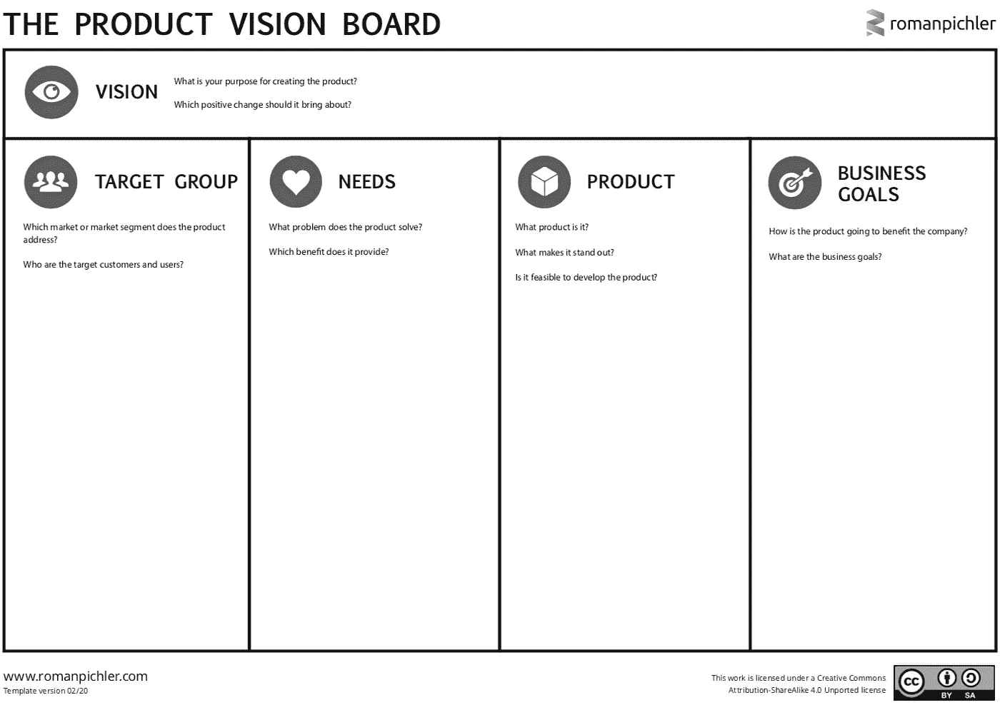

# 促进您的产品管理实践；从产品愿景开始

> 原文：<https://medium.com/globant/boost-your-product-management-practices-and-start-with-the-product-vision-b1636fd18bb7?source=collection_archive---------2----------------------->

[The Product Vision Board](https://www.romanpichler.com/tools/product-vision-board/) a tool proposed by Roman Pichler

# 我们都听说过很多关于产品愿景的话，但是为什么有一个产品愿景是好的呢？

在技术领域，团队往往会发展壮大并更换成员，因此了解我们产品的关键要素、产品脱颖而出的原因、业务目标(但最重要的是我们的客户是谁、他们的需求以及我们的价值主张如何满足他们)非常重要。

当开发一个产品时，我们经常在与我们的利益相关者共享的几个演示文稿中有关于它的信息，我们有报告和大量的文档，稍后很可能在共享驱动器中被遗忘，我们大多数人所做的就是拿最新的版本并对其进行一些编辑，以便在下一次状态会议上演示。

根据我的经验，这不仅仅是填充画布和市场上可用的其他工具，**它更多的是关于使用这些工具时提出的问题，以及让我们的团队在我们想要实现的目标上保持一致的机会。**

# 产品愿景板

让我们来谈谈罗曼·皮克勒提出的[产品愿景板](https://www.romanpichler.com/blog/tips-for-writing-compelling-product-vision/)。我喜欢这个工具，因为它能帮助我们快速理解我们产品存在的原因。让我来分享一些我在尝试使用该板时想到的问题和注意事项。

## 愿景

产品愿景是一个易于阅读的陈述，描述了我们产品存在的原因，它具有启发性和激励性。在创建它时，我们应该问自己几个问题:

**产品愿景仅仅是由产品经理创造的吗？**

我想说，创造产品愿景不是“一个人”或“一个女人”的工作，我们宁愿与产品团队一起创造愿景，这涉及到不同的领域，如开发、营销、销售等。

团队参与创建产品愿景越多，你的合作就越多，你最终会得到一个更丰富的版本，因为不同的角色帮助创建了它。

在这里，您可以看到特斯拉令人振奋的产品愿景*“通过推动世界向电动汽车的转变，创建 21 世纪最引人注目的汽车公司”*

考虑产品愿景时的一些注意事项:

*   尽量具体说明*为什么。*
*   以客户为中心。
*   做好调整的准备，因为你可能需要(肯定必须)调整。

## 目标群

在市场营销中有一句谚语，*“如果你试图与每个人交谈，你无法接触到任何人”*所以我们需要了解我们的目标群体

*   细分市场是什么？就像 Qualtrics 描述的那样*“这是将你的目标市场划分成可接近的群体的做法”。*我的建议是考虑这四个主要类别，如**人口统计**(年龄、性别)**心理统计**(态度、愿望)**行为统计**(产品使用、技术)**地理细分**(国家、城市或农村)。
*   我的目标用户是谁？当谈论一个新产品时，你需要定义谁是你的目标群体，并通过研究和实验来验证它。如果你已经有一个现有的产品，那么试着深入研究这些数据，获得一些定量的信息。

## 需求和产品

我倾向于认为，如果我们不能通过我们的产品解决问题或为客户增加价值，那么我们就做得不对。如果您想了解更多细节，您可以开始考虑其他可用的画布，例如 Strategyzer 的[价值主张画布](https://www.strategyzer.com/canvas/value-proposition-canvas)。然而，要获得这些信息，你需要进行用户研究、采访等。你可能需要考虑几个建议:

*   当考虑客户问题时，试着想想他们的痛苦，记住它们可能是社交的、功能的、情感的等等。关注难点将有助于回答您的产品正在解决什么问题，以及您的客户从中获得了什么好处。
*   产品信息不必是一个巨大的功能列表，而是一个帮助你传达产品价值主张的陈述，当然你应该包括那些使你的产品脱颖而出的特征。

## 商业目标

为什么我们需要有商业目标？想一想你必须决定优先处理什么的时候，我不是说你必须发布错误修复来解决生产问题，我是说你必须优先处理的那些时候，以便不仅为用户而且为业务产生价值。以下是一些你可以考虑的事情:

*   产品业务目标应该与你的公司战略保持一致，如果你的公司目标是“收入年增长三倍”，你应该考虑你的产品将如何帮助实现这一目标。
*   尽量具体一点，用 OKRs 把你的产品路线图和你的业务目标联系起来，是验证你产品价值的最好方法之一。

# 结论

拥有一个产品愿景将有助于你指导你的团队和利益相关者，它将作为一颗北极星来记住你现在的位置和你未来想要的位置，它将帮助你轻松地解释你的产品是什么，它将帮助你优先考虑你的下一个产品计划。试着更新你的产品愿景，因为市场和商业环境不断变化，所以你需要做好调整的准备。从你的产品愿景初稿开始，和我分享你在这个过程中还有哪些问题或发现。

## 参考

[https://www . qual trics . com/experience-management/brand/what-is-market-segmentation/](https://www.qualtrics.com/experience-management/brand/what-is-market-segmentation/)

[https://www . romanpichler . com/blog/tips-for-writing-impressive-product-vision/](https://www.romanpichler.com/blog/tips-for-writing-compelling-product-vision/)