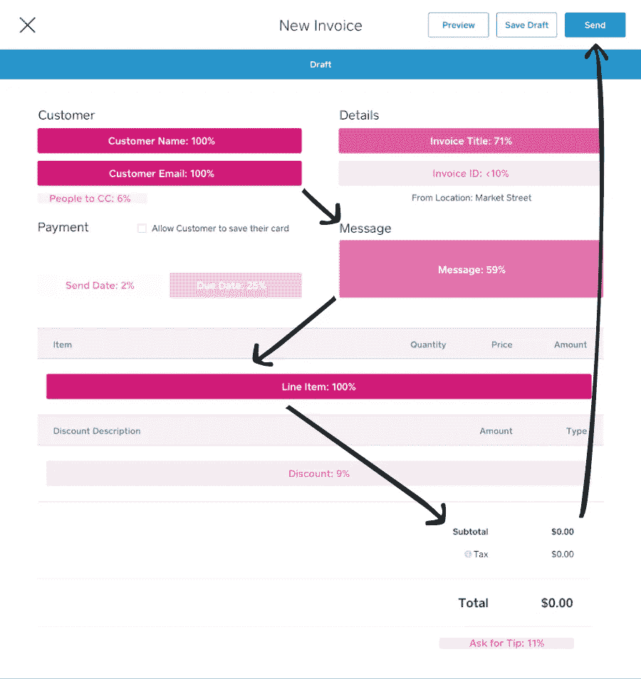
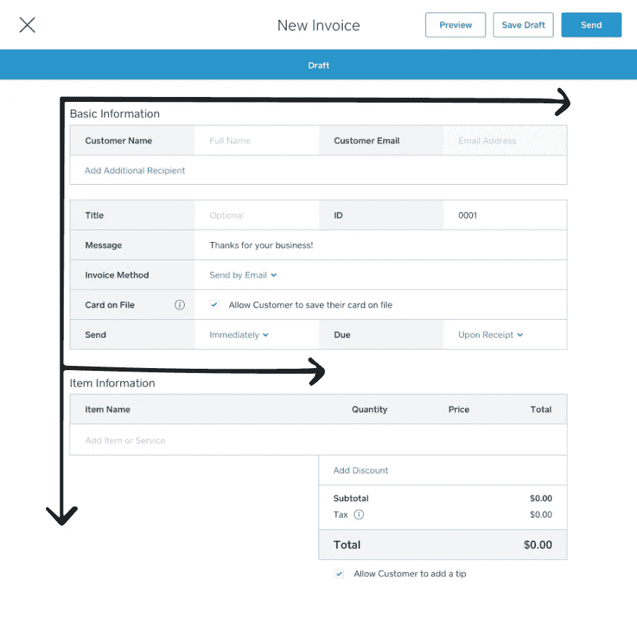
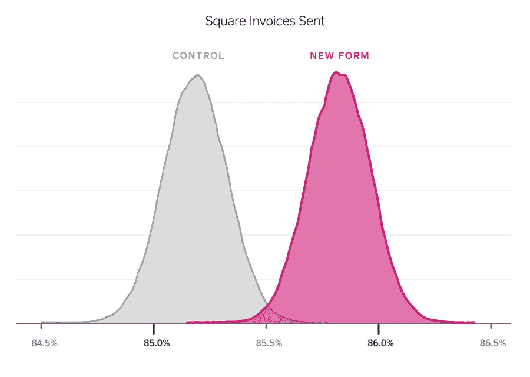

# 通过分析、设计原则和 UX 提高转化率

> 原文：<https://medium.com/square-corner-blog/boosting-conversion-rates-with-analytics-design-principles-and-ux-3ee133545610?source=collection_archive---------0----------------------->

*合著者:罗希尼·潘迪(产品)，杰里米·卢宾(设计)，拉杰特·米塔尔(工程)，雷切尔·史密斯(分析)*

> 注意，我们已经行动了！如果您想继续了解 Square 的最新技术内容，请访问我们在 https://developer.squareup.com/blog[的新家](https://developer.squareup.com/blog)

# **客户体验摩擦**

我们对[方形发票](http://square.com/invoices)有很大的计划，我们正在不断构建新的功能来帮助我们的卖家轻松发送发票并快速获得付款。

几个月前，我们的产品达到了一个转折点。Square Invoices 从我们开始的地方走了很长的路，我们的卖家喜欢我们解决方案的简单性。然而，随着我们增加了成千上万的新卖家，开发了越来越多的功能，产品开始变得杂乱和令人困惑。我们真的不能在不使布局变得势不可挡的情况下给我们的创作形式增加另一个特征。我们需要在不牺牲 Square 卖家重视的易用性的前提下增加功能，这也是他们来找我们的初衷。

这时，我们的团队使用分析和设计思维来解决这个问题。我们最初的形式给了很少使用的领域很高的视觉突出性，缺乏清晰的视觉层次，造成了一种杂乱的感觉，这种感觉因任何新功能的添加而加剧。

数据证明了这一点。

# **初步调查结果**

我们对字段使用数据进行了 UX 分析，以确定现有销售人员如何与发票表单中的字段和功能进行交互。我们发现创建表单上最常用的字段迫使客户从屏幕的左上侧快速移动到右中侧，然后回到左下方。最后，他们不得不将注意力转移到表单的顶部，将发票发送给买家。

*旧方发票创建表单:*

*The overlayed pink fields highlight the heat map of usage in the old creation form*

显然，这种之字形图案并不理想。为了改进我们的产品，我们*让*对我们的设计做了一些相当重大的改动。

# **重新设计:变得有条理**

我们构建了一种全新的体验，极大地改善和简化了发票流程。一个单列布局被用来创建一个清晰的页面层次结构，左侧标签用于提高可浏览性和理解性，并为未来的功能提供一个强大的视觉基础。它甚至很好地遵循了推荐的 [F 型](https://thenextweb.com/dd/2015/04/10/how-to-design-websites-that-mirror-how-our-eyes-work/#.tnw_R3lPJ3e8)布局。

*我们新的方形发票创建表单:*

我们对一些积极使用这种产品的精选方形发票卖家测试了这种新形式的可用性。一旦我们有了最初的定性反馈，我们就准备了一个很好的老式的 A/B 测试来决定哪种形式表现得更好。

# **我们的假设和成功的衡量标准**

在开始这个实验之前，我们讨论并概述了我们的主要成功指标。其中最重要的是控制组和测试组之间发送发票的比率。我们的假设是，Square 销售人员将能够通过更有组织的布局更有效地完成新的发票创建流程，这将导致测试组中创建和发送的发票数量增加。我们还跟踪了一些次要指标，包括:从未使用过该产品的新卖家的创建率、漏斗底部产品使用情况以及创建的支持票数量。

# **表演整容**

结果呢？请击鼓…新形式赢了！我们发现，看到我们新创建表单的卖家发送的发票数量增加了 1 个百分点，这在统计上非常显著。不仅如此，发送新表格的第二张发票的卖家数量也有所增加。换句话说，这种重新设计有助于提高我们产品使用漏斗顶部和底部的参与度。

这个结果很好地证明了新的形式是对旧体验的巨大改进。我们没有改变表单中的任何核心功能，我们只是通过设计一个改进的有组织的体验来使它更容易使用——这推动了增长和转换。

但是所有的产品团队都知道，“没有什么是持久的，没有什么是结束的，也没有什么是完美的”( [Richard Powell](https://en.wikipedia.org/wiki/Wabi-sabi) )。我们正在为 Square 发票开发更多更新和功能，以帮助我们的卖家轻松发送发票并快速获得付款！

*非常感谢和赞扬参与这个项目的所有团队，包括设计、工程、分析、支持和产品。如果你有兴趣加入我们的团队，就去看看 https://square.com/careers 的*！