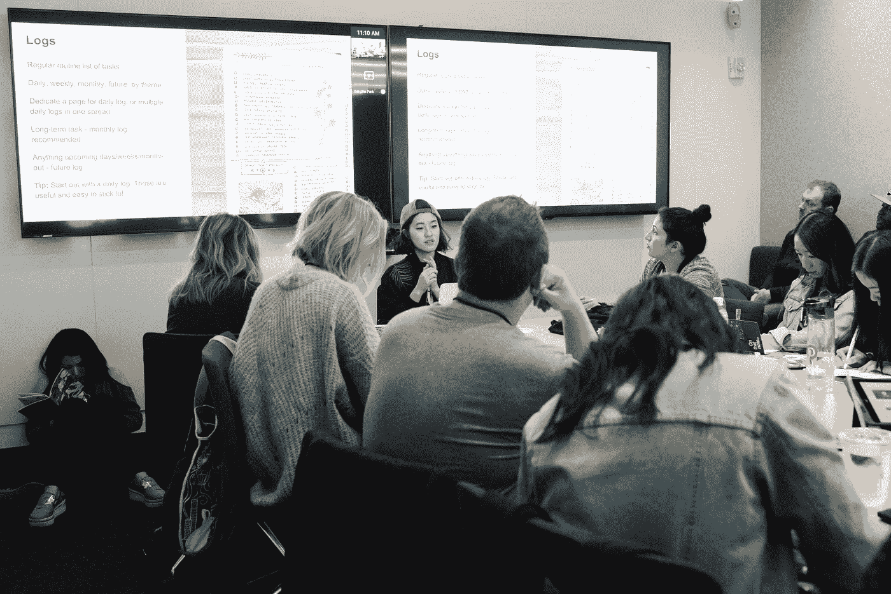
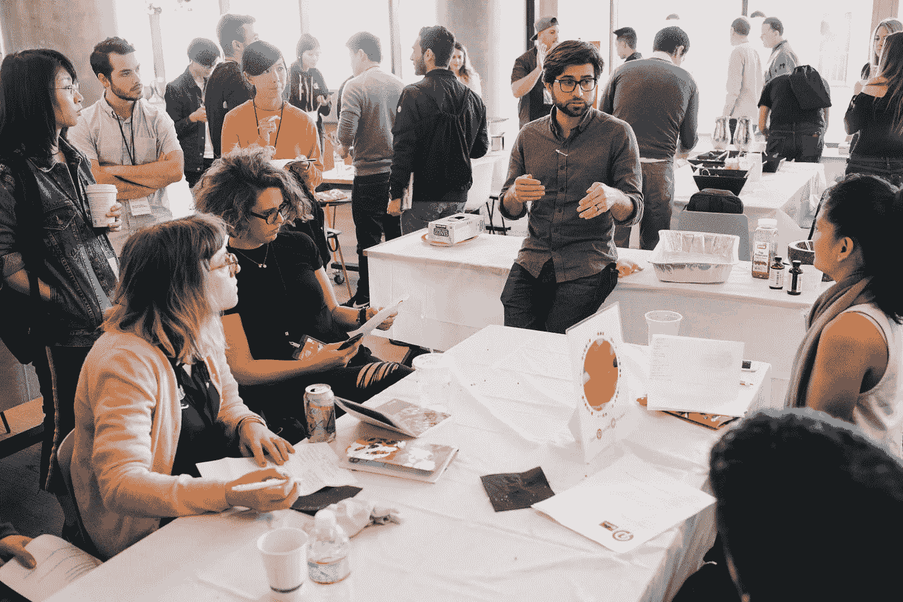

# 自下而上:Pinterest 成长团队如何分散结构

> 原文：<https://medium.com/pinterest-engineering/bottoms-up-how-the-pinterest-growth-team-decentralizes-team-structure-d9f890fa8869?source=collection_archive---------1----------------------->

尼拉杰·钱德拉|增长工程

在 Pinterest 的增长团队中，我们将我们的结构描述为“自下而上”，这意味着想法和职责在团队中流动，为每个人在各种角色中处理项目提供了很大的自主权。结果是一个非常可扩展和灵活的团队。这意味着我们团队中的每个人都有很大的自由来选择如何度过我们的时间。

# 这种方法如何工作

最终，我的主要任务是建立有助于获取、激活和保留用户的体验，这也是评估我们团队的机制。

具体来说，我的团队专注于用户转化，在 Pinterest 的背景下，这意味着向潜在用户展示 Pinterest 的价值，并将他们转化为活跃用户。为了做到这一点，我们提出改进的想法，构建并启动实验来衡量变化，并分析结果。如果实验带来了有价值的增长，我们会将实验发送给用户。相反，如果实验对增长漏斗没有影响，或者对用户增长有负面影响，我们就关闭它，删除实验，并分析结果来学习和改进。我们的团队每季度运行数百个实验，因此为了准确测量特定实验的影响，我们将人群随机分为对照组和实验组。

为了进行如此多的实验，我们的团队一直在寻找新的想法。我们不相信观念产生应该只属于一个人；相反，整个团队都有责任。我们定期花时间集思广益和评估新想法。任何人都可以向团队提出一个想法来获得反馈，如果这个想法成立，它就会被转移到 backlog 中。证明一个想法有价值的一部分是展示有足够的机会，所以我们也必须解释为什么这个想法是重要的，并且大到足以去实现。

同样，分析结果的责任也落在了每个团队成员身上。我们已经建立了一个实验框架来计算和汇总关键指标，但通常我们需要进一步挖掘来了解用户行为。因此，我工作的一个关键部分是利用我们的数据工具来构建查询和分析实验结果。如果需要的话，我当然可以得到帮助，但是我应该推动分析，并帮助完成我们对 Pinners 的理解。

每个人都参与分析的一个附带好处是，我们总是在任何新实验之前考虑所需的数据和日志的类型。因为我们都有使用日志回答问题的经验，所以在整个开发过程中的额外投入只会让我们变得更好。

# 我们为什么这么做

在这一点上，你可能想知道为什么我们以这样的方式组织自己。当然，我们仍然有一些专业化，但总的来说，这是一个更加松散的结构。为什么每个人都花时间产生想法和分析结果？

鉴于我们的工作性质，这种特殊的结构对我们来说是理想的，因为它允许我们专注于困难的问题，保持可伸缩性和灵活性，并鼓励我们自己的成长。

**一些额外的关键原因:**

*   **迅速做出正确的决定。**团队的意见让我们能够更快地提出高质量的想法，这样我们就可以专注于解决正确的问题。如果我们选择了错误的项目来工作，我们在开发和分析方面的效率是没有关系的，因为整个想法很可能会有糟糕的结果并被终止。通过让每个人都参与到这个过程中，我们可以为我们的问题找到更多的解决方案，并融入更广泛的观点。除了提出解决用户问题的想法，评估任何机会的潜在影响也很重要，这样我们就可以相应地进行优先排序。预测一个新项目的预期影响对于一个人来说可能很难，但是通过让整个团队参与进来，我们可以让彼此负责，并获得更客观和严格的结果。在实践中，这意味着我们每周召开一次会议，会上每个人都会向团队提出他们的想法。作为一个团队，我们讨论每个想法的优点和潜在机会，然后利用这些来确定我们的优先顺序。
*   **调整以关注当前的问题。**通过让每个人都参与流程的每个部分，我们保持了灵活性和可扩展性。如果我们的团队缺乏创意，我们可以将本周的重点转移到创造新的创意上。如果我们积累了大量的想法，我们会优先发展这些想法并进行实验。如果我们需要分析正在进行的实验，我们可以各自进行必要的分析以得出结论。结果是我们可以调整来解决当前的问题，不管它们在我们的过程中处于什么位置；我们还可以在不改变流程的情况下轻松吸纳新成员。
*   新思想引领职业发展。最后，我们每个人都可以通过接触流程的不同部分来学习和成长。我个人觉得这真的很令人兴奋，因为我开始参与产生想法、确定工作优先级、开发实验和分析结果。每一项都需要不同的技能，随着我工作性质的转变或兴趣的改变，我可以相应地进行调整。自从加入这个团队，我在这些事情上都变得更好了。我提高了提出想法供考虑的能力，也提高了深入挖掘数据分析的能力。在这个过程的一个部分变得更好也有助于我处理其他部分。例如，通过更加熟悉分析实验，我可以在开发过程中纳入更好的日志，通过更好地产生想法，我可以理解在分析过程中需要回答什么问题。这也意味着，除了建立新的体验，我开始思考更大的用户获取和激活的问题。这对我和企业都很重要；随着我们每个人对用户增长的了解越来越多，我们可以反过来贡献更好、更有影响力的想法，同时确保我们的团队快速前进。

# 这种方法需要什么

这种自下而上的方法可能不适用于每个团队。因为我们倾向于建立更小的计划来测试我们的假设，在投入更大的努力之前，我们必须不断地思考、适应和学习。因此，我们的团队从我们灵活的天性和专注于构思中受益匪浅。值得称赞的是，整个团队也真正接受了这种心态，看到每个人都采取好奇的心态并考虑新的机会，真是令人兴奋。

通过改进，我们已经成功地使自下而上的方法为我们所用。但是它是如何为管理层服务的呢？

我询问了 Pinterest 增长工程主管 Ludo Antonov 对这种方法的看法，以及他为什么以这种方式帮助构建团队。这是他告诉我的:

*“我喜欢‘自下而上’和分散的团队，因为这让团队中的每个人都能感受到对产品和公司的所有权。它鼓励各种功能，如设计，营销，工程和产品走到一起，从彼此的角度学习，并建立一个世界一流的产品。我总是说，我们应该努力让那些把大部分个人时间花在把想法变成现实上的人，在这个方向上最有发言权。这导致了更高质量的执行和团队的快乐，同时促进了学习和卓越。*

当我看到工程师、设计师或营销人员提出与我们今天的产品截然不同的想法，并把这种激情转化为成功的想法时，我欣喜若狂。从这个意义上说，我认为团队中处于领导地位的任何人(包括我自己)都是他们的顾问，在创造价值的过程中指导和帮助他们。我最喜欢的部分是，当我有我认为我们应该建立的想法时，我知道团队有权对我说“不”。因此，我知道，当我们实际上在构建某些东西上达成一致时，这是因为他们认为这值得他们花费时间，并且会使团队和产品更加成功，而不是因为领导的意见而构建东西。"

# 把这一切联系在一起

最终，我们的团队通过自下而上的文化获得了成功。它鼓励我们每个人掌控自己的领域，同时产生健康多样的想法。能够测试我自己的想法也是令人难以置信的授权——没有什么可以代替尝试一个想法，看看它实际上是如何执行的。我最喜欢的是能够在一天中花时间思考我们的战略，提出新的想法，然后将这些想法变成现实。我成为了更大的对话的一部分，这是一个难以置信的机会来影响一个每月超过 2.5 亿人使用的产品。

*感谢布莱恩·李、卢多·安东诺夫、海德尔·凯西和张信哲对这篇文章的帮助！*