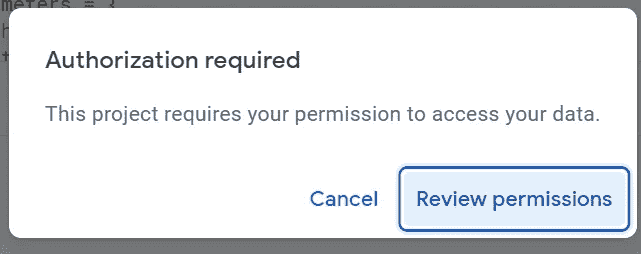
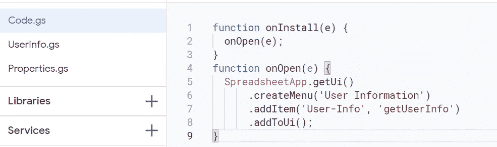

# 使用 Google API 的有界应用程序脚本

> 原文：<https://medium.com/globant/bounded-apps-script-with-google-api-459ef6e0f367?source=collection_archive---------1----------------------->

Apps Script 是一个基于云的 JavaScript 平台，允许您集成和自动化跨 Google 产品的任务。在本文中，我们将看到如何通过 Google API 获取用户信息，并使用 Apps 脚本显示在 Google Sheet 中。

什么是应用程序脚本？

Apps Script 是一项自动化业务系统、托管 web 应用程序、定制功能等的服务。它是用简单的 javaScript 和 html 编写的，带有各种内置库，可以与 G-Suite 应用程序进行交互。

应用程序脚本最常见的用法如下:

*   谷歌云:与谷歌云功能交互。
*   创建 Web UI 表单并在 excel 中整合数据
*   谷歌日历:获取和管理事件。
*   Gmail:获取和管理电子邮件:创建和发送电子邮件，搜索电子邮件
*   管理 Google Drive、Google Slides 以及更多与 Google 应用程序的交互。

**如何安装 Apps 脚本？**

应用程序脚本由谷歌提供，并在谷歌服务器上执行。它只需要 Gmail 账户就可以访问。不需要额外安装。

**如何访问 Apps 脚本？**

使用链接:[https://script.google.com/home](https://script.google.com/home)

Apps 脚本作为扩展绑定到 Google Sheets。

# **Apps 脚本与 Google API 的交互**

**步骤 1:用 Google Sheet 创建一个有界应用程序脚本项目。**

*   打开一个新的 Google 工作表并保存它。
*   从菜单栏中，点击*扩展*和*应用程序脚本*。

这将创建一个与谷歌表链接的应用程序脚本项目。

**步骤 2:为 Google API 定义请求参数**

作为本文的一部分，我考虑过通过 Google API 获取登录用户的信息。

谷歌用户信息应用编程接口:[https://www.googleapis.com/oauth2/v2/userinfo](https://www.googleapis.com/oauth2/v2/userinfo)

*   创建新的脚本文件:UserInfo.gs
*   创建一个函数作为 getUserInfo()并定义请求参数:

*方法*:根据定义的 API 定义 http 方法。

*contentType* :定义请求体的格式

*muteHttpExceptions* :如果 t*true，* fetch 不抛出异常，而是在失败的情况下返回 HttpResponse。

*头*:将访问令牌作为授权参数传递

**什么是 ScriptApp？**

ScriptApp 是一个控制授权和触发器的定义类。

ScriptApp.getOAuthToken()获取经过身份验证的有效用户的 OAuth2.0 令牌。

请注意，运行应用程序脚本需要授权才能访问用户数据。当脚本第一次启动时，它会询问“需要授权”。

点击查看权限。在下一步，它将提示进行身份验证。请输入 Gmail 帐户凭据。认证后，仔细阅读提供的条款并同意。

**第三步:向 Google API 发出请求**

*   创建一个新的脚本文件:Properties.gs，并将 URL 定义如下:

*   通过传递 getUserInfo()函数中定义的参数向 USER_INFO 发出请求。

**步骤 4:解析并读取响应**

使用 JSON.parse 将字符串解析为 JSON 对象。如果您需要验证响应，请使用 console.log 来打印结果。

**第五步:在谷歌表单中填充数据**

*   创建一个新函数 populateData()；
*   使用 SpreadsheetApp 获取活动工作表，清除现有内容或任何现有过滤器，并为工作表声明一个名称。

**spreadsheeapp 是什么？**

SpreadSheetApp 是定义的类，用于访问和创建/修改 google 工作表文件。

*   定义标题，应用样式并冻结标题行。

*   定义单元格范围，并根据标题填充内容/响应数据。

*   加载图像并将图像设置到指定的单元格。

*   创建筛选器并调整列宽和行高

**第六步:在 Google Sheet 中添加用户信息菜单**

*   在 Code.gs 中创建 onInstall()和 onOpen()函数
*   使用 SpreadsheetApp 创建菜单并在菜单中添加一项。
*   在 addItem()方法中，“User-Info”是标签，“getUserInfo”是被调用的定义函数。

**第 7 步:运行项目**

*   因为我们已经用 Google Sheet 创建了一个有界应用程序，所以只需点击 Run 就可以应用 Google Sheet 上的更改。

**结论**

本教程解释了如何将 Apps 脚本与 Google API 集成。在 Apps Script 中，您可以做更多的事情，使 excel 中的计算、功能定制和托管 web 应用程序变得简单，并且在很短的时间内完成。这是一种有趣的学习。

# apps script # Google API # AutomateGoogleSheet