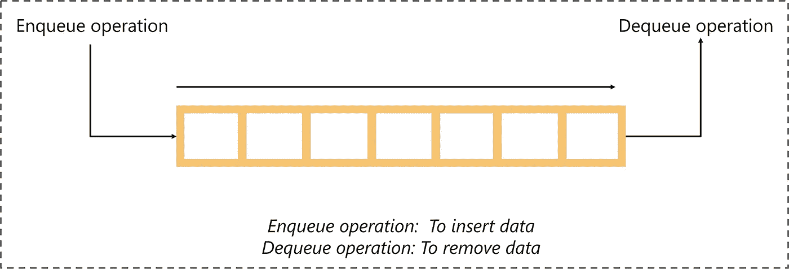

# 关于广度优先搜索算法，你只需要知道

> 原文：<https://medium.com/edureka/breadth-first-search-algorithm-17d2c72f0eaa?source=collection_archive---------0----------------------->


Breadth-First Search Algorithm — Edureka

图的遍历方法总是让我着迷。从执行有效的对等通信到使用 GPS 查找最近的餐馆和咖啡馆，遍历方法在现实世界中有各种各样的应用。在这篇关于广度优先搜索算法的博客中，我们将讨论图遍历方法背后的逻辑，并用例子来理解广度优先搜索算法的工作原理。

以下是本文将涉及的主题列表:

1.  图形遍历简介
2.  什么是广度优先搜索？
3.  用一个例子理解广度优先搜索算法
4.  广度优先搜索算法伪代码
5.  广度优先搜索的应用

# 图形遍历简介

*访问和探索一个图进行处理的过程称为图遍历。更具体地说，它是关于访问和探索图中的每个顶点和边，使得所有的顶点都被精确地探索一次。*

听起来很简单！但是有一个问题。

有几种图的遍历技术，如广度优先搜索，深度优先搜索等。挑战在于使用最适合解决特定问题的图遍历技术。这给我们带来了广度优先搜索技术。

# 什么是广度优先搜索算法？

*广度优先搜索算法是一种图形遍历技术，选择一个随机的初始节点(源节点或根节点)开始逐层遍历图形，所有节点及其各自的子节点都被访问和浏览。*

在我们通过一个例子进一步理解广度优先搜索之前，让我们先熟悉与图遍历相关的两个重要术语:


1.  **访问一个节点:**顾名思义，访问一个节点就是访问或选择一个节点。
2.  **浏览节点:**浏览所选节点的相邻节点(子节点)。

参考上图可以更好地理解这一点。

# **通过一个例子理解广度优先搜索算法**

广度优先搜索算法遵循简单的、基于级别的方法来解决问题。考虑下面的二叉树(这是一个图表)。我们的目标是通过使用广度优先搜索算法来遍历图。

在我们开始之前，您必须熟悉广度优先搜索算法中涉及的主要数据结构。

*队列是一种抽象的数据结构，遵循先进先出的方法(首先插入的数据将首先被访问)。它在两端都是开放的，其中一端总是用于插入数据(入队)，另一端用于删除数据(出队)。*



现在让我们来看看使用广度优先搜索遍历图的步骤:

**第一步:**取一个空队列。

**第二步:**选择一个起始节点(访问一个节点)插入队列。

**步骤 3:** 假设队列不为空，从队列中提取节点，并将其子节点(探索节点)插入队列。

**第四步:**打印提取的节点。

如果您感到困惑，请不要担心，我们将通过一个示例来理解这一点。

请看下图，我们将使用广度优先搜索算法遍历该图。


在我们的例子中，我们将把节点“a”指定为根节点，开始向下遍历，并遵循上面提到的步骤。


上图描绘了广度优先搜索算法的端到端过程。让我更深入地解释一下。

1.  将“a”指定为根节点，并将其插入队列。
2.  从队列中提取节点“a”，并插入“a”的子节点，即“b”和“c”。
3.  打印节点“a”。
4.  队列不为空，并且具有节点“b”和“c”。因为‘b’是队列中的第一个节点，所以让我们提取它并插入‘b’的子节点，即节点‘d’和‘e’。
5.  重复这些步骤，直到队列变空。请注意，已经访问过的节点不应再次添加到队列中。

现在让我们看看广度优先搜索算法的伪代码。

# 广度优先搜索算法伪代码

下面是实现广度优先搜索算法的伪代码:

```
Input: s as the source node

BFS (G, s)
let Q be queue.
Q.enqueue( s )

mark s as visited
while ( Q is not empty)
v = Q.dequeue( )

for all neighbors w of v in Graph G
if w is not visited
Q.enqueue( w )
mark w as visited
```

在上面的代码中，执行了以下步骤:

1.  (G，s)是输入，这里 G 是图，s 是根节点
2.  创建队列“Q ”,并用源节点“s”初始化
3.  “s”的所有子节点都被标记
4.  从队列中提取并访问子节点
5.  处理 v 的所有子节点
6.  将 w(子节点)存储在 Q 中，以便进一步访问其子节点
7.  继续，直到“Q”为空

在我们结束博客之前，让我们看看广度优先搜索算法的一些应用。

# **广度优先搜索算法的应用**

广度优先搜索是一种简单的图遍历方法，具有令人惊讶的应用范围。以下是面包优先搜索的一些有趣的应用方式:

## **搜索引擎中的爬虫:**

广度优先搜索是用于索引网页的主要算法之一。该算法从源页面开始遍历，并跟踪与该页面相关联的所有链接。在这里，每个网页将被视为图中的一个节点。

## **GPS 导航系统:**

广度优先搜索是使用 GPS 系统查找邻近位置的最佳算法之一。

## **求一个未加权图的最短路径&最小生成树:**

对于未加权的图，计算最短路径非常简单，因为最短路径背后的思想是选择边数最少的路径。广度优先搜索可以通过从源节点开始遍历最少数量的节点来实现这一点。类似地，对于生成树，我们可以使用广度优先搜索或深度优先遍历这两种方法中的任何一种来查找生成树。

## **广播:**

网络利用我们称之为数据包的东西进行通信。这些数据包遵循遍历方法到达各种网络节点。最常用的遍历方法之一是广度优先搜索。它被用作一种算法，用于在网络中的所有节点之间传递广播数据包。

## **点对点联网:**

广度优先搜索可以用作查找对等网络中所有相邻节点的遍历方法。例如，BitTorrent 使用广度优先搜索进行点对点通信。

这就是广度优先搜索算法的工作原理。就这样，我们到了这篇文章的结尾。如果你想查看更多关于 Python、DevOps、Ethical Hacking 等市场最热门技术的文章，那么你可以参考 [Edureka 的官方网站。](https://www.edureka.co/blog/?utm_source=medium&utm_medium=content-link&utm_campaign=breadth-first-search-algorithm)

请留意本系列中的其他文章，它们将解释数据科学的各个方面。

> *1。* [*数据科学教程*](/edureka/data-science-tutorial-484da1ff952b)
> 
> *2。* [*数据科学的数学与统计*](/edureka/math-and-statistics-for-data-science-1152e30cee73)
> 
> *3。*[*R 中的线性回归*](/edureka/linear-regression-in-r-da3e42f16dd3)
> 
> *4。* [*机器学习算法*](/edureka/machine-learning-algorithms-29eea8b69a54)
> 
> *5。*[*R 中的逻辑回归*](/edureka/logistic-regression-in-r-2d08ac51cd4f)
> 
> *6。* [*分类算法*](/edureka/classification-algorithms-ba27044f28f1)
> 
> *7。* [*随机森林中的 R*](/edureka/random-forest-classifier-92123fd2b5f9)
> 
> *8。* [*决策树中的 R*](/edureka/a-complete-guide-on-decision-tree-algorithm-3245e269ece)
> 
> *9。* [*机器学习入门*](/edureka/introduction-to-machine-learning-97973c43e776)
> 
> 10。 [*朴素贝叶斯在 R*](/edureka/naive-bayes-in-r-37ca73f3e85c)
> 
> *11。* [*统计与概率*](/edureka/statistics-and-probability-cf736d703703)
> 
> *12。* [*如何创建一个完美的决策树？*](/edureka/decision-trees-b00348e0ac89)
> 
> 13。 [*关于数据科学家角色的 10 大误区*](/edureka/data-scientists-myths-14acade1f6f7)
> 
> *14。* [*顶级数据科学项目*](/edureka/data-science-projects-b32f1328eed8)
> 
> 15。 [*数据分析师 vs 数据工程师 vs 数据科学家*](/edureka/data-analyst-vs-data-engineer-vs-data-scientist-27aacdcaffa5)
> 
> *16。* [*人工智能的种类*](/edureka/types-of-artificial-intelligence-4c40a35f784)
> 
> *17。*[*R vs Python*](/edureka/r-vs-python-48eb86b7b40f)
> 
> *18。* [*人工智能 vs 机器学习 vs 深度学习*](/edureka/ai-vs-machine-learning-vs-deep-learning-1725e8b30b2e)
> 
> *19。* [*机器学习项目*](/edureka/machine-learning-projects-cb0130d0606f)
> 
> *20。* [*数据分析师面试问答*](/edureka/data-analyst-interview-questions-867756f37e3d)
> 
> *21。* [*面向非程序员的数据科学和机器学习工具*](/edureka/data-science-and-machine-learning-for-non-programmers-c9366f4ac3fb)
> 
> *22。* [*十大机器学习框架*](/edureka/top-10-machine-learning-frameworks-72459e902ebb)
> 
> *23。* [*用于机器学习的统计*](/edureka/statistics-for-machine-learning-c8bc158bb3c8)
> 
> *24。* [*随机森林中的 R*](/edureka/random-forest-classifier-92123fd2b5f9)
> 
> *25。* [*监督学习*](/edureka/supervised-learning-5a72987484d0)
> 
> *26。*[*R 中的线性判别分析*](/edureka/linear-discriminant-analysis-88fa8ad59d0f)
> 
> 27。 [*机器学习的先决条件*](/edureka/prerequisites-for-machine-learning-68430f467427)
> 
> 28。 [*互动 WebApps 使用 R 闪亮*](/edureka/r-shiny-tutorial-47b050927bd2)
> 
> *29。* [*十大机器学习书籍*](/edureka/top-10-machine-learning-books-541f011d824e)
> 
> 三十岁。 [*无监督学习*](/edureka/unsupervised-learning-40a82b0bac64)
> 
> *三十一。* [*10 本数据科学最佳书籍*](/edureka/10-best-books-data-science-9161f8e82aca)
> 
> 32。 [*机器学习使用 R*](/edureka/machine-learning-with-r-c7d3edf1f7b)

*原载于 2019 年 9 月 6 日 https://www.edureka.co*[](https://www.edureka.co/blog/breadth-first-search-algorithm/)**。**