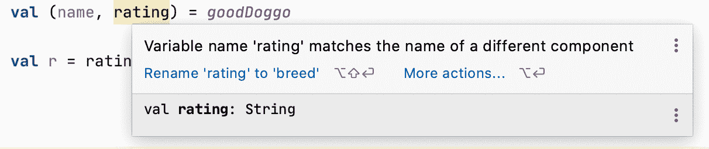

# 分解析构声明

> 原文：<https://medium.com/androiddevelopers/breaking-down-destructuring-declarations-e21334ac1e9?source=collection_archive---------0----------------------->


## 科特林词汇——解构

有时你只想分解一个包含多个字段的对象来初始化几个独立的变量。要实现这一点，可以使用 Kotlin 的析构声明。请继续阅读，了解如何使用这个特性，默认情况下 Kotlin 类型提供了哪些特性，如何在自己的类中实现这个特性，或者如何为那些您无法控制但认为可以从析构中获益的类实现这个特性，以及一切是如何工作的。

# 使用

析构声明允许我们这样定义**局部**值/变量:

这是处理来自函数或集合的数据的一种便捷方式:

默认情况下，所有数据类都支持析构。

您可以决定只使用类字段中的变量子集:

析构不允许你选择你想要使用的字段；它将始终使用前 x 个字段，其中 x 是您声明的变量的数量。这样做的坏处是很容易出错。例如，下面的代码片段可能会产生意外的结果:

```
val (name, rating) = goodDoggo
```

等级值实际上包含 goodDoggo.breed 的值。您将得到一条警告:“变量名' rating '与不同组件的名称相匹配”，并建议将等级重命名为 breed。由于这只是 IDE 中的警告，而不是编译警告，所以很容易被忽略。



使用了错误的析构变量声明

如果你只需要不连续字段的子集，对那些你不感兴趣的字段使用`_`，Kotlin 会跳过它们。上面的例子变成了:

```
val (name, _, rating) = goodDoggo
```

# 在后台

让我们来看看一个反编译的数据类，看看发生了什么。在这篇文章中，我们将只关注为析构生成的函数。关于数据类的更多信息，请关注以后的文章。

要查看 Java 反编译代码，进入工具-> Kotlin ->显示 Kotlin 字节码，然后按反编译按钮。

我们看到，为主构造函数中声明的每个属性生成了名为 componentN 的函数，其中 N 是主构造函数中字段的索引。

# 实现析构

正如我们所见，析构依赖于 componentN 函数。因此，如果你想给一个不支持析构功能的类添加析构功能，那么只需实现相应的 componentN 操作符函数。确保在它们前面加上 operator 关键字。

# 为不属于自己的类实现析构

Kotlin 允许你通过扩展函数为你不拥有的类实现析构。比如[地图。条目](https://kotlinlang.org/api/latest/jvm/stdlib/kotlin.collections/-map/-entry/)只是一个接口，默认情况下它不支持析构。为了克服这个问题，创建了 component1()和 component2()函数，它们返回 Map.Entry 的键和值。

# 结论

每当需要将对象的字段解包为值/变量时，使用析构。在幕后，析构是通过提供 componentN 运算符函数来实现的，因此您可以自己为您认为受益于该功能的类提供这些函数。