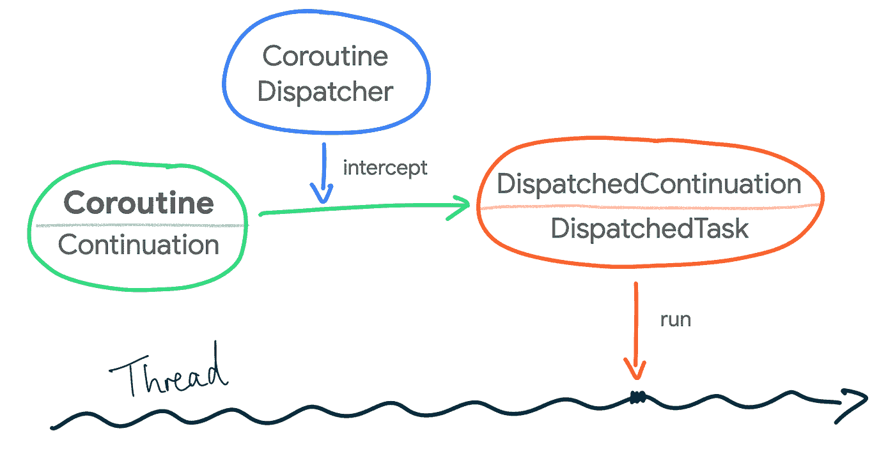

# 弥合协程、线程和并发问题之间的差距

> 原文：<https://medium.com/androiddevelopers/bridging-the-gap-between-coroutines-jvm-threads-and-concurrency-problems-864e563bd7c?source=collection_archive---------1----------------------->


“*协程是轻量级线程*”，你读过多少遍了？这对你有什么意义吗？大概不会。继续阅读，了解更多关于**协同程序如何在 Android 运行时**上实际执行，它们如何与线程相关，以及使用 Java 编程语言线程模型时不可避免的**并发问题**。

# 协程和线程

协程旨在简化异步执行的代码。当谈到 Android 运行时上的协同程序时，**作为 lambda 传递给协同程序构建器的代码块最终在特定的线程上执行**。例如，这个简单的[斐波那契](https://en.wikipedia.org/wiki/Fibonacci_number)计算:

```
// Coroutine that calculates the 10th Fibonacci number in a background thread
someScope.launch(Dispatchers.Default) {
    val fibonacci10 = synchronousFibonacci(10)
    saveFibonacciInMemory(10, fibonacci10)
}private fun synchronousFibonacci(n: Long): Long { /* ... */ }
```

上面的`async`协程代码块执行同步和分块斐波那契计算，并将其保存到内存中，**被分派和调度到由协程库**管理的线程池中执行，协程库是为`Dispatchers.Default`配置的。根据线程池的策略，代码将在未来的某个时间在线程池的线程中执行。

注意，上面的代码在一个线程中执行，因为它没有挂起。如果执行被移动到不同的调度程序，或者如果块包含可能在使用线程池的调度程序中产生/挂起的代码，则一个协同例程可能在不同的线程中执行。

类似地，如果没有协程，您可以使用线程手动执行上述逻辑，如下所示:

```
// Create a thread pool of 4 threads
val executorService = Executors.newFixedThreadPool(4)// Schedule and execute this code in one of those threads
executorService.execute {
    val fibonacci10 = synchronousFibonacci(10)
    saveFibonacciInMemory(10, fibonacci10)
}
```

虽然可以自己手动管理线程池，但由于内置的取消支持、更简单的错误处理、*结构化并发性*降低了内存泄漏的可能性，以及与 Jetpack 库的集成， **coroutines 是 Android 上异步编程的推荐解决方案。**

## 在后台

从创建协程的那一刻起，直到它在线程上执行，会发生什么？当您使用标准协程构建器创建协程时，您可以指定在哪个`[CoroutineDispatcher](https://github.com/Kotlin/kotlinx.coroutines/blob/master/kotlinx-coroutines-core/common/src/CoroutineDispatcher.kt)`上运行它；如果没有，则使用`Dispatchers.Default`。

**协程调度器负责将一个协程的执行分派给一个线程**。在底层，当一个`CoroutineDispatcher`被使用时，它使用这个`[interceptContinuation](https://github.com/Kotlin/kotlinx.coroutines/blob/master/kotlinx-coroutines-core/common/src/CoroutineDispatcher.kt#L99)`方法拦截协程，这个方法是**将** `**Continuation**` **(即协程)包装在一个** `[**DispatchedContinuation**](https://github.com/Kotlin/kotlinx.coroutines/blob/master/kotlinx-coroutines-core/common/src/internal/DispatchedContinuation.kt)`中。这是可能的，因为`CoroutineDispatcher`实现了`[ContinuationInterceptor](https://github.com/Kotlin/kotlinx.coroutines/blob/master/stdlib-stubs/src/ContinuationInterceptor.kt)`接口。

> 如果你读过我关于[协程如何在幕后工作](https://manuelvivo.dev/suspend-modifier)的文章，你已经知道编译器创建了一个状态机，状态机的信息(例如接下来需要执行什么)保存在一个[延续](https://kotlinlang.org/api/latest/jvm/stdlib/kotlin.coroutines/-continuation.html)对象中。

如果一个延续需要在不同的调度程序中执行，`DispatchedContinuation`的`[resumeWith](https://github.com/Kotlin/kotlinx.coroutines/blob/master/kotlinx-coroutines-core/common/src/internal/DispatchedContinuation.kt#L178)`方法负责将协程调度到合适的调度程序！

此外，**一个** `**DispatchedContinuation**` **从** `[**DispatchedTask**](https://github.com/Kotlin/kotlinx.coroutines/blob/master/kotlinx-coroutines-core/common/src/internal/DispatchedTask.kt)`抽象类扩展而来，该抽象类在 Java 编程语言实现中是实现`Runnable`接口的类型。所以一个`DispatchedContinuation`可以在一个线程上运行！多酷啊。当一个`CoroutineDispatcher`被指定时，协程被转换成一个`DispatchedTask`，作为一个`Runnable`被分派到一个线程上执行！

现在…当你创建一个协程时，如何调用`dispatch`方法？当您使用标准协程构建器创建协程时，您可以用类型`[CoroutineStart](https://kotlin.github.io/kotlinx.coroutines/kotlinx-coroutines-core/kotlinx.coroutines/-coroutine-start/index.html)`的`start`参数指定协程如何启动。例如，您可以使用`CoroutineStart.LAZY`将其配置为仅在需要时启动。默认情况下，使用`CoroutineStart.DEFAULT`,它根据协程的`CoroutineDispatcher`调度协程的执行。答对了。



Illustration of how the block of code in a coroutine ends up executing in a Thread

## 调度程序和线程池

通过使用`[Executor.asCoroutineDispatcher()](https://kotlin.github.io/kotlinx.coroutines/kotlinx-coroutines-core/kotlinx.coroutines/java.util.concurrent.-executor/as-coroutine-dispatcher.html)`扩展函数将协程转换为`CoroutineDispatcher`，您可以在任何应用程序线程池中执行协程。或者，您可以使用协程库中默认的`[Dispatchers](https://github.com/Kotlin/kotlinx.coroutines/blob/master/kotlinx-coroutines-core/jvm/src/Dispatchers.kt)`。

你可以看到在这个`[createDefaultDispatcher](https://github.com/Kotlin/kotlinx.coroutines/blob/master/kotlinx-coroutines-core/jvm/src/CoroutineContext.kt#L22)`方法中`Dispatchers.Default`是如何初始化的。默认情况下，使用`[DefaultScheduler](https://github.com/Kotlin/kotlinx.coroutines/blob/master/kotlinx-coroutines-core/jvm/src/scheduling/Dispatcher.kt)`。如果您查看一下`[Dispatchers.IO](https://github.com/Kotlin/kotlinx.coroutines/blob/master/kotlinx-coroutines-core/jvm/src/Dispatchers.kt#L118)`的实现，它也使用了`DefaultScheduler`，并且允许按需创建至少 64 个线程。`Dispatchers.Default`和`Dispatchers.IO`隐式地链接在一起，因为它们使用相同的线程池，这将我带到下一个主题。用不同的调度程序调用`withContext`的运行时开销是多少？

## 线程和上下文性能

在 Android 运行时，如果创建的线程多于可用的 CPU 内核，线程之间的切换会带来一些运行时开销。 [*上下文切换*](https://en.wikipedia.org/wiki/Context_switch) 不便宜！操作系统需要保存和恢复执行上下文，CPU 需要花时间调度线程，而不是运行实际的应用程序工作。除此之外，如果线程正在运行阻塞的代码，可能会发生上下文切换。如果线程是这种情况，那么在不同的调度程序中使用`withContext`会有什么性能损失吗？

幸运的是，正如您所想象的，线程池为我们管理了所有这些复杂性，试图尽可能地优化要执行的工作(这就是为什么在线程池上执行工作比手动在线程中执行要好)。协程也从中受益，因为它们是在线程池中调度的！最重要的是，协程不会阻塞线程，而是*暂停*它们的工作！甚至更高效！

**`[**CoroutineScheduler**](https://github.com/Kotlin/kotlinx.coroutines/blob/master/kotlinx-coroutines-core/jvm/src/scheduling/CoroutineScheduler.kt)`是 Java 编程语言实现中默认使用的线程池，**以最有效的方式将分派的协程分配给工作线程**。由于`Dispatchers.Default`和`Dispatchers.IO`使用相同的线程池，它们之间的切换被优化以尽可能避免线程切换。协程库可以优化这些调用，保持在相同的调度程序和线程上，并遵循快速路径。**

**由于`Dispatchers.Main`通常是 UI 应用中的不同线程，在协同程序中的`Dispatchers.Default`和`Dispatchers.Main`之间切换不会带来巨大的性能成本，因为协同程序只是暂停(即停止在一个线程中执行)，并被调度到另一个线程中执行。**

# **协同程序中的并发问题**

**由于不同线程上的调度工作非常简单，协程确实使异步编程变得更加容易。另一方面，这种简单性可能是一把双刃剑:**由于协程运行在 Java 编程语言线程模型上，它们不能简单地避免线程模型带来的并发问题**。因此，你必须注意避免这种情况。**

**多年来，像不变性这样的良好实践已经减轻了您可能面临的一些与线程相关的问题。然而，有些情况是不可避免的。所有并发问题的根源是状态管理！特别是在多线程环境下访问 ***可变状态*** 。**

**多线程应用中的操作顺序是不可预测的。除了可以对操作重新排序的编译器优化之外，线程不能保证以特定的顺序运行，并且上下文切换可能随时发生。如果在访问可变状态时没有采取必要的预防措施，线程可能会看到陈旧的数据，丢失更新，或者遭受 [*竞争条件*](https://en.wikipedia.org/wiki/Race_condition) 等问题。**

> **请注意，可变状态和访问顺序的讨论并不特定于 Java 编程语言。它们也会影响其他平台上的协程。**

**使用协程的应用本质上是一个多线程应用。**使用协程并包含可变状态的类必须采取预防措施** **使其可预测**，即确保协程中执行的代码看到最新版本的数据。这样，不同的线程不会互相干扰。并发问题会导致你的应用程序中非常细微的错误，非常难以调试，甚至 [*海森伯格*](https://en.wikipedia.org/wiki/Heisenbug) ！**

**这些类型的课程并不少见。也许类需要在内存中保存登录用户的信息，或者在应用程序运行时缓存一些值。如果不小心的话，并发问题仍然会在协程中发生！使用`withContext(defaultDispatcher)`的挂起函数不能保证总是在同一个线程中执行！**

**假设我们有一个缓存用户事务的类。如果没有正确访问缓存，例如下面的例子，可能会发生并发错误:**

> **即使我们谈论的是 Kotlin，Brian Goetz 的书*Java concurrency in practice*也是了解这个主题和 Java 编程语言系统中并发复杂性的极好资源。或者，Jetbrains 也有关于共享可变状态和并发性的文档。**

# **保护可变状态**

**如何保护可变状态，或者找到一个好的 [*同步*](https://en.wikipedia.org/wiki/Synchronization_(computer_science)) *策略*，完全取决于数据的性质和涉及的操作。这一节将介绍您可能面临的并发问题，而不是列出所有不同的方法和 API 来保护可变状态。尽管如此，这里有一些技巧和 API 可以让你的可变变量线程安全。**

## **包装**

**可变状态应该被封装，并且由一个类拥有。这个类集中了对状态的访问，并将使用更适合用例的同步策略来保护读写。**

## **线程限制**

**一种解决方案是限制对一个线程的读/写访问。对可变状态的访问可以使用队列以生产者/消费者的方式完成。关于这一点，JetBrains 在 T21 有很好的文档。**

## **不要多此一举**

**在 Android 运行时中，有一些线程安全的数据结构可以用来保护可变变量。例如，对于简单计数器的情况，可以使用`[AtomicInteger](https://docs.oracle.com/javase/8/docs/api/java/util/concurrent/atomic/AtomicInteger.html)`。或者，为了保护上面代码片段的映射，您可以使用一个`[ConcurrentHashMap](https://docs.oracle.com/javase/8/docs/api/java/util/concurrent/ConcurrentHashMap.html)`。`ConcurrentHashMap`是一个线程安全的同步集合，它优化了对 map 的读写吞吐量。**

**注意，线程安全的数据结构不能防止调用者排序问题，它们只是确保内存访问是原子性的。当逻辑不太复杂时，它们有助于避免使用锁。例如，它们不能在上面显示的`transactionCache`示例中使用，因为操作的顺序和它们之间的逻辑需要线程和访问保护。**

**此外，这些线程安全数据结构中的数据需要是不可变的或受保护的，以防止在修改已经存储在其中的对象时出现竞争情况。**

## **定制解决方案**

**如果您有需要同步的复合动作，`[@Volatile](https://kotlinlang.org/api/latest/jvm/stdlib/kotlin.jvm/-volatile/)`变量或线程安全数据结构不会有帮助！而且有可能内置的`[@Synchronized](https://kotlinlang.org/api/latest/jvm/stdlib/kotlin.jvm/-synchronized/)`注释不够精细，不足以让您的用例高效。**

**在这些情况下，您可能需要使用并发实用程序来创建自己的同步机制，如[闩锁](https://docs.oracle.com/javase/7/docs/api/java/util/concurrent/CountDownLatch.html)、[信号量](https://en.wikipedia.org/wiki/Semaphore_(programming))或[屏障](https://en.wikipedia.org/wiki/Barrier_(computer_science))。其他时候，您可以使用[锁](https://en.wikipedia.org/wiki/Lock_(computer_science))或互斥锁无条件地保护多线程对代码的访问。**

**Kotlin 中的`[Mutex](https://kotlin.github.io/kotlinx.coroutines/kotlinx-coroutines-core/kotlinx.coroutines.sync/-mutex/index.html)`有挂起函数`[lock](https://kotlin.github.io/kotlinx.coroutines/kotlinx-coroutines-core/kotlinx.coroutines.sync/-mutex/lock.html)`和`[unlock](https://kotlin.github.io/kotlinx.coroutines/kotlinx-coroutines-core/kotlinx.coroutines.sync/-mutex/unlock.html)`来手动保护你的协程代码的一部分。方便的是，扩展功能`[Mutex.withLock](https://kotlin.github.io/kotlinx.coroutines/kotlinx-coroutines-core/kotlinx.coroutines.sync/with-lock.html)`更易于使用:**

**由于使用`Mutex`的协程会暂停执行，直到可以继续执行，这比阻塞线程的 Java 编程语言锁要有效得多。在协程中使用 Java 编程语言同步类时要小心，因为这会阻塞正在执行协程的线程，并产生[活性](https://en.wikipedia.org/wiki/Liveness)问题。**

**传递给协程构建器的代码块最终在一个或多个线程上执行。因此，协同程序运行在 Android 运行时线程模型上，并带有所有的约束。使用协程，仍然有可能编写出易受攻击的错误多线程代码。因此，在代码中要注意对共享可变状态的访问！**