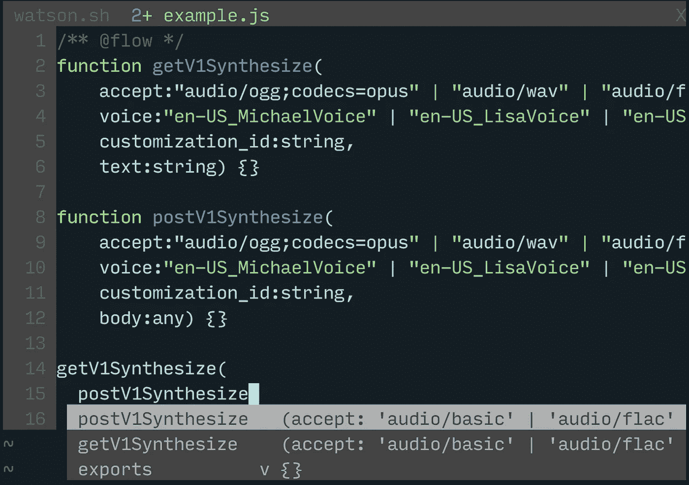

# 弥合网络鸿沟

> 原文：<https://medium.com/walmartglobaltech/bridging-the-network-divide-80e2355051dc?source=collection_archive---------1----------------------->


Illustration by Dustan Kasten. Icons from Gravit.io

您是否曾经想过，为什么我们在 API 和数据库层构建并支持丰富的类型和模型信息，而在跨越 HTTP 界限进入 web 和本地客户端时却将这些都抛弃了？我们在[沃尔玛实验室](http://www.walmartlabs.com/)的杂货团队对 [GraphQL](http://graphql.org/) [、Falcor](https://netflix.github.io/falcor/) 和类似工具带来的许多想法感兴趣。存在于客户机和服务器上的 GraphQL 类型系统和通过网络的 Falcor 透明模型访问都使得构建和维护产品的方法变得非常强大和容易。

像大多数团队一样，除了减缓或阻止采用这些特定工具的其他约束之外，我们已经在生产中有过多的服务。尽管有了我们手中的工具，我们还是可以达到和实现这些其他抽象所提供的一些承诺。

*当我要写下我们的具体实现时，我希望你明白的是，你不应该利用你当前的环境或技术来阻止你今天做得更好。可能有一些方法可以创建更具表现力的抽象或工具，让您更安全、更稳定地放心开发和部署。*

具体来说，我的团队有从 API 实现本身生成的文档。我们可以消费这些信息，并将其输入 JavaScript 代码生成工具，如 [Babel](http://babeljs.io/) 和 [jscodeshift](https://github.com/facebook/jscodeshift) 来生成我们的客户端代码。有了用[流](http://flowtype.org/)类型注释的生成代码，我们很快就在 UI 和服务器模型之间建立了一座坚实的桥梁。

使用代码生成模型这样做的一个关键好处是，我们可以按需生成`git diff`来查看所有的 API 契约变更。流的静态分析可以随后引导我们通过任何突破性的变化。这让我们确信，我们的客户端代码以安全和正确的方式与 API 交互，并且在使用与 API 交互的方法时，为编辑器自动完成提供了方便的开发人员工具。



Flow so smart

大多数现代服务器框架都有工具来丰富地描述、验证和共享领域模型。这通常以一种 [ORM](https://en.wikipedia.org/wiki/Object-relational_mapping) 的形式出现，它从应用程序操作中抽象出数据库操作，同时提供丰富的 API 来与这些对象进行交互。

Rails 有 ActiveRecord。
哈比神有 Joi 验证。
GraphQL 有它的类型系统。

这些抽象使得服务器工程师生成文档并将其公开给消费者(比如 UI 工程师！).

**但是为什么就此止步呢？**为什么为了网络部门的一些微薄的文档而放弃 API **合同**的工具集成和安全性？

对于本文的其余部分，我想概述我们当前的解决方案，并以一些问题和后续步骤结束。我们的方法优先解决以下两个问题:

*   我们如何让 API 交互变得可预测和自动化？
*   我们如何对 API 请求和响应契约启用 UI 代码的静态分析？

我们并不认为我们的解决方案是新颖的。解决类似问题的现有技术是:

*   脸书 [GraphQL](http://graphql.org/) / [继电器](https://facebook.github.io/relay/)
*   谷歌的[协议缓冲区](https://developers.google.com/protocol-buffers/)
*   网飞的[法鲁克](https://netflix.github.io/falcor/)

考虑到折衷，我们的解决方案介于自组织网络呼叫和上述解决方案之间。这些解决方案要求系统上的客户机和服务器之间有一个超越 HTTP 的协议。我们的解决方案允许我们利用现有的工具和基础设施，同时采用一种渐进的方式来实现更有见解和更强大的抽象。

# 工具

*   [**Swagger**](http://swagger.io/) 从实现中生成丰富的文档。
*   [**jscodeshift**](https://github.com/facebook/jscodeshift) 将 Swagger 表示转换成 JavaScript 抽象语法树(AST)和源文件。

我们将使用 IBM 沃森公开的狂妄定义。你可以在 https://Watson-API-explorer . mybluemix . net/APIs/text-to-speech-v1 看到它的 HTML 视图

秘密在于 Swagger 也生成了一个 JSON 视图。[https://Watson-API-explorer . mybluemix . net/listings/text-to-speech-v1 . JSON](https://watson-api-explorer.mybluemix.net/listings/text-to-speech-v1.json)

作为程序员，我们习惯于处理像对象和数组这样的数据结构，并转换它们。

*…要是我们能把 Swagger 的 JSON 格式转换成 JavaScript 文件就好了…*

我来给大家介绍一下 JavaScript 抽象语法树！唉，不要害怕。树木制造我们呼吸的氧气！

# 对 ASTs 过于简单的介绍

一个典型的程序被编写并存储在一个称为字符串的数据结构中。字符串不是一种非常丰富的数据结构，所以大多数工具将字符串转换成一个丰富的层，称为抽象语法树 AST。

一个[树结构](https://en.wikipedia.org/wiki/Tree_(data_structure))只是节点的集合。在 JavaScript 中有一些节点，比如标识符、变量声明、函数表达式、every 语句和语言的其他结构。作为一个简短的例子，你可以看看下面的 hello world 函数及其 AST 表示。

 [## AST 浏览器

### 在线 AST 浏览器。

astexplorer.net](http://astexplorer.net/#/13NIfAERo1) 

```
function hello () {
 return “world!”;
}
```

上述函数可以表示为以下 AST 结构:

```
{
  "type": "FunctionDeclaration",
  "id": {
    "type": "Identifier",
    "name": "hello"
  },
  "params”: [],
  "body": {
    "type": "BlockStatement",
    "body": [
      {
        "type": "ReturnStatement",
        "argument": {
          "type": "Literal",
          "value": "world!",
          "raw": "\"world!\""
        }
      }
    ]
  }
}
```

# 将碎片拼在一起

我们已经看了一下 Swagger JSON 模型以及 JS 程序的源代码。现在编写一个程序，将 Swagger 模型转换为我们的 JavaScript AST，并将其打印到一个文件中。

让我们从简单地生成文件的导出函数和签名开始。对于每个 Swagger 端点，我们希望生成一个类似如下的代码块:

```
type CustomType = any;
export function getV1Resource(
  arg1 : string,
  arg2 : string,
  arg3 : CustomType
) {}
```

只需大约 130 行代码就可以生成完整的 Swagger 定义。这是 130 行注释代码，包括请求和解析 JSON 本身。

[https://gist . github . com/iamdustan/2e 36 a 440 b 5702 e 14376 bfba 56d 303427](https://gist.github.com/iamdustan/2e36a440b5702e14376bfba56d303427)

通读一遍。一开始可能感觉有点陌生，但是很容易。保证！

它的核心就是这么小:

```
/**
 * Generate a JS AST from a Swagger entry.
 */
const toFn = (path, method, obj) => Object.assign(
  j.exportDeclaration(false, j.functionDeclaration(
    j.identifier(genFnName(method, path)),
    genArgs(obj.parameters),
    j.blockStatement([])
 )),
 {comments: [j.commentBlock(formatDescription(obj.description))]}
);
```

我们是沃尔玛实验室 [Redux](http://redux.js.org/) 的狂热用户，所以接下来我们将使导出函数声明的返回值成为一个简单的对象定义。

让我们通过编写生成以下函数体的代码来结束本教程:

```
return {
  type: 'FETCH',
  payload: {}
};
```

这是一个`ReturnStatement`，它的值是一个有两个键的`ObjectExpression`。

```
const genBody = (path, method, obj) =>
  j.blockStatement([j.returnStatement(
    j.objectExpression([
      j.property(‘init’, j.identifier(‘type’), j.literal(‘FETCH’)),
      j.property(‘init’, j.identifier(‘payload’), j.objectExpression([]))
   ])
 )]);
```

# **未来的挑战**

在这一点上，我们取得了一些重大胜利。对于 API 可能返回的每个模型，我们都有丰富的类型定义。我们可以在整个代码库中使用它们，每当它们改变时，Flow 将告诉我们 UI 的哪些部分正在执行无效的属性查找，或者缺少 API 所需的输入参数。

当我们想要与 API 交互时，我们不再需要离开我们的编辑器来查看 API 契约，而是可以直接从 Flow 中获取信息。

唉，我们对返回值的类型定义有很大的损失。例如，如果可接受的输入是`{a: string} | {b: SomeEnum}`，那么当前生成的是完全不同的`{a: string, b: SomeEnum}`。我们目前正在手动修补这些案例。既然我们的 API 已经稳定下来，我们已经考虑放弃自动生成的类型，转而使用手动维护的定义。

最后，我们正在考虑探索 fetch 中间件的参数化类型定义，目标是帮助 Flow 理解 Redux reducers 需要考虑的精确形状。

现在，如果我能找到一种方法，在 JavaScript 中实现 Rust 的详尽模式匹配

*感谢* [*菲利克斯克林*](https://twitter.com/fkling42) *和乔哈德森对本文的审阅和反馈。*