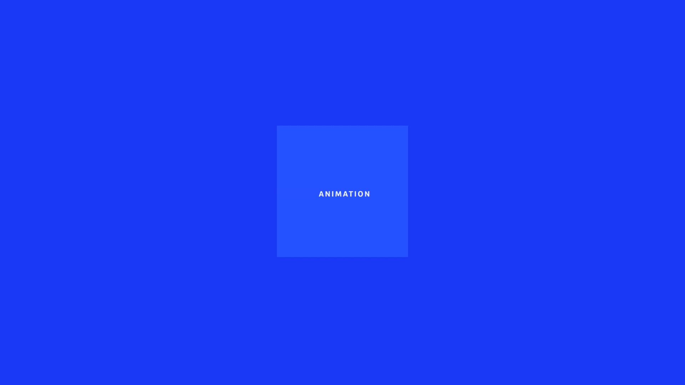
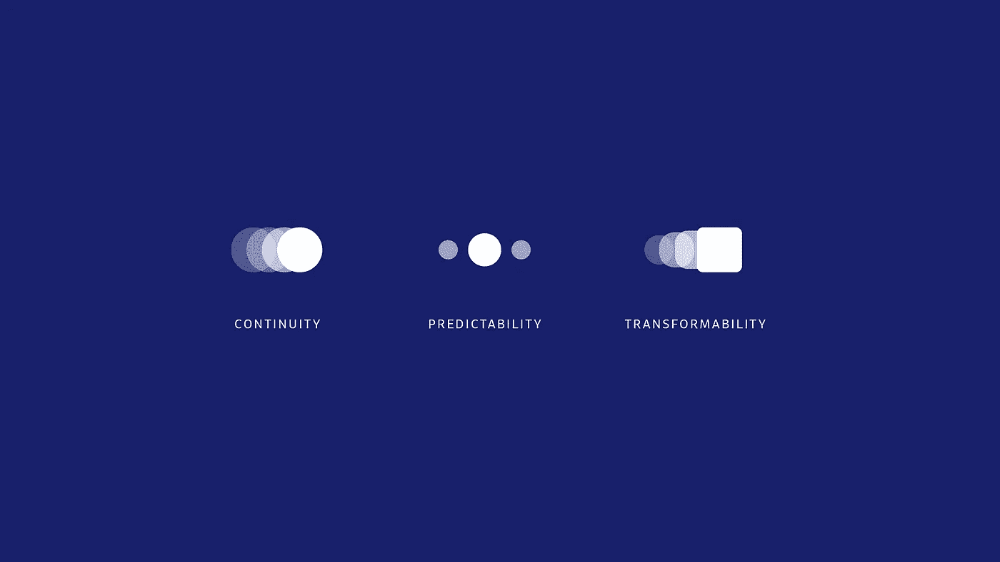
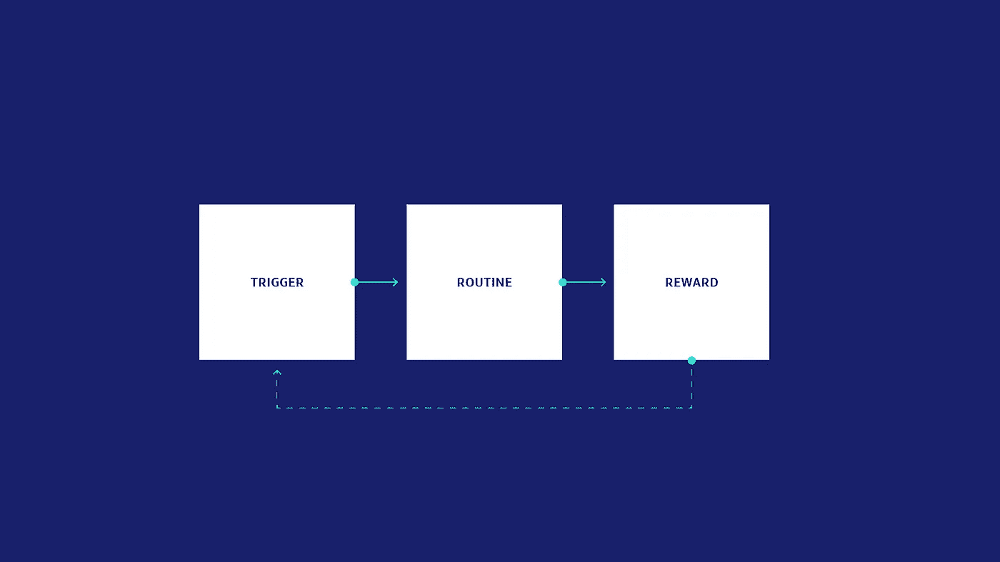
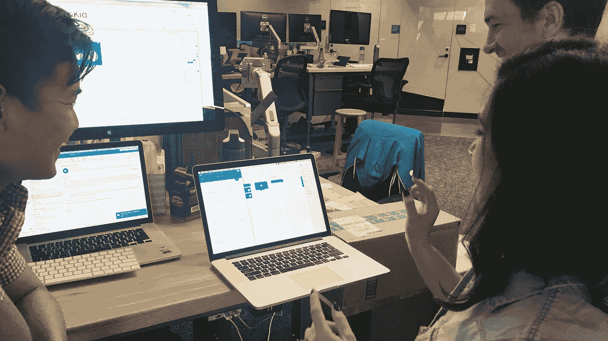
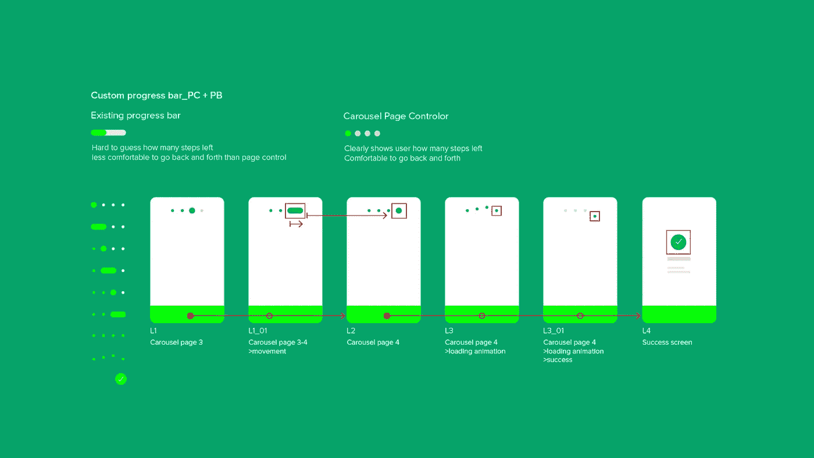
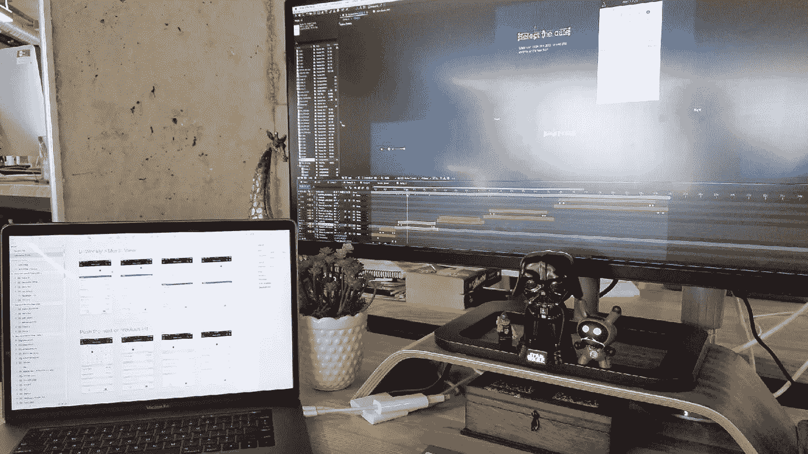

# 通过开发人员和设计人员的合作，将微交互和 UI 动画带入生活

> 原文：<https://medium.com/capital-one-tech/bringing-delightful-micro-interaction-and-ui-animation-to-life-through-developer-designer-3c409bc326f?source=collection_archive---------0----------------------->

我们可以通过微交互和 UI 动画为用户创造愉悦的体验！

嗨，我叫京·金，我在第一资本公司做产品设计师已经两年了。在我的工作中，我一直在使用微交互和动画，包括一些你自己可能也用过的移动项目。在我开始从事技术工作之前，我的背景是电影。在电影中，重点是讲故事和剪辑，以创造一个吸引观众的故事；其中大部分是通过使用过渡来完成的。当我为数字工具创造经验和故事时，我发现这些技能今天很有用。

当我在设计时，我会考虑一些因素，这些因素会给用户带来过渡和讲故事的愉快体验。

一个产品要给用户带来愉快的体验，它必须提供比美观的设计和令人印象深刻的动画效果更多的东西。

> 无论产品是基于应用程序、基于网络还是任何其他形式的数字产品，它都必须吸引用户，让他们愉快地使用，并让他们有机会以直接和有意义的方式参与其中。

微交互有能力让用户体验愉悦和满足，这是许多设计元素无法做到的。在我们进入产品设计的微观交互之前，让我们先从基础开始。

***它们是什么？为什么对用户体验有好处？为什么设计师和开发者要把它们融入到工作中？产品设计团队如何合作来改进它们？***

# 什么是微互动，为什么要关心微互动？

什么是微交互或者 UI 动画？人们通常称它们为漂亮的动画、运动图形或运动图像设计。然而，它们远不止于此。

> **与其他形式的动画不同，微互动直接吸引用户，使他/她能够完成各种任务，并以直观有效的方式与产品互动。**

如果我们将这一点与良好系统设计的原则联系起来，这将增强并实现用户的系统反馈。如果做得正确，用户会将微交互视为来自用户的信息，即它(系统)正在做它应该做的事情，以响应用户的需求。

即使你不知道什么是微互动，你也会定期参与其中。每当你使用一个应用程序或基于网络的产品来完成一项特定的任务时——无论是阅读新闻、购物、玩游戏、创建个人资料，还是调整你的设置和通知偏好——你所做的每一个单独的动作都构成了一个微交互。微交互无缝地编织到产品的平台中，使其功能透明且可访问，有效地改善了用户的整体体验。

尽管这些“行动”采取了多种不同的形式，但一些常见的例子包括:

*   当我们将商品“移动”到虚拟购物车时。
*   当我们在类似 CTA 的切换按钮上的两个选项之间进行选择时。
*   当我们“下拉”以刷新新闻提要并查看最新更新时。
*   当我们在长输入或页面中“上下滚动”时。

当我们设计一个微交互时，我们需要检查它对用户的体验是否真正必要和至关重要。否则，它有可能分散用户使用你的产品的注意力，或者成为视觉噪音。

# 微观互动原理

我在设计微交互的时候，总会考虑三个原则。

1.  **连续性(和微妙性)**

微交互元素应该是微妙的，这样当用户做出一个动作时，他/她的体验就会有一个连续的流动。例如，如果我们在一个长提要中创建一个滚动动画，用户应该能够关注页面的内容而不是滚动动画本身。

2.**预见性**

高质量的微交互具有可预测性，这使得用户能够有效且高效地浏览产品。用户可以准确地预测他们的行动的效果，对逆转他们感到舒适，并对他们按照预期执行的能力充满信心。

3 **。** **可变形性**

多屏幕之间的流畅转换和其中各种对象的明确转换是高质量微交互的关键方面。它们使用户能够对屏幕和其中的元素之间的关系有一个直观的理解。

当遵循这些原则设计时，微交互通过帮助用户知道如何与它交互来为设计提供背景。微互动是完成单一任务的瞬间事件。可以说，微交互是网站或应用程序设计中最小的交互元素，但也是最重要的元素，因为它们提供了各种核心功能。

触发器(点击、滑动、拖动等)启动上一节列出的每一个动作(连续性、可预测性和可变形性)。用户在网站或应用程序上执行一个操作来开始该过程(即使它在初始步骤之后继续)。这遵循来自用户的行动号召模式、由界面确定的参与规则(将发生什么和如何发生)、来自用户的反馈(它是否工作)以及模式或循环(行动是否发生一次或按照计划重复)。

# -开发人员和设计人员如何合作，将微交互带入生活

正如你所看到的，微交互在塑造用户体验方面有着至关重要的作用。因此，作为一名产品设计师，它们已经成为我工作中越来越重要的一部分。在跨多个平台和用途的各种项目中工作过之后，我注意到并不是每个人都认识到这些元素的价值或者如何有效地创建它们。更重要的是，团队成员通常不知道如何向其他人表达他们关于设计过渡和微交互的想法。

我意识到这一切都归结于沟通——当我向开发人员解释我的设计想法时，有些东西在翻译中丢失了。你可能听过孔子的这句话，“告诉我，我会忘记。给我看，我也许会记得。让我参与进来，我会理解的。”作为一个设计师和开发人员团队，正是通过参与，我们才能创造出卓越的体验。

***首先，让我们快速描述一下设计流程……***

在理想情况下，当设计师想出一个微交互的想法时，传统的工作流程按以下顺序进行:

1.  设计师开发实现他/她的想法所必需的视觉元素和动画效果。
2.  设计师向其他团队成员展示最终模型及其基本概念。

但是如果设计过程在实践中不像在理论上那样发挥作用呢？如果我们正在展示一个故事板或者一个不完整的模型呢？还是团队里的其他人在设计模型？

当这种情况发生时，问题很可能出现在演示或开发中。这些问题通常分为三类:

1.  动画创意传达得不够清楚。

如果你试图用文字或静止图像来描述一个动画概念，你可能会在观众的脸上看到鬼脸。这意味着他们在尽力理解你的想法，但他们并没有真正理解。即使他们理解了基本的概念，他们脑海中想象的画面也可能与你想象的不一致。因为人们倾向于以不同的方式感知运动图像、静止图像和文字描述，所以依靠文字或图像来传达动画想法会产生误解，并且经常会在团队成员之间产生不必要的紧张。

2.设计师在检查和测试开发人员的原型之前，不知道动画是否运行良好。

当设计师不具备原型制作技能时，他们只能通过故事板向开发者推销他们的想法。即使一个设计师非常相信一个微交互模型，他或她也不能说它是否发挥了全部潜力，直到开发人员完成原型。由于许多原因，这是有问题的，主要的一个原因是这种方法在过程中引入了很高的错误传达的可能性。此外，它打开了团队成员怀疑的大门，并导致对想法可行性的质疑。从发展的角度来看，这可能会耗费大量的时间。

**3。设计者和开发者不在一个页面上**

当设计者制作 UI 动画或微交互时，他们试图包含复杂的设计细节，如定制的场景、脚本、表达式和其他效果。当向开发人员展示这些想法时，他们可能会听到，*“在我们的时间线内不可能做到这一点，”*或*“我们不能做到完全一样，但我们会努力的。”在这一点上，他们可能会尝试与开发人员一起解决各种细节和技术问题。然而，如果设计师不具备开发人员使用的工具或语言的工作知识，这些讨论可能会无果而终。在制定和讨论想法时，应该考虑这些因素，以便微交互与开发人员的默认设置兼容，增加最终产品符合设计师(和其他人)标准的可能性。*

# 这些问题的解决方案是什么？

虽然所有的设计师和开发人员都有他们自己交流动画概念的方式，但我想分享我的团队正在使用的一种方法。这种方法非常成功，减少了会议次数，极大地改善了我们团队的沟通。

现在，我们不再争论是否包含微交互，我们正在探索让它们变得更好的方法！

## 框架交互概念和交互指南

> “框架交互概念和交互指南没有留下解释的余地，这使我能够立即开始工作，并有信心符合设计师的愿景。”–Jesse M . maj cher/首席 IOS 工程师

我们用来交流 UX 设计的标准流程并不适用于 UI 动画。首先，UX 的设计和流程仍然是逐屏设计的，是静态的。UI 动画本身就是流，它们是流动的，并且基于时间。当我们创建一个静态设计时，我们制作一个粗略的线框，这样我们就可以理解这个想法并讨论流程。这允许我们在创建最终版本之前轻松地修改和微调设计。一旦每个团队成员都同意将设计交付给开发人员，设计人员就向开发人员提供一个风格指南和一条红线，其中包含细节、规格和其他有关设计的重要信息。

如果我们对动画使用类似的过程，我们的过程可能会更快更好。

1.  **骨骼交互概念(运动研究)**

骨架交互概念类似于你在设计 flow 时创建的线框，主要区别在于这是一个可播放/可点击的原型演示。如果我们把这个带到会议上，我们的团队成员就不必运用他们的想象力去理解这个概念。设计师可以使用可播放/可点击的演示或静态故事板来直接引用设计的视觉和动画元素。这将使每个人对自己的想法有一个清晰而准确的认识。反过来，合作伙伴可以提供非常具体的反馈，因此对设计师非常有价值。同时，产品管理和开发团队将获得信息，这些信息将使他们能够改进项目的内部沟通和时间估计。

2.**互动指南**

一旦团队就概念达成一致，设计师就可以创建交互指南。这类似于样式指南，它概述了元素的位置、旋转、缩放和计时。我们可以添加关于动画的每个细节，这将有助于我们的合作伙伴清楚地理解它。当设计师向他们的合作伙伴展示交互指南时，他或她可以更清楚地了解动画概念的移动和测量。这对于通过协作完成工作非常有帮助。这也有助于设计师在他们的动画/微交互设计中更加深思熟虑。

3.**设计师的原型制作技巧**

以我的经验来看，要让你自己为一个成功的设计合作做好准备，产品设计师应该是动画的驱动者，而开发者应该提供支持。这意味着产品设计师在合作中承担大部分责任。他们不仅有责任非常清楚地解释他们的想法，他们必须通过提供概念证明来表明他们是可行的。这也意味着产品设计师需要能够制作自己的动画原型。如果一个产品设计师可以创建一个原型，并在会议上展示，接下来的讨论将更加清晰，耗时更少，从而导致更有效的整体沟通过程。

那么，设计师应该熟悉哪些类型的原型工具呢？有很多工具，但不是每个人都知道什么对特定的微交互任务最有效。以下是我根据设计这些元素的个人经验提出的建议。

**如果你熟悉编码:**

*   手机:Xcode，Android studio
*   移动或网络:框架
*   Web: CSS 动画

**如果你想设计一个类似屏幕的推送和模块之间的交互:**

*   视觉和大理石

**如果你想创造更详细的互动:**

*   原理，Adobe CC，origami Studio 和 Pixate

**如果你想创建详细的交互+动画:**

*   后遗症

目前，我很喜欢在我的原型制作中使用 After Effect。即使它不是交互式的(例如，可点击的)，它也是呈现动画概念的完美方式。此外，没有效果的限制，你可以控制细节的移动。它甚至可以用来在 3D 空间中进行交互，就像 AR 和 VR 一样。

# 令人愉快的团队互动造就了令人愉快的产品

微交互已经变得越来越重要——如果不是至关重要的话——是网页、手机设计等等的元素。即使设计人员和开发人员都认识到了 UI 动画的价值，并且有动力去创建它们，他们也常常很难以一种高效的方式进行协作。按时运送伟大的微交互需要强大的团队；这样的团队需要清晰的角色划分，有效的沟通技巧，以及合适的原型工具来完成手头的任务。

为了让你的微观互动取得成功，确保你的团队拥有这些特征并参与这些过程。祝你自己的微互动之旅好运！

***披露声明:以上观点为作者个人观点。除非本帖中另有说明，否则 Capital One 不属于所提及的任何公司，也不被其认可。使用或展示的所有商标和其他知识产权都是其各自所有者的所有权。本文为 2017 首都一。***

***欲了解更多关于 Capital One 的 API、开源、社区活动和开发者文化，请访问我们的一站式开发者门户网站 DevExchange:***[***【developer.capitalone.com】***](https://developer.capitalone.com/)***。***