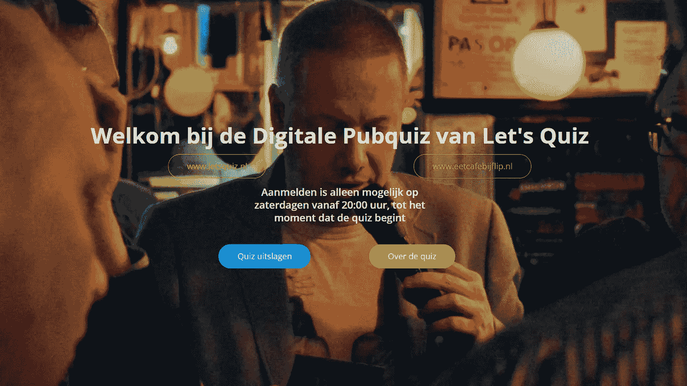

# 将酒吧测验带入数字世界

> 原文：<https://medium.com/mendix/bringing-the-pub-quiz-to-the-digital-world-8c3618c061be?source=collection_archive---------3----------------------->

根据定义，[酒吧智力竞赛](https://en.wikipedia.org/wiki/Pub_quiz)是“*在酒吧或酒吧*举行的智力竞赛”。在当前，电晕影响，社会，这是不幸的不再是一个选项。我们生活在一个陌生的世界，这个世界需要我们认为永远不需要回答的问题的答案。
我问自己的一个问题是:“*我怎样才能让一个数字酒吧问答游戏和一个真实的现场问答游戏一样有趣，尽管这个问题远不是最紧迫的问题之一？*”

www.digitalepubquiz.nl

**背景** 在我担任 Mendix 顾问的四年时间里，我曾在业余时间尝试开发许多 Mendix 应用程序来解决相关(也有不太相关)的问题。
我本人是一个酒吧智力竞赛爱好者，但无法参加我最喜欢的消遣——现实生活中的酒吧智力竞赛，我于 3 月 21 日通过脸书直播观看了第一次数字版。它仅仅包括团队写下答案，然后为自己标记正确的答案。团队之间没有互动，没有共同外出的感觉，或者感觉自己是比自己家更大的群体的一部分。

**应用开发是如何启动的？第一次数字酒吧测试的第二天，我开始开发一个新的应用程序，试图改善体验。可以提交和检查答案的第一个工作版本很快就完成了。作为一个初学者应用程序，我选择了已经嵌入了多页向导功能的表单模板。这很容易适应，所以每一轮酒吧测验都是向导中的一步。出现的一个有趣的挑战是，在奇数个团队参加的测验中，确保最后一个提交答案的团队不会检查自己的答案。通过检查必须提交答案的剩余团队数量，并确保最后三个团队被调换 A- > B- > C- > A，而不是 A<->B。
由于领域模型实际上只存在三个相关实体(测验、团队、回合)，其余的功能实现起来并不困难。**

有 10 个团队的第一次测试是成功的，但真正的挑战是在快速激励之后，很明显有 200 多个团队宣布他们有兴趣在下周加入！

要做到这一点，我必须在 Mendix 免费应用程序环境的限制上更有创造性，特别是因为每个应用程序的并发会话数量有限。最终，我决定创建一个供人们注册的管理员应用程序，以及数量可扩展的测验应用程序(注册时人们将被重定向到这些应用程序)，这些应用程序都运行相同的 Mendix 模型，并通过 REST 服务将订阅的团队和测验结果传递给管理员应用程序。这样，参与者就可以共享测试体验，同时将负载分配给多个应用程序。

这个应用程序是如何工作的？
这款应用提供了数字版的现场酒吧问答游戏的几个特点。人们不仅可以回答问题，还可以检查其他参与团队的答案，还可以与管理员一起验证他们的结果。当然，有一个最终结果列表，你可以将自己的分数与所有其他团队的分数进行比较，这也是创造原始酒吧问答氛围的一个重要部分。

**经验教训**
同时使用多个应用程序，显然会带来许多单个应用程序所没有的困难。确保人们知道在哪里登录被证明是一个问题，而且额外的工作来自于必须在所有应用程序之间切换以监控团队的进展和验证结果。我非常感谢我选择的 Forms starter 应用程序自带的默认样式。我在以前尝试自己开发应用时学到的一件事是，如果你想让人们使用并持续使用你的应用，一个好看的外观和感觉是至关重要的。

另一件事是，我在构建这个应用程序的过程中进行了大量实践，以确保功能尽可能地可重用。由于重复的性质(回答、检查、复习…第一轮、第二轮、第三轮…)，相同的功能经常重复，但变化很小。尤其是在构建页面的过程中，我真的学到了很多关于条件可见性的选项和代码片段的用法。

**接下来是什么？**
我目前正在与 Mendix 联系，看看是否有可能提供一个云环境，消除使用多个免费应用程序陪伴大量参与者的需要。
由于大型聚会的禁令可能不会很快解除，应用程序的开发仍在继续，以便在这个社交距离和远程聚会的时期保持可持续性。

如果你想尝试用 Mendix 提供的优秀模板制作自己的简单应用程序，请点击[此处](https://templates.mendix.com/)进行尝试。如前所述，这个应用程序使用了 forms 应用程序模板。

如果你想参加数字酒吧竞猜，可以去 [www.digitalepubquiz.nl](http://www.digitalepubquiz.nl) 。每周六晚上 9 点将举行一次测验(荷兰语)。