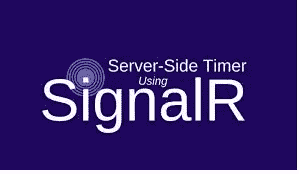
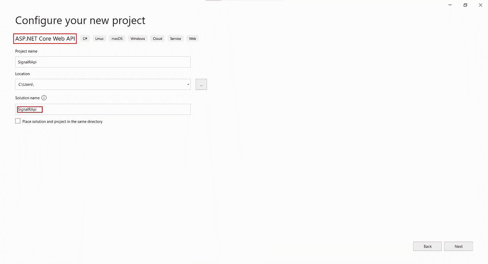
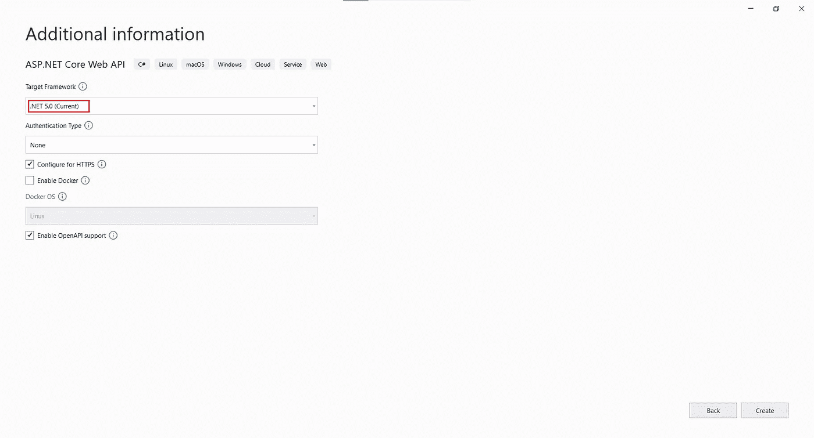
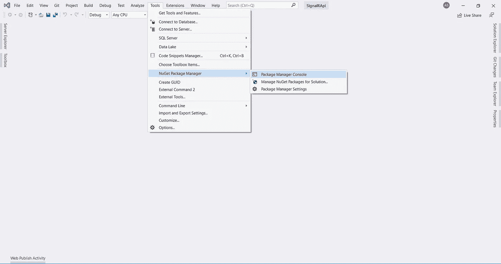
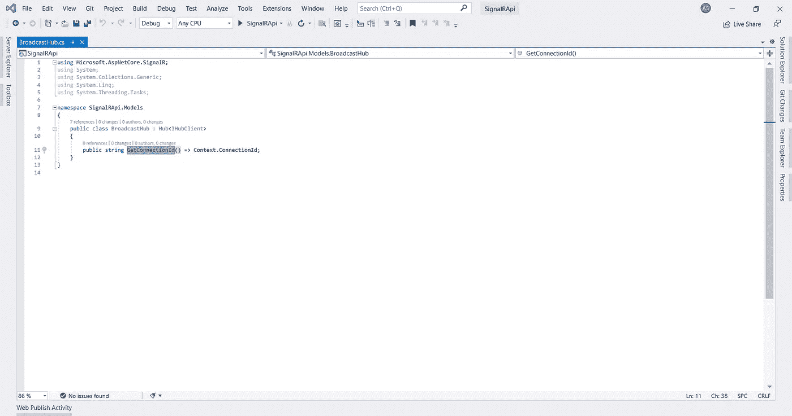
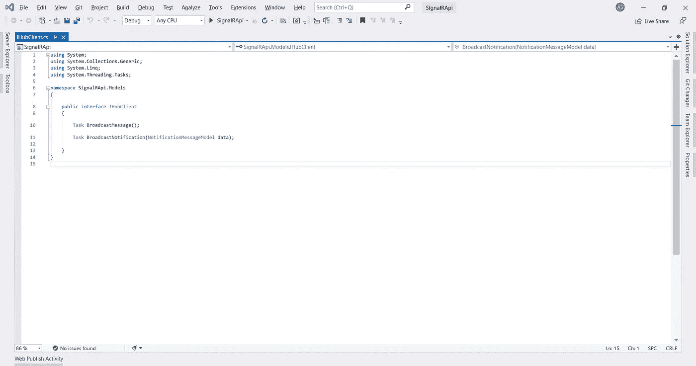
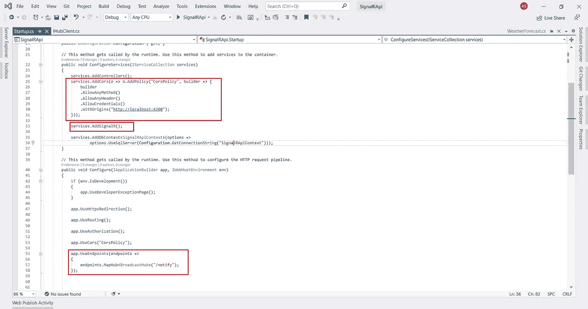
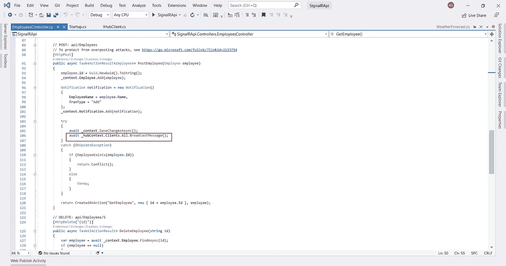
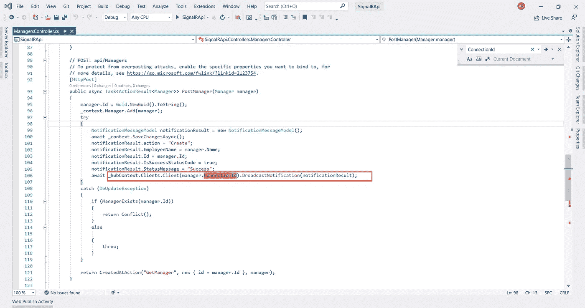
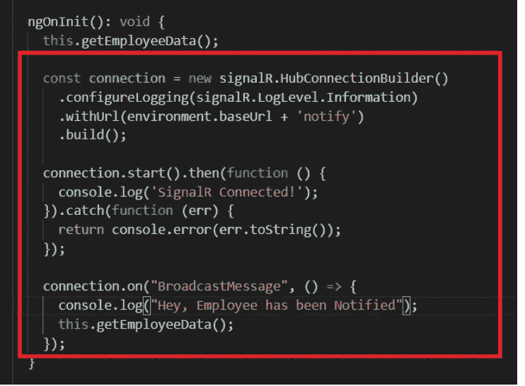

# 使用 Angular &通过 SignalR 广播消息。网络核心 API

> 原文：<https://medium.com/globant/broadcasting-messages-with-signalr-using-angular-net-core-api-e8d893dd11de?source=collection_archive---------0----------------------->

PC: Google Images

本文简要介绍了如何使用 SignalR 向实时 web 应用程序广播消息。

# 阅读本文后，您会:

*   了解信号 R 的基本概况及其在现实世界中的应用。
*   建立项目。
*   检查代码。

**先决条件**

这篇文章有一些附加条件。您应该对在 REST API 中公开 CRUD 操作有一个大致的了解&通过任何 web 应用程序使用它。对于本文，我使用 Angular 9(兼容 Angular 的所有版本)来消费和显示数据。

***工具/框架/语言***

*   [Visual Studio 201](https://visualstudio.microsoft.com/downloads/) 9 与**ASP.NET**工作量
*   [Visual Studio 代码](https://code.visualstudio.com/?wt.mc_id=vscom_downloads)
*   [角度 CLI](https://angular.io/guide/setup-local)
*   [Node.js](https://nodejs.org/en/)
*   [微软。AspNet.SignalR( *版本* 2.4.2)](https://www.nuget.org/packages/Microsoft.AspNet.SignalR/)

# 介绍

SignalR 是一个开源库，用于简化向应用程序添加实时 web 功能的过程。

> **实时 web 功能**能够让服务器代码在内容可用时立即将内容推送至连接的客户端，而不是让服务器等待客户端请求新数据。

它提供了一个简单的 API，用于创建从服务器端调用客户端浏览器(和其他客户端平台)中的 JavaScript 函数的服务器到客户端的远程过程调用(RPC)。NET 代码。它还包括用于连接管理(例如，连接和断开事件)和连接分组的 API。它自动处理连接管理，并让您同时向所有连接的客户端广播消息，就像一个聊天室。您还可以向特定的客户端发送消息。客户端和服务器之间的连接是持久的，不像传统的 HTTP 连接，每次通信都要重新建立连接。

> SignalR 支持 ***【服务器推送】*** 功能，其中服务器代码可以使用远程过程调用(RPC)在浏览器中调出客户端代码，而不是当今 web 上常见的请求-响应模型。

SignalR 应用程序可以使用内置的第三方扩展提供程序扩展到数千个客户端。

# SignalR 和 WebSocket

SignalR 在可用的地方使用新的 WebSocket 传输，并在必要时回退到旧的传输。虽然你当然可以直接使用 WebSocket 编写你的应用程序，但是使用 SignalR 意味着你需要实现的许多额外功能已经为你完成了。最重要的是，这意味着您可以编写应用程序来利用 WebSocket，而不必担心为旧客户端创建单独的代码路径。SignalR 还让您不必担心 WebSocket 的更新，因为 SignalR 已更新为支持底层传输中的更改，为您的应用程序提供了跨 WebSocket 版本的一致接口。

# **信号装置的应用**

1.  **通知**:如果你想通知单个客户或所有客户，那么我们可以使用 SignalR。通知可以是一些警告、提醒、反馈或评论等等。
2.  **聊天**:使用 SignalR 很容易实现一个聊天应用程序，可以是一对一聊天，也可以是群聊。
3.  **游戏** : SignalR 帮助创建一个游戏应用程序，该程序需要频繁地从服务器推送等等。

**我使用信号 R 的用例**

> 在一个处理大量数据和许多用户的项目中，我们使用了计时器，它在特定的时间间隔内调用服务器来了解工作(它可以是批准/拒绝场景或文件导入等)。)状态，基于该状态需要向哪些客户端通知工作完成状态。当有大量用户时，这些计时器会影响应用程序的性能。
> 
> 所以为了提高性能，我们选择使用 SignalR 让服务器通知客户端是否有任何后台更新。

# 让我们展示一些代码…

为了理解 SignalR 是如何工作的，我创建了一个旨在管理员工和经理的 web 应用程序。当我们对员工数据执行 CRUD 操作时，我们将从 Angular 应用程序中的 SignalR hub 获得广播消息，并立即在所有连接的客户端浏览器中显示修改后的数据。

> 为了能够使用 SignalR，我们需要在 API 中将其添加为 NuGet 包，在节点模块中将其添加为 npm 包。

**步骤**

## **1。API 端点**

*   在 Visual Studio 中，创建一个 ASP.NET 核心 Web API 应用程序。

Fig-#1

*   单击 Next 后，选择要使用的目标框架。对于本文，我使用了**。NET 5.0** 。

> 注意:-我们选择了默认的“启用开放 API 支持”选项。这个特性将帮助我们在应用程序中启用 swagger API 文档。

Fig-#2

*   我们现在可以为我们的 API 创建 CRUD 操作。要了解同样的*待办事项*步骤，可以参考 [Web API 创建](https://docs.microsoft.com/en-us/aspnet/core/tutorials/first-web-api?view=aspnetcore-6.0&tabs=visual-studio)。
*   我们可以安装 NuGet 包 ***“微软。*AspNet . SignalR**现在。
*   要安装 NuGet 软件包，我们可以导航到软件包管理器控制台并输入以下命令:

> **安装包微软。AspNet . SignalR-版本 2.4.2**

Fig-#3

## **2。信号代码配置**

*   我们创建了 **IHubClient** 接口和 **BroadcastHub** 类来向 Angular 应用程序广播实时消息。**接口和类都将用于向 Angular 应用程序广播实时消息。**

Fig-#4

**注意:-** BroadcastHub 继承自 Hub < IHubClient >。 ***Hub 类提供了与连接到 Hub 的 SignalR 连接进行通信的方法。***

Fig-#5

## 3.Startup.cs 更改和创建通知中心

Fig-#6

> 在注册 SignalR 之前，请确保您已经调用了 CORS 中间件。我们可以在[CORS](https://docs.microsoft.com/en-us/aspnet/web-api/overview/security/enabling-cross-origin-requests-in-web-api)大会上深入了解更多信息。

## 4.广播消息

在创建任何新员工并保存更改后，我们会将更改通知客户。

Fig-#7

SignalR 支持两种类型的消息:-
1。客户。All — 用于向连接到 SignalR 服务器的 ***所有*** 客户端广播消息。
2。**客户。Client(ConnectionId)** —用于根据**图 4** 中指定的 ***连接 id*** 向 ***特定客户端*** 广播消息。

Fig-#8

## 5.UI 集成

*   使用下面的命令创建一个新的角度应用。
    **ng 新信号员**。
*   我们可以选择创建路由的选项。(默认情况下，它为假)
*   安装所有节点包需要一些时间。我们可以使用下面的 npm 命令安装 **Signal R Client** 包。
    **npm 安装**[**@微软/signalr**](http://twitter.com/microsoft/signalr) 。
*   现在，我们可以创建组件并集成 API 来执行 CRUD 操作。有关 API 与 Angular 集成的更多信息，我们可以参考[**Angular-API-Integration**](https://angular.io/tutorial/toh-pt6)。
*   为了收听服务器广播的消息，我们需要与***SignalR hub connection builder***建立连接，连接开始。此连接将从服务器侦听来自 SignalR hub 的消息。每当服务器发送消息时， ***不刷新*** 所有浏览器(即多个会话)将被通知更新后的信息。
*   我们需要将下面的代码添加到组件的 ngOnInit()中，在这里我们要监听广播的消息。在我的例子中，我已经调用了 employees.component.ts。

**总结**

我们了解了如何使用 SignalR 为我们的应用程序提供实时功能。*此外，我们已经使用 SignalR hub* 从服务器向所有连接的客户端广播了一条消息。

***参考文献***

1.  [教程:与 SignalR 2 |微软文档的实时聊天](https://docs.microsoft.com/en-us/aspnet/signalr/overview/getting-started/tutorial-getting-started-with-signalr)

# 感谢阅读。请在下面随意评论您对这篇文章的想法…