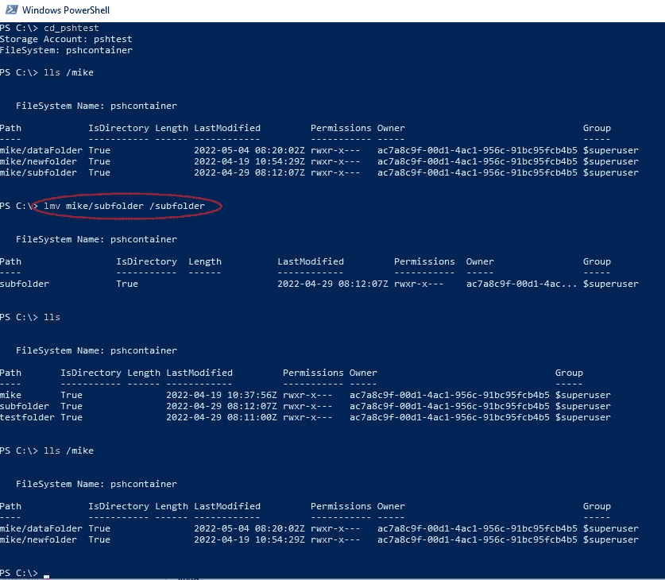
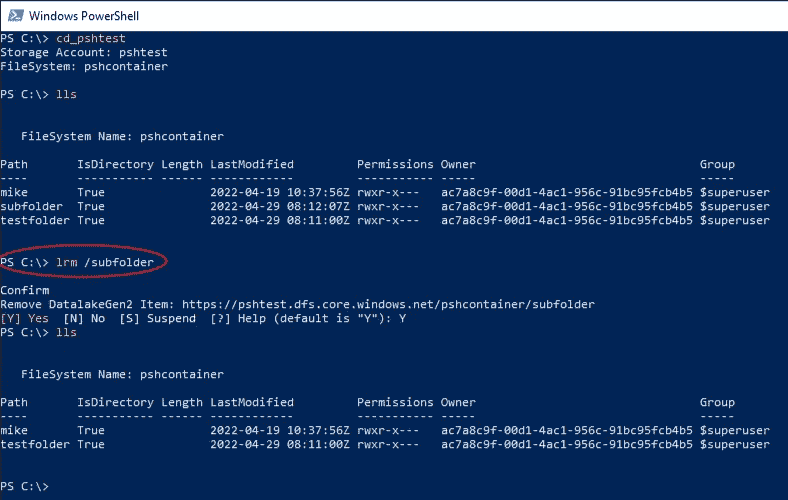

# 使用 PowerShell 浏览 ADLS 第 2 部分

> 原文：<https://medium.com/version-1/browsing-adls-with-powershell-part-2-b2c29f2c85d4?source=collection_archive---------7----------------------->

## 使用 Linux 文件系统命令在命令行上使用 Azure 数据湖存储

在[第 1 部分](/version-1/access-adls-g2-with-unix-filesystem-commands-part-1-5c7e2584a4f9)中，我们设置了从命令行移动 ADLS G2 的基础，在第 2 部分中，我们将添加命令来模拟 ***mv，rm & md*** ，以便我们可以在 Azure Data Lake 中创建文件夹以及删除和移动文件。

该过程与在[第 1 部分](/version-1/access-adls-g2-with-unix-filesystem-commands-part-1-5c7e2584a4f9)中设置 ***ls*** 命令非常相似:

*   为我们想要模拟的文件系统命令创建一个函数
*   使用 ***cd*** 功能设置存储上下文
*   调用函数传递路径进行 ***移动，删除*** 或 ***制作目录*** 动作

## 使用 lmv 和 lrm 的示例

用 **lmv:** 将**文件夹**从 mike/subfolder 移动到文件系统的根目录

move “subfolder” to the root of our ADLS filesystem

使用 **lrm:** 移除我们刚刚移动的文件夹

We even get a nice friendly Confirm? prompt :-)

原来真的是这样！ ***lmv、lmd & lrm*** 函数的代码在下面的完整列表中，我还包括了第 1 部分的故障排除部分。

## 快速设置—完整代码

*   安装**和 *Az。存储*** PowerShell 模块
*   将完整的[代码列表](https://gist.github.com/SinisterChinaPenguin/fe7a867aeb789bf03bcc219d68c7245c)添加到您的个人资料中…

设置以下项目的值:

*   **Line 1** $tenantID 为您想要连接的 Azure 租户设置值

为每个 ADLS 文件系统设置“CD”命令，例如

*   **第 32 行**设置存储帐户名称
*   设置您的 ADLS 文件系统名称

(或者将其用作模板，并创建自己的 CD 函数来连接到 ADLS 存储帐户\文件系统)

(full code listing [here](https://gist.github.com/SinisterChinaPenguin/fe7a867aeb789bf03bcc219d68c7245c))

## 进一步修饰

总有改进的空间，以下是我对如何改进代码的一些想法:

*   将租户放入 cd 命令中，以允许我们在租户之间移动
*   在 cd 之后执行 ls，这样我们可以看到我们移动到了哪里
*   使用不同的认证机制而不是 AAD，您可以在“CD”功能中设置它—参见文档[此处](https://docs.microsoft.com/en-us/powershell/module/azure.storage/new-azurestoragecontext)。
*   添加一个命令来模拟 Unix“touch”命令，以创建新文件。
*   使用 PowerShell Blob 命令，如 **Get-AzureStorageBlob** 以同样的方式浏览 Blob 存储。

# 解决纷争

*   您必须重新启动 PowerShell 窗口来加载新的配置文件。
*   授权错误可能需要您管理 ADLS 文件系统上的 ACL，以授予自己读\写\执行权限。
*   运行 ***Clear-AzContext***
*   **Get-azdatalakegen 2 child item:该请求未被授权使用该权限执行该操作。您将需要在您的 ADLS 文件系统上管理 ACL \ RBAC，以给自己读\写\执行权限。**

## 最后

我知道我的 PowerShell 不是最好的，例如，使用全局变量不是最佳实践，我相信它可以得到改进，因此欢迎评论和建议！

**关于作者:**
Mike Knee 是这里 1 版的 Azure 数据开发者。