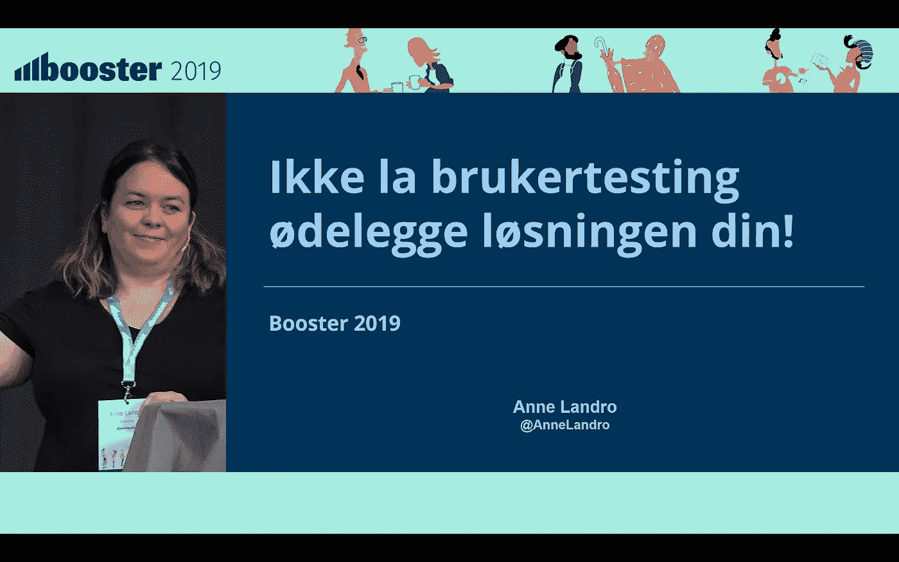

# Brukertesting og annet snacks på Booster 2019

> 原文：<https://medium.com/compendium/brukertesting-og-annet-snacks-p%C3%A5-booster-2019-7cf80e2b64fc?source=collection_archive---------2----------------------->

I forrige uke var jeg på [Booster 2019](https://2019.boosterconf.no/) for å prate om noen av tingene jeg brenner for (i dette tilfellet: domenedrevet design og brukertesting).

Booster er en av favorittkonferansene mine (i tillegg til [DDDEurope](http://dddeurope.com/) ). Litt har nok med å gjøre at konferansen er i verdens beste by (ja, Bergen, ja :) ), men mest er det fordi det er en utrolig koselig og avslappet stemning, mange flinke folk, og veldig godt program der.

Som funksjonell arkitekt, er det ikke alltid like lett å finne foredrag og workshops som er superrelevante for meg. På Booster har jeg ofte motsatt luksusproblem — det er vanskelig å velge hvilken av de mange relevante trackene jeg skal gå på. Heldigvis var vi flere funksjonelle arkitekter fra Computas, og vi spredte oss litt rundt for å suge til oss mest mulig kunnskap. Siden workshopene ikke blir filmet, er det godt å kunne få oppsummering fra kollegene mine siden vi er et stykke unna menneskekloning.

Min absolutte favoritt (som heldigvis ***ble*** filmet), var opening keynote av Marie Moe — [Embodied vulnerabilities — Why I am hacking my own heart](https://2019.boosterconf.no/talks/1364) . Den var veldig inspirerende! :)

Selv holdt jeg et foredrag sammen med en kollega, Mads Opheim, om domenedrevet design som Computas la ut [link til tidligere i uken](/grensesnittet/computas-på-booster-2019-85007906b51d) .

I tillegg holdt jeg en lyntale om brukertesting, som dere kan se under.

# Ikke la brukertesting ødelegge løsningen din

> Brukertesting er enkelt å gjennomføre og gir masse innsikt på kort tid. Men det er fort gjort å gå i noen feller som gjør at designet ditt faktisk blir DÅRLIGERE av brukertestingen.
> 
> I denne lyntalen deler jeg noen skrekkhistorier hvor brukertesting førte til at løsningene våre ble dårligere, heller enn bedre. I tillegg deler jeg enkle løsninger som gjør at andre slipper å gjøre de samme feilene som vi har gjort.

Trykk på bildet for å se videoen