# 温习撰写文本颜色

> 原文：<https://medium.com/androiddevelopers/brushing-up-on-compose-text-coloring-84d7d70dd8fa?source=collection_archive---------3----------------------->

假设您的设计师要求您实现下面的草图:

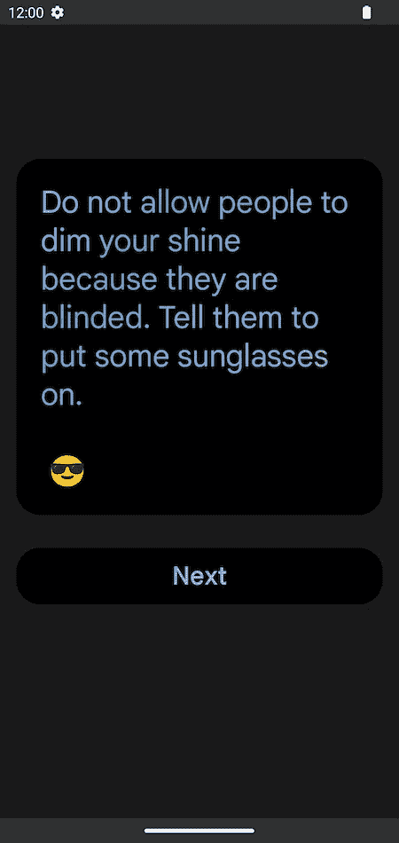

Screen design with a main `Text` and a `Button`

在 Jetpack Compose 中构建这个屏幕应该很简单，除了`[Text](https://developer.android.com/reference/kotlin/androidx/compose/material/package-summary#Text(kotlin.String,androidx.compose.ui.Modifier,androidx.compose.ui.graphics.Color,androidx.compose.ui.unit.TextUnit,androidx.compose.ui.text.font.FontStyle,androidx.compose.ui.text.font.FontWeight,androidx.compose.ui.text.font.FontFamily,androidx.compose.ui.unit.TextUnit,androidx.compose.ui.text.style.TextDecoration,androidx.compose.ui.text.style.TextAlign,androidx.compose.ui.unit.TextUnit,androidx.compose.ui.text.style.TextOverflow,kotlin.Boolean,kotlin.Int,kotlin.Function1,androidx.compose.ui.text.TextStyle))`的渐变颜色。

让我们探索一下在[版本 1.2.0](https://developer.android.com/jetpack/androidx/releases/compose-ui#version_12_2) 之前，您可以用来在 Compose 中实现渐变的一些通用策略。

第一种方法是使用 Compose 的`[Canvas](https://developer.android.com/reference/kotlin/androidx/compose/ui/graphics/package-summary#Canvas(android.graphics.Canvas))`，直接在原生的`[android.graphics.Canvas](https://developer.android.com/reference/android/graphics/Canvas)`上绘图:

一个更符合写作习惯的方法是在文本上使用`[drawWithCache](https://developer.android.com/reference/kotlin/androidx/compose/ui/draw/package-summary#(androidx.compose.ui.Modifier).drawWithCache(kotlin.Function1))`修饰符，以及一个`[Brush](https://developer.android.com/reference/kotlin/androidx/compose/ui/graphics/Brush)`:

*Text with gradient painted using Compose modifiers*

这里的策略是在文本上绘制一个带有渐变颜色的矩形，然后使用`[SrcAtop](https://developer.android.com/reference/kotlin/androidx/compose/ui/graphics/BlendMode#SrcAtop())`混合它，以确保只有文本可见，矩形的其余部分被剪切。然而，这种方法利用了表情符号(如上所示)和[内嵌内容](https://developer.android.com/reference/kotlin/androidx/compose/foundation/text/InlineTextContent)。

这两种解决方案都需要对绘图 API、`Canvas`和`[Paint](https://developer.android.com/reference/android/graphics/Paint)`有更深入的了解。从 [Compose 1.2.0](https://developer.android.com/jetpack/androidx/releases/compose-ui#version_12_2) 开始，我们有了一个更好的解决方案！

# 画笔 API

[Compose 1.2.0](https://developer.android.com/jetpack/androidx/releases/compose-ui#version_12_2) 在`[TextStyle](https://developer.android.com/reference/kotlin/androidx/compose/ui/text/TextStyle)`和`[SpanStyle](https://developer.android.com/reference/kotlin/androidx/compose/ui/text/SpanStyle)`中增加了`[Brush](https://developer.android.com/reference/kotlin/androidx/compose/ui/graphics/Brush)` API，提供了一种使用复杂颜色绘制文本的方式，渐变只是开始。

> 在`[TextStyle](https://developer.android.com/reference/kotlin/androidx/compose/ui/text/TextStyle)`中`[Brush](https://developer.android.com/reference/kotlin/androidx/compose/ui/graphics/Brush)`的所有用法都是实验性的，所以确保在必要的地方添加了`[ExperimentalTextApi](https://developer.android.com/reference/kotlin/androidx/compose/ui/text/ExperimentalTextApi)`注释。

您将使用两个主要组件:

*   `[**Brush**](https://developer.android.com/reference/kotlin/androidx/compose/ui/graphics/Brush)`:提供对默认画笔的访问，其中大部分是`[ShaderBrush](https://developer.android.com/reference/kotlin/androidx/compose/ui/graphics/ShaderBrush)`的实现(如`[LinearGradient](https://developer.android.com/reference/kotlin/androidx/compose/ui/graphics/LinearGradient)`、`[RadialGradient](https://developer.android.com/reference/kotlin/androidx/compose/ui/graphics/RadialGradient)`等)。
*   `[**ShaderBrush**](https://developer.android.com/reference/kotlin/androidx/compose/ui/graphics/ShaderBrush)`:当默认画笔不够用时，你可以扩展这个类来实现你自己的自定义画笔。

为了实现上面的设计，我们定义了渐变颜色列表，并在`TextStyle`上使用了`[linearGradient](https://developer.android.com/reference/kotlin/androidx/compose/ui/graphics/Brush#linearGradient(kotlin.Array,androidx.compose.ui.geometry.Offset,androidx.compose.ui.geometry.Offset,androidx.compose.ui.graphics.TileMode))`笔刷。

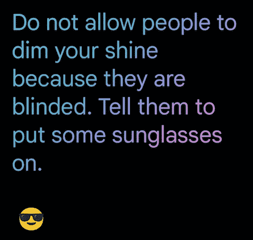

*Brush.linearGradient*

就是这样！真的就这么简单。值得注意的是，使用这个解决方案，画笔不会绘制表情符号，因为它们被底层着色器跳过。

# 默认画笔

`Brush`在其 API 中提供了各种预定义的笔刷样式。我们已经使用了`[linearGradient](https://developer.android.com/reference/kotlin/androidx/compose/ui/graphics/Brush#linearGradient(kotlin.Array,androidx.compose.ui.geometry.Offset,androidx.compose.ui.geometry.Offset,androidx.compose.ui.graphics.TileMode))`，并且您还有以下内容:

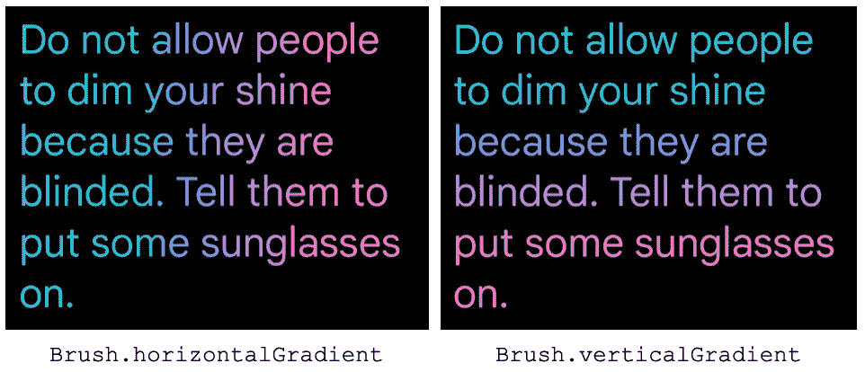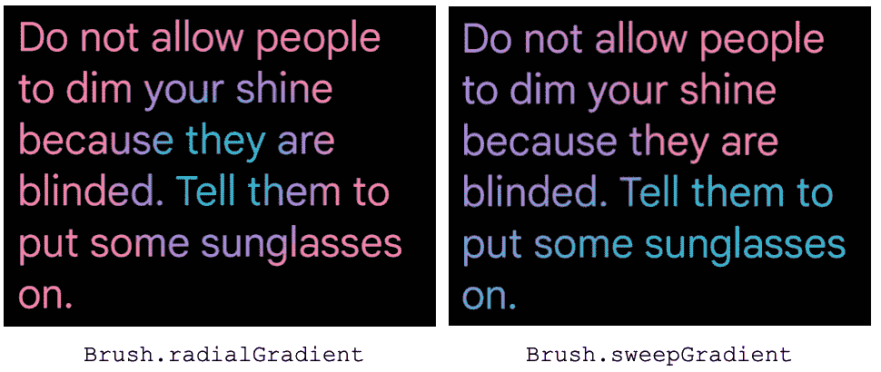

另外`SolidColor`用单一给定颜色刷油漆:

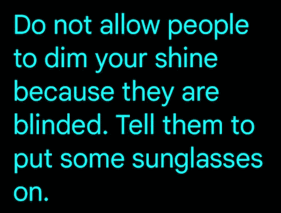

*SolidColor(Cyan)*

查看`Brush` [文档](https://developer.android.com/reference/kotlin/androidx/compose/ui/graphics/Brush)获取完整的 API 描述。

# 自定义画笔

在某些情况下，你可能需要确切地知道画笔的大小或绘制区域，并使用它来执行一些计算——比如减小画笔的大小以实现特定的平铺效果。下面，看看我们如何使用自定义笔刷来实现这一点。

## 重复颜色模式

想象一下，我们想要实现某种颜色模式重复三次。一个简单的方法是将笔刷大小减少到绘图区域的三分之一，然后重复这个过程。

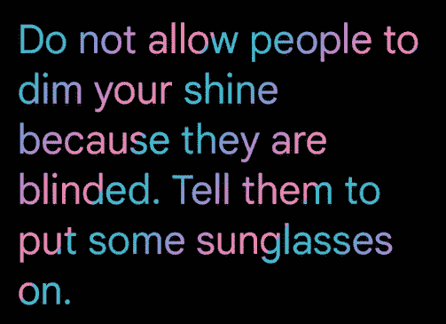

Design we want to implement with a repeated pattern

要访问画笔大小，你可以通过扩展抽象类`ShaderBrush`和覆盖`createShader()`方法来创建自己的`Brush`。

使用`[tileMode](https://developer.android.com/reference/kotlin/androidx/compose/ui/graphics/TileMode)`参数给出的策略重复梯度模式。

`tileMode`参数决定着色器如何填充其边界之外的区域的行为。由于重复的计算方式，在以下情况下可以更清楚地看到效果:

*   你的画笔被迫小于文本布局(就像这样)。
*   您的绘图坐标小于可用的绘图区域。
*   使用径向渐变画笔。

您可以使用以下平铺模式:

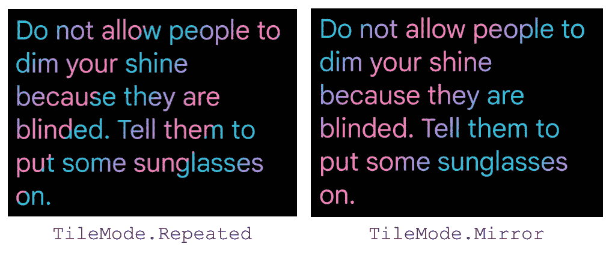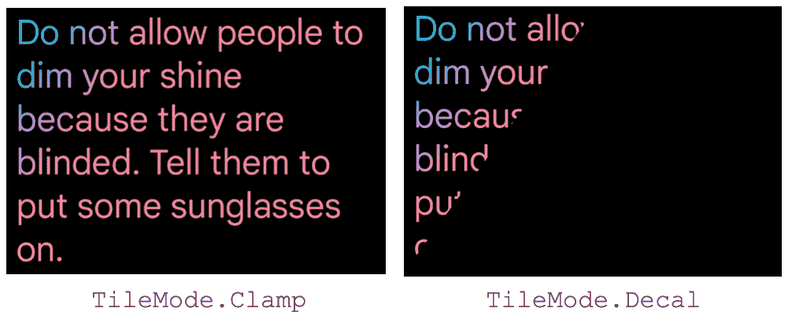

*   `[repeated](https://developer.android.com/reference/kotlin/androidx/compose/ui/graphics/TileMode#Repeated())`(刚刚在上面使用)在边缘重新开始颜色，重复该序列。
*   `[mirror](https://developer.android.com/reference/kotlin/androidx/compose/ui/graphics/TileMode#Mirror())`从最后到第一个镜像图案边缘的颜色。
*   `[clamp](https://developer.android.com/reference/kotlin/androidx/compose/ui/graphics/TileMode#Clamp())`将通过绘制渐变边缘的颜色来完成绘图区域:
*   `[decal](https://developer.android.com/reference/kotlin/androidx/compose/ui/graphics/TileMode#Decal())`启动 Android S (API 31)及以上版本支持，它绘制笔刷大小给定的图案，并用黑色完成其余的绘制区域。你可以通过使用`[isSupported](https://developer.android.com/reference/kotlin/androidx/compose/ui/graphics/TileMode#(androidx.compose.ui.graphics.TileMode).isSupported())`方法来检查这个`tileMode`是否被支持。如果不是，它将退回到`tileMode` `clamp`。

## 作为文本颜色的图像模式

假设我们需要使用图像的颜色作为文本颜色。例如，使用 Jetpack Compose 徽标，我们希望得到以下结果:

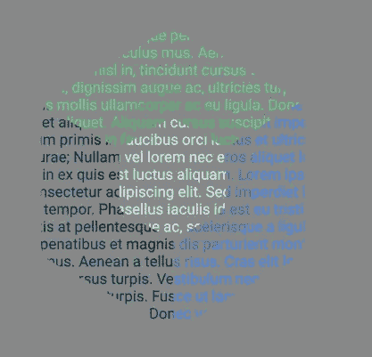

Text with colors defined by a Bitmap

为了实现这一点，我们使用一个方法来创建一个`ShaderBrush`，传入一个本机`[BitmapShader](https://developer.android.com/reference/android/graphics/BitmapShader)`并设置我们想要使用的`Bitmap`。

我们使用 remember 函数来跨重新组合保存`ShaderBrush`,因为创建一个着色器可能会很昂贵，并且每次调用 ShaderBrush 都会导致 BitmapShader 的新分配。

# 笔刷集成

刷子可与接受造型组件`TextStyle`和`[AnnotatedString](https://developer.android.com/reference/kotlin/androidx/compose/ui/text/AnnotatedString)`的所有元件一起使用。

例如，您可以为您的`[TextField](https://developer.android.com/reference/kotlin/androidx/compose/material/package-summary#TextField(kotlin.String,kotlin.Function1,androidx.compose.ui.Modifier,kotlin.Boolean,kotlin.Boolean,androidx.compose.ui.text.TextStyle,kotlin.Function0,kotlin.Function0,kotlin.Function0,kotlin.Function0,kotlin.Boolean,androidx.compose.ui.text.input.VisualTransformation,androidx.compose.foundation.text.KeyboardOptions,androidx.compose.foundation.text.KeyboardActions,kotlin.Boolean,kotlin.Int,androidx.compose.foundation.interaction.MutableInteractionSource,androidx.compose.ui.graphics.Shape,androidx.compose.material.TextFieldColors))`配置一个`Brush`样式:

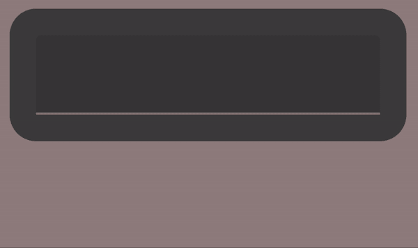

*TextField value styled with Brush*

当每个新输入的字符的状态发生变化时，确保使用`remember`函数在重新组合中保持画笔。

此外，一些性能优化是在幕后完成的。例如，将笔刷转换为着色器可能是一个昂贵的操作，但`[AndroidTextPaint](https://cs.android.com/androidx/platform/frameworks/support/+/androidx-main:compose/ui/ui-text/src/androidMain/kotlin/androidx/compose/ui/text/platform/AndroidTextPaint.android.kt?q=AndroidTextPaint%20)`优化了这一过程，使笔刷在合成之间不会改变(就像在这种情况下)。

要仅在文本或段落的选定部分添加渐变，您可以构建一个`AnnotatedString`并将`Brush`样式仅设置到文本的特定范围，如下所示:

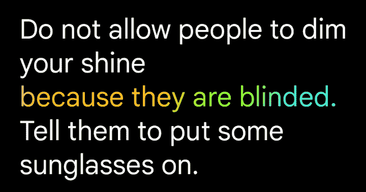

Text with gradient built with brush in SpanStyle

## 使用画笔的不透明度

[Compose 版本 1.3.0-alpha01](https://developer.android.com/jetpack/androidx/releases/compose-ui#1.3.0-alpha01) 为`TextStyle` / `SpanStyle`引入了一个 alpha 可选参数，它允许您在使用颜色渐变实现类似这样的东西时修改整个文本的不透明度:

*“Text in” has 0.5f alpha*

为了实现这一点，我们将对文本的两个部分使用相同的笔刷，并且我们将改变文本在相应范围内的 alpha。

更多画笔和`TextStyle` / `SpanStyle`的例子，看一下 AOSP 的`[BrushDemo](https://cs.android.com/androidx/platform/frameworks/support/+/androidx-main:compose/foundation/foundation/integration-tests/foundation-demos/src/main/java/androidx/compose/foundation/demos/text/BrushDemo.kt)`例子。

> 如果你想知道更多关于用画笔在 Compose 中可以实现什么的灵感，请查看由[Halil](http://twitter.com/halilozercan)[zer can](http://twitter.com/halilozercan)制作的[这个](https://twitter.com/halilozercan/status/1546563464025481216?t=Z26RiyXPvBE94xFRpUMU4g&s=19)演示(你可以在这里找到代码[)。](https://github.com/halilozercan/madewithcompose/tree/main/app/src/main/java/com/halilibo/madewithcompose/brush)

# 概述

我们希望，通过拥有新的令人兴奋的、与您已经熟悉的 API 无缝集成的组合惯用 API，将帮助您为您最有创意的用例创建漂亮的视觉效果。

如果您在使用`Brush` API 时发现任何错误，请通过在[我们的问题跟踪器](https://issuetracker.google.com/issues/new?component=779818&template=1371638)上提交错误来让我们知道。要了解更多关于 Compose 中的`Canvas`，你可以查看我们关于 Compose 中的[图形的文档。](https://developer.android.com/jetpack/compose/graphics)

我们迫不及待地想看看你和`Brush`一起建造了什么。在推特上给我加标签，这样我就可以看到你美丽的作品了！

最后但同样重要的是，如果你想学习如何用笔刷🖌️绘制颜色动画，请阅读这篇博文的第二部分。

快乐作曲！👋

*这篇文章是与 Jetpack 撰写文本团队的*[*Halil zercan*](http://twitter.com/halilozercan)*合作撰写的。感谢 DevRel 团队的* [*丽贝卡·弗兰克斯*](https://twitter.com/riggaroo)[*弗洛里纳·芒特内斯库*](https://twitter.com/FMuntenescu) *和* [*尼克·布彻*](https://twitter.com/crafty) *对他们的透彻点评。*