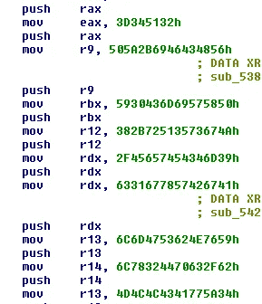

# 速率配置解码更新

> 原文：<https://medium.com/walmartglobaltech/brute-ratel-config-decoding-update-7820455022cb?source=collection_archive---------1----------------------->

作者:杰森·里维斯


已经有一些关于如何解密蛮率[1]配置数据的报告，以及一些创建的解密器[2，3]。但是，开发人员在发行说明中补充说，他们将其改为动态键，而不是大家所指的硬编码键。硬编码的密钥仍然被使用并且存在，用于解密板上的一些字符串。


Ref: [https://bruteratel.com/release_notes/releases.txt](https://bruteratel.com/release_notes/releases.txt)

我们从趋势科技关于 BlackBasta 演员利用 QBot 提供 Brute Ratel 和 CobaltStrike 的报告样本开始:

```
62cb24967c6ce18d35d2a23ebed4217889d796cf7799d9075c1aa7752b8d3967
```

基于外壳代码的加载程序存储在板上，并加载到内存中。外壳代码登台程序使用一些反调试检查，如检查 NtGlobalFlag。

如 MDSec 博客[3]所述，编码的板载 DLL 仍然以 RC4 加密的方式存储。密钥是最后 8 个字节:


RC4

手动解码:

```
>>> data[-8:]
'*%@{.de|'
>>> rc4 = ARC4.new(data[-8:])
>>> t = rc4.decrypt(data)
>>> t[:1000]
'zn<dq{f%\x00\x00\x00\x00\x00\x00\x00\x00\x00\x00\x00\x00\x00\x00\x00\x00\x00\x00\x00\x00\x00\x00\x00\x00\x00\x00\x00\x00\x00\x00\x00\x00\x00\x00\x00\x00\x00\x00\x00\x00\x00\x00\x00\x00\x00\x00\x00\x00\x00\x00\x00\x00\x80\x00\x00\x00\x0e\x1f\xba\x0e\x00\xb4\t\xcd!\xb8\x01L\xcd\x00\x00\x00\x00\x00\x00\x00\x00\x00\x00\x00\x00\x00\x00\x00\x00\x00\x00\x00\x00\x00\x00\x00\x00\x00\x00\x00\x00\x00\x00\x00\x00\x00\x00\x00\x00\x00\x00\x00\x00\r\r\n$\x00\x00\x00\x00\x00\x00\x00PE\x00\x00d\x86\t\x00\xdd\x9b\x1dc\x00\x00\x00\x00\x00\x00\x00\x00\xf0\x00."\x0b\x02\x02"\x00\xb8\x02\x00\x00\xdc\x00\x00\x00\x1e\x00\x00\x00\x10\x00\x00\x00\x10\x00\x00\x00\x00\x00\x10\x00\x00\x00\x00\x00\x10\x00\x00\x00\x02\x00\x00\x04\x00\x00\x00\x00\x00\x00\x00\x05\x00\x02\x00\x00\x00\x00\x00\x00\x10\x04\x00\x00\x04\x00\x00/\xb9\x03\x00\x03\x00\x00\x00\x00\x00 \x00\x00\x00\x00\x00\x00\x10\x00\x00\x00\x00\x00\x00\x00\x00\x10\x00\x00\x00\x00\x00\x00\x10\x00\x00\x00\x00\x00\x00\x00\x00\x00\x00\x10\x00\x00\x00\x00\xe0\x03\x006\x00\x00\x00\x00\xf0\x03\x00\x80\x04\x00\x00\x00\x00\x00\x00\x00\x00\x00\x00\x00\x80\x03\x00\x98\x13\x00\x00\x00\x00\x00\x00\x00\x00\x00\x00\x00\x00\x04\x00l\x04\x00\x00\x00\x00\x00\x00\x00\x00\x00\x00\x00\x00\x00\x00\x00\x00\x00\x00\x00\x00\x00\x00\x00\x00\x00\x00\x00\x00\x00\x00\x00\x00\x00\x00\x00\x00\x00\x00\x00\x00\x00\x00\x00\x00\x00\x00\x00\x00\x00\x00L\xf1\x03\x00\x10\x01\x00\x00\x00\x00\x00\x00\x00\x00\x00\x00\x00\x00\x00\x00\x00\x00\x00\x00\x00\x00\x00\x00\x00\x00\x00\x00.text\x00\x00\x00\x00\xb7\x02\x00\x00\x10\x00\x00\x00\xb8\x02\x00\x00\x04\x00\x00\x00\x00\x00\x00\x00\x00\x00\x00\x00\x00\x00\x00 \x00P`.data\x00\x00\x000\x1b\x00\x00\x00\xd0\x02\x00\x00\x1c\x00\x00\x00\xbc\x02\x00\x00\x00\x00\x00\x00\x00\x00\x00\x00\x00\x00\x00@\x00`\xc0.rdata\x00\x00\xf0\x83\x00\x00\x00\xf0\x02\x00\x00\x84\x00\x00\x00\xd8\x02\x00\x00\x00\x00\x00\x00\x00\x00\x00\x00\x00\x00\x00@\x00`@.pdata\x00\x00\x98\x13\x00\x00\x00\x80\x03\x00\x00\x14\x00\x00\x00\\\x03\x00\x00\x00\x00\x00\x00\x00\x00\x00\x00\x00\x00\x00@\x000@.xdata\x00\x00|\x18\x00\x00\x00\xa0\x03\x00\x00\x1a\x00\x00\x00p\x03\x00\x00\x00\x00\x00\x00\x00\x00\x00\x00\x00\x00\x00@\x000@.bss\x00\x00\x00\x00\xa9\x1d\x00\x00\x00\xc0\x03\x00\x00\x00\x00\x00\x00\x00\x00\x00\x00\x00\x00\x00\x00\x00\x00\x00\x00\x00\x00\x00\x80\x00`\xc0.edata\x00\x006\x00\x00\x00\x00\xe0\x03\x00\x00\x02\x00\x00\x00\x8a\x03\x00\x00\x00\x00\x00\x00\x00\x00\x00\x00\x00\x00\x00@\x000@.idata\x00\x00\x80\x04\x00\x00\x00\xf0\x03\x00\x00\x06\x00\x00\x00\x8c\x03\x00\x00\x00\x00\x00\x00\x00\x00\x00\x00\x00\x00\x00@\x000\xc0.reloc\x00\x00l\x04\x00\x00\x00\x00\x04\x00\x00\x06\x00\x00\x00\x92\x03\x00\x00
...snip...
```

正如我们前面提到的，配置的 RC4 键不再是 DLL 中的硬编码值。相反，它现在是来自解码的 DLL blob 的最后 8 个字节:

```
>>> a = base64.b64decode('FE2frlPu/3cYTkUYWP9aoUwTUKZ778EWaz5b2nzDTz2OAR2qI5Jvqozn6a2BTADp7kUTrsTI6ssgvPSGj5fcOboKvlmSAfPCKKWJti2L3sLeYnM0BhcVZiiXAG5cBBa2y0aaQ/0jXBpdKs3Wx1TFfsPDF/uq6iTtoCEvRTvmttevJu6r84nQ4uj+5kWeNUsbgn6RRuzrVw6eSZ9LRUPoFZHUAn8kVdD5stYXv/J8exdDIb1PVVobNGUxEwkUjYfM0CHz2LYmkJEZz7vkWQMQcn84U+BPUnhSm/BVa+Vjy3IrjOjclCjMRedQ7JFKa412O6s6kJ3YkHESrsCP9sTfMxqOFSzgXMDjQRw9XmD2fqwTyMgNGU+vbgfdHcPfK6qXDTaAj9ICRiVsI1VFscGRb2OvMOru0ksiflgoZJuZB1cbiEsdz4s=')
>>> rc4 = ARC4.new('\x24\x7b\x29\x75\x5e\x2f\x2e\x70')
>>> rc4.decrypt(a)
'0|5|5|||||eyJjaGFubmVsIjoi|In0=|0|1|symantecuptimehost.com|8080|Mozilla/5.0 (Windows NT 10.0; Win64; x64) AppleWebKit/537.36 (KHTML, like Gecko) Chrome/90.0.4430.93 Safari/537.36|AHOEN1R8FF7NF1VJ|GM8Q54SRAII7TKET|/admin.php?login=|Content-Type: application/json|a3fd9bbed51227aca2f7f1577395132776ff95f4e906bd33a92344d59a6e77fc'
```

所以，如果我们想自动化，我们需要考虑两种方法，我见过它们被外壳代码层用来加载配置和 DLL 数据。

call over 方法调用相关数据，使其地址被压入堆栈:


Call over method

还有堆栈加载方法，其中将数据块推送到堆栈上，导致其被重建:



Stack load method

对于 call over 方法，我们只需查找导致调用的指令，然后提取数据。我将使用一种简单的方法，但我建议将代码切换为使用 YARA，因为你的解码器会持续更长时间。

```
cfg_off = blob.find('\x5a\xe8\x00\x00\x00\x00\x59\x48\x01\xd1\x48\x83\xc1\x0a\xff\xd1')
cfg_len = struct.unpack_from('<I', blob[cfg_off-4:])[0]
cfg_off += 16
cfg = blob[cfg_off:cfg_off+cfg_len]
```

为了找到这个场景中的数据，我们使用了一种类似的方法，只需找到调用指令序列并从中提取长度:

```
if cfg != '':#Few ways to find the end
    #way1
    off1 = blob.find('\x41\x59\xe8\x00\x00\x00\x00\x41\x58')
    l = struct.unpack_from('<I', blob[off1-4:])[0]
    bb = blob[off1+19:]
    bb = bb[:l]
```

解码配置只需要首先解密 DLL 并恢复密钥:

```
 rc4 = ARC4.new(bb[-8:])
    decoded = rc4.decrypt(bb[:-8]) rc4 = ARC4.new(decoded[-8:])
    decoded_cfg = rc4.decrypt(base64.b64decode(cfg)) print(decoded_cfg)
```

对于基于堆栈的加载，我将使用 Unicorn[5]模拟器，我用它来解码以前恶意软件样本的数据。首先，我们需要配置数据:

```
else:
    #need to pull from stack
    offset = data.find(needle) blob = data[offset:] STACK=0x90000
    code_base = 0x10000000
    mu = Uc(UC_ARCH_X86,UC_MODE_64) test = re.findall(r'''4883e4f04831c050.+4889e168''',binascii.hexlify(blob))
    temp = [test[0][:-2]]
    mu.mem_map(code_base, 0x100000) mu.mem_map(STACK, 4096*10)
    for i in range(len(temp)):
        #print(temp[i])
        try:
            blob = binascii.unhexlify(temp[i])
        except:
            blob = binascii.unhexlify(temp[i][1:])
        mu.mem_write(code_base, '\x00'*0x100000)
        mu.mem_write(STACK, '\x00'*(4096*10)) mu.mem_write(code_base,blob)
        mu.reg_write(UC_X86_REG_ESP,STACK+4096)
        mu.reg_write(UC_X86_REG_EBP,STACK+4096)
        try:
            mu.emu_start(code_base, code_base+len(blob), timeout=10000)
        except:
            pass
        a = mu.mem_read(STACK,4096*10)
        b = a.rstrip('\x00')
        b = b.lstrip('\x00')
        cfg = str(b)
```

对于数据，我们只需要考虑更大的堆栈大小:

```
 mu = Uc(UC_ARCH_X86,UC_MODE_64)#045e95f1a5bcc1ce2eeb905ab1c5f440a42364a170008309faef1cfdba296644 has 5a48
    test = re.findall(r'''00005a4[89].+4989e068''',binascii.hexlify(blob))
    if len(test) > 0:
        temp = [test[0][6:-2]]
        mu.mem_map(code_base, 0x100000) mu.mem_map(STACK, 4096*200)
        for i in range(len(temp)):
            try:
                blob = binascii.unhexlify(temp[i])
            except:
                blob = binascii.unhexlify(temp[i][1:])
            mu.mem_write(code_base, '\x00'*0x100000)
            mu.mem_write(STACK, '\x00'*(4096*200)) mu.mem_write(code_base,blob)
            mu.reg_write(UC_X86_REG_ESP,STACK+(4096*100))
            mu.reg_write(UC_X86_REG_EBP,STACK+(4096))
            mu.emu_start(code_base, code_base+len(blob), timeout=100000)
            a = mu.mem_read(STACK,4096*200) b = a.rstrip('\x00')
        b = b.lstrip('\x00')
        b = str(b)
```

解码配置与第一次解密 DLL 的过程相同:

```
 rc4 = ARC4.new(b[-8:])
        t = rc4.decrypt(b[:-8]) rc4 = ARC4.new(t[-8:]) decoded_cfg = rc4.decrypt(base64.b64decode(cfg))
        print(decoded_cfg)
```

在列举 VirusTotal 的样本时，我们还发现了一个看起来更像是 stager 版本的东西:

```
d79f991d424af636cd6ce69f33347ae6fa15c6b4079ae46e9f9f6cfa25b09bb0
```

这个版本只是将一个字节码 blob 加载到堆栈上:


Stager like version

字节码 config 的解码仍然是最后 8 个字节作为 RC4 键:

```
|{"channel":"|"}|1|login.offices365.de|443|Mozilla/5.0 (Windows NT 10.0; Win64; x64) AppleWebKit/537.36 (KHTML, like Gecko) Chrome/90.0.4430.93 Safari/537.36|ITOU1PFRSSE8GHCJ|Fd6Ve1xcaCO4EhDTbgTV|/en/ec2/pricing/|content-type: application/json|
```

# IOCs

```
symantecuptimehost.com
login.offices365.de 
```

# 参考

1:[https://bruteratel.com/](https://bruteratel.com/)

2:[https://github . com/Immersive-Labs-Sec/BruteRatel-detection tools/blob/main/config decoder . py](https://github.com/Immersive-Labs-Sec/BruteRatel-DetectionTools/blob/main/ConfigDecoder.py)

3:[https://www . MD sec . co . uk/2022/08/part-3-how-I-met-your-beacon-brute-ratel/](https://www.mdsec.co.uk/2022/08/part-3-how-i-met-your-beacon-brute-ratel/)

4:[https://www . trend micro . com/en _ us/research/22/j/black-basta-influtes-networks-via-qak bot-brute-ratel-and-coba . html](https://www.trendmicro.com/en_us/research/22/j/black-basta-infiltrates-networks-via-qakbot-brute-ratel-and-coba.html)

5:【https://www.unicorn-engine.org/ 