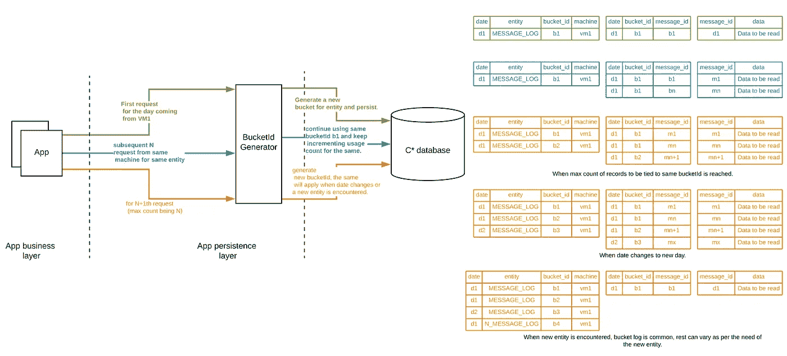
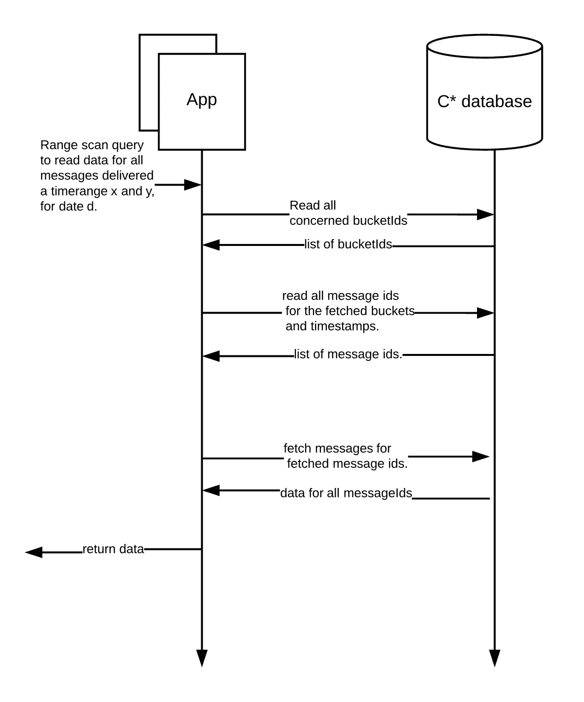

# Bucketisation:使用 cassandra 进行时间序列数据扫描。

> 原文：<https://medium.com/walmartglobaltech/bucketisation-using-cassandra-for-time-series-data-scans-2865993f9c00?source=collection_archive---------1----------------------->

Photo credit: [Source](https://pixabay.com/photos/calm-water-clear-drink-glass-2315559/)

来自 RDBMS 世界的你需要一些时间来适应，然后才能有效地开始在 Cassandra 中建模实体。帮助我的经验法则是让您的查询定义您需要的实体。

最近，我将我的应用程序的持久层从 Oracle 迁移到了 Cassandra。虽然迁移一些主要实体相当简单，但它解决了一些用例，如支持范围扫描，这给我们带来了一系列独特的挑战。

注意:范围扫描/查询基本上是基于时间戳范围的记录查找，上面有或没有任何过滤器。

在进入实际问题之前，让我们先了解应用程序的一些事情，我在这里提到的应用程序处理客户在我们的网站上执行的所有交易的所有通信。客观地说，我们平均每天向客户发送数千万条信息，跨越各种渠道，如电子邮件、短信和应用程序通知。

**问题？**

我们希望确保在迁移到 Cassandra 后支持对实体的范围查询，原因有两个:

*   当我们在 Oracle 上时，我们的团队已经在几个仪表板中使用类似的读取，所以必须确保向后兼容性。

例如，查询在时间“Y”和“Z”之间的日期“X”发出了多少次特定事件的通信。

*   此外，它还可以帮助您为我们将来可能不得不执行的到任何下一代持久性解决方案的任何潜在迁移做好准备。

对于本文的范围，让我们假设我们有一个列族，定义如下:

现在，这有助于您根据消息 id 查询消息的详细信息，因为上面的实体是根据消息 id 划分的。

但是，当您想要查找在特定时间范围内到达的消息时，问题就出现了。为了支持这一点，我们将引入如下所示的柱族:

现在，这允许我们执行如下查询，以获取某个时间范围内的数据:

Lookup on dated entity to get all message ids, primary entity may be looked up to get per message info.

虽然这可能适用于旨在提供一致和可预测流量的系统，但对于容易受到客户行为驱动的意外激增的系统，这样的模型可能是一个绝对的噩梦。

由于上述模型是在 created_date 列上进行分区的，因此在给定日期任何意外的流量激增都意味着您的所有写入都被定向到同一个分区，并且很有可能在您的 Cassandra 集群上创建一个热点。就集群性能而言，这实质上意味着三件事:

1.  您可能会使群集中的某些节点面临风险。
2.  您可能永远无法成功读取这些数据，因为查找有超时的风险。
3.  您违反了帮助您的集群保持健康状态的黄金法则之一，即*不要让您的分区变得太大。*(建议保持分区大小在 100 MB 左右，没有确切的数字。)

那我们做了什么？我们尝试引入一个名为“一天中的窗口”的新因素，它只不过是一个时隙(统一的)，将一天分成相等的时隙，并将流量分散到多个分区，如下所示:

slot based message log entity.

现在，在某一天流量激增的情况下，我们仍然能够在写入数据的同时访问多个分区，并防止任何潜在的热点。

在这种情况下，读取一天的全部数据的查询如下所示(假设我们决定使用 6 个小时的时间段)

query based on slots identified.

虽然这种方法确实解决了问题，但它只是部分地解决了问题。如果流量激增被限制在特定时隙，则该模型仍然容易出现我们在第一个模型中描述的相同问题。

你可能会决定减少你的时间，甚至是几分钟，但事实是你的模型仍然容易受到影响。

在尝试将这种方法应用于我们的生产用例的无望尝试中，我们评估需要大约 *5 分钟*的槽大小，以确保即使在我们的最大峰值(当前)期间，我们也能够防止任何热点，并能够尽快将流量导向下一个分区，同时将当前分区大小保持在可接受的限制内。这实际上意味着我们必须在 12 * 24 = 288 个分区中查找，以获取仅一天的数据。

**那我们该怎么办？**

我们决定后退一步，重新评估我们的计划，而不是粗暴地强迫我们的方式来勾选所有数据卡珊德拉建模指南。我们的结论是，我们需要一种可靠的方法来向每个分区发送受控写入，一旦达到限制(我们希望每个分区保持的最大存储)，我们的应用程序应该能够将写入重定向到新分区。

我们提出了一种分桶策略，其中每个应用程序实例(虚拟机/计算机)为其保存的记录维护自己的内存计数器，并为所有这些写入分配一个专用的 bucket_id。该应用程序每次在流动条件下运行时都会生成一个新的随机唯一 id:

*   日期已更改。
*   引入了一个新的实体。
*   存储桶已达到其最大计数。*(这意味着这个特定分区中已经保存了足够多的记录，需要将写入内容移动到一个新的分区中。)*

这还要求我们维护一个字典，以维护由所有应用程序实例生成的所有 bucket _ ids 到它们被创建的日期和实体的映射。我们可以在同一个卡珊德拉密钥空间中保持这种状态。

在这种情况下，我们的实体(message _ log _ dated)中支持范围扫描的行将如下所示

message_log_dated column family.

而用于维护日期和实体到该范围内各自存储桶的映射的字典将是这样的。

bucket_id_dictionary column family.

现在，当您的存储桶在某一天溢出时，您可能会看到如下所示的条目(请注意在同一天为同一个虚拟机创建的第 7 行。):

Sample data to demo new bucket generated by vm1 since its original bucket for the day ‘random_unique_id1’ reached it max capacity.

现在，让我们看看如何使用这个模型，通过一些实际的测试数据，对一个给定的实体进行范围扫描。

这里有一个快速查询，确认每个存储桶都符合分配的最大存储桶计数，在我的测试中保持在 50000。

Bucket count validation.

下面是此流的读写操作的快速示意图:

Illustration of how writes shall flow.

Illustration of read flow.

**评估**

现在让我们来评估这种方法，

优点:

*   过滤应该是直接的，您可以在日期日志中复制更多的列，这样您就可以只读取您想要的配置的消息 id。
*   插入既简单又快速。
*   阅读速度很快。
*   最重要的是，它解决了我们在这里试图解决的集群平衡问题。
*   如果你的应用程序上的负载平衡器是一个公正的负载平衡器，它会有所帮助，但是即使它在 bug/配置改变的情况下摇摆不定，这种方法仍然是可靠的。

缺点:

*   排序(如果需要)需要在应用程序层进行。
*   分页需要在应用程序层执行。

**总结**

Cassandra 上的范围扫描不是一个简单的问题，但是有了正确的数据模型，你一定可以解决它。为了保持集群正常运行，您的写入必须是分布式的和统一的。

虽然你可能会认为使用上面提出的解决方案会消耗更多的存储空间，但在 Cassandra 的世界里这完全没问题。如果有助于优化您的查询，您可以复制数据(而不是最正常的形式)。

使用这种基于“桶化”的方法，您可以支持范围扫描，同时免受意外流量激增的影响，并且不会对集群的运行状况造成任何风险。

最后但并非最不重要的一点，我要向我的导师大声欢呼，因为他从这种方法的开始一直到它在生产中发挥作用，一直在指导我。