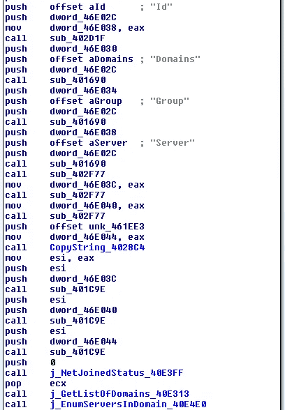
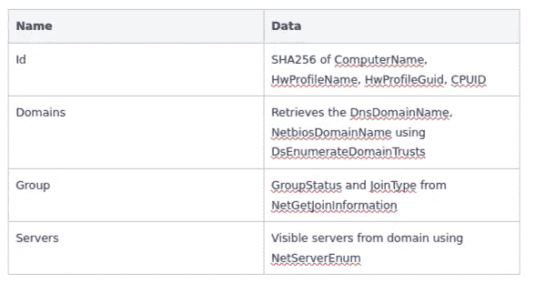
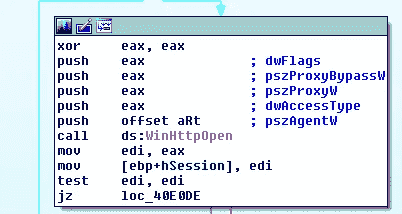
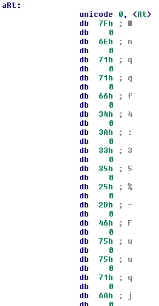
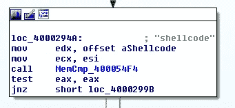
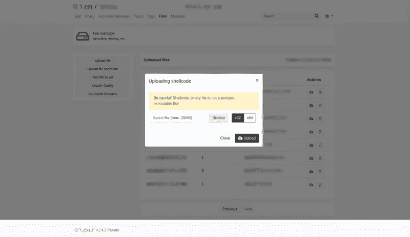
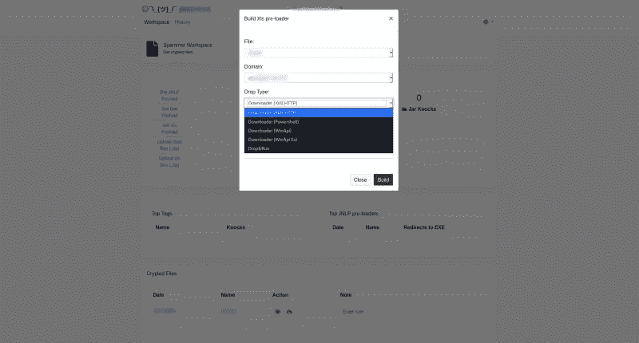

# BuerLoader 更新

> 原文：<https://medium.com/walmartglobaltech/buerloader-updates-3e34c1949b96?source=collection_archive---------6----------------------->

作者:约书亚·普拉特和杰森·里维斯


# 行动纲要

*   帕尔任务包括域剖析器，似乎有代码重用版本的帕尔被利用的 TrickBots 船员
*   围绕加载外壳代码的新功能[4]作为一项任务，允许针对目标的更广泛的功能，而不需要下载单独的 CobaltStrike stager
*   Buers 的新面板还包括帮助设置垃圾邮件操作和创建预加载程序对象的功能

TrickBot 中的一名成员已经利用帕尔[1]装载机[2，5]一段时间了，最终交付钴击[3]，并最终导致勒索软件。用于这些活动的帕尔版本进行了更多更新，看起来完全是围绕企业焦点设计的。其中一个还没有被公开讨论的是，帕尔也有一个组件，它经常作为任务在内存中传递，并通过不同的端口与帕尔的同一个 C2 通信。

# 域名信息

进入 Buers 的“DomainInfo”组件，该组件的最终目的是分析有关受感染系统及其加入的网络的一些信息。

收集的数据被构建到一个 JSON blob 中，列出了“Id”、“域”、“组”和“服务器”。



下表解释了收集的数据:



收集完所有数据后，它会简单地将数据发送到 C2，这样就传递了一个硬编码的用户代理。



用户代理看起来很奇怪，但事实证明，提交这个文件的帕尔样本有相同的用户代理。



流量示例:

```
POST: /api/v1/modules/domains/dns
User-Agent: Rt\x7fnqqf4:35%-Fuuqj2nUmtsj<H74675739;;@%Z@%HUZ%qnpj%Rfh%TX%]@%js.%Fuuqj\\jgPny49750%-PMYRQ1%qnpj%Ljhpt.%[jwxnts4835%Rtgnqj46F:98%Xfkfwn496>38{
 "Id": "e3b0c44298fc1c149afbf4c8996fb92427ae41e4649b934ca495991b7852b855"
 "Domains": {
  "DomainsError": "",
  "DomainsNetBios": [""],
  "DomainsDns": [""]
 },
 "Group": {
  "JoinStatus": "NetSetupWorkgroupName",
  "GroupType": "WORKGROUP"
 },
 "Server": {
  "PCNames": [""]
 }
}
```

# 外壳代码

外壳代码作为一个任务在帕尔已经存在，但它在一个主要用于分发 CobaltStrike 的机器人中的添加完全有意义，因为它删除了一个中间人单独的 stager，并允许帕尔直接加载 stager 外壳代码，甚至直接加载反射式信标。



# 垃圾邮件制造者工作场所

帕尔现在还包括通过创建基于文档的加载器和来自面板的各种交付链来帮助处理垃圾邮件的能力:



在 spammer workshop 内部，也可以利用二进制文件，例如最近提到的 ProofPoint[6]的基于 Rust 的加载程序版本。帕尔装载机是我们在 2021 年跟踪的最积极开发和更新的装载机之一。

# IOCs

C2s:

```
itmanagersupporter[.]click
hxxps://officewestunionbank[.]com/api/v1/modules/domains/dns
hxxps://tokacpebanking[.]com/api/v1/modules/domain/dns
hxxps://webgraitupeople[.]com/api/v1/modules/domain/dns
```

域名信息哈希:

```
38a41e8128ae3955d541c8a00a93de1cd10a01c58368c8254a35659f8627ba30
```

相关的 OSINT 活动:

```
[https://pastebin.com/U2kNQ3kd](https://pastebin.com/U2kNQ3kd)
```

# 参考

1:[https://www . proof point . com/us/threat-insight/post/布尔-new-loader-emerges-underground-market](https://www.proofpoint.com/us/threat-insight/post/buer-new-loader-emerges-underground-marketplace)

2:[https://news . sophos . com/en-us/2020/10/28/hacks-for-sale-inside-the-malware-as-a-service/](https://news.sophos.com/en-us/2020/10/28/hacks-for-sale-inside-the-buer-loader-malware-as-a-service/)

3:[https://medium . com/walmartglobaltech/cobalt strike-stager-utilizing-floating-point-math-9 BC 13 F9 b 9718](/walmartglobaltech/cobaltstrike-stager-utilizing-floating-point-math-9bc13f9b9718)

4:【https://twitter.com/vk_intel/status/1262618254251614215? lang=en

5:【https://twitter.com/VK_Intel/status/1359689043735416835? s=20

6:[https://www . proof point . com/us/blog/threat-insight/new-variant-布尔-loader-written-rust](https://www.proofpoint.com/us/blog/threat-insight/new-variant-buer-loader-written-rust)