# Go 中的缓冲通道——它们有什么用？

> 原文：<https://medium.com/capital-one-tech/buffered-channels-in-go-what-are-they-good-for-43703871828?source=collection_archive---------2----------------------->

## 绝对有的东西！

[***连载三上围棋***](/@jon_43067)

在之前的一篇博客文章中，我们讨论了如何构建一个无界的通道，在这个通道中写入数据永远不会阻塞。它建立在两个无缓冲通道、一个 goroutine、一个 slice 和几个闭包之上。

值得注意的是缺少一个缓冲通道。缓冲通道永远不会有无限的缓冲区。正确使用缓冲通道意味着您必须处理这样的情况，即缓冲区已满，并且您的写例程阻塞等待读例程。那么，缓冲通道的正确用法是什么呢？为什么在 Go 的设计中包含了它们？

缓冲通道的情况很微妙。用一句话来概括:

**当您知道您已经启动了多少个 go routine，想要限制您将要启动的 go routine 的数量，或者想要限制正在排队的工作量时，缓冲通道非常有用。**

当您希望从已经启动的一组 goroutines 中收集数据或者希望限制并发使用时，缓冲通道非常有用。它们还有助于管理系统排队等待的工作量，防止您的服务落后和不堪重负。这里有几个例子来说明如何使用它们。

## **并行处理**

goroutines 的一个常见模式是扇出。当您想要将相同的数据应用于多个算法时，您可以为每个子任务启动一个 goroutine，然后在它们完成时将数据收集回来。例如，您可能希望通过多种评分算法处理相同的数据，并返回所有的分数，或者从多个微服务中提取数据以组成一个页面。缓冲通道是从子任务收集数据的理想方式。

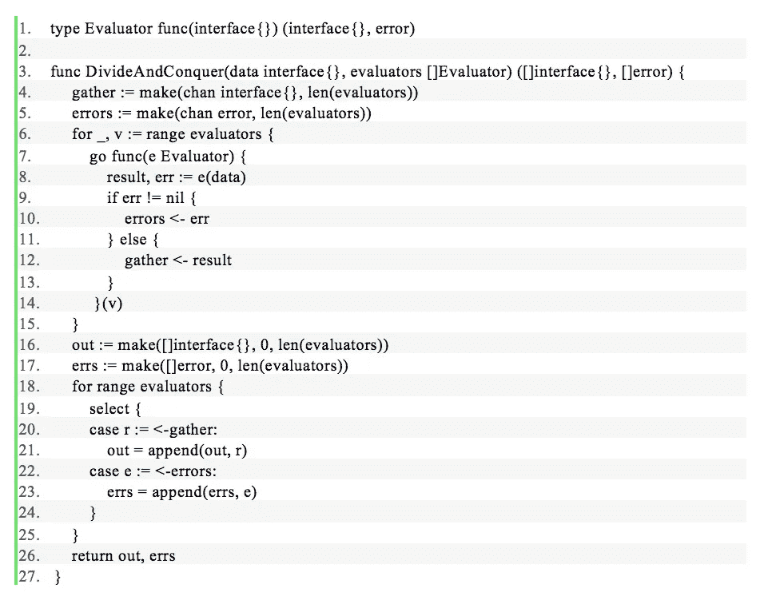

如前一篇博文所述，Go 没有泛型，所以我们将使用 ***接口{}*** 作为占位符类型。

代码很简单。首先我们定义一个新的类型， ***Evaluator*** ，它是一个函数，接受一个值，返回一个值和一个错误。这不是必需的，但它使理解代码变得更容易。

我们的函数***DivideAndConquer***接收一部分 ***评估者*** 以及将要发送给他们每个人的数据。我们创建了两个缓冲通道，一个用来保存有效响应，另一个用来保存错误。接下来，我们为每个 ***评估器启动一个新的 goroutine。***

*(注意，我们将* ***v*** *传递给 goroutine，以便每个 goroutine 都引用不同的* ***评估器****；在****a for****循环中启动 goroutines 时的一个常见问题是在 goroutines 内部使用 for 声明中的键或值；这将导致相同的值被传递给所有的 goroutines！)*

在 goroutine 中，我们执行 ***评估器*** 并将输出或错误写入适当的通道。

一旦启动了所有的 goroutine，我们就设置 ***out*** 和 ***errs*** 片来保存结果，循环 ***len(赋值器)*** 次来从每个 go routine 拉回结果或错误，然后在完成时返回 ***out*** 和 ***errs*** 。

通过使用缓冲通道返回值和错误，我们确保没有任何 goroutines 在等待主任务读取它们的输出时被暂停。缓冲区允许 goroutines 写然后退出。有趣的是，使用缓冲通道不再需要任何同步工具。我们知道，我们将在两个通道上准确地获得***len(evaluator)***写操作，因此我们的主要任务就是等待一个值被写入任一通道，并将其放在适当的片上。当所有赋值器都完成后，函数返回。

这个简单的测试案例演示了我们如何使用***DivideAndConquer***:

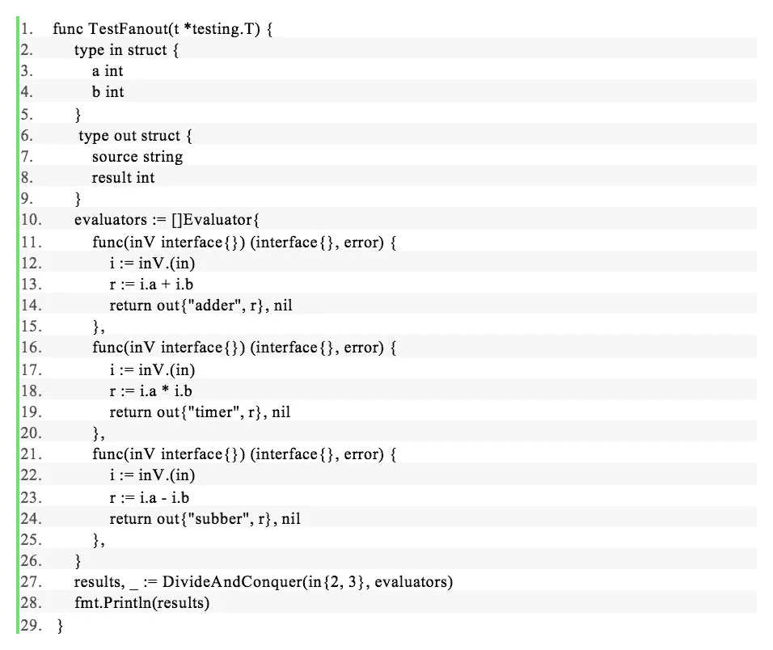

结果以随机顺序返回，这是您并行运行它们时所期望的:

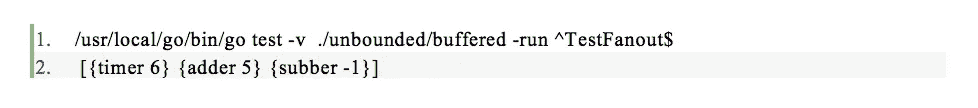

## 时间去了哪里？

我们的并行处理器做了它应该做的事情，但是它有一个明显的限制。如果你不想永远等待所有的子任务完成，该怎么办？让我们考虑一下从多个微服务中聚合数据的情况。如果一个微服务很慢，或者(更糟糕)挂起，我们不想冻结前端等待它的响应。即使我们只是运行评分算法，其中一个可能会有一个错误，触发缓慢的行为或无限循环。最好将每个子任务限制在一定的时间内，对于花费太长时间的子任务，返回一个错误。

为了实现这个新特性，我们将使我们的赋值器类型变得更复杂一些。而不仅仅是作为***afunc(interface { })(interface { }，error)*** 的一个名字，现在是一个有两个方法的接口， ***Evaluate*** 和 ***Name*** :

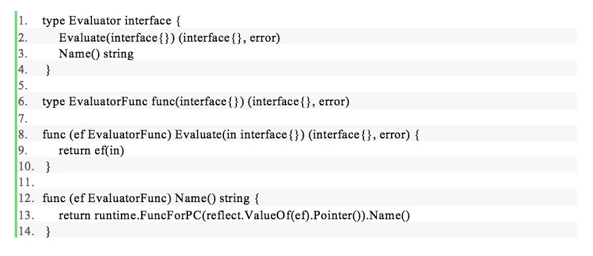

我们已经将该函数移到了不同的类型中，***Evaluator func***，它实现了 ***Evaluator*** 接口。我们希望将 ***命名为*** 方法，这样我们就可以报告哪个子任务没有完成。***evaluator func***利用 Go 中的一个技巧，在给定一个引用函数的变量的情况下，获取该函数的名称。如果名字返回使用 r**untime。Func.Name()** 不合您的口味，您可以在 struct 中嵌入***evaluator func***进行自定义:

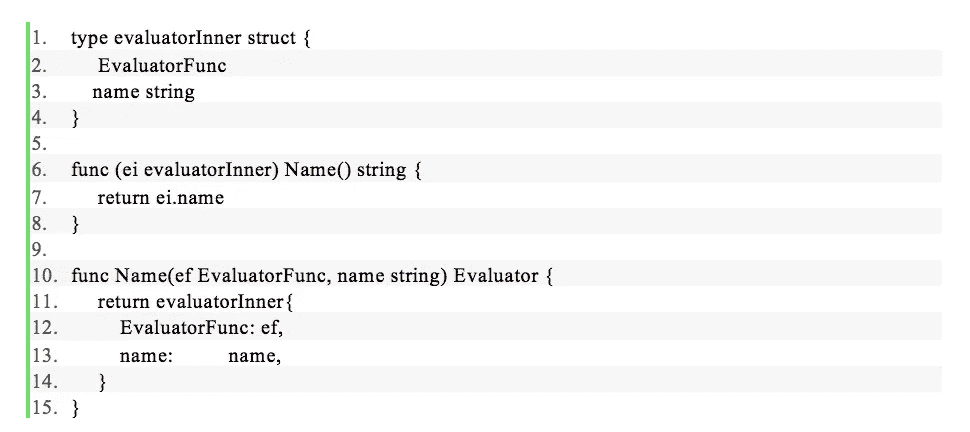

下面是我们更新后的***DivideAndConquer***函数:

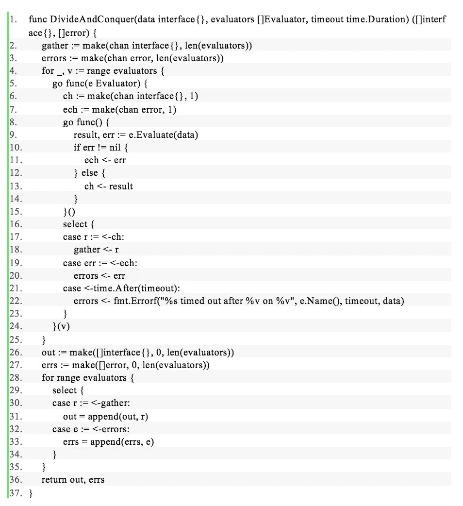

虽然收集结果的代码保持不变，但是 goroutine 逻辑变得更加复杂。每个 goroutine 现在创建两个大小为 1 的缓冲通道， ***ch*** 和 ***ech*** ，并启动第二个 goroutine。第二个 goroutine 运行**评估器*。评估*** 并写入 ***ch*** (如果成功)或 ***ech*** (如果返回错误)。

周围的 goroutine 有一个 ***select*** 语句，用于检查先返回什么——结果、错误或超时。如果结果或错误先到达，我们把它们分别写到*或 ***错误*** 通道。如果超时，我们会创建一个新的错误来指示超时，并在 ***错误*** 通道上返回。*

*为了利用 ***的时间。在*** 之后，我们需要启动第二个 goroutine，并通过渠道与它沟通。但是不明显的是为什么 ***ch*** 和 ***ech*** 通道被缓冲。为什么不使用无缓冲通道呢？答案是我们不想泄露任何 goroutines。虽然 Go runtime 能够一次处理成千上万个 goroutine，但是每个 Go routine 确实会使用一些资源，所以在不必要的时候，您不希望让它们闲置。如果你这样做，一个长时间运行的围棋程序将开始表现不佳。*

*请记住，非缓冲通道会暂停写入 goro routine，直到另一个 goro routine 进行读取。如果超时在 ***评估器*** 完成执行之前触发，读取将永远不会发生，因为读取这些通道的唯一位置是在外部 goroutine 的 select 语句中，并且外部 goroutine 在超时触发后退出。这意味着使用非缓冲通道将导致内部 goroutine 在超时时永远等待，从而泄漏 goroutine。同样，缓冲通道证明是有用的，因为我们确切地知道我们可以预期多少次写入。*

*这里有一个显示超时的简单测试:*

*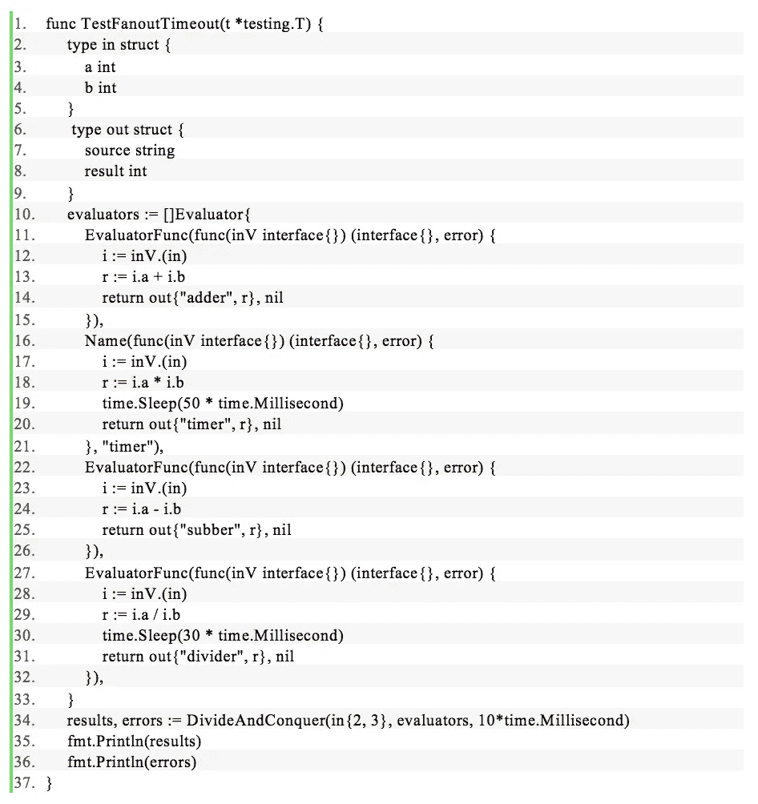*

*这将返回输出:*

*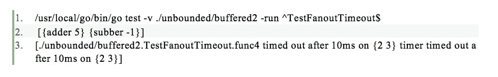*

## ***创建池***

*缓冲通道有用的另一种情况是在创建对象池时。当您有创建成本很高的对象时(比如大型内存缓冲区)，或者当您希望限制同时执行时(比如不要让太多的请求淹没一个服务)，应该使用池。*

*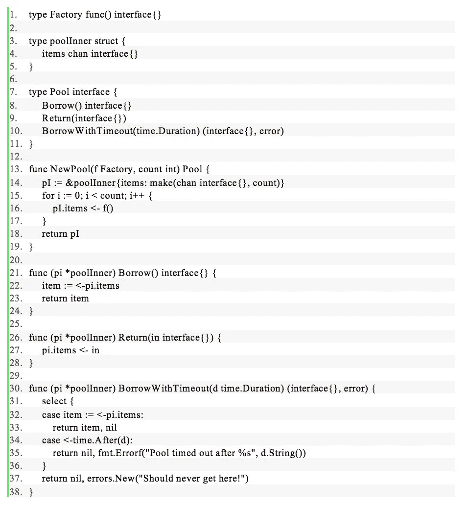*

*这里的想法是使用缓冲通道作为池。 ***NewPool*** 函数接受一个 ***Factory*** 用计数相同的项填充池(如果这些项在功能上不相同，那么池的客户机的行为将取决于它们得到哪个项，这是一个坏主意)。当调用 ***借用*** 方法时，从通道中读取一个值并返回。如果池中的所有项目都已被使用，通道读取将阻塞，直到通过 ***Return*** 方法将一个值放回池中。*

*如果你不想永远等待(在生产代码中，你可能永远也不想永远等待某事发生)，***BorrowWithTimeout***允许你指定一个时间。等待项目返回池中的持续时间。通过不要永远等待，您向您的客户端进程提供了有价值的信息，即您当前的进程做了太多的工作。这被称为*背压*，在构建可扩展系统时，这是一个非常重要的工具。背压让您知道系统的某个部分负载过重，或者调用过于频繁。当你看到负载增加时，防止彻底崩溃的最好方法之一就是拒绝将你无法在合理时间内处理的工作排队。*

*泳池如你所料:*

*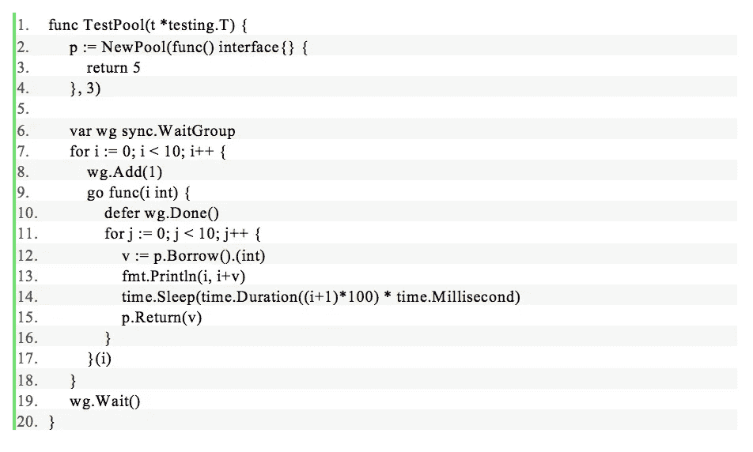*

*当您观察输出时，您会看到三个条目被快速打印出来，然后当数字被返回到池中并被另一个 goroutine 获取时会有停顿。*

## ***堵住水池的漏洞***

*虽然这个简单的池可以工作，但它需要很多信任。它的功能就像一个公共图书馆。虽然大多数借出书籍的人做了正确的事情，并及时归还，但有些人却忘记归还。写得不好的池客户机也是如此。它们将通过不调用 ***Return*** 从池中泄漏项目。最终，这个池将会是空的，没有值可以借用。*

*另一种可能是错误的值被放回池中。这将破坏预期的契约，并导致不确定的问题。这就像你在图书馆归还的书与你借出的不一样，希望图书管理员不会注意到。*

*我们可以扭转这个模式。我们可以像对待特殊收藏一样对待我们的馆藏项目，而不是成为一个借阅图书馆；人们只能在图书馆内访问这些项目。*

*翻译一下，我们不打算通过 ***从池中返回值，借用*** 并希望它们在 ***返回*** 时返回；我们将接受一个闭包并运行它。*

*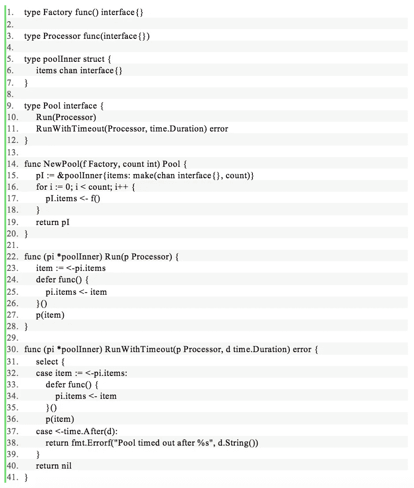*

*通过以这种方式构建池，我们不仅使池更难损坏，还使编写客户端更容易，因为他们不再需要为池记账:*

*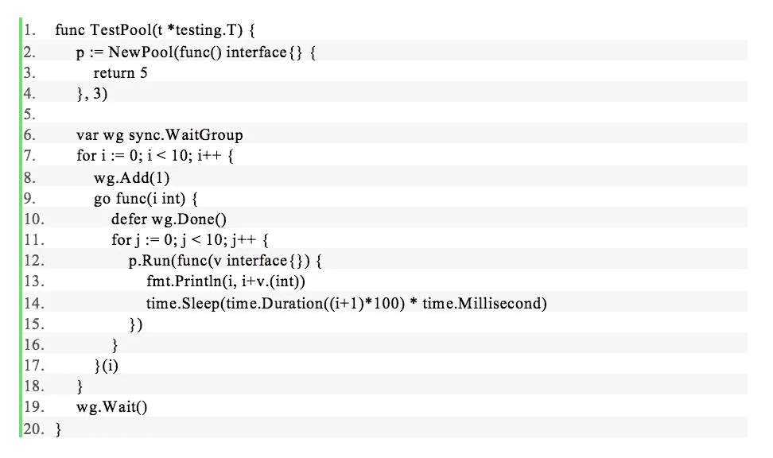*

*如您所见，缓冲通道在设计用于智能处理负载的系统中确实有一席之地。它们可以帮助您管理系统中的负载，进而帮助您保持服务正常运行。*

****披露声明:以上观点为作者个人观点。除非本帖中另有说明，否则 Capital One 不属于所提及的任何公司，也不被其认可。使用或展示的所有商标和其他知识产权都是其各自所有者的所有权。本文为 2017 首都一。****

# *附加链接*

*   *[闭包是 Go 的泛型](/capital-one-developers/closures-are-the-generics-for-go-cb32021fb5b5)*
*   *[在 Go 中构建无界通道](/capital-one-developers/building-an-unbounded-channel-in-go-789e175cd2cd)*
*   *[在 Go 中构建 REST API](https://developer.capitalone.com/blog-post/building-a-serverless-rest-api-in-go/)*