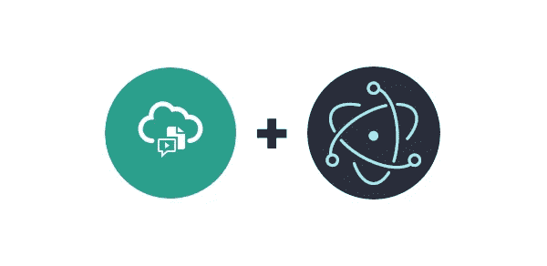
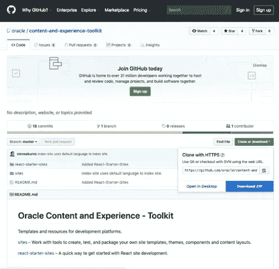
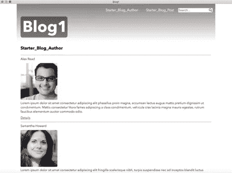
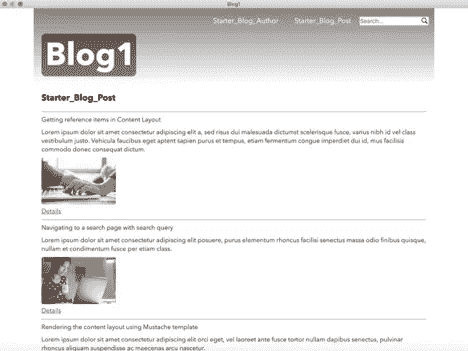
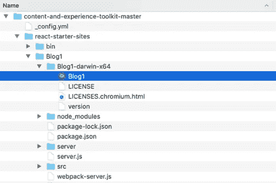

# 使用 OCE 入门网站 CLI 构建内容丰富的电子应用程序

> 原文：<https://medium.com/oracledevs/build-a-content-rich-electron-app-using-the-oce-starter-site-cli-965e1195c1ed?source=collection_archive---------0----------------------->



# 概观

本博客展示了如何使用自定义 ReactJS 站点模板和 OCE Starter 站点 CLI 来生成本机电子应用程序，以浏览 Oracle Content and Experience Cloud 中的内容。

ReactJS 站点模板是将内容放入 ReactJS 站点的重要部分。模板是生成站点的框架。这样的话，生成的站点基本就是电子 app 了。内容根据内容模型植入应用程序。在这篇博客中，我们将展示如何从入门网站 CLI 生成包含内容的电子应用程序。

电子框架用于使用 JavaScript 构建桌面应用程序。框架负责处理困难的部分，这样你就可以专注于应用程序的核心。在这个博客中，我们还将介绍自定义模板中电子方面的具体变化。

# 安装和设置 Oracle 内容和体验工具包

Oracle Content and Experience Toolkit，包括 Starter Site CLI，可以直接从 GitHub 获得。前往 https://github.com/oracle/content-and-experience-toolkit[点击**克隆或下载**。选择 **Download ZIP，**和**content-and-experience-toolkit-master . ZIP**将被下载。将文件 content-and-experience-toolkit-master . zip 解压缩到用户主目录中，~/。进入 ***cd 内容-和-体验-工具包-master/react-starter-site****进入目录。*](https://github.com/oracle/content-and-experience-toolkit)

**

*要设置启动站点 CLI，请继续执行[安装启动站点 CLI](https://docs.oracle.com/en/cloud/paas/content-cloud/developer/install-starter-site-cli.html) 的步骤 4。安装 Starter 站点 CLI 后，您应该能够调用 cecss 的帮助。*

```
*~/content-and-experience-toolkit-master/react-starter-sites$ **cecss -h**
Usage: cecss <command> [options]Run 'cecss <command> -h' to get the detailed help for the command.Commands:
  cecss create-site <name>               Creates the Site <name> for the content from local or from CEC server.
  cecss export-server-content <channel>  Create content template based on the channel <channel>, then export and download the archive from CEC server.
  cecss list-server-content-types        List all content types from server.
  cecss list-server-channels             List all channels from server.
  cecss develop                          Start development server. Watches files, rebuilds, and hot reloads if something changes.
  cecss build                            Build a CEC starter site.
  cecss serve                            Serve previously build CEC starter site.Options:
  --help, -h     Show help                                                                                                                             [boolean]
  --version, -v  Show version number*
```

*然后[进行一次 Gradle Setup](https://docs.oracle.com/en/cloud/paas/content-cloud/developer/do-one-time-gradle-setup.html) 设置 **gradle.properties** 。*

*最后，在用户的主目录下创建一个名为**的新文件。cec_properties** (~/。cec_properties)并输入您的 Oracle 内容和体验云服务器的值。例如:*

```
*cec_url=*<server-name.example.com>*
cec_username=*<username>*
cec_password=*<password>*
cec_env=pod_ec*
```

# *使用自定义 ReactJS 站点模板生成电子应用程序*

*电子应用程序将根据 ReactJS 网站模板生成；这个模板包含了将内容集成到电子应用程序中所需的所有文件。首先[下载模板 ElectronTemplate.zip](https://oracle.com/webfolder/PublicBlogs/OCE/ReactTemplateBlog/ElectronTemplate.zip) 放入*~/content-and-experience-toolkit-master/react-starter-sites/data*目录。另外，在*~/content-and-experience-toolkit-master/react-starter-sites*目录中，已经有一个现成的内容模板， *StarterBlog_export.zip，*包含了一个示例博客的内容。*

*现在从*~/content-and-experience-toolkit-master/react-starter-sites**目录中，我们将执行 CLI *cecss create-site* 来生成电子 app *Blog1，*传入站点模板 *ElectronTemplate.zip* 和内容模板 *StarterBlog_export，zip* 。**

```
**~/content-and-experience-toolkit-master/react-starter-sites$ **cecss create-site Blog1 -f ~/content-and-experience-toolkit-master/react-starter-sites/data/ElectronTemplate.zip -c StarterBlog_export.zip**
 - unzip content template file
 - unzip site template
 - add content to site
 - set up files for site runtime
 - create component file ./Blog1/src/Starter_Blog_Author/Starter_Blog_Author.js
 - create component file ./Blog1/src/Starter_Blog_Post/Starter_Blog_Post.js
 - finish processing js files
 *** site created, please run npm install to build**
```

**这将创建一个名为 *Blog1* 的目录，其中包含电子应用程序。接下来我们将编辑 *Blog1* 目录下的 *package.json* 文件。这将添加运行电子应用程序所需的条目。**

```
**~/content-and-experience-toolkit-master/react-starter-sites$ **cd Blog1**
~/content-and-experience-toolkit-master/react-starter-sites/Blog1$ **vi package.json****
```

**我们将添加一个*产品名称*名称值:**

```
***“*productName”: “Blog1”,**
```

**我们将更改*主*条目的值:**

```
***“*main”: “src/main.js”,**
```

**我们将在*脚本*下更改*开始*条目的值:**

```
**“start” : “electron src/main.js”,**
```

**最后，我们将添加两个依赖项:**

```
**"electron": "^5.0.1",
"electron-packager": "^13.1.1",**
```

**以下是 package.json 的代码片段，修改部分以粗体显示:**

```
**{
        "name": "cec-startsite",
        **"productName": "Blog1",**
        "version": "1.0.0",
        "description": "Content and Experience Cloud starter site",
        **"main": "src/main.js",**
        "scripts": {
                **"start": "electron src/main.js",**
                "build": "webpack --mode production --config ./webpack.config-prd.js",
                "dev": "concurrently \"node ./server.js dev\" \"node ./webpack-server.js\""
        },
        "repository": {
                "type": "git",
                "url": ""
        },
        "keywords": [
                "CEC"
        ],
        "author": "Hui Zeng",
        "engines": {
                "node": "8.9.4"
        },
        "license": "ISC",
        "dependencies": {
                **"electron": "^5.0.1",
                "electron-packager": "^13.1.1",**
                "babel-core": "6.26.3",
 …**
```

**接下来，我们将运行 *npm install* 来安装所有依赖项。**

```
**~/content-and-experience-toolkit-master/react-starter-sites/Blog1$ **npm install**> fsevents@1.2.9 install /Users/kyoung/content-and-experience-toolkit-master/react-starter-sites/Blog1/node_modules/fsevents
> node installnode-pre-gyp WARN Using request for node-pre-gyp https download 
[fsevents] Success: "/Users/kyoung/content-and-experience-toolkit-master/react-starter-sites/Blog1/node_modules/fsevents/lib/binding/Release/node-v64-darwin-x64/fse.node" is installed via remote> puppeteer@1.7.0 install /Users/kyoung/content-and-experience-toolkit-master/react-starter-sites/Blog1/node_modules/puppeteer
> node install.jsDownloading Chromium r579032 - 80.8 Mb [====================] 100% 0.0s 
Chromium downloaded to /Users/kyoung/content-and-experience-toolkit-master/react-starter-sites/Blog1/node_modules/puppeteer/.local-chromium/mac-579032> core-js@2.6.9 postinstall /Users/kyoung/content-and-experience-toolkit-master/react-starter-sites/Blog1/node_modules/core-js
> node scripts/postinstall || echo "ignore"Thank you for using core-js ( [https://github.com/zloirock/core-js](https://github.com/zloirock/core-js) ) for polyfilling JavaScript standard library!The project needs your help! Please consider supporting of core-js on Open Collective or Patreon: 
> [https://opencollective.com/core-js](https://opencollective.com/core-js) 
> [https://www.patreon.com/zloirock](https://www.patreon.com/zloirock)Also, the author of core-js ( [https://github.com/zloirock](https://github.com/zloirock) ) is looking for a good job -)> electron@5.0.3 postinstall /Users/kyoung/content-and-experience-toolkit-master/react-starter-sites/Blog1/node_modules/electron
> node install.jsDownloading tmp-652-1-SHASUMS256.txt-5.0.3
[============================================>] 100.0% of 4.74 kB (4.74 kB/s)
npm notice created a lockfile as package-lock.json. You should commit this file.
added 1018 packages from 662 contributors and audited 8014 packages in 156.366s
found 1 high severity vulnerability
  run `npm audit fix` to fix them, or `npm audit` for details**
```

**要在开发模式下运行应用程序，请执行 *npm 开始开发。电子应用程序 Blog1 显示了示例博客。内容来自内容模板。在开发模式下，对应用程序的任何更改都会立即反映出来。目前，应用程序的名称叫做电子，图标是临时的；我们稍后会更改它们。***

```
**~/content-and-experience-toolkit-master/react-starter-sites/Blog1$ **npm start develop****
```

********

**使用菜单**电子>退出电子**退出电子 app。现在让我们运行 Starter Site CLI 命令 **cecss build** ，这将构建应用程序的生产版本。构建应用程序的生产版本时，您可以通过更新应用程序的来指定内容来自 Oracle Content and Experience Cloud。cec_properties。为了简单起见，我们不会这样做。**

```
**~/content-and-experience-toolkit-master/react-starter-sites/Blog1$ **cecss build****
```

**接下来，我们将使用电子打包工具来包含 desire 图标，并指定应用程序名称 Blog1。例如，在 Mac 上，您可以执行以下命令。在 Win32 上，可以将 icon 参数更改为 src/icons/oce.ico。在 Linux 上，可以将 icon 参数更改为 src/icons/oce.png。**

```
**~/content-and-experience-toolkit-master/react-starter-sites/Blog1$ **node_modules/.bin/electron-packager . --icon src/icons/oce.icns****
```

**例如，在调用电子打包程序后，您将在 Mac 上看到子目录 Blog1-darwin-x64。在其中你会找到一个名为 Blog1 的可执行文件。**

****

**当您调用可执行文件时，它将呈现 production Blog1 应用程序并使用 Oracle Content and Experience Cloud 图标。**

****

# **Starter 站点 CLI 如何使用模板扩展来生成包含内容的电子应用程序**

**React JS 站点模板的结构和[构建入门站点模板](https://docs.oracle.com/en/cloud/paas/content-cloud/developer/build-starter-site-template.html)在为 Oracle 内容和体验云开发中有所介绍。阅读本节之前的内容很重要。**

**生成网站或电子应用程序的主要部分是使用 Mustache 进行模板扩展。Mustache 是一种模板语法。它可以用于 HTML、配置文件和源代码。它通过使用散列或对象中提供的值来扩展模板中的宏。当使用 *cecss create-site* 时，Mustache 被调用来为模板中的所有文件扩展一组宏。这组宏记录在[构建一个初学者站点模板](https://docs.oracle.com/en/cloud/paas/content-cloud/developer/build-starter-site-template.html)中。**

**例如，在自定义模板 ElectronTemplate.zip 的 *Blog1/src/index.html* 文件中，页面的标题编码为:**

```
**<title>{{sitename}}</title>**
```

**{{sitename}}是已知的宏。当调用 *cecss 创建站点*时，在生成的电子应用程序中，宏将被替换为实际站点名称。对于应用程序 Blog1，标题应该是:**

```
**<title>Blog1</title>**
```

**模板扩展的另一种形式与模板中的目录/文件名有关。在自定义模板中，有一个名为{{types}}的目录和文件名{{name}}.js。**

```
**{{types}}
{{types}}/{{name}}.js**
```

**{{types}}和{{name}}是已知的宏。{{types}}是应用程序中所有内容类型名称的数组。{{name}}是字段名称。在生成的应用程序 Blog1 中，以下是模板扩展:**

```
**Blog1/src/Starter_Blog_Post
Blog1/src/Starter_Blog_Post/Starter_Blog_Post.js
Blog1/src/Starter_Blog_Author
Blog1/src/Starter_Blog_Author/Starter_Blog_Author.js**
```

**如你所见，使用 Mustache 的模板扩展非常有用和强大。**

# **自定义模板中特定于电子的更改**

**ElectronTemplate.zip 是从现成的模板 StarterSite.zip 定制的。在这一节中，我们将介绍 ElectronTemplate.zip 中特定于电子的变化。**

**Blog1/src/main.js 是电子 app 的引导程序。它有一个 createWindow()函数，用于创建电子应用程序的主窗口。**

```
****function createWindow ()** {
  // Create the browser window.
  mainWindow = new BrowserWindow({
    width: 1200,
    height: 900,
    webPreferences: {
      nodeIntegration: true
    }
  })// and load the index.html of the app.
  var mode;
  if (process.argv[2] == 'develop') {
        mode = 'develop';
  } else {
        mode = 'production';
  }
  console.log('file://' + __dirname + '/index.html?mode=' + mode);
  **mainWindow.loadURL('file://' + __dirname + '/index.html?mode=' + mode);**// Open the DevTools.
  //mainWindow.webContents.openDevTools()// Emitted when the window is closed.
  mainWindow.on('closed', function () {
    // Dereference the window object, usually you would store windows
    // in an array if your app supports multi windows, this is the time
    // when you should delete the corresponding element.
    mainWindow = null
  })
}// This method will be called when Electron has finished
// initialization and is ready to create browser windows.
// Some APIs can only be used after this event occurs.
app.on('ready', createWindow)**
```

**createWindow()函数调用 loadURL()，它将加载 index.html。Blog1/src/index.html 是 app 的主页面。根据是使用生产还是开发，基本 href 被设置为相应的端口。见 index.html 的粗体部分。**

```
**<html lang="en">
**<script>
const urlParams = new URLSearchParams(window.location.search);
const mode = urlParams.get('mode');
if (mode == 'develop') {
  document.write('<base href="**[**http://localhost:9090**](http://localhost:9090)**"/>');
} else if (mode == 'production') {
  document.write('<base href="**[**http://localhost:8080**](http://localhost:8080)**"/>');
}
</script>**
<head>
    <meta charset="UTF-8">
    <meta name="viewport" content="width=device-width, initial-scale=1.0">
    <meta http-equiv="X-UA-Compatible" content="ie=edge">
    <title>Blog1</title>
    <link rel="shortcut icon" href="/favicon.ico">
</head>
<body class="app">
  <div class="app" id="root"></div>
  <script type="text/javascript" src="/bundle.js"></script>
</body>
<script src="/bundle.js"></script></html>**
```

**在 Blog1/src/app/App.js 中，ReactJS 路由将任何请求定向到电子应用程序的*/src/index.html。**

```
**…
<Route exact path={'*/src/index.html'} render={props =><ContentSwitcher {...props} ContentComp={ {{component}} } site={SITE_NAME} contentType='{{name}}'/>} />
…**
```

**这就是运行一个包含内容的电子应用程序所需要的一切！您可以在开发模式下迭代工作，然后切换到使用 Oracle Content and Experience Cloud 来托管生产中的内容。**