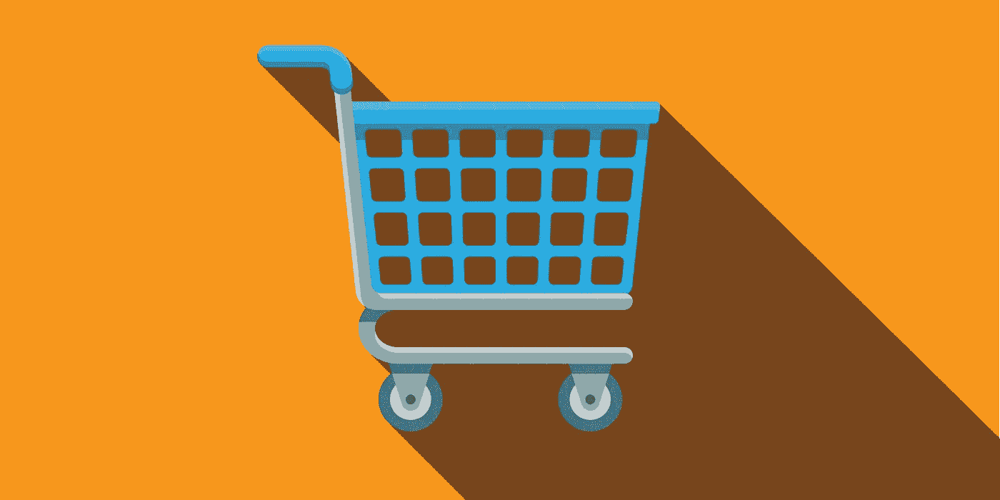
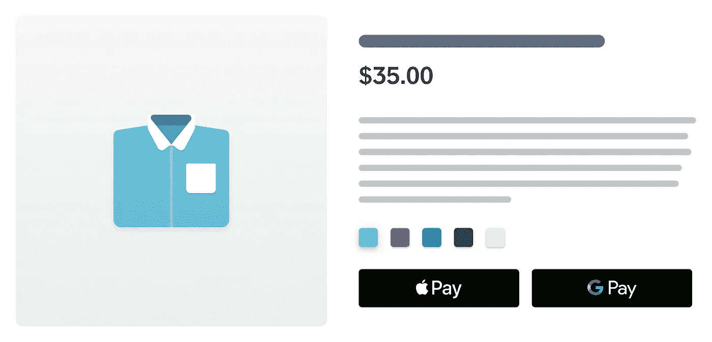

# 仅使用数字钱包打造结账体验，促进在线销售

> 原文：<https://medium.com/square-corner-blog/build-a-digital-wallet-only-checkout-to-boost-online-sales-7ebe92f4791d?source=collection_archive---------6----------------------->

> 注意，我们已经行动了！如果您想继续了解 Square 的最新技术内容，请访问我们的新家[https://developer.squareup.com/blog](https://developer.squareup.com/blog)

网络星期一 2018，网购最繁忙的一天，以[79 亿美元的销售额](http://exploreadobe.com/retail-shopping-insights/)创下 2018 年新高。移动设备(手机和平板电脑)占流量的 57%以上，但仅占销售额的 39%。这是因为与台式机相比，移动设备上的转化率通常较低。

提高移动转化率的一个很好的方法是使用 Apple Pay 和 Google Pay 这样的数字钱包。他们工作是因为他们减少了支付的摩擦。使用这些数字钱包的一种流行方式是将它们添加到产品详细信息页面，而不需要信用卡表单。这种方法允许买家跳过购物车和结账页面，快速购买一件商品，增加了冲动购买的可能性。

今天，我们很高兴地宣布对 [Square 支付表单](https://docs.connect.squareup.com/payments/sqpaymentform/digitalwallet/intro)的更新，这将允许您在产品详情页面中使用数字钱包建立快速结账体验。

**步骤 1:** 为数字钱包添加占位符。

**第二步:**初始化 Square 支付表单中的数字钱包。

**第三步:**如果数字钱包的占位符可供买家使用，则显示该占位符。

此时，如果启用了 Apple Pay 和 Google Pay 按钮，买家应该能够看到它们。

**步骤 4:** 用订单信息创建一个 PaymentRequest 对象。当点击数字支付按钮时，该回调被触发。

**第五步:**一旦买家完成支付，Square 将对卡进行令牌化，并通过 cardNonceResponseReceived 回调给你一个 nonce。然后，您可以将 nonce 发送到您的服务器，以便向客户收费。

您可以在我们的[文档](https://docs.connect.squareup.com/payments/sqpaymentform/digitalwallet/intro.)中了解更多关于如何将这些数字钱包添加到您的产品详情页面的信息。要了解更多关于 Square 开发者平台的信息，请访问[https://squareup.com/developers](https://squareup.com/developers)或加入我们在[squ.re/slack](http://squ.re/slack)的社区。

*注意:Square 仅支持 Apple Pay、Google Pay 和 Masterpass 的美元交易。*

**补充阅读**

*   与 [SqPaymentForm](https://docs.connect.squareup.com/payments/sqpaymentform/sqpaymentform-overview) 集成
*   与[检验 API](https://docs.connect.squareup.com/payments/checkout/overview) 集成

*想要更多？* [*注册*](https://www.workwithsquare.com/developer-newsletter.html?channel=Online%20Social&sqmethod=Blog) *订阅我们的每月开发者简讯或来与我们一起在 Square Dev*[*Slack channel*](https://squ.re/slack)*！您也可以在 Twitter 上关注我们，地址:*[*@ square dev*](https://twitter.com/@SquareDev)*。*