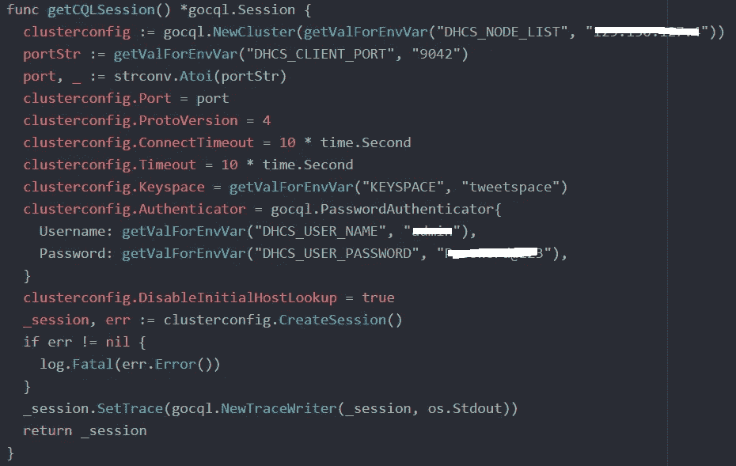
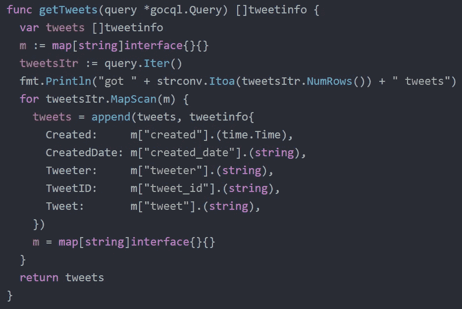
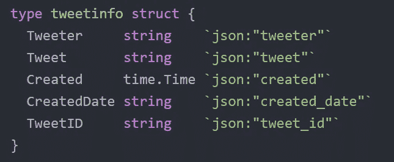
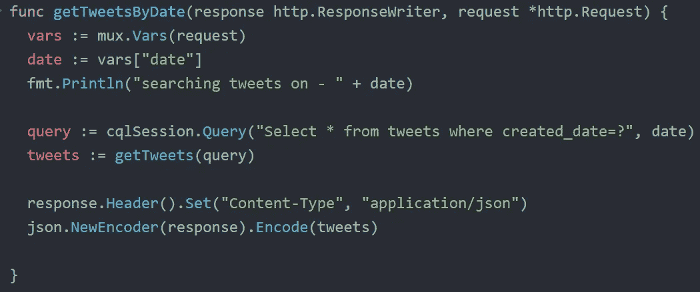
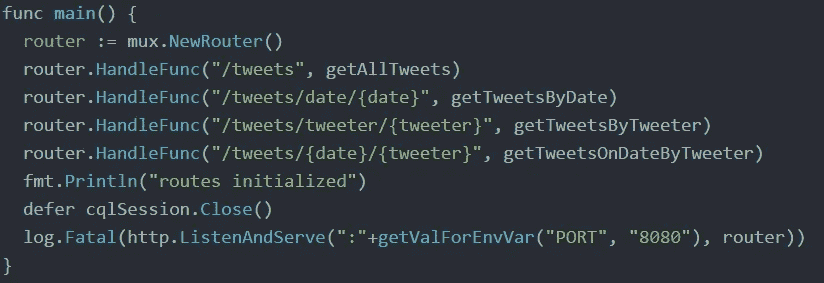
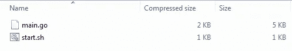
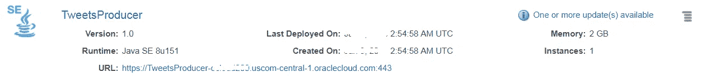
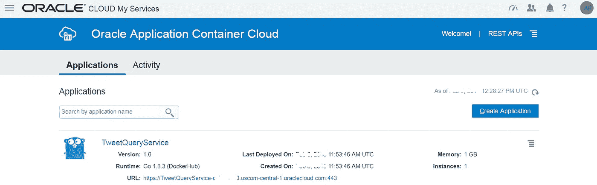

# 构建一个基于 Go 的 REST API 来查询 Cassandra 中的时间序列 tweet 数据

> 原文：<https://medium.com/oracledevs/build-a-go-lang-based-rest-api-on-top-of-cassandra-3ac5d9316852?source=collection_archive---------0----------------------->

[以前的一个博客](/oracledevs/getting-started-with-cassandra-using-oracle-data-hub-cloud-550889f4126e)展示了一个时间序列应用程序，使用该应用程序，一个连续的推文流(高速数据)被消费并保存到一个 Cassandra 实例(使用 [Oracle 数据中心云](https://cloud.oracle.com/datahub))中，然后使用另一个服务进行查询

[](/oracledevs/getting-started-with-cassandra-using-oracle-data-hub-cloud-550889f4126e) [## 使用 Oracle 数据中心云开始使用 Cassandra

### 使用 Oracle 数据中心云构建基于 Twitter 数据的时间序列应用程序

medium.com](/oracledevs/getting-started-with-cassandra-using-oracle-data-hub-cloud-550889f4126e) 

这篇博文附带的两个[示例应用程序](https://github.com/abhirockzz/accs-cassandra-twitter-timeseries-app)(即 Tweets 生产者服务和 Tweet 查询服务)都是基于 Java 的。在这篇博文中，我们将重新设计 Twitter 查询应用程序，以展示一个基于[**Golang**](https://golang.org)**的服务(而不是基于 Java 的 Spring Boot 应用程序)，并将其部署到 [Oracle 应用程序容器云](https://cloud.oracle.com/application-container-cloud)(是的，它[支持 Golang](/oracledevs/go-with-kafka-mysql-on-oracle-cloud-9c93e71167c2) ！)**

**具体地说**

*   **继续使用 Oracle 数据中心云作为推文的持久存储**
*   **使用 [**gocql**](http://gocql.github.io/) 库与 Cassandra 交互，以编写基于不同 crietria 获取 tweets 的核心逻辑**
*   **使用 [Gorilla toolkit](http://www.gorillatoolkit.org/pkg/mux) (具体来说是`**mux**`包)来设置我们的 HTTP 路由**

**在继续之前，我建议阅读前一篇博客中的以下部分，以获得一些用例/解决方案的上下文(这相当简单！)**

*   ****架构概述****
*   ****关于 Cassandra 数据模型的几个字****

# **解决办法**

> **Github 上有这款应用**

**[](https://github.com/abhirockzz/accs-golang-cassandra-tweet-query-service.git) [## abhirockzz/accs-golang-Cassandra-tweet-query-service

### 在 GitHub 上创建一个帐户，为 accs-golang-Cassandra-tweet-query-service 开发做出贡献。

github.com](https://github.com/abhirockzz/accs-golang-cassandra-tweet-query-service.git) 

我们将只探讨基于 Go 的 Tweet 查询服务的相关细节

首先连接到数据中心云上的 Cassandra 实例，并创建一个`**gocql.Session**`对象

注意连接属性(Cassandra 节点/主机和端口以及凭证)是如何从环境变量`**DHCS_***`中获得的——这要归功于**服务绑定**！



Create `**Session**`

核心逻辑驻留在处理程序中——有四个处理程序(名称不言自明)

*   `getTweetsByTweeter`
*   `getTweetsByDate`
*   `getTweetsOnDateByTweeter`
*   `getAllTweets`

注意`**getTweets**` 函数——它遍历从 Cassandra 收到的一堆 tweets，创建`**tweetinfo**` 对象并发回一个切片



Cassandra objects to **tweetinfo** slice

`tweetinfo` 是一个简单的结构，带有 tweet 的必需属性



**struct** to represent **tweets**

所有这些处理程序都遵循相同的模式

*   执行一个`**gocql.Query**`
*   调用`getTweets` 来获取`**tweetinfo**` 对象的一部分
*   并将它们编码为`json` 并返回给调用者——使用本机`**encoding/json**`包



HTTP handler in action

主要的方法是应用程序的入口点，它将所有东西集合在一起，启动 HTTP 服务器



**func main()**

## 绑定到数据中心云的服务

应用容器云为数据中枢云提供现成的服务绑定。这为你的应用程序提供了一个安全的通信渠道，而无需你做任何明确的事情

> 在数据库基础设施级别不需要与端口相关的配置

[这是此功能的文档](https://www.oracle.com/pls/topic/lookup?ctx=en/cloud/paas/app-container-cloud/jsewn&id=GUID-BCD4C8AA-0E1C-490D-92E8-6BAE003F5F5C)** 

# **构建和部署**

**在继续之前，请浏览前一篇博客的**基础设施设置**部分，完成以下强制步骤**

*   **使用 Oracle Datahub 云控制台和引导 Cassandra ( **键空间**和**表**)设置 Cassandra 集群**
*   **创建一个 **Twitter 应用**，为我们提供所需的认证令牌**

## **构建 **Tweet producer 应用****

**首先从 Github 获取项目— `git clone [https://github.com/abhirockzz/accs-cassandra-twitter-timeseries-app](https://github.com/abhirockzz/accs-cassandra-twitter-timeseries-app)`**

*   **`cd accs-dhcs-cassandra-tweets-producer`**
*   **`mvn clean install`**

**构建过程将在`target` 目录中创建`accs-cassandra-tweets-producer-dist.zip`**

## **构建**推文查询服务****

**首先从 Github 获取项目— `git clone [https://github.com/abhirockzz/accs-golang-cassandra-tweet-query-service](https://github.com/abhirockzz/accs-golang-cassandra-tweet-query-service)`**

**压缩以下文件— `main.go`、`start.sh`例如`accs-golang-tweet-query-service.zip`**

****

**zip file contents**

## **部署也称为向云推进**

**借助 Oracle Application Container Cloud，您在部署应用程序方面有多种选择。本博客将利用 **PSM CLI** ，这是一个用于管理 Oracle 云服务的强大命令行界面**

> **其他部署选项包括 [REST API](https://docs.oracle.com/en/cloud/paas/app-container-cloud/apcsr/index.html) 、 [Oracle 开发者云](https://docs.oracle.com/en/cloud/paas/developer-cloud/csdcs/deploying-application-oracle-developer-cloud-service.html#GUID-6FE6D850-65DC-471D-A249-F7CCA9CAB56F)，当然还有[控制台/UI](https://docs.oracle.com/en/cloud/paas/app-container-cloud/csjse/creating-application.html)**

**您可以在您的机器上下载并设置 PSM CLI(使用`psm setup` ) — [详情请点击](https://docs.oracle.com/en/cloud/paas/java-cloud/pscli/using-command-line-interface-1.html)**

**部署这两个应用程序**

*   ****推文制作人****

**使用您的 Twitter 访问令牌和 Oracle 数据中心云实例详细信息更新`deployment.json`**

```
{
 “instances”: 1,
 “memory”: “2G”,
 “environment”: {
 “TWITTER_CONSUMER_KEY”: “<as per your app>”,
 “TWITTER_CONSUMER_SECRET”: “<as per your app>”,
 “TWITTER_ACCESS_TOKEN”: “<as per your app>”,
 “TWITTER_ACCESS_TOKEN_SECRET”: “<as per your app>”,
 “TWITTER_TRACKED_TERMS”: “cloud,nosql”
 },
 “services”: [
 {
 “type”: “DHCS”,
 “name”: “<as per your instance>”,
 “username”: “<as per your instance>”,
 “password”: “<as per your instance>”
 }
 ]
}
```

**把拉链放进云里！**

**`psm accs push -n **TweetsProducer** -r java -s hourly -m manifest.json -d deployment.json -p target/accs-cassandra-tweets-producer-dist.zip`**

****

**Tweets Producer service deployed**

*   ****推文查询服务****

**也为此服务更新`deployment.json`**

```
{
  "instances": 1,
  "memory": "1G",
  "services": [
    {
      "type": "DHCS",
      "name": "<name of your Cassandra instance>",
      "username": "<Cassandra username>",
      "password": "<Cassandra password>"
    }
  ]
}
```

**..并部署这个应用程序**

**`psm accs push -n **TweetsQueryService** -r golang -s hourly -m manifest.json -d deployment.json -e **dockerhub** -p accs-golang-tweet-query-service.zip`**

> **一旦执行，异步进程就会启动，CLI 会返回其作业 ID，以便您跟踪应用程序的创建**

****

****Go** based Tweet query app on Application Container Cloud**

**部署应用程序后，导航至 Oracle Application Container 云应用程序页面进行确认— *记下应用程序 URL***

# **测试一下…**

**你测试的方式已经在[之前的博客](/oracledevs/getting-started-with-cassandra-using-oracle-data-hub-cloud-550889f4126e)的**试驾**部分有所概述——没有必要重复。要点如下**

*   **启动 tweets producer 应用程序，等待生产者开始消费 tweets，并将它们持久化到 Cassandra**
*   **然后使用 Tweets 查询服务公开的 REST API**

# **快速回顾**

**你只是，**

*   **创建了一个用 Tweets 轰炸云上的 Cassandra 实例的服务！**
*   **然后部署了一个基于 Go 的 REST API 来与 Cassandra 交互，帮助你以不同的方式访问这些推文**

**这就是全部了！**

# **不要忘记…**

*   **深入阅读 Oracle 数据中心云文档**

 **[## Oracle 数据中心云服务—开始使用

### 帮助管理员、开发人员和用户开始使用 Oracle Event Hub Cloud Service 的文档。

docs.oracle.com](https://docs.oracle.com/en/cloud/paas/data-hub-cloud/index.html)** 

*   **查看 Oracle Application Container Cloud 教程—每个运行时都有适合的内容！**

 **[## Oracle 应用容器云服务—创建您的第一批应用

### Oracle 应用容器云服务教程。学习创建你的第一个应用程序。

docs.oracle.com](https://docs.oracle.com/en/cloud/paas/app-container-cloud/create-first-applications.html)** 

*   **关于应用容器云的其他博客**

**[](/tag/app-container-cloud/latest) [## 关于应用容器云的最新故事和新闻—中型

### 阅读关于应用容器云的最新文章。每天，成千上万的声音阅读、书写和分享重要的…

medium.com](/tag/app-container-cloud/latest) 

干杯！

> 本文表达的观点是我个人的观点，不一定代表甲骨文的观点。**