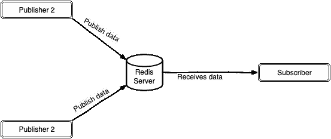
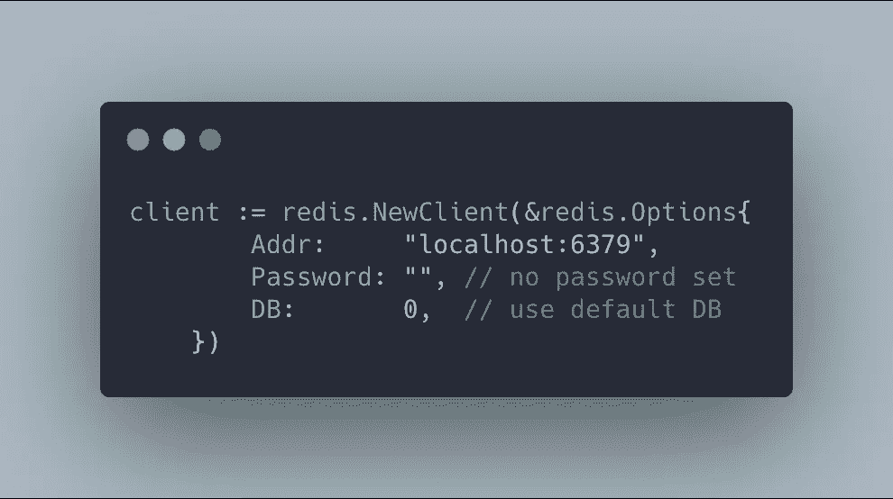
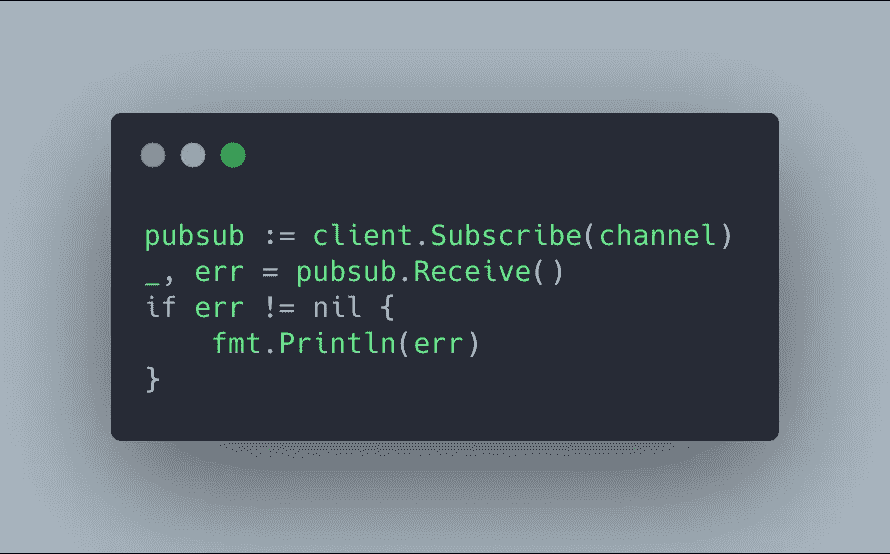

# Build a Real-Time App with Redis Pub/Sub

> 原文：<https://medium.easyread.co/build-a-real-time-app-with-redis-pub-sub-a99e46d000d5?source=collection_archive---------3----------------------->

## Bagaimana membuat *real-time app* menggunakan redis pub/sub?

Di tulisan kali ini saya akan memberikan tutorial bagaimana membuat *real-time app* menggunakan redis pub/sub. Melalui langkah-langkah yang kita lakukan nanti, kita bisa melihat bagaimana sharing data secara *real-time* tersebut dilakukan. Sebelumnya kita bahas dulu apa itu *real-time data processing* dan bagaimana ia bekerja.

Photo by [Lukas Blazek](https://unsplash.com/@goumbik?utm_source=unsplash&utm_medium=referral&utm_content=creditCopyText) on [Unsplash](https://unsplash.com/?utm_source=unsplash&utm_medium=referral&utm_content=creditCopyText)

[***Real-time data processin*** *g*](https://www.techopedia.com/definition/31742/real-time-data-processing) adalah proses pengambilan tindakan pada data yang diterima ( *received* ) dalam periode singkat (hampir seketika) di waktu data tersebut dibuat atau diterbitkan. Dari istilah tersebut kita bisa menyimpulkan bahwa akan ada 3 proses penting yang terjadi, yaitu proses menerima data, pengambilan tindakan dan proses membuat atau menerbitkan ( *publish* ) data.

*Nah,* yang menjadi fokus perhatian kita adalah bagaimana cara data tersebut dapat diterbitkan dan diterima. Proses menerima data dilakukan oleh *subscriber/receiver* dan proses pembuatan atau penerbitan data dilakukan oleh *publisher* . Data yang dimaksudkan disebut *message* . Di dalam dunia *software architecture* , istilah ini disebut [***publish–subscribe pattern***](https://en.wikipedia.org/wiki/Publish%E2%80%93subscribe_pattern) . Bagi yang sudah tahu atau sering mendengar istilah *message queuing* , ini mirip tetapi tidak serupa.

[**Redis**](https://redis.io/topics/introduction) adalah salah satu tool dari sekian tools yang menyediakan fitur *publish* dan *subscribe* . Contoh lainnya yang mungkin familiar ialah [**Google Pub/Sub**](https://cloud.google.com/pubsub/?utm_source=google&utm_medium=cpc&utm_campaign=japac-ID-all-en-dr-bkws-all-all-trial-e-dr-1008074&utm_content=text-ad-none-none-DEV_c-CRE_308495403071-ADGP_Hybrid+%7C+AW+SEM+%7C+BKWS+~+T1+%7C+EXA+%7C+Big+Data+%7C+M:1+%7C+ID+%7C+en+%7C+Cloud+PubSub-KWID_43700029830238360-kwd-395094646964&userloc_1007706&utm_term=KW_google%20pub%20sub&gclid=EAIaIQobChMI_p-24vy-6QIVmDUrCh3XKwg0EAAYASAAEgK9rfD_BwE) . Redis menyediakan beberapa commands seperti `**SUBSCRIBE**` , `**UNSUBSCRIBE**` , dan `**PUBLISH**` . Command ini akan kita gunakan untuk melakukan *publish* *message* ke *channel* , *subscribe* dan *unsubscribe* *channel* . Untuk lebih jelasnya, kamu dapat membacanya di situs [ini](https://redis.io/topics/pubsub) .

Publish and subscribe data in Redis

*Sudah cukup perkenalannya, sekarang kita akan mempraktekkannya.*

Kita akan membuat 2 program sederhana sebagai *publisher* dan *subscriber* . Disini saya menggunakan bahasa Go dan saya anggap kalian sudah memiliki *Redis* dan Go di perangkat masing-masing.

## Publisher

Program pertama akan berperan sebagai *publisher* . Di sini kita akan mengirimkan 10 *message* ke *channel* `**EXAMPLE**` dalam interval waktu 1 detik. Jadi kita berharap *subscriber* akan mendapatkan 10 *message* juga dan harus sama persis.

Karena kita berkomunikasi via Redis, **pertama-tama** kita harus membuat sebuah redis client.

**Kedua** , kita perlu `**SUBSCRIBE**` channel `**EXAMPLE**` menggunakan method `**Subscribe**` dan channel akan secara otomatis terbuat. Perlu diketahui method Subscribe tidak menunggu response apapun dari Redis, jadi *subscription* mungkin tidak akan aktif secara langsung. Untuk ***‘memaksa’*** program kita menunggu response dari Redis, kita perlu menambahkan method **Receive** .

**Ketiga** , kita akan mengirimkan 10 *message* ke *channel* per detik. Karena ini hanya sebatas contoh, kita akan mengirimkan angka acak yang unik saja. Dan untuk message terakhir, kita akan mengirimkan angka `**-1**` sebagai penanda kalau kita sudah selesai mem- *publish* *message* dan akan menutup *client* dan *channel* juga.

Untuk code lengkapnya bisa dilihat di bawah ini.

## Subscriber

Program kedua adalah sebagai *subscriber* . Disini kita akan menerima 10 message dari channel `**EXAMPLE**` dalam waktu yang sama ketika *message* di-publish.

Langkah pertama dan kedua sama seperti di program pertama. Bedanya disini kita memanggil method `**Channel**` . Method ini akan mengembalikan sebuah Go *channel* untuk secara konkuren menerima *message* dari *channel* yang kita *subscribe* .

Untuk code lengkapnya bisa dilihat di bawah ini.

Untuk menjalankannya, pertama jalanin *subscriber* -nya dulu, lalu kemudian *publisher* . Contohnya bisa dilihat di bawah ini.

Dari hasil di atas, kita bisa lihat bahwa program *subscriber* kita berhasil menerima *message* yang sama persis seperti *publisher* kirimkan. *Message* tersebut bisa kita proses sebagaimana yang kita inginkan.

# Kesimpulan

Sebagai penutup, berikut hal-hal yang kita pelajari dan lakukan, yaitu:

*   Pemahaman mengenai konsep *real-time dat* a
*   Pemahaman mengenai konsep *publish-subscribe pattern*
*   Membuat aplikasi *real-time* sederhana dengan *Redis Pub/Sub*

Sekian dan terimakasih.

# Referensi

1.  [**Real-Time Data Processing**](https://www.techopedia.com/definition/31742/real-time-data-processing)
2.  [**发布-订阅模式**](https://en.wikipedia.org/wiki/Publish%E2%80%93subscribe_pattern)
3.  [**云 Pub/Sub**](https://cloud.google.com/pubsub/?utm_source=google&utm_medium=cpc&utm_campaign=japac-ID-all-en-dr-bkws-all-all-trial-e-dr-1008074&utm_content=text-ad-none-none-DEV_c-CRE_308495403071-ADGP_Hybrid+%7C+AW+SEM+%7C+BKWS+~+T1+%7C+EXA+%7C+Big+Data+%7C+M:1+%7C+ID+%7C+en+%7C+Cloud+PubSub-KWID_43700029830238360-kwd-395094646964&userloc_1007706&utm_term=KW_google%20pub%20sub&gclid=EAIaIQobChMI_p-24vy-6QIVmDUrCh3XKwg0EAAYASAAEgK9rfD_BwE)
4.  [Redis](https://redis.io/topics/introduction)