# 用 Flutter 构建加密货币定价 App

> 原文：<https://medium.com/quick-code/build-a-simple-app-with-pull-to-refresh-and-favourites-using-flutter-77a899904e04?source=collection_archive---------0----------------------->


Image taken from [https://flutter.dev](https://flutter.dev)

> Flutter 允许你从一个代码库在 iOS 和 Android 上构建漂亮的原生应用

我最近偶然发现了 Google 新的用于跨平台开发的开源工具包，并决定尝试一下。你可以在这里阅读各种好处(剧透，看起来真的很棒)，但我想我会与你分享如何用他们的教程之外的东西开始使用 Flutter。

我们将创建一个具有拉至刷新功能的加密货币价格表应用程序，并跟踪您最喜爱的加密货币。

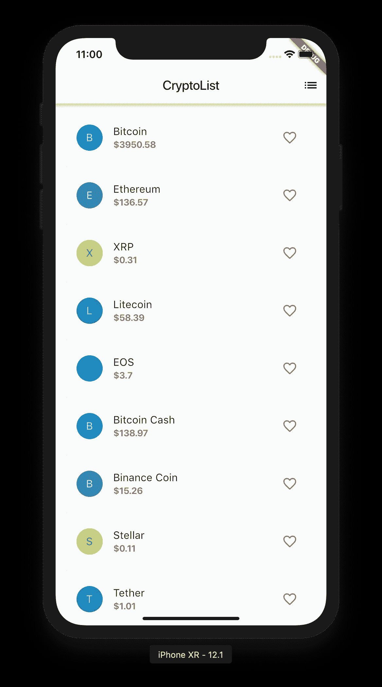

What we will be doing in this tutorial.

# 先决条件

我将使用装有 iOS 模拟器的 Macbook 来构建这个应用程序。随意使用 Windows 机器和 Android 模拟器。

在我们开始之前，前往 [Flutter](https://flutter.dev) 并安装 Flutter 和各种依赖项。当你在做的时候，拿起你最喜欢的 IDE 并设置它使用 flutter(在本教程中我们将使用 VS 代码)。

# 我们开始吧！

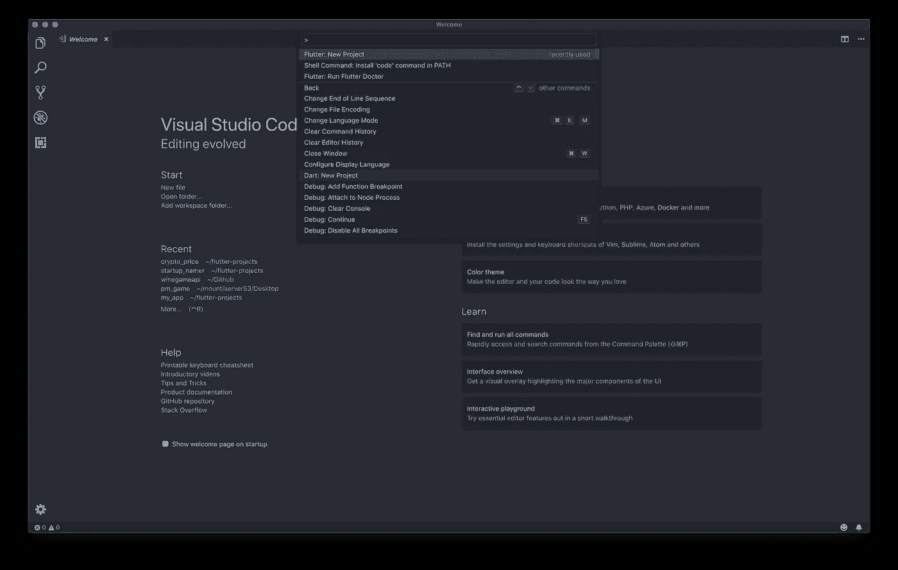

在 VS 代码中(如果需要，在这里按照步骤[执行](https://flutter.dev/docs/get-started/test-drive?tab=vscode)，搜索`Flutter New Project`来创建一个新的颤振项目。命名为 crypto_list，让 flutter 为我们初始化这个项目。

创建了一个文件`main.dart`，这将是我们应用程序的入口点。我们将从头开始构建应用程序，所以继续删除那里的所有代码。

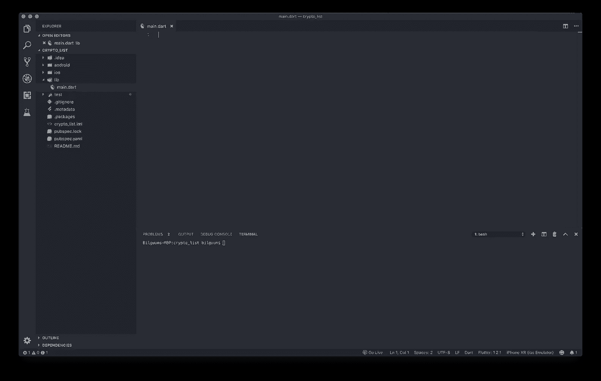

这是您的 IDE 在这一点上应该有的样子。

## 创建基本用户界面

当你启动应用程序时，代码将从`main`函数中执行。因此，让我们继续如上所述创建它。

```
open -a Simulator
flutter run
```

这将打开您的机器上使用的默认模拟器，并运行应用程序。运行它，它应该显示以下内容

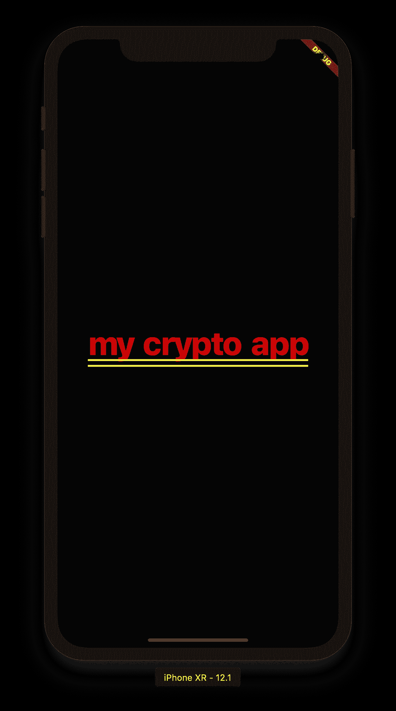

It is ugly but gets the job done.

好极了。您已经使用 flutter 构建了您的第一个 UI！它现在很难看，所以让我们创建一些小部件来美化我们的应用程序。

## 添加小部件

> **无状态**小部件是不可变的，这意味着它们的属性不能改变——所有的值都是最终的
> 
> **有状态**小部件维护可能在小部件的生命周期中改变的状态。实现有状态小部件至少需要两个类:1)创建实例的 stateful widget 类，2)State 类。StatefulWidget 类本身是不可变的，但是 State 类在小部件的整个生命周期中都是持久的。

编辑我们的代码，如上所示。

我们所做的是:

1.  添加一个有状态的小部件`CryptoList`，创建它的状态类`CryptoListState`
2.  大多数逻辑将存储在`CryptoListState`中，而`CryptoList`只是创建它的状态类
3.  `build`描述小部件的外观。这里我们返回了`Scaffold`，它创建了一个带有`title`和`icons`的`appBar`以及带有集中文本的`body`。

按`r`重新加载更改或`R`热重启(并重建状态)

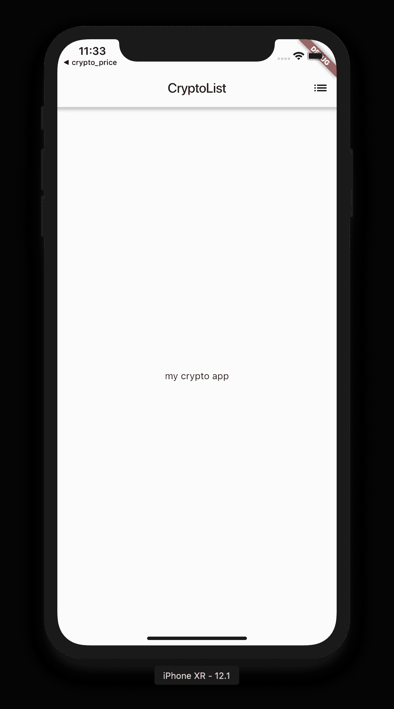

Looks so much prettier!

有了`Scaffold`,我们已经无限地改进了我们应用程序的整体用户界面。还记得我们在`MyApp`类中使用了`theme`吗？它被用来设置我们的应用程序的原色，(以及扩展的`appBar's`颜色)。

请随意更改，例如`new ThemeData(primaryColor: Colors.orange)`，但我们将继续使用白色。

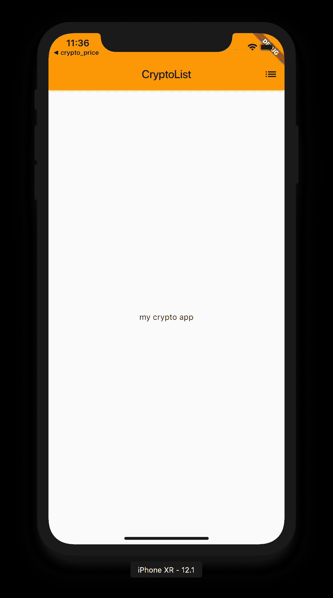

Primary colour changed to orange.

## 发出 HTTP 请求以获取数据

在我们将加密货币列表添加到视图主体之前，让我们首先获取继续操作所需的所有数据。

```
import 'package:flutter/material.dart';
import 'dart:math';
import 'dart:async';
import 'dart:convert';
import 'dart:core';
import 'package:http/http.dart' as http;
```

在你的`main.dart`文件的顶部导入我们将要使用的所有模块。找到文件`pubspec.yaml`和`http: ^0.12.0+1`(这是进行 http 请求所必需的)，如下所示:

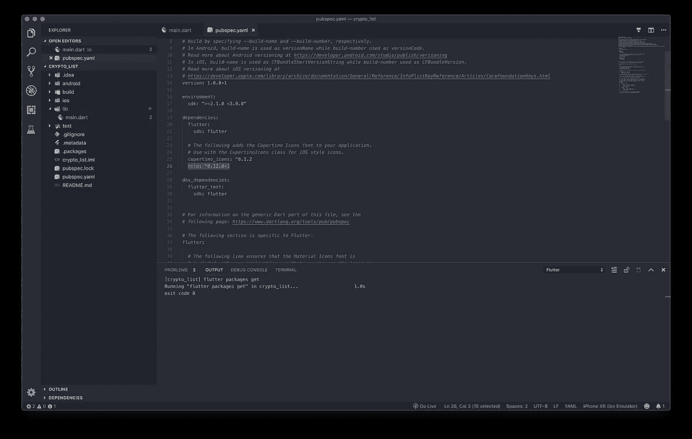

Once you add, flutter will automatically install the dependency

1.  `pubspec`是存储包元数据的地方
2.  `dart:async`允许使用`Future`类编写异步代码
3.  `dart:convert`允许解码 JSON 响应
4.  `package:http/http.dart`允许发出 http 请求
5.  `dart:math`和`dart:code`提供了一些辅助函数来操作数据

如上所示更新代码。请阅读添加内容的评论。本质上，我们已经要求我们的小部件在状态初始化时执行`getCryptoPrices`。然后我们执行一个`async`操作来从一个 api 获取数据，并设置`cryptoList.`的状态

按下`R`进行热重启

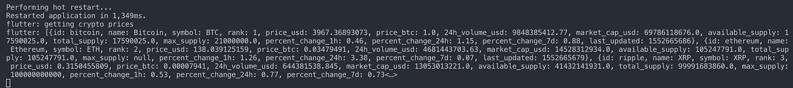

Output of the app now. All the required data is available for us to use.

太好了！我们的数据可供我们使用。我们现在可以生成 UI 来显示这些数据。

## 创建 ListView

用上面显示的代码更新您的代码。增加了很多代码，但是我已经尽量多加注释，让它看得懂。以下是我们所做的工作:

1.  把我们的`Scaffold body`换成`_buildCryptoList`。这返回一个`ListView`。使用`_buildRow`构建行
2.  `_buildRow`用颜色吸收每个加密货币对象。它相应地构建了一行:头像、标题、副标题和图标
3.  `_fav`点击心形图标时的处理。`_saved`包含我们喜欢的`crypto`对象列表。

按下`R`进行热重启

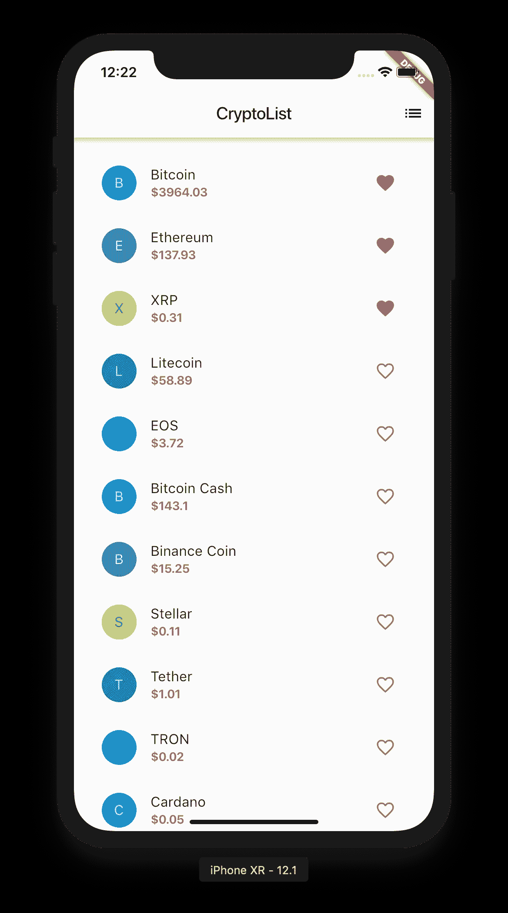

Looks so much better!

太好了！现在，您已经构建了一个非常漂亮的 UI，其中包含了各种加密货币的真实数据。如果你不能理解代码，没关系！慢慢来，经过足够的练习，你会找到窍门的。否则，欢迎在下面发表评论。

## 添加装载栏

如果你注意到，当你重启应用程序时，会有一个短暂的错误显示。这是因为当调用`getCryptoPrices`时，没有设置用于构建列表视图的`_cryptoList`状态，因此在设置状态之前会出现一个错误。让我们编辑代码以显示一个加载栏，直到`_cryptoList`被设置。

用这个更新代码。我们调用了另一个函数`_getMainBody.`，而不是直接调用`Scaffold`中的`_buildCryptoList`

在`getCryptoPrices`中，我们还在发出请求之前将`_loading`设置为 true，在完成请求之后将`_loading`设置为 false。`_getMainBody`然后检查并返回一个进度条，如果`_loading`为真。

当你运行应用程序时，你应该会看到一个圆形的进度指示器，而不是我们之前看到的错误页面。

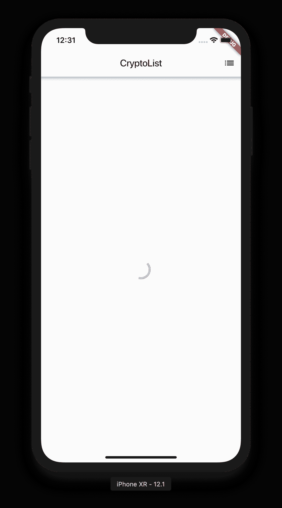

Centralised loading bar when an API is in progress

## 拉至刷新

我们现在有一个不错的应用程序。因为我以前有过开发 iOS 应用的经验，所以我想看看模仿一些功能会是什么样子。最常用的功能之一是 ***拉刷新。***

事实证明，其实很简单。

用上述功能替换`_getMainBody`。它所做的是，不是直接返回`ListView`，而是将它包装在`RefreshIndicator`周围，这使得拉刷新成为可能。然后我们将`onRefresh`指向我们进行 api 调用的函数。

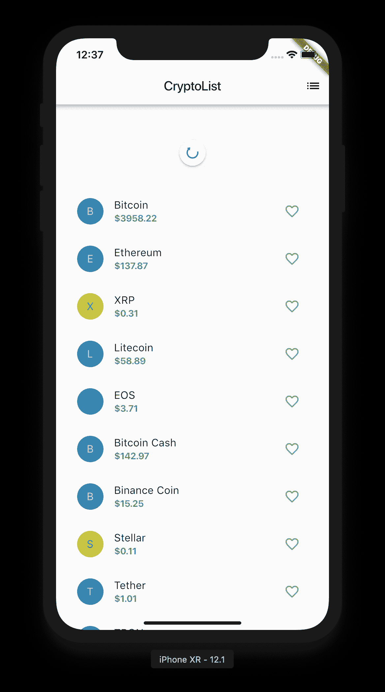

Pull down to refresh the data

这就是为什么我们需要我们的小部件是有状态的。当数据发生变化时，无论是通过轮询还是服务推送，我们都希望数据发生变化，UI 也相应地呈现出来。如果我们只想在应用程序运行期间显示一次数据，我们可以让我们的小部件成为无状态的。

## 推动新观点

我们之前提到过，我们希望能够查看喜欢的加密货币。所以让我们来实现它。

如上所述，实现我们之前声明的`_pushSaved`函数。我在评论中写下了正在发生的事情。基本上，我们得到每个`saved`条目，建立一个新的列表，并将其传递给新路线的`Scaffold.`

该功能在以下情况下触发:

```
new IconButton(icon: const Icon(Icons.list), onPressed: _pushSaved),
```

在主屏幕上。让我们运行应用程序，看看会发生什么。

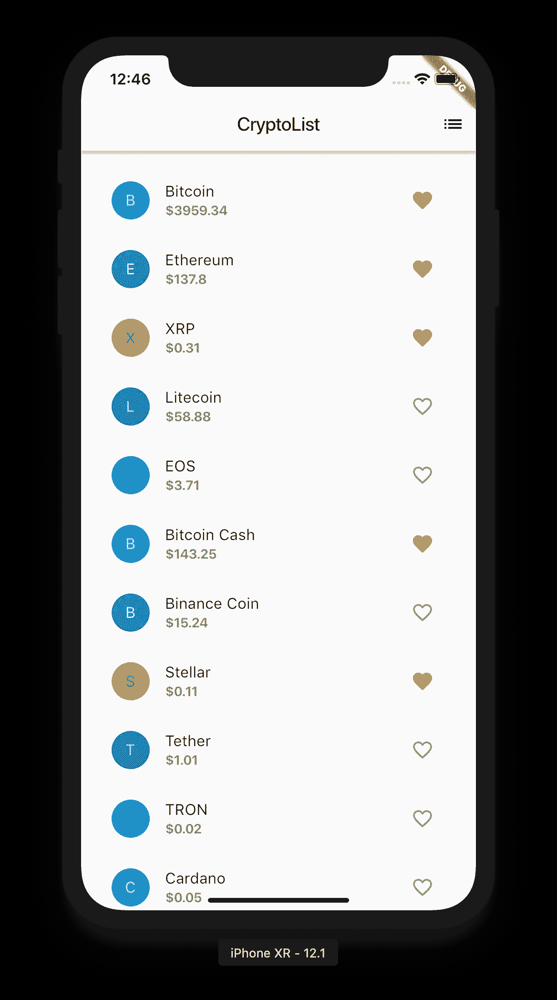

First favourite some items and press the top right button

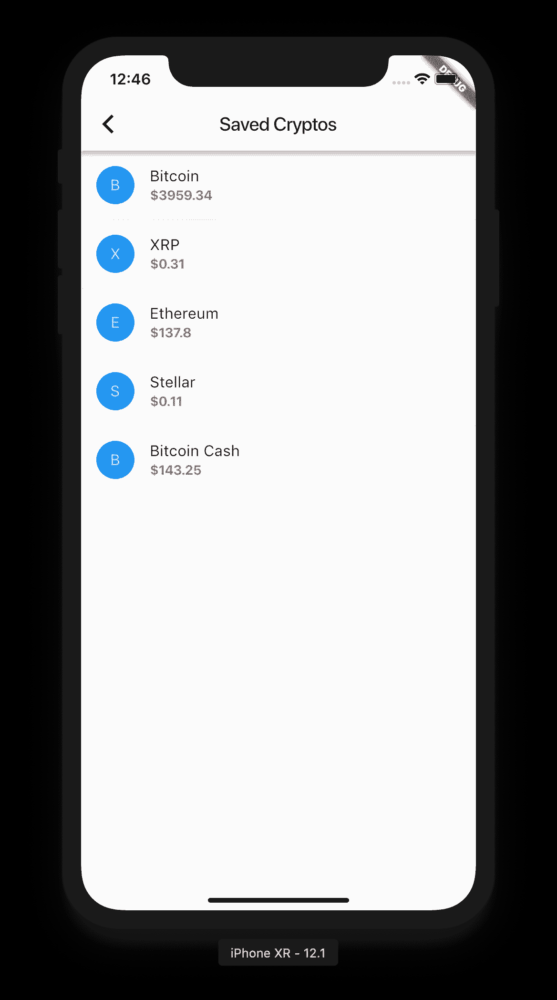

Your favourited items will be visible!

当然，如果我们不能在 Android 和 iOS 上运行跨平台框架，它就没有用了！所以下面是 ***无代码变化的安卓等效截图。***

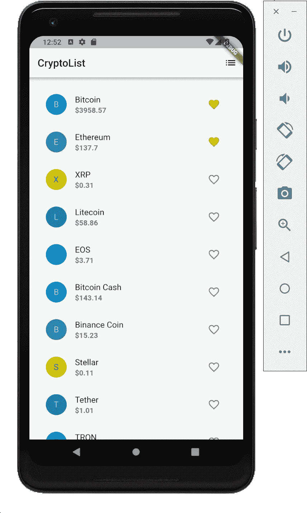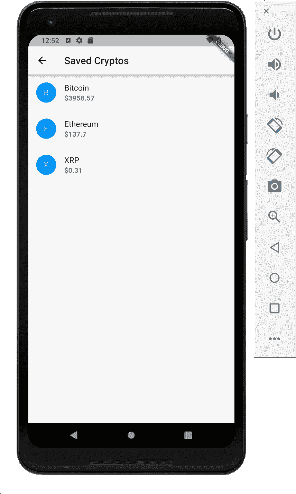

我相信某些定制肯定是可能的，以更好地适应每个平台的本机外观，例如通过使用 *cupertino 风格*小部件，但这不包括在本教程中。

# 最后的想法

这是我用 Flutter 做的第一个项目。我参考了官方 Flutter 页面中显示的原始样本，但为了方便自己的学习，对其进行了扩展。框架真的感觉很酷，所以我以后可能会写其他复杂的教程。

完整的源代码可以在这里找到:

[](https://github.com/Bilguun132/crypto_list) [## Bilguun132/crypto_list

### 颤振演示。在 GitHub 上创建一个帐户，为 Bilguun132/crypto_list 的开发做出贡献。

github.com](https://github.com/Bilguun132/crypto_list) 

如果有人觉得这些有用，请随意分享或者让我知道是否有错误/不好的实践/实现。

祝编码愉快！