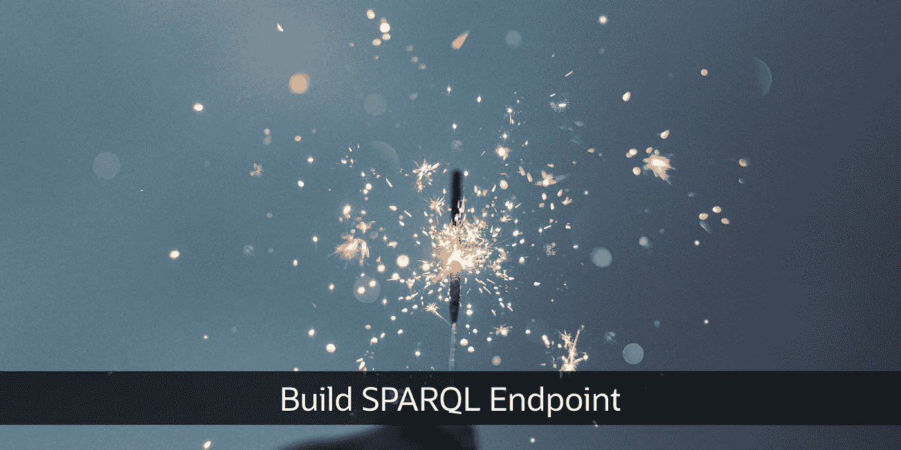
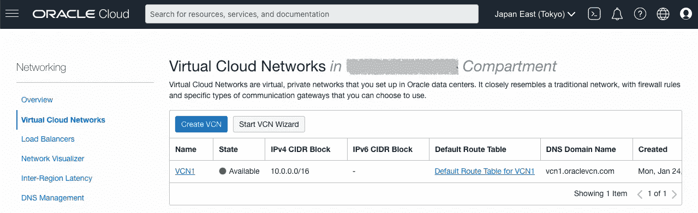
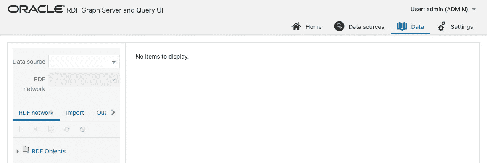
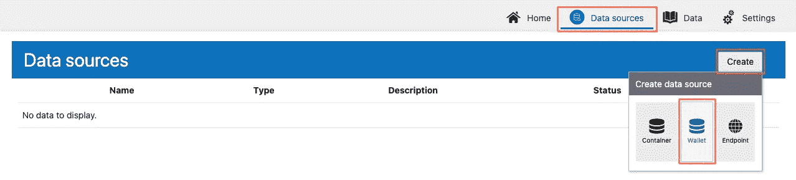
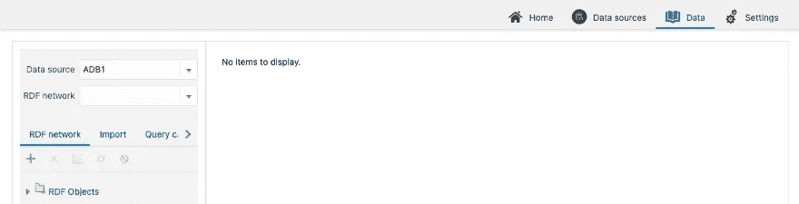

# 使用自治数据库构建 SPARQL 端点(第 1/2 部分使用 WebLogic)

> 原文：<https://medium.com/oracledevs/build-always-free-sparql-endpoint-part-1-2-6749daa974bd?source=collection_archive---------0----------------------->



Photo by [Cristian Escobar](https://unsplash.com/@cristian1?utm_source=unsplash&utm_medium=referral&utm_content=creditCopyText) on [Unsplash](https://unsplash.com/s/photos/spark?utm_source=unsplash&utm_medium=referral&utm_content=creditCopyText)

(本文中的过程已经过 Oracle RDF Graph Server 和 Query UI 版本 **22.2.0** 的测试)

SPARQL 是什么？资源描述框架(RDF)是在 Web 上交换数据和元数据的通用方法，SPARQL 是检索以 RDF 格式存储的数据的标准查询语言。为了发布和链接数据，许多组织都提供了 SPARQL 端点。

本文将向您展示如何在 Oracle Cloud 的[永远免费服务中使用 RDF 数据构建 SPARQL 端点。这是一项针对自治数据库的免费服务，没有时间限制，包括每个帐户两个数据库实例和两个计算虚拟机。](https://www.oracle.com/cloud/free/)

要将 Always Free 自治数据库中的数据集作为 LOD(链接开放数据)发布到 web，您可以通过在 Oracle WebLogic Server 中部署 RDF Server 来创建 SPARQL 端点，该端点可用于具有 [Oracle 技术网络许可证](https://www.oracle.com/downloads/licenses/wls-dev-license.html#licenseContent)的开发和测试。在生产中使用 Oracle WebLogic Server 来部署 SPARQL 端点需要商业许可证。如果你正在寻找一个免费的选项，请参见[这篇文章](/oracledevs/48fb5f33ec4a)并使用 Tomcat 代替。

这一部分描述了一种快速构建端点和执行 SPARQL 查询的方法。本文末尾补充了进一步的考虑，以供参考。

相关文章:

*   [使用自治数据库构建 SPARQL 端点(使用 Tomcat 的第 1/2 部分)](/oracledevs/48fb5f33ec4a)
*   [使用自治数据库构建 SPARQL 端点(第 2/2 部分)](/oracledevs/build-sparql-endpoint-with-autonomous-database-part-2-2-7c1c10f617b9)

**先决条件**

首先，做好以下准备。你需要注册一个免费的甲骨文云账户。您可以对密码 1–3 使用相同的密码。

```
- Oracle Cloud account
- 1 SSH key pair (private/public key)
- 3 passwords
  - <password_1>: DB login (for **ADMIN** user)
  - <password_2>: RDF Server login (for **admin** user)
  - <password_3>: DB Connection Wallet
```

**创建数据库**

按照如下步骤浏览屏幕，创建一个数据库。这是一个完全受管理的数据库服务，称为自治数据库。

```
Oracle Cloud console
  > Oracle Database
    > Autonomous Database
      > Create Autonomous Database
```

配置项目如下。

```
- Configure the database
  - Database name: <db_name> (**ADB1**)
  - Workload type: **Data Warehouse** or **Transaction Processing**
  - Deployment type: **Shared Infrastructure**
  - Database version: **19c** or **21c**
  - Password: **<password_1>** - Choose network access: **Secure access from everywhere**
```


**创建网络**

按照以下步骤浏览屏幕，创建一个网络。我们将使用向导创建基本网络配置，您可以稍后更新网络详细信息。

```
Oracle Cloud console
  > Networking
    > Virtual Cloud Networks
      > Start VCN Wizard
        > Create VCN with Internet Connectivity
          > Start VCN Wizard
```

配置项目如下。

```
- Configuration
  - VCN NAME: **VCN1**
  - The rest of the items: (Do not need to change)
```



为公共子网添加新规则，使端口 7002 和 8001 可以从外部访问。

```
Oracle Cloud console
  > Networking
    > Virtual Cloud Networks
      > VCN1
        > Public Subnet-VCN1
          > Default Security List for VCN1
            > Add Ingress Rules
```

配置项目如下。

```
- Add Ingress Rules
  - Source CIDR: **0.0.0.0/0**
  - Destination port range: **7002,8001**
  - Description: **For SPARQL Endpoint**
```


**创建一个 SPARQL 端点**

SPARQL 端点应用程序是作为一个市场映像分发的，因此按照下面的步骤启动这个映像。

```
Oracle Cloud console
  > Marketplace
    > All Applications
```

找到下图，启动堆栈。


```
- Name: **Oracle RDF Graph Server and Query UI**
- Version: **22.2.0**
```


配置项目如下。

```
- Configure Variables
  - Resource name prefix: Any name
  - OCI compartment: Your compartment
  - Server available domain: Any domain
  - Server shape: **VM.Standard.E2.1.Micro** (Always Free eligible)- Add SSH keys
  - SSH public key: Upload the public key (e.g. "ssh-rsa AAAAB3N..")- Instance Network
  - Virtual cloud network compartment: Your compartment
  - Existing virtual cloud network: The VCN created above (**VCN1**)
  - Subnet compartment: Your compartment
  - Existing subnet: The public subnet (**Public Subnet-VCN1**)- WebLogic Advanced Configuration
  - WebLogic Admin User Name: **admin**
  - WebLogic Admin Password: **<password_2>**
```


创建完成后，新创建的实例的公共 IP 地址将显示在日志部分。您也可以从“计算实例”页面检查它。


**登录 SPARQL 端点**

现在，您可以从 web 浏览器访问 SPARQL 端点。

*   https:// <ip_address>:8001/orardf</ip_address>

由于自签名证书，您将看到一条安全警告。所以你必须继续:

*   Chrome:在屏幕上输入“thisisunsafe”
*   火狐:高级>接受风险并继续

以`admin`用户身份登录。

```
- User: **admin**
- Password: **<password_2>**
```


此时您将看不到数据源，因为这个端点还没有连接到自治数据库。



**下载钱包**

Oracle Wallet 是一个 zip 文件，用于归档一组身份证明文件，如证书、证书请求和私钥。SPARQL 端点需要它来访问自治数据库。

按照以下步骤打开钱包下载页面。

```
Oracle Cloud console
  > Oracle Database
    > Autonomous Database
      > Select the ADB created above (**ADB1**)
        > DB Connection
```

下载钱包 zip 文件。

```
- Wallet Type: **Instance Wallet**
- Password: **<password_3>**
```


**向钱包添加凭证**

我们需要将数据库用户的凭证添加到这个 wallet 中，以便 SPARQL 端点可以访问自治数据库。为此，我们将钱包上传到计算实例，运行以下脚本，将用户名和密码包含到钱包中。

```
$ scp -i **<key>** ~/Downloads/Wallet_**<db_name>**.zip opc@**<ip_address>**:
$ ssh -i **<key>** opc@**<ip_address>**
$ mkdir wallet
$ cd wallet
$ unzip ../Wallet_<db_name>.zip
$ export JAVA_HOME=/usr/local/java/jdk1.8.0_221
$ /u01/app/oracle/middleware/wls12214/oracle_common/bin/mkstore \
  -wrl /home/opc/wallet -createCredential **<db_name>**_high \
  ADMIN **<password_1>**Enter wallet password: **<password_3>**
```

示例:

```
$ scp -i .ssh/id_rsa ~/Downloads/Wallet_**ADB1**.zip opc@**192.0.2.1**:
$ ssh -i .ssh/id_rsa opc@**192.0.2.1**
$ mkdir wallet
$ cd wallet
$ unzip ../Wallet_ADB1.zip
$ export JAVA_HOME=/usr/local/java/jdk1.8.0_221
$ /u01/app/oracle/middleware/wls12214/oracle_common/bin/mkstore \
  -wrl /home/opc/wallet -createCredential **adb1**_high \
  ADMIN ************Enter wallet password: ************
```

下载更新的钱包。

```
$ zip ../wallet_with_cred.zip *
$ exit
$ scp -i **<key>** opc@**<ip_address>**:~/wallet_with_cred.zip ~/Downloads/
```

示例:

```
$ zip ../wallet_with_cred.zip *
$ exit
$ scp -i **.ssh/id_rsa** opc@**192.0.2.1**:~/wallet_with_cred.zip ~/Downloads/
```

**连接到数据库**

可以将数据库注册为数据源，然后 SPARQL 端点可以对该数据库发出查询。

浏览“数据源”选项卡，上传钱包。



配置项目如下。

```
- Zip file: Select the local path of **wallet_with_cred.zip**
- Name: Any name of this data source (**ADB1**)
- Wallet Service: <db_name>_high (**adb1_high**)
```


创建数据源后，您可以在“数据”选项卡中选择它。但是，它还不包含任何 RDF 网络。



我们将在[第 2 部分](/@ryotayamanaka/build-always-free-sparql-endpoint-part-2-2-5910564f6c76)中创建一个 RDF 网络并上传一个样本数据集。

**如何更改登录密码**

如果需要更改密码，请访问 WebLogic Server 控制台。因为您还没有配置证书(您正在使用自签名证书)，所以您将再次得到一个警告。

*   https://<ip_address>:7002/控制台</ip_address>

使用密码登录。

```
- Username: **admin**
- Password: **<password_2>**
```

导航至`admin`用户的设置，如下所示。

```
Security Realms
  > myrealm
    > Users and Groups
```

打开`Passwords`选项卡，更改密码。

现在您已经成功构建了一个“永远免费”的 SPARQL 端点！在[第 2 部分](/oracledevs/build-sparql-endpoint-with-autonomous-database-part-2-2-7c1c10f617b9)中，我将展示如何使用这个端点，包括如何上传 RDF 数据集、在 UI 上运行 SPARQL 查询、发布数据集、通过 REST API 访问它们等等。

请从以下网址了解有关**甲骨文图**的更多信息:

*   [中](/tag/oracle-graph) (=所有带甲骨文图形标签的文章)
*   [堆栈溢出](https://stackoverflow.com/questions/tagged/oracle-graph) (=带有 oracle-graph 标记的问题)
*   [Slack AnDOUC](https://join.slack.com/t/andouc/shared_invite/zt-1a2hmiz6f-vLlblcQyv0t9FMraMMP5uQ) (=邀请链接，请访问#graph)
*   [Slack OracleDevRel](https://join.slack.com/t/oracledevrel/shared_invite/zt-uffjmwh3-ksmv2ii9YxSkc6IpbokL1g) (=邀请链接，请访问#oracle-db-graph)