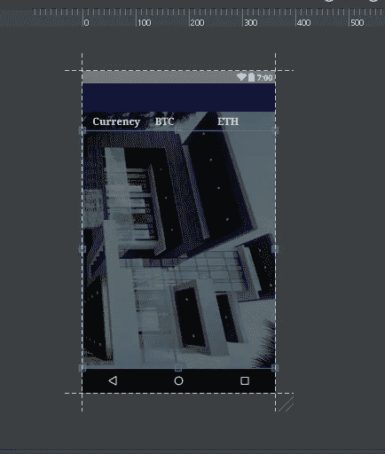
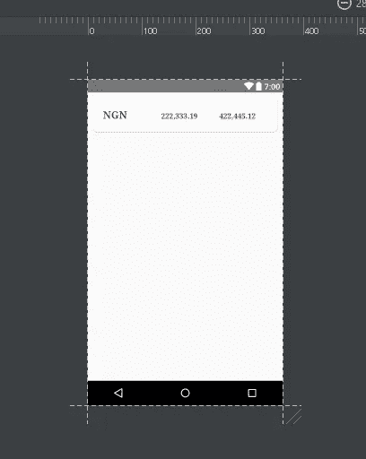
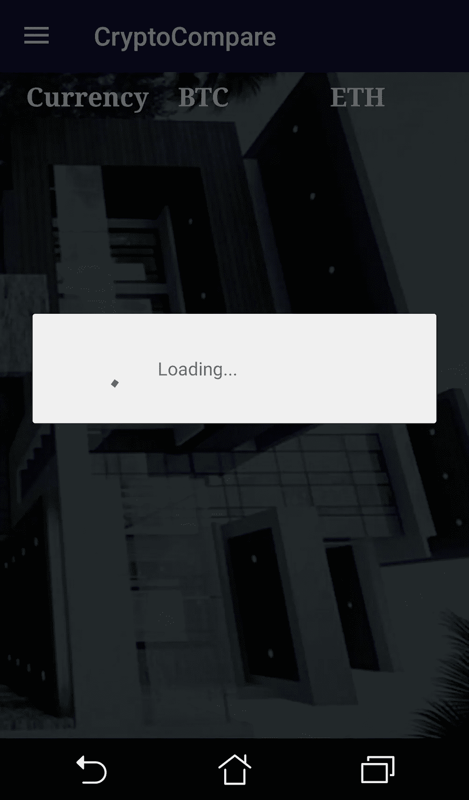
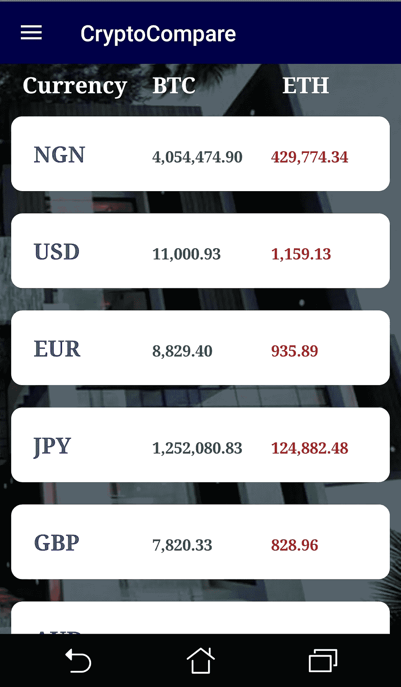
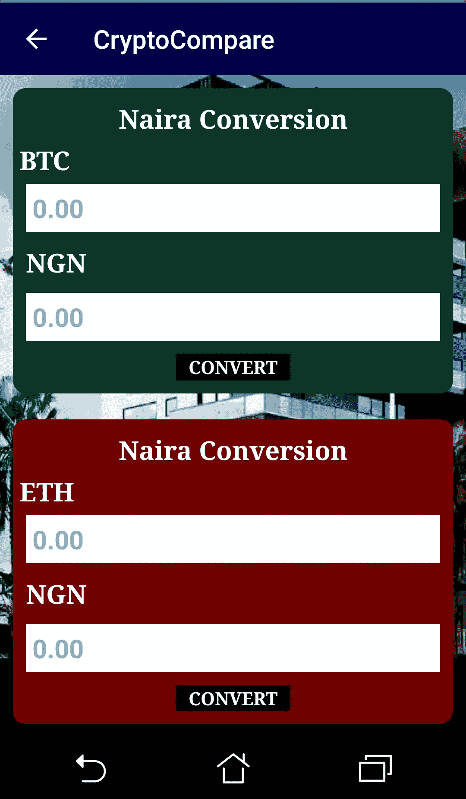
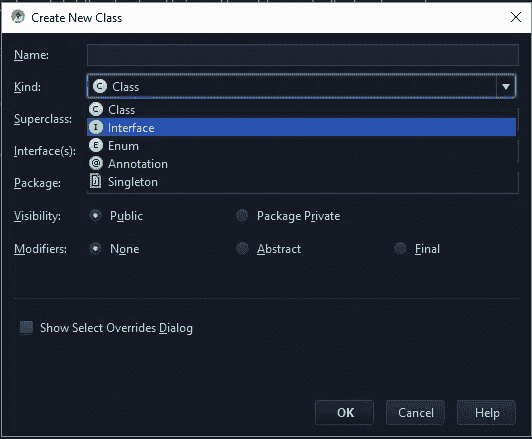
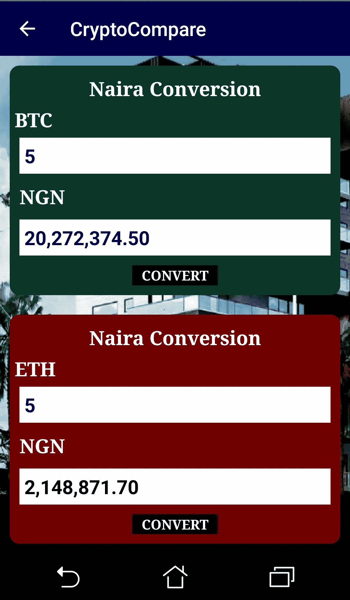

# 建立一个 Android 应用程序来监控和转换 20 种当地货币的“比特币和以太币”

> 原文：<https://medium.com/quick-code/build-an-android-app-to-monitor-and-convert-bitcoin-and-etherum-in-20-local-currencies-6628a9058a29?source=collection_archive---------4----------------------->

在数字世界时代，货币体系在不断变化，曾经流行的东西最近正在被改进的技术取代。

鉴于加密货币已被许多国家和支付平台接受，支付行业尤其受到加密货币数字时代的影响。像日本这样的国家已经和其他许多国家一样，把它作为一种合法的支付手段。

一个朋友曾经写道“我们的生态系统不再仅仅是关于代码，而是关于构建和使用产品的人。

最近，我意识到我 50%的时间(包括周末)都分配给了 VS 代码、终端和 Slack。这整个事情正在成为一种生活方式，当然，我正在拥抱它——这是我喜欢的”。

我相信他不是一个人。我们很多人每周花 50 个小时在生产力工具上。为什么要把它限制在仅仅是代码上呢？为什么不把它扩展到我们的日常生活中呢？

考虑到这一点，我开发了一个开发工具来展示在你的 android 设备上实时监控这些加密货币的可能性。不仅如此，你还可以将它们转换成 20 种不同的当地货币。

因此，在本教程中，我们将介绍如何利用我们为此目的提供的 api 来构建这个应用程序。

# 演示

对你正在构建的东西和它是如何工作的有一个视觉和实际的想法总是一个好的做法，所以你可以看看这个[短片](https://youtu.be/SN5_GbxU3pI)来看看这个应用是如何工作的，你也可以在 github 上访问[源代码](https://github.com/Kennypee/CryptoCompare)。事不宜迟，让我们前往 Android Studio 并开始构建..

# 辅助知识

通过这篇文章，你将学到一些其他的 Android 开发技巧，比如:

*   进行 API 调用
*   用迭代器处理嵌套的 Json 对象
*   使用排球发出网络请求
*   使用 recyclerviews 和 cardviews
*   带格式的数学转换
*   等等

# **技术**

在我们继续并开始构建之前，明智的做法是谈论一下我们将使用的技术，这样当您在我们的过程中遇到它们时就不会感到困惑。

*   **凌空**——一个第三方库，允许我们无缝地进行网络请求
*   **recycle view/CardView**—Android 特殊布局，更好地组织屏幕上的内容

现在创建一个名为“CryptoCompare”的新的 Android Studio 项目，这应该是一个相当基础的步骤，但是如果你刚刚开始，请参考我以前的任何一篇关于如何建立一个新的 AS 项目的文章。

一旦你完成了一个新项目的创建，就为我们讨论过的技术安装依赖项。打开您的应用级别`build.gradle`文件并添加:

click sync to install dependencies

# 主要活动布局

然后打开`Activity_main.xml`，像这样设置布局:

这是一个非常简单的布局，有一个工具栏和三个 TextView 对象，分别用于本地货币 BTC 和瑞士法郎，这主要只是作为远程加载到我们在 TextView 对象下定义的 recyclerview 中的值的标题。在 xml 可视化工具中，此布局应该如下所示:

嘿，你的可能看起来不完全像这样，但也不应该是这样，因为我用了一个自定义的背景图片，你可能没有。需要注意的重要一点是，三个 TextView 对象按预期显示，蓝色线条表示 recyclerview 覆盖的区域，可能还有工具栏。

当我们进行 api 调用来返回这些 TextView 对象的值时，我们只需将数据传递到 CardView 布局中，然后使用该布局来相应地填充 recyclerview，明白吗？好的，我们继续。

# 卡片视图布局

说到 CardView，我们来新建一个布局资源文件，名为“card_items.xml”。这将是 CardView 布局，我们将在其中定义希望在 recyclerview 上显示的内容，即货币、BTC 和瑞士法郎。因此，创建新的资源文件，并像这样设置它:

这是一个简单的 CardView 布局，有三个 TextView 对象，我们用虚拟值预定义了这些对象，作为我们将从 api 中获取的实际数据的占位符。为了清楚起见，该布局的 xml 可视化工具应该如下所示:

现在让我们来看一下我们的`MainActivity.java`文件并进行互动。打开`MainActivity.java`并初始化 recyclerview 对象。然后我们开始进行 api 调用。首先，我们将 api 存储在一个定义为“private static final String*URL _ DATA】*的变量中，然后使用它来构建我们的 JSONObject 请求，如下所示:

我们在`onCreate()`方法中所做的非常简单，我们在一个字符串变量中定义了我们的 api，初始化了我们的工具栏、文本和 recyclerview。我们还从一个`CardItems`类中创建了一个`ArrayList`，我们还没有创建它，但是很快就会创建了。请注意，我们还调用了一个方法`loadURLData().`,这是我们向 api 发出请求以返回比特币、以太币的值以及它们在 20 种货币中各自的值的方法。如果您将这段代码复制到您的工作室中，但出现了错误，请不要担心，您并没有迷路，实际上我们调用了一个方法，甚至还有两个我们尚未创建的类:

*   `loadURLData()`
*   `MyAdapter`阶级
*   `CardItems`类。

所以回到 MainActivity 类中，创建`loadURLData()`方法，并像这样设置它:

# loadURData()

这里我们只是简单地用存储 api 的变量传入一个 Api 调用。该方法返回一个`response`，然后我们从这里将 btc 和 eth 值提取到一个 JSONObject 中。然后我们使用`iterator<?>`遍历嵌套的对象，并将单个的`btc`和`eth`值与它们各自的货币`keysBTC`和`keysETH`相匹配。接下来我们创建`MyAdapter`类。因此，创建一个名为 MyAdapter 的新 java 类，并像这样设置它:

# MyAdapeter 类

MyAdapter 类与我们的 recyclerview 视图对象相关联。我们用它来组织 recyclerview 的内容。在这种情况下，我们简单地放大了`card_items.xml`布局，然后使用实现的方法来创建视图持有者，并将其内容绑定到放大的布局。

好的，让我们来看一下，顺便说一下，如果你在这一点上看到任何红线，不要担心，你不是一个人，我会解释你为什么会有红线以及如何克服它。从顶部开始，当我们创建`MyAdapter`类时，我们扩展了`RcyclerView.Adapter<MyAdapter.ViewHolder>`并向其中传递了 cardItemsList 和上下文，这促使我们实现它的关联方法(`viewHolder()`和`onBindViewHolder()`)。在`viewHolder()`方法中，我们简单地扩充了`card_items.xml`布局文件，并返回了一个新的`viewHolder(v)`方法。

然后在`onBindViewHolder()`方法中，我们创建了 CardItems 类的一个实例，然后将 cardItem 对象的值存储到其各自的变量中(curr、btcVal 和 ethVal)。然后，为了最终将这些变量绑定到它们在视图保持器上各自的位置，我们在 CardItems 实例的帮助下`set`将它们放在视图保持器上`holder`，在 CardItems 实例中，我们定义了 setters 和 getters。

最后，请注意，当我们扩展 MyAdapter 类时，我们传入了`<MyAdapter.ViewHolder>`,因此，我们在 MyAdapter 类中创建了`ViewHolder`类，其中我们简单地初始化了 card_item.xml 文件中的所有视图对象，包括 LinearLayout。

# 心脏类

最后，为了完成 MainActivity 的设置，我们创建了 CardItems 类。CardItems 类将简单地帮助我们为我们的`card_items.xml`文件的内容生成`setters`和`getters`，我们之前已经在 MainActivity 类的`onCreat()`方法中初始化了该文件。因此，创建一个名为`CardItems`的新 java 类，并像这样设置它:

至此，一切都已正确设置。如果您运行该应用程序，您现在应该会看到我们从 JSON 响应传递到 card_items 布局文件中的内容会显示在布局上，该布局又会在 recyclerview 上显示出来，如下所示:

此时，我们可以看到列出了所有 20 种货币及其各自的比特币和以太值，假设我们实现了一个 ScrollView，您只需向上滚动即可看到更多内容。然而，我们还没有完成。

> *了解各种编程语言的* [*快速代码*](http://www.quickcode.co/) *免费课程。在* [Messenger](https://www.messenger.com/t/1493528657352302) *上获取新的更新。*

# 转换

很明显，我们看到的价值是以基础货币列出的。那么，如果我不仅想知道奈拉中 1 BTC 的值，而且想把任何奈拉值转换成 BTC 或瑞士联邦理工学院的等效值，反之亦然，又会怎样呢？这是我认为你可能想做的事情，或者至少如果不做的话，你已经知道了。所以这并不是什么大不了的事情，我相信你已经可以想象我们将如何实现这一目标。不管怎样，让我们继续并开始转换，首先，创建一个名为`ConvertActivity.`的新活动，这是我们将正确执行转换的地方。每个新活动都带有一个布局资源文件(在本例中为`activity_convert.xml`和一个 java 文件`ConvertActivity.java.`)打开`activity_convert.xml`并设置布局，如下所示:

如果你自己不能实现这个布局，请随意在这个 [github gist](https://gist.github.com/Kennypee/5fc164e5719981486d1400691c0f5ad9) 上获取我为这个布局文件编写的代码。不过你也可以随时在项目[源代码](https://github.com/Kennypee/CryptoCompare)上找到。由于文章的长度，我决定不附上特定的片段给它的长度。

因此，如果你成功地构建了你的转换布局，看起来像我的，接下来我们需要创建一个接口，在那里我们将定义一些与我们的转换相关的常数。创建一个名为`Constants.`的新接口这并不是什么新东西，就像你创建 java 类一样，只是这次你把‘kind’值改为 interface 而不是 class。

一旦创建了 Constants 接口，打开它并像这样设置它:

接下来，打开`MyAdapter`类并更新它，这样当单击视图固定器上的任意一张卡片时，它会打开包含该特定卡片详细信息的`ConvertActivity`。本质上，创造一个意图，并把你需要的所有额外的东西转化过来。因此，打开文件，通过添加以下代码来更新`onBindViewHolder()`方法:

最后我们打开`ConvertActivity.java`文件，初始化所有必要的视图对象，最后像这样设置转换逻辑:

如果由于视图对象及其 id 的原因，您没有像我一样构建您的转换布局，这可能会让您有点困惑。如果您在这一点上有任何错误，请确保检查您在`activity_convert.xml`中分配给视图对象的 id，或者简单地从源代码中复制它。

接下来，我们创建了一个方法`getFullName()`来获取完整的货币名称，并将其传递给布局文件中的`fullNameView` textview。

最后，为了进行实际的转换和显示值，我们创建了另一个名为`doCOnvert().`的方法。这个方法将被一个视图调用，这样当一个特定的视图被点击时，它将使用提供的输入值执行转换，并在相应的`flatValueEdit`对象中显示结果。

现在，转换活动已经准备就绪，可以开始了。如果您再次运行该应用程序，它应该都设置好了，并完全按照预期工作。

# 结论

你刚刚为自己创造了一个神奇的开发工具。现在你可以实时跟踪 20 种不同货币的比特币和以太币的价值。这还不是全部，你甚至可以转换所有货币的价值，并实时获得想要的结果，这是一个很好的工具，尤其是在这个加密时代。最棒的不是你有那个应用程序，而是你创建了它，所以恭喜你！！不断学习

请点击👏按钮下面几下，以示支持！⬇⬇谢谢！不要忘记遵循下面的快速代码。