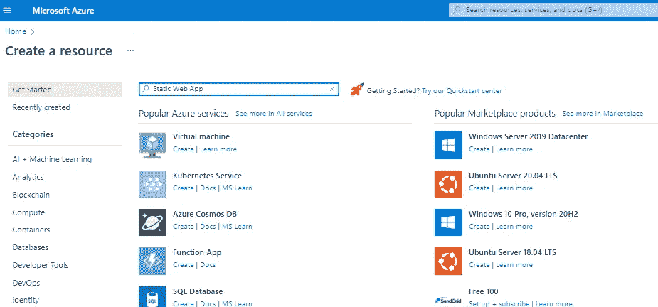
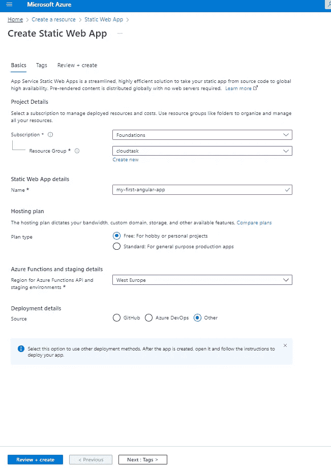
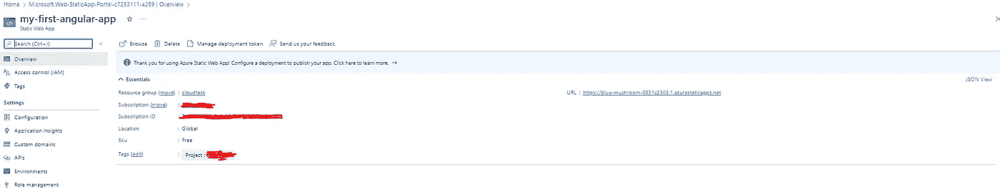
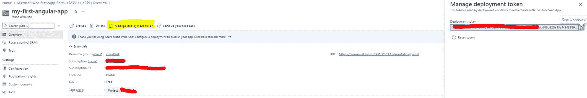
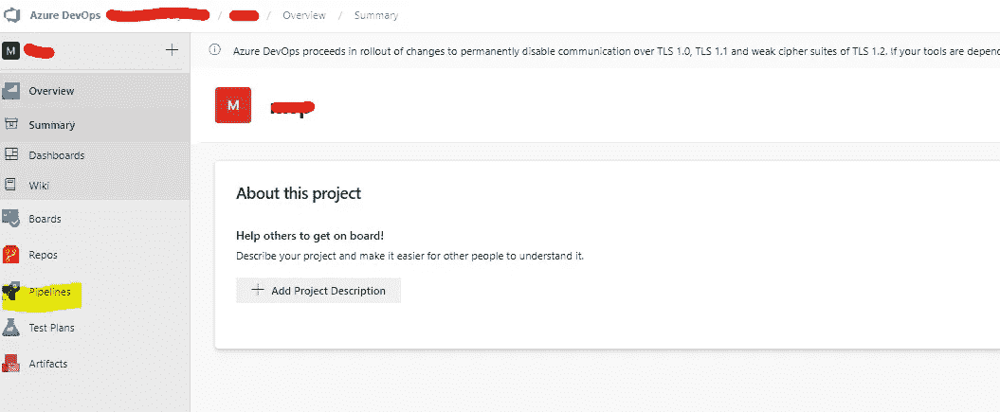
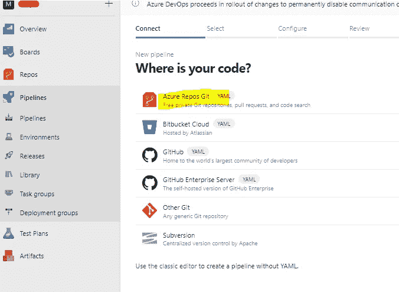
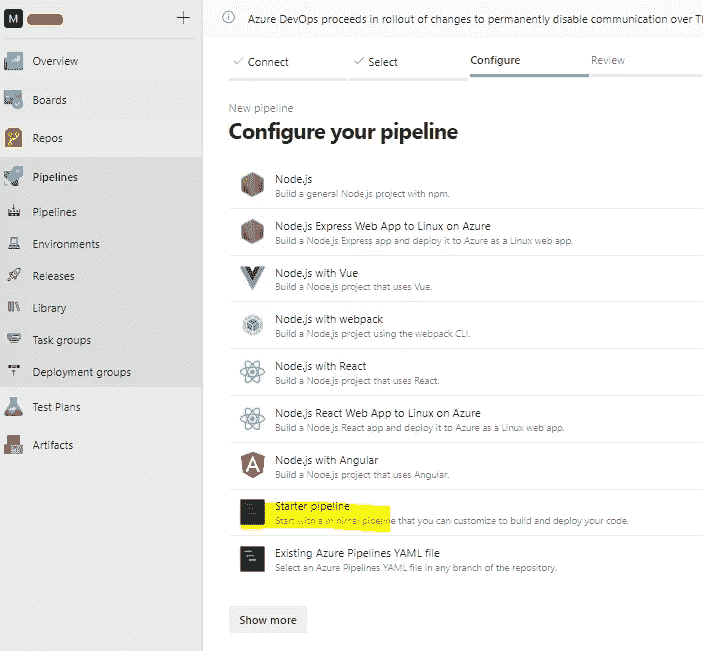
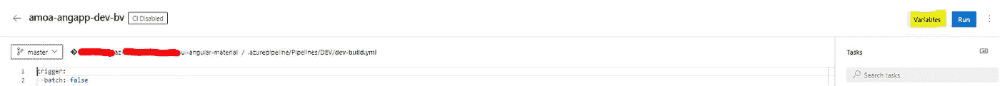
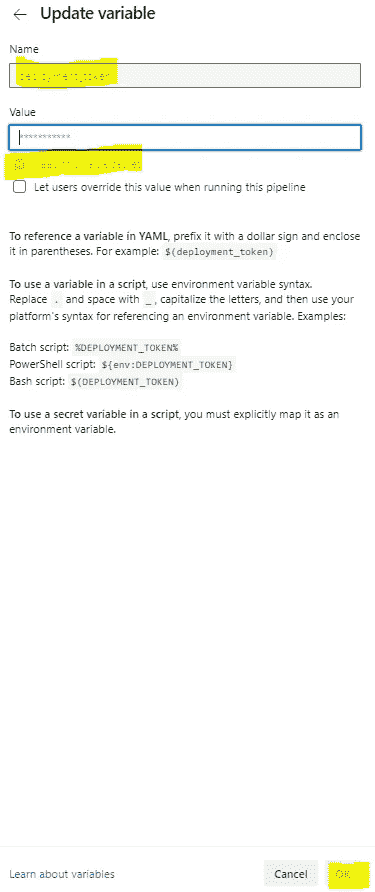

# 使用 Azure DevOps 将 Angular 应用程序构建和部署到 Azure 静态 Web 应用程序

> 原文：<https://medium.com/version-1/build-and-deploy-angular-application-to-azure-static-web-app-using-azure-devops-264f846d63f5?source=collection_archive---------0----------------------->


**Azure Static Web App** 是一个现代化的 Web 应用服务，提供从源代码到高全球可用性的简化全栈开发。好处包括无缝的开发者体验，包括 Visual Studio 代码扩展、CICD 等等。

微软推出了“GA”(普遍可用)服务，目前支持 2 个计划。免费计划允许您免费开始，而标准计划包括所有免费功能以及定制功能(如身份验证和 API)的能力。

在这篇文章中，我将带你在 Azure DevOps 中使用两个独立的基于 YAML 的管道(Build & Deploy)构建和部署一个 Angular 应用程序到 Azure static web app。

## 先决条件:

*   一个 **Azure** 账号(你可以使用免费试用，如果你没有，你可以[创建一个免费 账号)](https://azure.microsoft.com/free/)
*   **Azure DevOps** (如果需要帮助入门，请参见 [**创建**](https://azure.microsoft.com/en-us/services/devops/?nav=min) 一个)
*   Azure Repo 中的角度代码
*   熟悉 Azure DevOps 任务

## 创建静态 Web 应用程序:

**步骤 1** :导航到 Azure 门户，通过搜索静态 Web 应用创建一个新资源，然后点击“创建”。



**第二步**:选择订阅和资源组，填写详细信息。然后继续静态 Web 应用程序的细节:选择名称——“我的第一视角应用程序”——并坚持免费计划。然后选择你的地区——我的是“西欧”。



**注意**:由于我将利用 Azure DevOps 作为部署方法，我选择了“*其他”*作为选项。

第三步:现在你已经准备好创建你的静态 Web 应用了。点击“查看+创建”,看看会发生什么。这是我的应用程序的概述:



**步骤 4** :一旦部署成功，导航到新创建的静态 Web Apps 资源，并从概览页面中选择*管理部署令牌*。记下该值，以备后续步骤使用。



## 在 Azure DevOps 中创建管道任务:

我们将使用 YAML 文件创建两条管道，一条用于构建，一条用于部署。我们可以预先在回购中包含这个 YAML 文件，也可以在管道创建过程中添加相同的文件。

**注意**:在创建管道之前，请将角度代码保留在 Azure Repo 中。

## 构建管道:

**步骤 1** :登录 angular 代码所在的 Azure DevOps 项目。点击左侧的*管道*。



**第二步**:点击*新管道*，选择*蔚蓝回购 Git* 。



**第三步**:选择保存角码的 *Azure repo 名称*。

**第四步**:点击*启动管道*写入 YAML 文件。



**步骤 5** :将以下内容复制粘贴到*启动器管道*部分。

```
# Build pipeline
trigger:
  batch: false
  branches:
    include:
     - master
  paths:
    exclude:
     - readme.mdpool:
  vmImage: ubuntu-lateststeps:
 - task: NodeTool@0
   displayName: 'Use Node 14.x'
   inputs:
     versionSpec: 14.x - script: |
     npm install -g @angular/cli
   displayName: 'install angular cli' - task: Npm@1
   displayName: 'npm install '
   inputs:
     workingDir: '$(System.DefaultWorkingDirectory)'
     verbose: false - task: Npm@1
   displayName: 'npm build'
   inputs:
     command: custom
     workingDir: '$(System.DefaultWorkingDirectory)'
     verbose: false
     customCommand: 'run build' - task: PublishBuildArtifacts@1
   inputs:
     PathtoPublish: 'dist'
     ArtifactName: 'app'
     publishLocation: 'Container'
```

为了更好地理解目录结构，请访问[构建配置](https://docs.microsoft.com/en-us/azure/static-web-apps/build-configuration?tabs=github-actions)

**第六步**:点击*保存并运行*。

## **部署管线:**

重复上面的步骤 1 到步骤 4 来创建部署管道。

**步骤 5** :将以下内容复制粘贴到*启动管线*部分。

```
# Deploy pipeline
trigger:
 batch: false
 branches:
  include:
  - master
 paths:
  exclude:
  - readme.mdstages:
 - stage: Deploy
   pool:
     vmImage: 'ubuntu-latest'
   jobs:
    - job: DeployWebAppProd
      steps:
       - task: DownloadPipelineArtifact@2
         inputs:
           buildType: 'specific'
           project: 'ab43f2c4-cbec-8f34-b6a6-b1b96af2c4bf'
           definition: '408'
           buildVersionToDownload: 'latest'
           allowPartiallySucceededBuilds: true
           allowFailedBuilds: true
           artifactName: 'app'
           targetPath: '$(Pipeline.Workspace)' - bash: cd $(Pipeline.Workspace); echo $(ls) - bash: cd $(Pipeline.Workspace)/app; echo $(ls) - task: AzureStaticWebApp@0
         inputs:
           cwd: '$(Pipeline.Workspace)'
           app_location: '/'
           skip_app_build: true
           skip_api_build: true
           verbose: true
         env:
           azure_static_web_apps_api_token: '$(deployment_token)'
```

**注意**:根据您的值替换*downloadpipeliartifact @ 2*任务中的值。

**第六步**:我们需要提供***azure _ static _ web _ apps _ API _ token***值。为此，选择**管道中的*变量*** 。



**第七步**:新建一个名为***deployment _ token***的变量(与上面发布 YAML 中提到的名称相同)。勾选 ***对该值保密*** 框，点击**确定**。最后， ***保存并运行。***



管道将执行应用程序并将其部署到 azure 静态 web 应用程序。现在，您可以使用静态 web 应用程序 URL 来访问应用程序。

**结论:**

我希望这个细节已经展示了如何使用 Azure DevOps 到带有两个独立 YAML 文件的 Azure static web app 来构建和部署 Angular 应用程序。

如果你对此感兴趣或有任何反馈，请在评论区告诉我。

快乐学习！

**关于作者:** Raghavendra BN 是一名 DevOps 工程师，目前在 Version 1 的 Foundation 的团队工作。关注版本 1 和 Raghavendra BN，了解更多关于 Microsoft Azure 和 Azure DevOps 的博客。