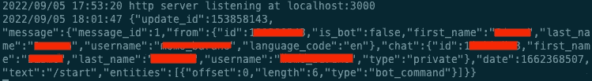

# 用 Golang & Telegram 构建基本聊天机器人

> 原文：<https://medium.easyread.co/build-basic-chatbot-with-golang-telegram-48390fb2765a?source=collection_archive---------1----------------------->


Chatbot with Golang & telegram

# 介绍

大家好！还是跟我分享一些软件工程领域中关于技术相关的经验，想法，或者看法。之前，我分享了如何使用 Golang 在 Messenger 上创建一个简单的聊天机器人，如果你感兴趣，请阅读这里。([https://bismobaruno . medium . com/build-simple-chatbot-with-golang-messenger-f00f 6299960](https://bismobaruno.medium.com/build-simple-chatbot-with-golang-messenger-f00f6299960))

在这篇文章中，我想分享我们如何使用另一个平台，在这种情况下，我们将尝试使用电报！当然还是用 Golang 做后端！

为了给我们应该做的事情提供一些背景，我们将处理以下几点:

*   拥有一个电报帐户或创建一个新帐户。
*   使用机器人父亲创建一个机器人。
*   在创建的 Bot 上配置 webhook 设置。
*   创建一个 webhook 服务器。

# 建筑设计

为了接收终端用户发送给 Telegram 的消息，我们需要提供一个带有 REST API 的 Webhook 服务器。架构设计将如下图所示:


Chatbot Architecture Design

# 电报帐户

基本要求是有电报帐号。要注册 Telegram，请在 Play Store / App Store 上找到应用程序，或者打开此链接【https://telegram.org/apps ，然后根据我们使用的设备选择移动应用程序。

> 注意:要注册 telegram，我们需要一个有效的电话号码。

# 使用机器人父亲创建一个机器人

完成帐户注册后，下一步是使用 Bot 父亲创建 Bot。我们可以从手机应用程序中搜索机器人，或者打开这个链接[https://telegram.me/BotFather](https://telegram.me/BotFather)，然后在手机应用程序或网络上打开它。


BotFather Commands List

要知道什么命令列表，我们可以给机器人父亲发送`/start`一条消息，并将回复一条类似上图的消息。


Successfully Created a Bot

创建一个新的机器人非常简单。只需输入`/newbot`然后输入机器人名称。仅供参考，机器人名称应以机器人结尾。成功创建后，机器人父亲将发送一条消息，其中包含可用于访问电报 API 的令牌。请确保将此令牌存储在安全的地方。

# Webhook

在第一阶段，我们可以创建一个简单的 Webhook 来打印请求数据，以查看实际发送的数据。

因为我们将在本教程中使用 Go，所以通过以下链接可以更好地理解 Go:

[](https://go.dev/) [## Go 编程语言

### Go 是一种开源编程语言，它使构建简单、可靠和高效的软件变得容易。

go.dev](https://go.dev/) 

那么，Go 代码的例子可以是这样的:

实际上，我们需要部署可以从 Telegram 平台接收 Webhook 事件的 live Webhook。代码必须托管在公共 HTTPS 服务器上。但是我们可以在本地完成，并使用 ngrok 创建一个从公共 URL 到本地主机的隧道。要安装和使用 ngrok，请参考以下链接:

[](https://ngrok.com/) [## ngrok -在线一行

### ngrok 的优势就是你的竞争优势。借助全球网络加速和 k8s 式负载扩展您的服务…

ngrok.com](https://ngrok.com/) 

首先，使用以下命令运行 Webhook 服务器:

```
go run .
```

Webhook 将在端口 3000 上运行。

```
2022/09/05 17:53:20 http server listening at localhost:3000
```

然后，启用隧道非常简单，只需运行以下命令:

```
ngrok http 3000
```

如果 ngrok 成功地启用了隧道，输出将如下所示:


ngrok Enabling Tunnel

为了测试这个 webhook，我们可以通过调用 Telegram API 在 Bot 设置中设置 ngrok URL。下面是用于更新 Webhook URL 的 curl:

```
curl --location --request POST 'https://api.telegram.org/bot${BOT_TOKEN}/SetWebhook' \--header 'Content-Type: application/x-www-form-urlencoded' \--data-urlencode 'url=https://3391-126-117-109-73.ngrok.io'
```

请用我们在创建新机器人后获得的令牌更改`${BOT_TOKEN}`。

如果 Webhook 设置成功，它应该返回以下 JSON:

```
{
 "ok": true,
 "result": true,
 "description": "Webhook was set"
}
```

下一步是搜索我们创建的机器人，只需点击`START`按钮来触发消息。


Start a conversation with the Bot

如果控制台收到这种消息，这意味着 Webhook 配置设置正确，webhook 代码正在工作！



Webhook successfully received a message

# 修改 Webhook

要向特定用户发送消息，我们只需用令牌调用 Telegram API，并指定用户 id 和消息。我们将修改代码，以便在发送任何内容时总是发送静态回复消息。最终的代码将如下所示(确保用真实的令牌替换常量`ACCESS_TOKEN`):

上面的代码只是一个简单的聊天机器人，它总是发送“自动回复🙌🏻“消息无论最终用户发送何种类型的消息(文本、贴纸、表情符号、gif、文件)。下面是最终代码的结果，发送消息后我们得到了回复！是的，起作用了！！


Webhook Sent Reply Message

# Webhook 秘密令牌

使用当前的实现，每个知道我们的 Webhook URL 的人都可以自由地访问它。为了确保这一点，Telegram 在这里有了新的更新:【https://core.telegram.org/bots/api#june-20-2022 

将 *secret_token* 作为可选参数，我们可以在 [setWebhook](https://core.telegram.org/bots/api#setwebhook) 方法上选择是否设置。当我们配置密码时，我们可以通过查看`X-Telegram-Bot-Api-Secret-Token`头来验证传入的请求。

# 关闭

为 Telegram 平台构建一个 Chabot 非常简单，因为从创建一个 bot 和配置 Webhook URL 开始并不需要花费太多精力。此外，没有限制我们创建机器人，所以我们可以很容易地测试我们的聊天机器人。

虽然这篇文章的范围仅限于回复消息，但有很多电报功能可用，所以我希望你能自己探索更多！

感谢您的阅读！希望这篇文章对你有用！！